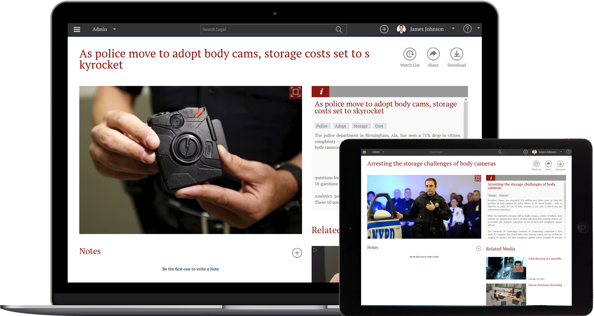
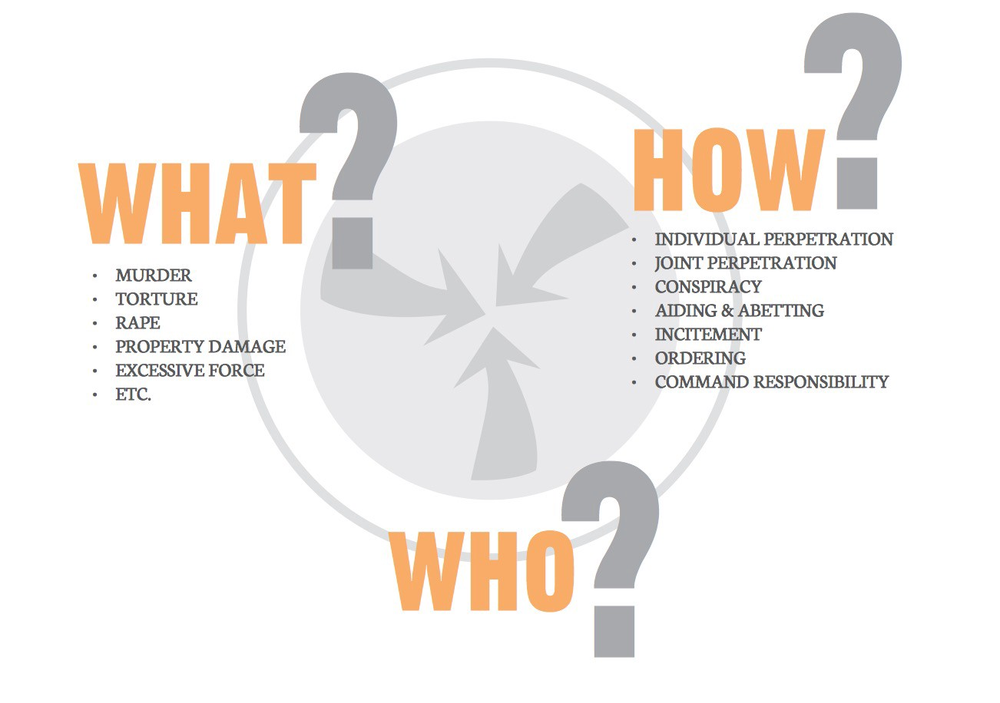
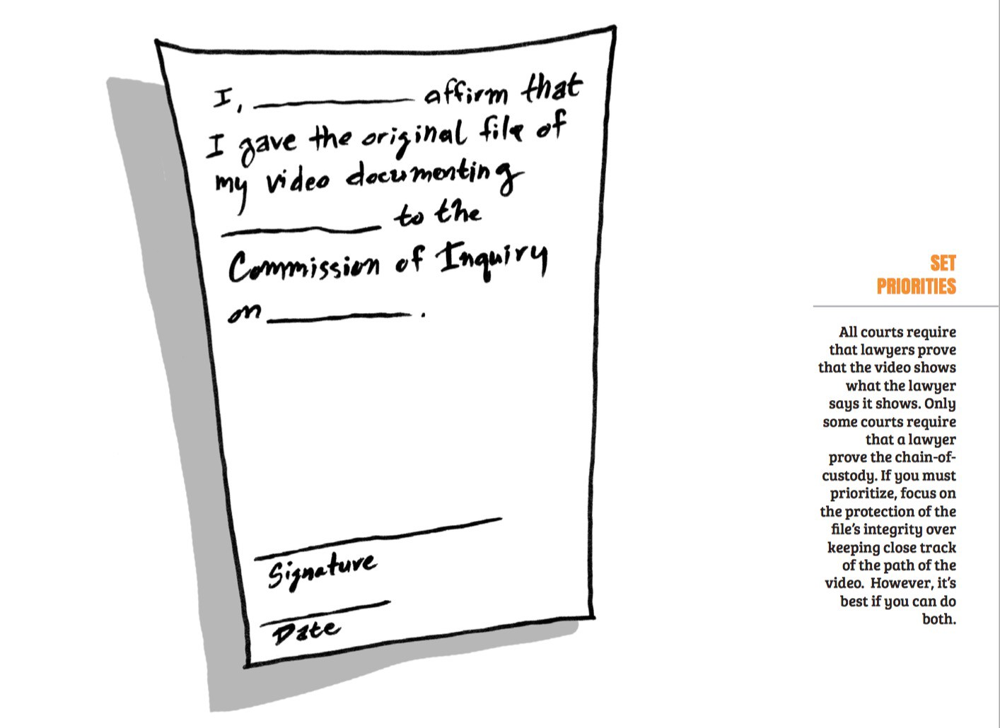
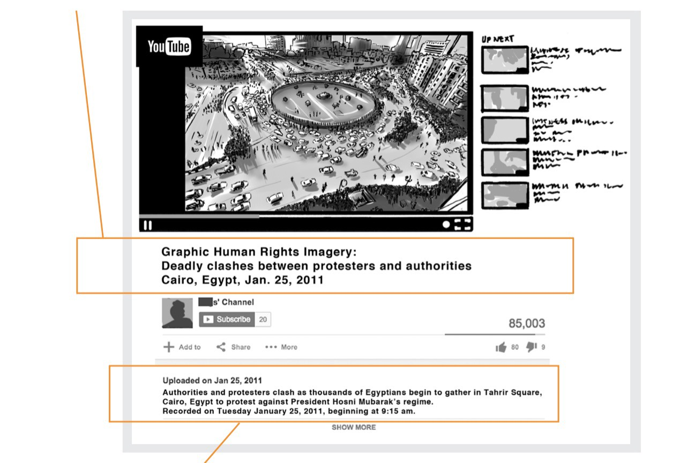

# 公民取证技巧：如何留住真相？ – iYouPort – Medium

[iYouPort](https://medium.com/@iyouport)

Jan 16 2019

> 曾经与一些记者交流时听到他们感叹，“中国民间传播的视频记录大多无法使用”，因为，“五个W一个都没有，镜头完全抓不住重点，等等”。我们看到过类似现象，很可能源于人们没有接受过作为公民的基本功培训，这是非常重要的基本功。公民的职责就是捍卫正义和真相，而政权最擅长抹杀真相，这是一场持久战，能给公民的最强大的武器就是技术能力和技巧经验

世界各地的公民都在使用视频来揭露违规行为，以推动变革；视频作为证据也越来越多地被用作调查的一部分和法律指南。视频是证据收集的一个非常重要的工具，因为它有希望永远存在。如今几乎每个人都有一部手机，可以在任何地方拍摄和制作视频，中国曾经有所谓的“围观改变什么”的说法，我们一直不同意这一说法，主要因为：中国的大多数“围观者”由于严重不专业无法成为记录者；缺乏与人权组织合作的经验而无法令资料发挥真正的作用；因此他们并没能推动“改变”。

让证据发挥作用不是一件很简单的事，和中国一样，刚果的人权律师和社会积极人士一直面临着证明和理解事件背景的挑战，他们通常很难收集可以直接指控犯罪的关键镜头。公民证人、活动家和非政府组织，是第一批面对诸如此类挑战的人 — 关于如何捕获关键信息。希望能让视频成为证据的具体方法，应该建议活动人士与律师合作，这样他们就会对应该拍摄哪些重点心里有数，以便通过媒体、议会、国际权利组织、委员会和法院伸张正义。

虽然公民拍摄的视频经常提供关于发生的事情和可能性负责人的有用线索，但其质量很少能通过需要在法庭上作为证据使用的更高标准。好消息是：通过略微练习和修改，公民和活动家冒着生命危险捕获的镜头就可以作为刑事和民事司法程序的证据。

**本文的主旨就是提供给所有勇于伸张正义的人们一些技巧和技术方面的协助。**

我们开始。

首先，确定要拍摄哪些影像，为了让某人或组织对犯罪行为负责，律师需要的证明包括：

- 犯下了什么罪行;
- 谁犯下的罪行;
- 是如何犯罪的（即 自己动手、有组织有计划、还是买凶等）。

公民和活动家通常可以很好地捕捉犯罪行为的镜头，但要记录犯罪者是谁、以及他们是如何做到这一点的，要困难得多。调查人员和律师要花费大部分时间来证明后者，因此，虽然记录犯罪行为的录像很有价值，但制裁和问责也很重要。在存在大规模暴行和系统性侵犯人权行为的情况下尤其如此。

记录犯罪的执行或后果的视频被称为**“基于犯罪的证据”**。以下是几个可以作为基于犯罪的证据的镜头示例。录像片段：

- 军队折磨和伤害平民;
- 推土机非法摧毁房屋，以及推土机离开现场后造成的损坏场面;
- 警方非法杀害嫌疑人，并销毁致死记录;
- 空袭结束后，记录医院遭受的轰炸和破坏状况;
- 军营中的儿童接受战争训练;
- 可证实非法钻探的钻机出现的具体地点…等等

关于应该捕捉“什么”，有点本能的意味，你看到一些错误现象正在发生，就可以将相机指向它并按下记录。人们都有道德心理，这就是为什么有大量基于犯罪的视频记录。但捕获“谁”、及“如何”的证据远不那么直观并难以做到，以下我们介绍一些能帮助你的技巧。

**包含关于“谁”和“如何”的线索的录像片段通常被称为“联系性证据”，因为证据将犯罪者与犯罪行为“联系起来”了**。虽然有可能无法使用视频直接确定究竟是谁犯了罪以及他们是如何做到的，但视频可以提供重要的线索，调查人员和律师可以与其他证据来源（如文件或证人证词）拼凑起来 — 找出谁应该承担责任，即使肇事者已经远离犯罪现场也要追究其责任。

有时“谁”和“如何”这样的信息很容易用视频捕获，例如，

- 一名士兵的正脸，他反复殴打平民;
- 推土机操作员在摧毁房屋时的脸孔特写;
- 导致嫌疑人死亡的官员的徽章编号和铭牌…等等

然而，有些时候也会比较难。以下是一些对取证来说形成挑战的状况：

- 视频无法向我们展示正在投掷炸弹的飞机的飞行员的身份，或指示飞行员向医院投掷炸弹的指挥官的身份;
- 我们可能会在训练营看到儿童兵，但可能看不到他们的训练员或指挥官;
- 我们不知道是谁下令将钻机非法放置在土著人土地上的，因为我们只能看到钻机
- 一些便衣流氓在使用暴力针对手无寸铁的平民，但我们不知道是谁指使他们这样做的

联系证据至关重要。作为当地的公民证人或人权活动家，您可以独特地收集联系证据。**虽然拍摄联系证据并不难，但了解如何捕获它比捕获基于犯罪的镜头更复杂**。

**— — 第一部分 — —**

**What：可能的基于犯罪的证据**

- 正在进行酷刑
- 死亡
- 受伤
- 被官员殴打的人
- 平民财产受损
- 文物被损坏
- 携带武器或参加军事活动的儿童
- 仇恨言论

**who & how: 可能的联系性证据**

- 警察部队阻止抗议者和/或部队调动
- 徽章编号和制服
- 护照或其他官方身份证件
- 公务车牌照
- 军事装备（包括序列号）
- 演讲者
- 检查站
- 被占用设施的外部
- 曾经被占用然后被遗弃的设施
- 通信设备 — 卫星天线、收音机等……

**第一步：**

- 记录日期，时间和位置
- 确保将相机或手机设置为正确的日期、时间和 GPS 位置
- 录制您的声音，解说日期、时间和地点
- **如果您需要匿名拍摄，请在一张纸上写下时间，日期和位置，然后将其放在相机前至少10秒钟**
- 您还可以拍摄任何可以显示日期、时间和位置的内容，例如时钟、报纸的头版、路牌、地标或地理特征

**第二步**：使用相机麦克风或笔和纸来记录以下内容的姓名和联系信息：

- 被拍摄的人物;
- 拍摄者;
- 现场其他与主题事件有关系的人。

**第三步**：

拍摄的目的是让那些不在场的人能够看到发生的事件，并理解基本要点。所以在拍摄时，问问自己，“如果我将这段录像给不熟悉该位置的人观看，他们能否总结一下所发生的事情，并根据我视频中的信息绘制出精确的场景地图？”你希望能够被回答，“是的！”

所以，对你拍摄的内容保持清醒和有目的性是必须的。活动家经常捕捉发生了“什么”，但不总是能捕捉到“谁”和“如何”。考虑填写**“收集计划”表单**，以帮助您战略性地确定需要捕获的素材，以便让观众清楚地了解发生的事件。由于每种情况都不同，因此没有绝对的规则，但以下是**关键的基本拍摄技术**，有助于确保您的视频易于理解和提供有价值信息：

当然能连续拍摄整个场景最好。但是，如果事件太大、很复杂或危险，您可能需要采取分片段拍摄。在这种情况下，请尝试通过将相机指向您刚才停止拍摄时的相同位置，以继续录制每一个新片段，可方便剪辑。换句话说：重叠镜头。

包括以下镜头：

- 一个**非常缓慢的** 360 度平移，提供上下文并显示场景背后所发生的事。
- 广泛建立镜头，提供易于理解的犯罪现场布局，并协助验证时间、日期和地点。
- 采取旁观者视角，以确定犯罪现场的证据、位置、以及一件证据与另一证据之间的关系。
- 特写镜头显示关键细节并识别现场人员。
- 如果可能，请从事件场景的**多个侧面**拍摄上面列出的镜头。
- **保持所有镜头10秒或更长时间**。更改位置或放大或缩小时，请缓慢移动相机。避免快速或不稳定的动作。如果可能，请使用三脚架、独脚架甚至固定表面都可以，以便稳定相机。

**第四步**：书面文档

如果您无法向录制的视频本身添加基本信息，则应创建一个单独的文档，其中汇总了有关您的素材的关键信息。一定要这样做，即使这可能有些耗时，但提供全面的书面文档可以显著增加您的视频被用作证据的机会。

摘要信息（通常称为“摄像报告”）可以手写或在计算机上完成，并保存在带有视频的文件夹中。始终包括以下内容：

- 您撰写摘要的日期和时间;
- 拍摄视频的日期、时间和地点;
- 以下名称和联系信息：拍摄者; 正在被拍摄的人物; 现场其他与事发信息有关的人;
- 视频中所显示内容的简短实际摘要。禁止错误信息和夸大描绘;
- 任何安全信息或安全限定。

**关键**：

书面文件很重要！即使您在视频录制中包含了基本信息，单独的书面摘要也会有所帮助。这些额外的文档将使您的视频在公民和活动家每天捕获和共享的成千上万个视频中脱颖而出，它将帮助人权研究人员和调查人员审查内容并确定您的视频是否有助于他们。简而言之，您越是有意为审核人员制作，他们就越有可能观看您的视频。

**— — 第二部分 — —**

如果您的视频没有得到适当的保护，您的视频的可信度就会受到质疑。以下基本步骤将帮助您**保护原始文件的完整性**，防止其被编辑或进行数字操作，用于避免设备故障、丢失或被丢弃、或可能落入坏人手中。

**第一步**

为了在现场的保护想出一个计划，以保护您的存储卡免受物理损坏，防止坏人可能抢走您的镜头。在现场时，请考虑以下做法：

- 使用空白卡换掉旧卡并藏好使用过的卡;
- 即时创建备份;
- 立即将镜头上传到安全服务器;
- 不使用时，将存储卡存放在坚固、无尘的卡片盒中。

**第二步**

在您从现场返回后想出一个保护您的镜头安全的计划。请考虑以下做法：

- 在传输视频之前，在存储卡上设置写保护锁;
- 将原始文件从卡传输到硬盘驱动器而**不以任何方式处理视频**，以保存原始文件。**不要**通过特殊软件运行它或更改文件格式、文件名或文件结构;
- 如果可能，至少**备份**原始文件一次和两次。复制后，请勿以任何方式更改原始文件;
- 将备份副本保存在单独的设备上，并保持主副本位于不同的物理位置;
- 限定只有必须的人才能以物理和数字形式访问您的视频，以保持存储安全。

**第三步：**整理您的视频

如果您想整理从相机中导出的视频，请按日期和创建者格式将它们整理到文件夹中。同样，**请勿更改原始视频的格式、文件名或目录结构**。以标准化方式命名您的文件夹，以便您可以轻松对其进行排序和识别，例如，yyyy-mm-dd\_Creatorname\_IncidentDescription。

**第四步：**跟踪视频

使用电子表格或数据库来跟踪存储素材的位置以及与之共享的人员。为了将您的视频用作调查的一部分，您需要将其提供给值得信赖的人权研究人员或调查人员。

当您将镜头提供给其他人或组织时，他们可能会要求您签署一份表格，记录手中的镜头。在法律方面，表格记录了“监管链”。请求的信息会有所不同，但您很可能需要验证您是否是视频录制者，并且未更改过视频文件。

**目标**

如果您认为在线分享视频片段是安全的 — 并且具有战略意义 — 请遵循以下基本实践，以便：

- 记者、研究人员或调查员能够搜索、查找、理解和验证您的视频;
- 让您使用的在线平台知晓该视频包含信息丰富的人权内容，这样它们就不太可能删除视频（YouTube 有所谓“暴力”内容审查）。

**标题**

将视频上传到在线平台时，请添加一个简短标题，其中包括日期、具体位置、城市、国家/地区，以及一些关于视频内容的关键描述性文字，要简明扼要。

**说明**

重复添加时间、日期、具体位置、城市和国家/地区的事实描述，并包含视频中显示内容的事实摘要。添加文字有助于观众了解视频的上下文，例如录制之前或之后发生的事。**避免**个人意见、错误信息和夸大描绘。如果确认安全，请包括摄像师或摄像师组织的名称和安全的联系信息。

**关键说明**

上传时请标注图像视频属于<人权内容>。这将：

- 提醒观众视频可能存在暴力或令人不安的画面;
- 在线平台发布时，提醒视频片段可能包含有价值的人权镜头，**非常重要**。如果没有此警告，YouTube 和其他平台可能会删除“违反其社区准则”的视频，该准则禁止用户发布没有公共价值的令人震惊、耸人听闻或不尊重的内容。

再次标签、日期、时间、具体位置、城市和国家/地区，然后添加描述性内容的关键字。例如：“人权”，“驱逐”，“逮捕”，“过度武力”，“炮击”，“抗议”，“儿童兵”，“检查站”，“制服”，“石油泄漏“，”折磨“或”难民“等，**标签必须是公正的和描述事实的**。

**第四步：保存**

文件视频网站（如 YouTube 等）非常适合分享视频，但**不应将其用作保存视频原始副本的地方**，因为：

- 上传到 YouTube 等平台的视频针对网络流式传输进行了优化，这意味着原始视频被压缩并可能剥离有价值的信息 — 文件中嵌入的元数据;
- 上传后您无法从 YouTube 等网站检索原始文件，因为只有针对网络流媒体优化的副本才可用;
- YouTube 和类似网站可以在未经您许可的情况下移除您的镜头，如今的审查已经越来越严重。

**— — 第三部分：与可信赖的个人和组织共享 — —**

**第一步**

与人权组织、调查员、执法人员和法院分享录像和信息会触发权利和责任。具体的权利和责任取决于您与谁共享信息。在将镜头提供给中间人进行保管之前，请务必选择以下中间人：

- 你确保能信任的人;
- 拥有技能、资源和基础设施，可以确保您的视频安全、完整和可靠的人;
- 尊重（甚至以书面形式保证）对镜头的具体使用的人，特别是不会给您拍摄到的人或社区组织带来安全风险的人。

**第二步**：决定如何提供原始文件给您信任的盟友以确保不会被更改

如果您与之分享视频的人或组织距离较近并且可以走访，则分享视频的最安全方式是亲自将视频从您的计算机或硬盘上传输给他们。但通常情况并非如此，将镜头传递给你的盟友的最常用实用方法是将通过网络。

如果您处于高风险状态，上传文件可能会很危险，于是需要选择相当安全的传输视频渠道（请参阅下面的技术推荐）。最好在选择通讯服务之前与您的盟友讨论安全风险。

**第三步**；提供补充信息

在可能的情况下，还需提供以下内容的印刷版或电子摘要：

- 视频捕获的时间、日期和具体位置;
- 视频中显示内容的简明事实摘要;
- 摄像师的姓名和联系信息、拍摄人员、以及可能掌握有关事件的宝贵信息并愿意与NGO或调查员交谈的其他人;
- 任何安全信息，确保您的盟友知道哪些信息是保密的，哪些信息可以与他人共享。

**— — 最后 — —**

考虑使用技术来保护您的视频。

虽然使用技术工具来增强视频的证据价值并不是强制性的，但是有用的新工具一直在开发中。这些工具与您的实践技能相结合，可以**增强**视频的可信度。以下是一些可供选择的选项：

**Capture：在现场拍摄、并可以为您的视频添加上下文**

• Storymaker: 一款带有使用培训和模板的 Android 应用程序，可帮助您安全有效地随时随地捕获视频 — [storymaker.cc](http://storymaker.cc/)

• InformaCam: Android 应用程序，用于通过嵌入式元数据创建安全且经过验证的视频，以确保捕获的镜头具有增强的证据价值 — [guardianproject.info/informa](http://guardianproject.info/informa)

• eyeWitness: Android 相机应用程序，可记录和嵌入元数据，以方便法院对镜头进行身份验证及使用其作为证据 — [eyewitnessproject.org](http://eyewitnessproject.org/)

• Taggly: 同时适用于 Apple 和 Android 设备的应用程序，将使用元数据水印为您的媒体标记 — [tagg.ly](http://tagg.ly/)

**Store: 保持媒体的安全和有序**

• Seagate Wireless Plus: 便携式硬盘驱动器，电池供电，支持 Wifi，随时随地为您提供额外的存储空间 — [goo.gl/lxwOsZ](http://goo.gl/lxwOsZ)

• Syncme: 自动同步文件的 Android 应用。与 Seagate 配合使用，可以在现场不断备份您的资料 — [goo.gl/kf3sqY](http://goo.gl/kf3sqY)

• Adobe Bridge: 媒体浏览工具，可帮助您整理视频，添加标签以及查看和编辑元数据 — [creative.adobe.com/products/bridge](http://creative.adobe.com/products/bridge)

• Activists’ Guide to Archiving Video: WITnESS 指南概述了存储和编录视频的工具和最佳实践 — [archiveguide.witness.org](http://archiveguide.witness.org/)

**Share: 与他人分享时，请确保您的资料安全且私密**

• Bittorrent Sync: 从一个设备直接传输到另一个设备，是在低带宽环境中进行安全共享的一个很好的选择 — [getsync.com](http://getsync.com/)

• SpiderOak: 易于使用的“云端”存储，具有端到端加密功能，有助于提高文件共享的安全性 — [spideroak.com](http://spideroak.com/)

• BoxCryptor: 免费服务，在您将文件上传到 Dropbox 或其他“云”服务站点之前对其进行加密 — [boxcryptor.com](http://boxcryptor.com/)

好啦，以上是最为基础的技术技巧介绍。如果您拥有相关实战经验、遇到过本文中没有提及的难题或挫折、或者还知道其他更好的并方便可用的技术，欢迎在评论栏中与大家分享。◾️

**_感谢帮助 iYouPort！_**

**_PayPal 捐赠渠道已开通_** [**_https://paypal.me/iyouport_**](https://paypal.me/iyouport)

------

原网址: [访问](https://medium.com/@iyouport/thetruth-57d38bb322cc)

创建于: 2019-01-18 20:57:58