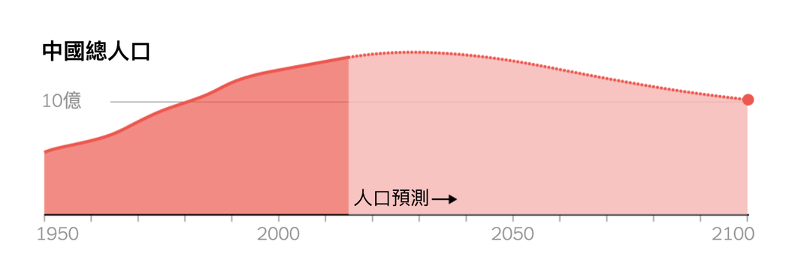
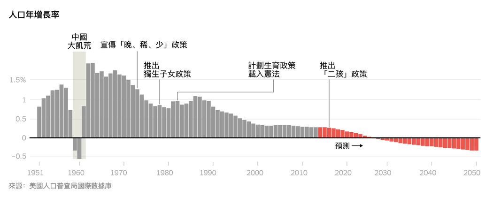
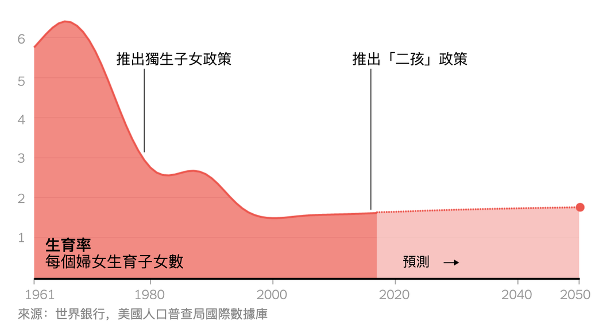
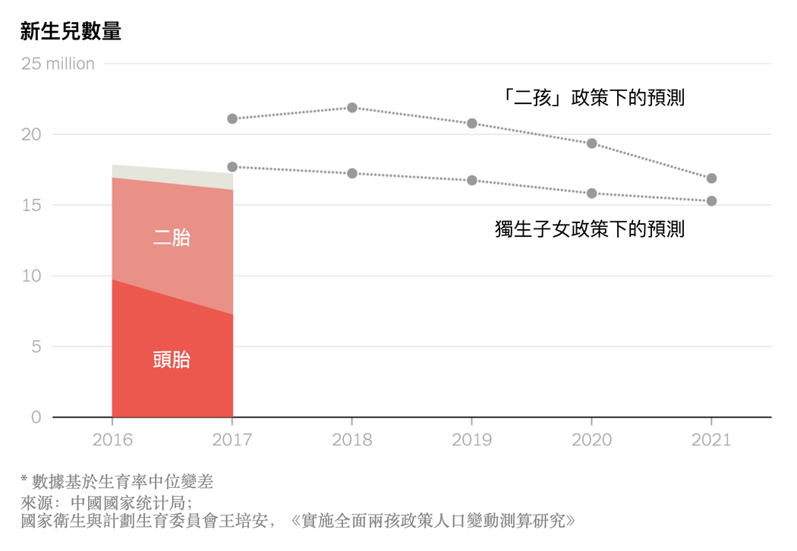
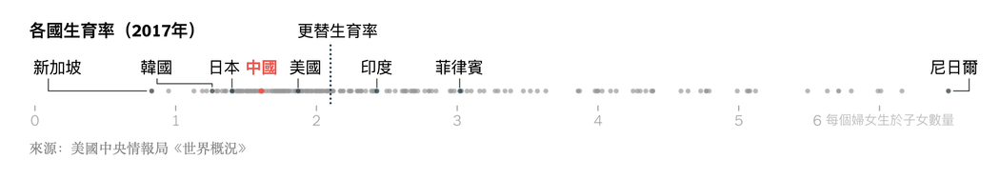
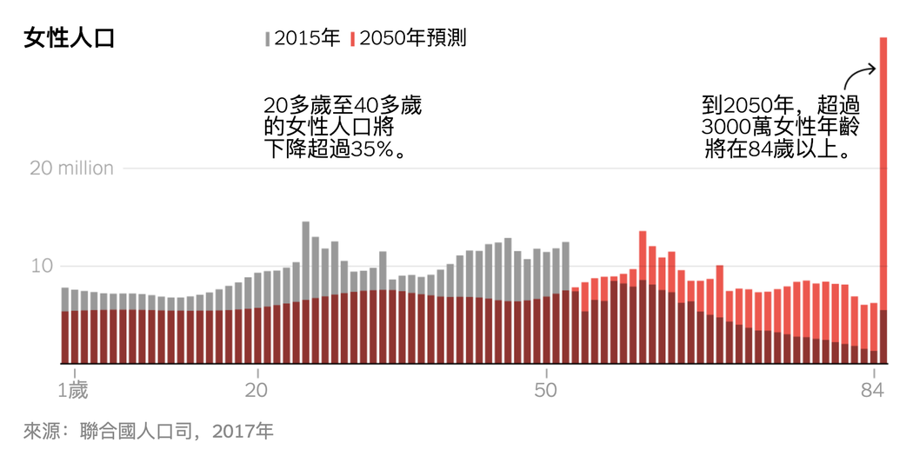
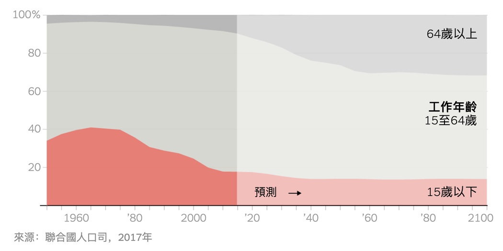

# “负增长”与老龄化：中国人口危机迫在眉睫 - 纽约时报中文网

STEVEN LEE MYERS, JIN WU, CLAIRE FU

2019年1月18日

中国学者最近向该国领导人发出了一个严重警告：中国正面临着几十年来最急剧的人口下降，有可能在不久的将来导致人口、经济甚至政治危机的发生。

多年来，为减缓世界上这个人口最多国家的人口增长速度，中国执政的共产党实施了一系列的政策，包括把一对夫妇允许生育的孩子数量限制为一个。这些政策的长期作用意味着，中国将很快进入一个人口“负增长”时代，即总人口数量将出现收缩。

中国社会科学院本月发布的这份[报告](http://ex.cssn.cn/zx/bwyc/201901/t20190104_4806519_1.shtml "Link: http://ex.cssn.cn/zx/bwyc/201901/t20190104_4806519_1.shtml")反映了一个最新的认识：虽然中国臭名昭著的“独生子女”政策也许已经实现了其放缓人口增长的最初目标，但也给政府带来了新的挑战。

社科院警告，出生率的下降和预期寿命的延长意味着，劳动力规模很快将不足以养活一个庞大的老龄化人口。据社科院估计，中国的总人口将在2027年开始出现收缩，虽然其他人认为，出现收缩的时间会来得更快，或者已经开始了。

政府已经认识到这个令人担忧的人口趋势，并于2013年开始在某些情况下放松“独生子女”政策的执行。后来，政府抱着引发一个婴儿潮的希望，在2016年把所有家庭生育孩子的上限提高到两个。[但成效不大](https://cn.nytimes.com/china/20180813/china-one-child-policy-birthrate/ "Link: https://cn.nytimes.com/china/20180813/china-one-child-policy-birthrate/")。

出生率在当年出现短暂上升之后，在2017年再度下降，每年出生的婴儿数量从2016年的1790万下降到2017年的1720万。尽管生二胎的家庭数量有所上升，但总体出生率继续下降。

据中共官方的《环球时报》援引的初步官方数据，2018年的出生婴儿总数可能会降至1500万。一些省市报告说，当地的出生率最多下降了35%。

维持人口水平所需的生育率是每个妇女生育2.1个子女，这个数字被称为“更替生育率”。

随着社会的富裕和老龄化，许多发达国家的生育率都在下降。

中国官方公布的生育率已降至每位妇女生育1.6个孩子，但即使对这个数字也存在争议。

威斯康星大学麦迪逊分校(University of Wisconsin-Madison)的易富贤教授写道，中国政府为了掩盖独生子女政策的灾难性后果，模糊了实际生育率。根据他的计算，2010年至2018年间的平均生育率为1.18。

和其他国家一样，生育率下降的原因有很多，包括不断增长的富裕程度和女性的新机会。中国的经济发展造就了这样一种社会：许多年轻夫妇现在生活在巨大的经济压力之下，教育和住房等生活成本的上升让他们感到要一个孩子都有困难，更不用说要两个了。

但易富贤和其他人说，生育率下降的最深层原因是“独生子女”政策。独生子女政策导致少生了孩子，由于文化中的男孩偏好，生下来的孩子中女孩的数量就更少了。

在实行“独生子女”政策后的年代里出生的中国女性，现在已经达到或过了生育高峰年龄。尽管政府新近出台了鼓励家庭生育两个孩子的措施，但育龄女性的数量根本不足以维持中国的人口水平。

迫在眉睫的人口危机可能是中国过去40年惊人经济转型的致命弱点。

总人口减少可能会给中国的经济和劳动力带来更大的负担。由于未来劳动力人数的减少，政府可能很难负担起一个不断老龄化、寿命越来越长的人口。

劳动年龄人口的减少也可能减缓消费支出，从而对中国乃至更大范围的经济产生影响。

许多人把中国的人口危机与20世纪90年代导致日本经济停顿的危机进行比较。

一些专家认为中国人口已开始减少。易富贤和北京大学经济学家苏剑在他们最近发表的一篇论文中提出理由说，中国人口在2018年出现了收缩，这是自毛泽东的“大跃进”工业化运动引发了1961年和1962年的饥荒以来，中国人口首次出现收缩。这两位研究人员说，不准确的人口普查估数模糊了实际人口数量和生育率。

“可以这样认为，2018年是中国人口的一个历史性转折点，”易富贤在一封电子邮件中写道。“中国的人口已经开始下降，并正在迅速老龄化。中国的经济活力将继续减弱。”

Steven Lee Myers是《纽约时报》驻北京记者。

翻译：Cindy Hao

[点击查看本文英文版。](https://www.nytimes.com/interactive/2019/01/17/world/asia/china-population-crisis.html)

------

原网址: [访问](https://cn.nytimes.com/china/20190118/china-population-crisis/?utm_source=tw-nytimeschinese&utm_medium=social&utm_campaign=cur)

创建于: 2019-01-18 21:12:09