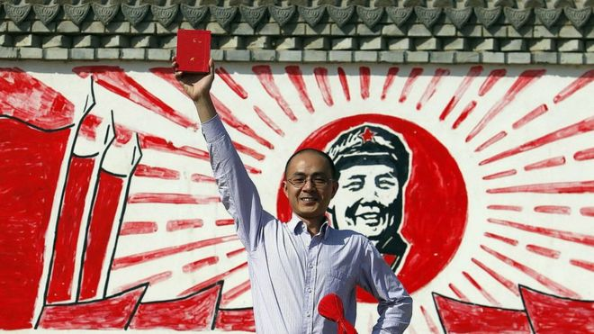
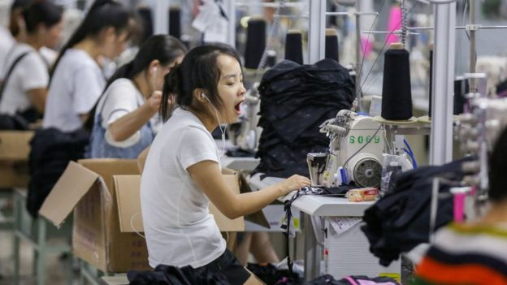
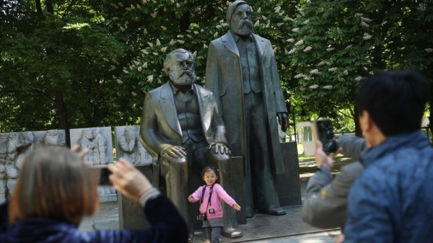
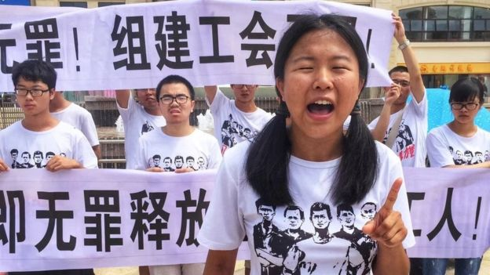

# 中国左翼青年问答录：有关“毛左” 、工人维权和共产实验的对话 - BBC News 中文

苒苒 BBC中文记者

2019年 1月 18日

 
图片版权 Getty Images 

BBC中文12月底发表了一篇中国左翼青年的[特写文章](https://www.bbc.com/zhongwen/simp/chinese-news-46616052)受到广泛关注和热议，也收到许多来自读者的询问，表达了对这一话题的极大地兴趣。我们邀请两位左翼青年和对这一独特的群像有研究的学者对其中的一些关键问题及BBC中文的一个问题进行解答，以下是问答实录。（其中前六个问题来自读者，最后一个问题为BBC中文记者所提。）

## 左翼青年的思想来源于哪里？什么影响了他们的思想？

肖明（左翼青年）：来源于马克思主义，后继有列宁主义、毛泽东思想，但是理论终是理论。在真正接触到了中国社会的现实，尤其是大多数底层人民的现实生存情况以后，我才选择了相信和接受。

郑华（左翼青年）：思想并不是无根无源的，更不是某些人洗脑灌输一下就可以生根发芽的；实际上，仅从我们身边的左翼青年们的情况来看，当充满理想情怀的年轻人们看到中华大地上有无数的周秀云被死亡、有无数的农村老人无依无靠自杀身亡、有无数的工人辛苦工作却换来尘肺病和暴力殴打、有无数的妇女在工厂中被非法改装的机器碾碎手指……我们怎么能不去探寻改造社会的理论？我们找到的就是——马克思主义。

- [高压下崛起的中国左翼青年](https://www.bbc.com/zhongwen/simp/chinese-news-46616052)
- [深圳佳士工人维权：左翼青年与政治诉求](https://www.bbc.com/zhongwen/simp/chinese-news-45204596)
- [深圳佳士工人声援者：我们被抓时高唱《国际歌》](https://www.bbc.com/zhongwen/simp/chinese-news-45341005)

## 左翼青年如何理解马克思主义？以中国目前的现状，马克思主义能在中国实现吗？

肖明：首先我们要明确，马克思主义是阶级性和科学性的统一，是立足于被压迫阶级、寻求阶级解放的科学理论。理论一经被压迫群众所掌握，就会成为改造现实的有力武器。近年以来，工人罢工、律师维权、教师讨薪等集体抗争发生得愈加频繁。中国工人抗争的次数成倍增长，规模不断扩大。塔吊工人、卡车司机工人的罢工甚至已经跨越了地区的分隔，初步联合起了整个行业。而现实的压迫还蔓延到高校教育体系内，官僚问题激起大批学生的不满。只要现实的压迫依旧存在，阶级的矛盾依旧尖锐，反抗的怒吼必然在某个时刻响起，马克思主义也就必然在这个或者那个时刻得到实现。更何况，多少有志青年又因现实的冲击而睁眼觉醒。列宁说“死亡不属于无产阶级！”胜利才是！

郑华：我们左翼青年从来不把马克思主义单纯地当作一门“学问”、当作学院中的高深哲学。正如马克思本人所说：哲学家总是在用不同的方式解释世界，但问题在于改造世界。它清晰地揭示了为什么中国有如此大量的农民工、又为什么这些农民工不得不生活和工作在极端缺乏劳动保障和法律保护的条件之下，不仅如此，它还告诉每一位学习它的人：我们不能停留于明白，还要去动手改变这不公的现实。世界是运动发展的，矛盾的运动有其规律，我们正是依靠掌握矛盾运动的规律并推动矛盾的变化发展从而实现对世界的改造的，我相信，这条道路在中国有其特殊性，比如对劳动者维权的强力打压、对各类消息的疯狂封锁，因而会很崎岖、甚至或许会很漫长，但是，社会历史的运动规律会证明，社会主义的到来是历史的必然。

 
图片版权 Getty Images 

**左翼青年****为何有勇气站出来为佳士工人发声？家庭或自己的生活有受到影响吗？**

肖明：佳士工人组建工会，甚至为了这项合法权益与资方、黑警都展开了英勇的斗争，甚至被打、被捕。左翼青年既然敢叫自己一声“左翼”，就要旗帜鲜明地和工人站在一起，连工人维权都不能施以支持，那还能做什么呢？我觉得这个问题重心不在于“为何勇敢”，而在于“该”与“不该”的问题。既然明白“只有马克思主义能够救中国”，那么就要把马克思主义积极地付诸实践，青年是历史重要的推动力量，吾辈肩担重责，自然要勇敢地和觉悟工人并肩战斗。

自从参与了佳士运动以来，家庭和个人生活和从前有了很大的不同。在思想发生冲突的时候，这是必然的。但是强权却利用我的亲情关系想让我屈服，对我的亲人把我描述成“受境外势力利用”、“违法犯罪”、“蓄意滋事”的人，利用我的父母以“教育感化”之名将我软禁、监视在家中。甚至到了现在，我的父母依旧坚持认为我是“受境外势力利用”、“被蒙蔽”的，这自然是我要大声抗议的。

郑华：今年夏天的佳士维权，其实是社会矛盾激化到一定程度的结果。我们左翼青年本就应当为一切工人维护自己权益的事迹鼓掌欢呼，当看到这次工人站起来为了不仅自己而且是全厂人的权益而斗争，看到他们甚至不畏惧与资方勾结的警方保护伞，当看到工人觉醒然后又被残酷打击，我们又怎能不愤怒、怎能不行动起来去声援呢？相比起工人们所遭受的不公遭遇和他们顽强的斗争，我们所受到的那些压力又算得了什么呢？

## 左翼青年怎么看待中国老一代“毛左”？

肖明：许多老一代的“毛左”是“长在红旗下”的老人，他们经历了中国前三十年的历史，对马克思主义、毛泽东思想都有比较深刻和具体的理解。市场化改革以来，网络上左翼思想和理论的传播最开始很大程度上要归功于他们的努力宣传。当然，新的斗争形势已经来到，在新的风浪面前，勇于斗争的战士是不分老少的，只要都信仰马列毛主义，都愿意为了社会主义奉献自己的力量，就是战友，就是同志。

郑华：新一代左翼青年，受教于老前辈，而又更具有行动的激情和能力，但我们都是为了无产阶级解放这同一个目标而努力奋斗的。

 
图片版权 Getty Images 

## 左翼青年是真的共产主义者吗？还是在中国的政治环境下为了方便行事姑且打出这样的旗号？ 假如第一个问题是肯定的。那他们作为中国顶尖大学的高材生，对中共以及共产主义在世界各地造成各种灾难的历史事实没有一点认识吗？至今所有的共产实验都失败了，为什么还相信这一套理论能解决问题呢？

肖明：我们当然是真正的共产主义者，前途是光明的，道路是曲折的，在建成真正的共产主义的过程中，会有挫折和坎坷，甚至会有失败，但是失败一次两次就证明理论错误了吗？我们相信马克思主义是真理，是受压迫者谋求解放的武器，共产主义是人类的未来，而不是灾难。压迫和剥削才是人类的灾难。

郑华：我们是坚定的马克思主义者，当然也是共产主义者。至于您带有如此强烈的有色眼镜所问的这些问题，建议您了解一下前两个世纪的历史，如果没有共产主义运动，根本就没有今天劳动者的地位和权益(当然我并不认为这已经足够)。我认为这是一个历史史实的问题，不是对我个人看法的采访。

- [观点：尘肺病工人的拷问与中国人权的生存权](https://www.bbc.com/zhongwen/simp/comments-on-china-46135616)
- [观点：深圳佳士工人维权的两大意义](https://www.bbc.com/zhongwen/simp/45217517)
- [深圳佳士维权： 中国社媒审查与致习公开信](https://www.bbc.com/zhongwen/simp/chinese-news-45267044)

## 中国当代左翼青年和上世纪二三十年代的左翼青年有什么相同点和不同点？

潘毅(香港大学社会系教授)：就今天和过去的历史来讲，他们从理念到手法都有相似的地方，理念就是指他们都坚持社会主义的信仰，手法是指，当年是学生跟工农结合，今天也是学生跟工人结合。他们之间的差别在于，二三十年代的左翼青年面对的社会环境比今天更恶劣，当时除了经济危机，政治危机比今天更严峻。在意识形态方面也有一些差异，上世纪的左翼青年探索过西方的议会民主制度，发现无法解决当时中国面对的帝国主义和殖民主义的问题，毅然走向了社会主义革命。今天的左翼青年其实在中国经历了社会主义建设的探索时期和文革的失败，然后再走到改革开放，改革开放又为中国带来新的问题，比如社会不平等和社会价值过度商品化，特别是两亿多新生代农民工的权益一直没有受到重视，因此启发当代的左翼青年重新探索如何走出改革开放留下来的社会问题，所以他们重新思考共产主义的可能性。

陈纯 (中山大学哲学博士、青年学者)：中国当代的左翼青年和上世纪二三十年代的左翼青年，相同点在于他们都来自中国最好的一些学府，有着对社会底层深切的同情，愿意做出实际行动，甚至不计较代价地为社会底层争取权益，并且他们都相信只有马克思主义才是真正正确的道路。不同的是，上世纪二三十年代的左翼青年，他们从普通的进步青年转变成马克思主义者，更多地受到来自知识分子的影响；而中国当代的左翼青年，变成马克思主义者的原因则更为复杂，受到马克思主义社团的影响、官方的宣传、自己的阅读与经历、受到老一辈左派的熏陶，原因都有。另一个不同点是，上世纪二三十年代的左翼青年，主要将马克思主义或共产主义作为一种救国的理念，他们相信只有追随苏联的步伐，才能真正地将中国从帝国主义和封建主义之中拯救出来；而当代左翼青年面对的问题，则是中国自身已经崛起成为准超级大国，中国改开四十年来暴露了相当多的问题，马克思主义重新作为一种祛除弊端的药方放在他们面前。

 
图片版权 YUE XIN 

北大毕业生岳昕参与佳士工人声援活动后，已在在公众视野中消失

## 中国新一代左翼青年跟老一代“毛左”在思想和行动上有什么异同？

潘毅：他们的共同点是对当下意识形态的挑战，直指社会主义国家工人阶级的地位和权利何在。另外，他们都是在毛泽东思想里面去寻找反抗的文化资源，而毛泽东比较出名的一句话就是“造反有理”。在行动上他们有所不同，老一代毛左往往只能号召民间人士参与行动，比如退休的老干部、下岗工人等；一般来说，回应的是国企下岗或转制的问题。而这次佳士事件中，左翼青年号召了许多高校学生支持，他们参与的是新工人阶级的抗争。

陈纯：中国新一代左翼青年中，毛左占了绝大多数。中国当代的毛左青年和老一代的“毛左”，在行动上和思想上既有一脉相承之处，也有一些区别：他们依然有相当强的集体主义观念，这种观念也体现在组织上和行动上，要求个人在任何事情上完全服从集体的安排；他们使用的语言和行动方式，依然非常强的毛时代色彩，容易将一些策略上的分歧上升到道德甚至政治立场的高度，喜欢攻击对手是“叛徒”，或者是“走狗”之类。但是，新毛左和老毛左在一些问题上差别还是比较明显，一个是对现政权的态度，老毛左对现政权还抱有幻想，新毛左有不少已经有“革之而后快”的想法；还有一个是对少数民族的态度，新毛左反对现在的许多民族政策，甚至有的愿意接受“民族自决”的想法，而老毛左基本都是大一统主义者；最后是对女性和性少数的态度，老毛左在这些方面和一般的“直男癌”没有什么差别，但新毛左里有不少具有进步的性别观念，认同女权主义、同性恋权益和酷儿。

（应受访者要求，肖明、郑华为化名）

------

原网址: [访问](https://www.bbc.com/zhongwen/simp/chinese-news-46903175?ocid=socialflow_facebook)

创建于: 2019-01-18 21:15:43