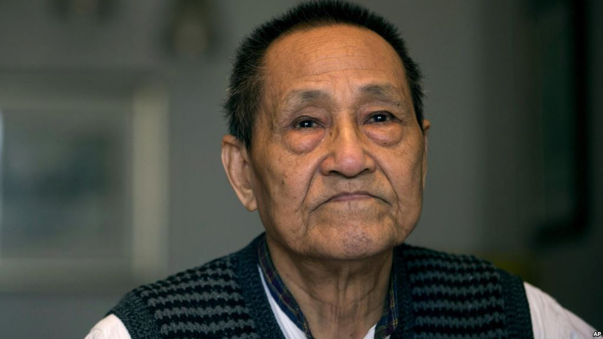

# [前政治局常委秘书鲍彤忆改开早期的华国锋、胡耀邦、赵紫阳、彭真]

前中共总书记赵紫阳的政治秘书、资深中共改革派领导人鲍彤 - 资料照片

北京 —  2018年是中国改革开放40周年。美国之音近期访问了直接参与这场历史性变革的资深改革派人士鲍彤等人。 鲍彤先回忆了改革开放初期一些中共领导人突破毛泽东路线的果敢作为和历史贡献，其中包括已故中共领导人华国锋、胡耀邦、赵紫阳以及时任全国人大常委会委员长彭真，同时阐述了他对改革开放深层意义的认知和感想。

**记者：**（当前中共宣传的改革开放40年成就展览中）只字没有提华国锋、胡耀邦、赵紫阳，好像也没有提万里，包括彭真直接参与了、主导了早期的修宪，做了很多立法工作。

**鲍彤：**这个问题提的非常好。刚才我说改革开放不是共产党领导出来的，并不意味着当时共产党人没有人去参加改革开放，投入到改革开放里面发挥了重要作用。不是这个意思。当时他们实际上是这样，有人看到改革开放，觉得这个东西否定毛泽东不得了。但是，确确实实也有很多的共产党员投身到改革当中去。他们实际上是跟老百姓一起，不是居高临下要领导老百姓来搞什么由它规定的路线，要老百姓向他看齐。不是这个意思。他们是顺应老百姓要求改革的潮流。他们也做出了努力，而且有的人做出很大的努力，很大的牺牲，担了很大的风险来做这样的事情。

#### **华国锋改了毛的人民公社**

刚才你提到华国锋。我认为华国锋是改革开放中第一位值得提的领导人。他当时是中共中央主席、国务院总理，他当然是共产党员。他后来是被污名化，说他好像是抵制改革的，实际情况完全不是这样。有人喜欢提他的两个凡是说明他是抵制改革的，这不是事实 。两个凡是是当时汪东兴提出来的，是他（华国锋）赞成的，而且他也不断说的。但是在华国锋先生来说，他是拿这东西当作招牌，当作一件外衣，来使他合法化，但是实际上他根本没那样做。他抓四人帮是两个凡是吗？ 当时很多人要求邓小平出来，他也赞成邓小平出来，而且考虑邓小平是被毛泽东批评过的，因此他考虑要顺顺当当的把邓小平请出来，因此要做充分的工作，让邓小平出来。因此，等到邓小平出来以后，实际上，华国锋对邓小平很尊重的。

为什么说华国锋当时是改革的？比方说，当时农村是人民公社 ，毛泽东给中国定的体制就是人民公社。当时中国人除了人民公社不知道有另外一种体制，但是华国锋率领一个代表团跑到欧洲去，他没有看到欧洲最发达的东西，他只看到的是南斯拉夫、罗马尼亚的农工联合体。就看到了这些东西，他已经觉得人民公社不行，所以他就提出背靠背，三个字的缩写，就是农工商联合体，用中国土话叫背靠背，他就觉得背靠背比人民公社好。这就是说，他愿意承认毛泽东的人民公社体制是不行的，他愿意接受外国的像农工商联合体这样的体制，他愿意同意农民提 出的改变毛泽东的人民公社制度的要求、愿望。

#### **彭真修宪写明权力属于人民**

刚才你提出的彭真，彭真本来是毛泽东的铁杆拥护者。延安整风的时候，第一个喊毛主席万岁的是彭真。但是彭真在文化大革命当中受到了教训，他知道中国需要法制，也应该成为一个法治国家，而不应该成为一个独裁国家，因此他重新出来以后，当时正好主管政法工作，他就非常注意中国不应该再走毛泽东的主张，应该尊重老百姓了。84年宪法中有一句话，我认为是驳不倒的，那就是：中华人民共和国的一切权力属于人民，中国人民在法律面前人人平等。这是彭真在制定或者说修改1984年宪法时最坚持的一个东西。中国如果是没有法制，中国变成什么东西呢？只能够变成野心家的工具。国家就成为一个工具，老百姓就成为这个工具的被治理者，彭真在这一点上很清楚。

#### **胡耀邦平反冤假错案广受支持**

刚才你讲到的胡耀邦。胡耀邦一开始到中央重新出来工作的时候，开始的时候在科学院工作，他觉得要尊重科学。后来他到了中央党校，他主张应该思想解放。后来呢，他到了中央组织部当部长。当时中央组织部有一个很重要的任务，就是平反冤假错案。平反冤假错案当时在党内是得到支持的，在毛泽东的时候不可能平反冤假错案，在毛泽东时候平反冤假错案就是否定文化大革命。因为当时把党内老干部的大多数都打成走资派了，平反冤假错案就是否定毛泽东，就是否定文化大革命。但是他受命来当中央组织部做的第一件事就是解放老干部，因此，得到了老干部的支持。但是，我也得说明这一点。耀邦没有满足在这一点上。他进一步了个什么事情呢？不仅是文化大革命的冤案要翻，党史上的一切冤假错案要翻，就像AB团什么的这些东西，不仅是党内的冤假错案要翻，社会上的阶级斗争也要翻，因此就牵扯到地富反坏、土地改革、镇压反革命，这些当中的冤案都翻。这是一个绝大的震动，这是做了一个绝大的好事。

我们说其它的事情都是老百姓主动的，那么这件事是老百姓非常渴望，但是老百姓不敢说的，一说这件事情就不得了。而胡耀邦在中央组织部 这样一个岗位上他是旗帜鲜明的把它翻了。翻了这个，也就是翻了中国共产党的全部历史，从阶级斗争一直到党内斗争，它的历史全部翻过来了。这是一个非常伟大的事情。

#### **赵紫阳八字诀：放权、松绑、让利、搞活**

赵紫阳他做的事情是什么呢？我跟赵紫阳一起工作了十年，我是80年5月到赵紫阳那里去的，我89年5月28号被邓小平下令逮捕， 正好十年。这十年当中，我跟赵紫阳在一起工作的时候，我听到赵紫阳最喜欢说的话是什么：放权、松绑、让利、搞活。

放权，放给谁，放权是谁来放权，共产党放权， 放给谁？放给老百姓。

松绑，过去共产党把老百姓捆起来了，把他们脚捆起来了，不准他们走，把他们手捆起来了，不准他们干， 把他们脑袋也捆起来了，不让他们想。当然嘴巴、耳朵、眼睛都捆起来了。要松绑。

让利，过去的利益都给毛泽东拿去了。毛泽东是反对工资制的，毛泽东连工资差别他都是反对的，毛泽东如果要搞，那就搞成波尔布特，那就搞成柬埔寨。但是毛泽东自己有稿费，有人告诉我毛泽东一个月的稿费大概是超过了中华人民共和国成立以来的全体所有的作者的稿费。

让利，要把国家从老百姓那里拿过来的东西，要还给老百姓。很遗憾，一直到现在，老百姓的个人所得，只占整个GDP的8%，也就是说中国的平民所创造的财富92%不知道哪里去了，只剩下8%，是在自己手里，以工资的形式，以各种收入的形式变成个人消费。让利，就是要把党和国家拿到的这部分利还给老百姓。

赵紫阳最后喜欢讲的是搞活。放权、松绑、让利、搞活。搞活是搞活什么？是使中国人成为活人，使中国人都得到自主权，都得到自由权，都能够保障他们的生命财产，都能够保障他们的行动，都能够在平等条件下发挥自己的长处，来竞争。赵紫阳喜欢的是这个。实际所有的事情都在这八个字底下，而这八个字加起来，一句话，就是党不是加强领导，而是减弱领导。减弱领导，要向老百姓让渡。要承认中国人是人，是主体，是活人，搞活嘛。

所以他们都是做出了很大的贡献。 他们做贡献从一定意义上来看，从形式上来看，好像来看是作为领导人起作用，但是从根本来看，他们的根都扎在老百姓当中。他们是代表老百姓发出了要求改变毛泽东的呼声，也就是改变这个举国体制的呼声。要求使自己成为活人，使自己成为活人，这就是叫改革。使老百姓成为被治理者，不叫改革。

（根据电话录音整理，受访者观点不代表美国之音）

---------------------------------------------------

原网址: [访问](https://www.voachinese.com/a/interview-with-bao-tong-20181216/4703617.html)

创建于: 2018-12-18 14:13:35
