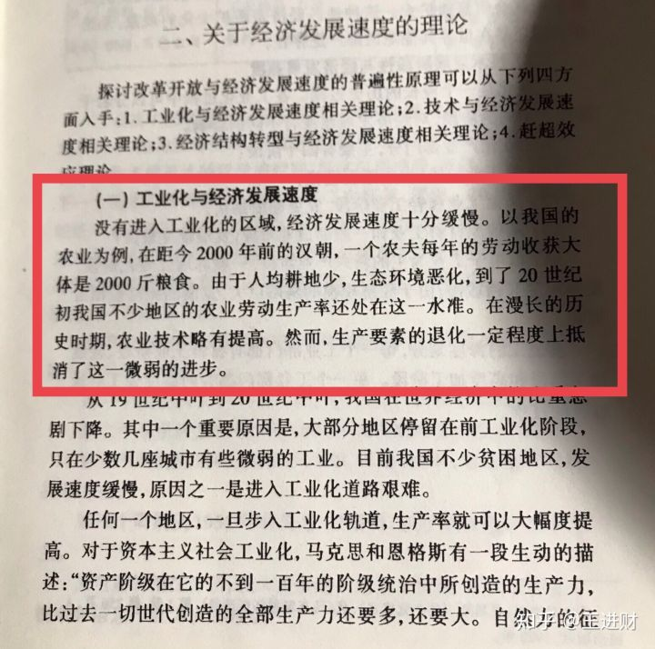

# 如果大米的价格政府不控制的话，那么在目前的通胀水平下，将会达到多少钱一斤？ - 知乎

[王进财](https://www.zhihu.com/people/yang-ding-san) 元龙臭味，孟公瓜葛。 

4,030 人赞同了该回答

和你想的有点不一样，如果国家不管控粮价，中国的粮价会持续走低，直到跌破农民成本，最终全国各地的农田里放眼望去全是杂草，市场经济只追求效率，也就是剩余劳动价值，不合理的经济活动会被无情摧毁。

矿泉水是充分竞争过的行业，价格1元一瓶比较合理，其中大部分是仓储和物流成本，比如我平时只喝1元的矿泉水，可口可乐的冰露就是1元啊，挺好喝的，农夫山泉和怡宝2元一瓶的矿泉水不过是最近几年的事情，大家愿意缴这个智商税你也没办法。

中国粮价是国际粮价的三倍左右，国家不遗余力的补贴调控才把价格稳在一个高位上，但是农民依旧赔钱，有人调侃中国农民种一亩地，除去花费能挣五块钱，我觉得说的不对，因为没有计算人工成本，算进去的话应该赚不到五块钱。俗话说，杀头的买卖有人干，赔本的生意没人做。在2014年左右，我在黑龙江问当地的粮商，他说巴西大豆渡过太平洋拉到大连港口，除去关税的价格还要比当地农民收购价便宜两毛多钱。谷贱伤农啊，结果是当地的农民第二年宁愿把一部分田荒着也不种大豆。中国有一大批商贩从越南走私大米到中国，然后掺在本地大米里一起卖，这样可以挣大钱，国家也是睁一只眼闭一只眼。你想想看，连越南这样的国家，生产粮食成本都比中国低的多，你就知道这个问题有多么的狗血了。

世界上根本不存在粮食价格的问题，只存在剩余劳动价值的问题，简单来说也就是说生产效率的问题，美国的农业生产效率是中国的几十倍都不止，就算比你价格低十倍都是合理的，美国玉米买2毛钱一斤，人家扛得住，你中国农民能扛得住？

中国农业人口在2010年统计大约是8亿，它生产的粮食自己吃都不够，粮食缺口估计是20%左右，实际缺口可能不敢想象。在2010年，中国进口了175亿美元的美国农产品，占美国农产品出口总额的15.1%。但是最可怕的是美国的农业人口不足1%，你的农业人口是70%，你这么一对比就知道为什么中国粮价这么高了。

反观天朝的农民怎么种地的，你观察一下仿佛就在二次元，你去田里看一下，连个二牛抬杠都看不到，全靠镰刀和锄头啊，本来人均土地就很少，效率还这么低，收割粮食全靠“久保田”这样的小收割机在全国跑着给农民服务，然后利润再被这些小商人压榨一些，最后拿手里还能剩多少？还是那句话，你的农业产出效率不是比人家低一点半点，是低几十倍都不止啊。

种地是作不了假的，种瓜得瓜，种豆得豆，你没有投入就没有产出。中国的农业生产水平还停留在汉武帝时期，你的农业基础设施建设还停留在文革时期，改革开放这么多年，农业基本上没发展，你为了一点点蝇头小利欠的账，现在怎么还的上？农业基础设施建设和发展需要大量的资金投入，你如今地方财政赤字几十万亿，怎么和人家玩这种高端的游戏？

再说耕地问题，中国自从搞了城镇化以后，可耕地面积大量减少，减少的是什么田？是被改良过的优质的高产农田，因为城镇周边有一种稀缺资源，那就是粪便。如今城市建设之后，城镇周边这部分田大面积减少，剩下的全是低产田，而且还没人种。这进一步加剧了中国农民的窘况，所以这个游戏根本就没办法玩，你种得多赔的多，你只能眼睁睁的看着人家搞倾销。

“农业是制造业和商业的基础”，这是美国农业部在1862年成立时在其部徽上镌刻的文字。经过近两百年坚定不移的政策补贴和资本投入，美国成为了世界粮仓。如今，世界上接近一半的小麦、三分之一以上的大豆、四分之一的牛肉、五分之一的玉米，以及牛奶、鸡蛋等主要农副产品，均来自于美国。这就是美国为什么敢把十三个航母群开到一二岛链威胁中国的底气，假设有一天，美国航母把海运一封，然后再从东南亚地区和印度高价收购粮食，那么这个画面不敢想象，中国的粮食缺口是多少？是20%还是更多，大家用指头一算，就知道该死多少人了。

德国有容克资本羊吃人的惨剧，中国有改田为桑饿死农民的惨剧，这两个故事就是一模一样，世界历史简直就是惊人的一致，到时候实在玩不下去，就只能搞小地主土地兼并，农民全被赶进城市做房奴的结局啊，似乎已经搞的差不多了，魔幻现实。

美国总统富兰克林曾经说过一句话，农业是国家财富的真正来源，是一个国家获取财富的唯一诚实的方式。所以某国你哪怕是把房子盖天上去也没用，你以为你换了个马甲人家就不知道你是王八了，出来混，迟早要还的。粮食是国家经济的命脉，你连粮食都不会种，你的商业和制造业的价值锚点在哪里？一个没有价值锚点的社会终究是沙土上的城堡，不堪一击。

  

————分割————

很多人骂我，私信骂我，说农夫山泉真的很好喝，这不是智商税，一块钱的冰露是纯净水，两块钱的农夫山泉是矿泉水，不懂不要乱逼逼。对于这个问题我只能摊手，你们愿意买两块钱的矿泉水，我祝福你们幸福，另外我要告诉这些人一个知识点，两块钱的怡宝也是纯净水，你们喝的还少了？

还有骂我不要乱逼逼的，因为中国农业有手扶拖拉机和久保田，甚至还有自动打谷机，你竟然说全靠锄头和镰刀，对于这个问题我没有意见，我只是觉得中国人可能对“机械化”产生了很深的误解。

还有骂我瞎逼逼的，说中国农业亩产很高，效率很高，完爆美国，你竟然说生产水平还停留在汉武帝时期，信口胡说，应该直接肉体消灭，关于这个问题，我刚看手头有一本书。

编辑于 2018-10-27

---------------------------------------------------

原网址: [访问](https://www.zhihu.com/question/293268002/answer/509469741?utm_source=com.google.android.keep&utm_medium=social&utm_oi=29896176828416)

创建于: 2018-12-18 20:51:01
