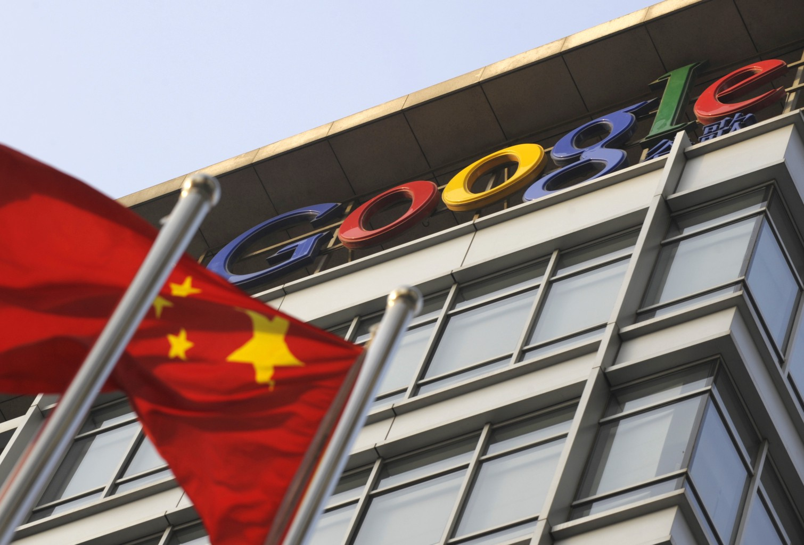

# 关于中国审查版搜索引擎：谷歌内部泄露的私下会议与该公司的公开 声称完全矛盾

[iYouPort](https://medium.com/@iyouport?source=post_header_lockup) Oct 10 2018

> 如您所知，“对内和对外”的态度在很多时候是有区别的，也是为什么人们普遍对内幕消息的兴趣远高于宣传稿。但是对于谷歌来说，这里的“区别”简直就是天壤之别，他们为什么要掩盖\[对于一家公司来说单纯的赚钱兴趣\]？我们似乎能闻到一股奇怪的味道，它可能远非“怕丢人”这么简单。本文是 The Intercept 最新获取的谷歌内部会议记录的副本，其中很多细节足以验证我们曾经对谷歌做出的分析……但这可能不是故事的全部

谷歌搜索引擎主管 Ben Gomes 说，“我们必须专注于我们想要实现的目标，确保当序幕拉开时我们已经做好了一切准备”。

此时是 7月18日星期三，Gomes 正在向谷歌内部员工发表演讲，他们正在开展一个秘密项目，为中国开发一个审查版搜索引擎，将“人权问题”、“学生抗议\[指64\]”和“诺贝尔和平奖\[指刘晓波\]”等均列入黑名单。

这里是 The Intercept 获得的此次会议记录，Gomes 在会议中称：“你们已经加入了**一项非常重要的工作，这事关公司的利益**……我不得不承认这是一段艰难的旅程。但我确实认为这是一个非常重要且有价值的工作。我希望我们能够尽快抵达目的地。”

Gomes 开玩笑说总统特朗普的不可预测性，并感叹于美中之间正在进行的所谓贸易战，据称导致谷歌与北京共产党官员之间的谈判被放缓，这一计划中的谈判如果启动，谷歌将要求北京批准谷歌推出审查版搜索引擎 — 也就是进入中国市场。

Gomes 于 1999 年加入 Google，并且是该公司搜索引擎项目背后的关键工程师之一，他表示希望该平台的审查版搜索引擎可以在 6 到 9 个月内推出，但有可能会更快。“这是一个我们以前从未涉及过的领域，”他说，“因此，我觉得我们不应该在时间表中加入太多明确的内容。”

*   **延伸阅读：《**[**谷歌想从中国得到什么？**](https://medium.com/@iyouport/%E4%B8%BA%E4%BB%80%E4%B9%88%E8%AF%B4-google-%E6%90%9C%E7%B4%A2%E6%98%AF%E5%90%A6%E8%83%BD%E6%88%90%E5%8A%9F%E5%9B%9E%E5%BD%92%E4%B8%AD%E5%9B%BD%E5%B8%82%E5%9C%BA%E6%A0%B9%E6%9C%AC%E4%B8%8D%E9%87%8D%E8%A6%81-4ae76ebd938)**》**
*   **《**[**谷歌为什么要这么做？**](https://medium.com/@iyouport/%E5%8F%AF%E6%80%9C%E6%AD%A3%E4%B9%89%E6%B2%A1%E6%9C%89%E9%92%B1-d3bec8596c6c)**（后半部分）》**

自 The Intercept 首次公布有关代号为 Dragonfly 的审查版搜索引擎的详细信息至今已有两个月了。从那时起，该项目一直在面临人权组织、谷歌员工、美国参议员、甚至副总统迈克彭斯的批评，他上周四呼吁谷歌“立即停止开发 Dragonfly 应用程序，这将加强共产党的审查、侵犯中国客户的隐私。“（后面有详细分析）

谷歌拒绝回答有关 Dragonfly 项目的问题或疑虑。 9 月 26 日，一位谷歌高管首次面临对审查计划的公众质疑，当时 Keith Enright 告诉参议院商业科学和运输委员会，“是有一个项目叫 Dragonfly”，但他说，“我们距离在中国推出产品还有很远。” 当被要求提供具体细节时，Enright 直接拒绝了，说他“不清楚该项目的范围或超出范围的部分。”

直接参与建立审查项目的谷歌高级管理人员在很大程度上避免了任何公众监督。但是在 9 月23 日，Gomes 在庆祝谷歌成立 20 周年的活动中遇到 BBC 记者时，简要地对 Dragonfly 项目发表了简要的评论。

“现在，我们所做的只是一些探索，”Gomes [告诉记者说](https://www.bbc.com/news/technology-45653035)，“但由于我们还没有任何推出什么东西的计划，所以我没什么可说的。”

> _One Google source said Gomes’s comments to the BBC were “bullshit.”_

**Gomes 的声明与公司的官方路线保持一致。但是，这与他私下告诉那些正在研究 Dragonfly 项目的员工的内容完全不一致 — 这让人感到不安**。一位谷歌消息人士告诉 The Intercep，Gomes 给英国广播公司的评论是“胡说八道”。

7月的会议上，Gomes 告知员工，该公司的计划是尽快启动审查版搜索引擎 — 并且一旦收到北京的批准，就可以“准备好”快速部署。

关于 Gomes 对内部工作人员的评论您可以在最下面阅读全文，突出显示了谷歌关于 Dragonfly 项目的公开和私下声明之间形成的鲜明对比。这个秘密项目自 2017 年春季以来一直在进行 — — 涉及约 300 名员工，其中大多数人都是全职工作的。这远远超出了他们公开声称的所谓“探索”，并且推出该项目的计划是完善的，尽管该公司努力压制这些信息，但最近几周内谷歌自己的一些员工也[强调了这一点](https://theintercept.com/2018/09/21/google-suppresses-memo-revealing-plans-to-closely-track-search-users-in-china/)。

Gomes 的言论同时揭示了为什么谷歌有兴趣在 2010 年高调离开后如今再次返回中国，当时该公司曾宣称由于担心言论自由和安全问题而“无法继续”。

在向工作人员解释为什么关于 Dragonfly 项目的工作“非常重要”时，Gomes 引用了中国市场的庞大规模为由，称“我们正在谈论的是 Google 的下一个十亿用户” — — 再次证实了[我们在两个多月前的分析](https://medium.com/@iyouport/%E4%B8%BA%E4%BB%80%E4%B9%88%E8%AF%B4-google-%E6%90%9C%E7%B4%A2%E6%98%AF%E5%90%A6%E8%83%BD%E6%88%90%E5%8A%9F%E5%9B%9E%E5%BD%92%E4%B8%AD%E5%9B%BD%E5%B8%82%E5%9C%BA%E6%A0%B9%E6%9C%AC%E4%B8%8D%E9%87%8D%E8%A6%81-4ae76ebd938)：西方市场已经饱和，谷歌和 Facebook 都需要在非西方加速铺展。尤其是中国，该国没有基于公民切身利益的隐私保护法案，其公民也不重视自己的隐私权，尤其是**该国政府对伪装成“智能城市”的大规模监视项目的垂青，谷歌需要借助搜索引擎作为跳板，以进入中国市场**。他们瞄准的是这个庞大的数据库，对监视资本主义者们来说这才是真金白银。在这里看到更多《[“智能城市”究竟是个什么鬼？！](https://medium.com/@iyouport/%E6%99%BA%E8%83%BD%E5%9F%8E%E5%B8%82-%E7%A9%B6%E7%AB%9F%E6%98%AF%E4%B8%AA%E4%BB%80%E4%B9%88%E9%AC%BC-81dbf603e2c2)》。

但是，上述显然**只是表面逻辑**。由于我们没有基于此事的内幕消息（想必美国的独立媒体也没有，除非情报机构内部人士泄露出来）于是不方便做更多推测。不过我们想借此指出一些可能被忽视了的线索，虽然不会得出结论，但这些线索应该对您的思考有一定帮助。

1、**首先认识谷歌**。当然这绝不是什么新闻，在美国不是，可在中国很大程度上似乎仍是新闻，即 谷歌从来都是情报部门的监视计划项目。我们推荐过一本书《[When Google Met Wikileaks](https://www.amazon.com/When-Google-Wikileaks-Julian-Assange/dp/8189059661) 》，出版于四年前，其中解释了几乎完整的谷歌内幕 — 最重要的是揭示了该公司的真实属性。这大概是第一部也是最透彻的一部阐述硅谷巨头的作品。

如果您没有读过这本书，这里还[有一份在线可读的报告](https://www.zerohedge.com/news/2017-08-28/how-cia-made-google)，该报告来自 INSURGE INTELLIGENCE：一个由众筹资助的调查性新闻项目 — 也就是说它是独立的，与任何权势无关，它揭露了美国情报界如何资助、培育谷歌，作为**全球信息战**的工具。

事实上相关文献大量存在，其中最为热门的包括 Tim Shorrock 的 “[Spies for Hire](https://books.google.com/books/about/Spies_for_Hire.html?id=F52N9M2ALpsC&printsec=frontcover&source=kp_read_button#v=onepage&q&f=false)”，从一个相比下较浅的角度揭示了“美国情报 — 工业联合体”的内幕：当今的科技巨头为什么能成为巨头，因为它们是当年通过向情报界提供技术服务和产品而开始的（否则他们没有今天这般强大）上面链接可在线阅读。这份资料曾被多家国际隐私权利组织引用。顺便提一个在美国几乎家喻户晓的常识：真正做政治决策的是情报机构而不是白宫，仅举一篇文章详细阐述了这点《[United States overseas operations: Role of CIA — Jacob G. Hornberger](https://www.globalvillagespace.com/united-states-overseas-operations-role-of-cia-jacob-g-hornberger/)》

2、**关于利益关系的逻辑**。就如我们曾经分析过的，此事有两个观察角度：

*   如果你使用地缘政治博弈的角度来看，即“高堡奇人”，美国 — 中国在数字技术世界的“均分天下”，那么这件事可能是错的，相当于将谷歌的能力 — 也就是美国情报机构的实力“切割”出一块可观的部分送给了北京，将球踢入对方的球门？；
*   但如果你换个角度看，从技术本身的可利用性角度，那么这事很可能就是“对的”，因为对美国情报机构来说有它大有好处，将意味着情报机构能够更深入地了解在中国“谁或哪些组织是对北京政权冲击力最大的、中国人普遍关心的问题都有哪些、谁在关切当局不喜欢的内容、中国社会的最典型特征都是些什么”等等，这些信息具有高度的情报价值。

而且后一种和前一种并不冲突，它们是完全一致的，中国人有曰“知己知彼方百战不殆”，情报从古到今都是无价之宝。并且它也符合上述 1 中关于 CIA 构建谷歌的目的 — — 北京一直明白或者说怀疑这种目的的存在，这才是真正的原因关于为什么中国的 GFW 一直在屏蔽硅谷巨头，并同时打造本土的几乎功能一样的克隆版数字应用和数字技术。这不仅仅是简单的舆论控制目的。

抵制“北方叙事”的危地马拉活动家们也曾经暗示过这点，即 后台是情报机构的硅谷巨头的全球覆盖将侵蚀小国的利益\[包括文化独立性\]。再推荐一本书《Science of Coercion: Communication Research and Psychological Warfare, 1945–1960》关于全球心理战的历史以及其对传播学发展的决定性作用。您将能从中感受到危地马拉活动家的焦虑所在（请看英文原版）。

3、**那么为什么参议员和彭斯都在公开反对该项目呢？**对于前者，一方面美国参议员也很可能并不了解情报机构的计划，这是基本政治模式，也是为什么美国民间称其为“deep state”；另一方面也有可能只是姿态，毕竟“协助\[不论任何一种\]审查”都是违背美国基本价值观的；而对于后者彭斯，审查版搜索引擎显然是一个极其惹眼的论据，作为中期选举前的舆论铺垫，不消说此论据具有显著的价值。

综上可见，作为谷歌高官，该项目只能秘密操作，一方面它不光荣，另一方面它不是简单的赚钱生意。也就解释了为什么该公司一直以来极力掩盖此事（在其项目启动一年多后我们才得知，还是多亏了独立媒体的揭露）。Gomes 在内部讲话中所表现出来的信心是非常有趣的观测点，虽然他自己也显然无法推测风向将会如何，但**作为生意人，为了一个直到现在还不知道能不能开张的买卖做出如此令人印象深刻的投入，那将意味着他心里有底，此事包赚不赔**。

为什么不论北京是否同意谷歌也不会赔钱？想想美国情报机构全球一流的情报预算吧。

The Intercept 的报告也明确指出，如今 Dragonfly 项目已被曝光、随之而来的不论是内部和外部的强烈反对，似乎都在使 Google 的领导地位不稳定？并且在该项目计划的方向上产生一定程度的不确定性？**然而并没有**。根据与 Dragonfly 项目有关信息来源，工程师们正在依照管理层的指示行事，继续在审查版搜索引擎项目上投入努力，**整体呈现一种积极发展的状况**。

我们不做任何判断，您可以结合我们上述给出的线索来分析这件事。**不论任何时候，我们坚决反对一切审查。是一切！**

The Intercep 联系了 Gomes 以征求意见，但这货没有回复通过电子邮件和短信发送的请求。周六，当有人再次问及 Dragonfly 时他搞了一个非常拙略的借口，“我听不清你在说什么，只知道你在说话”，他说，并迅速挂断了电话。

**以下是 Ben Gomes 在 2018 年7月18日向内部为审查版搜索引擎项目工作的 Google 员工发表的讲话（摘要版）**[全文在这里读到](https://theintercept.com/2018/10/09/google-china-censored-search-engine/)**：**

我知道这对你们中许多人来说是一个漫长的过程，我首先承认这点。毕竟很多人已经开始研究这个问题了，在一个暂时没有明显结果的项目上努力工作并不容易。再次我要对你们所有人表示感谢。在这项工作的过程中，您承担了对公司来说极为重要的任务 — 我们为全世界所有用户提供服务的基本使命。在此过程中，我认为我们将获得很多**“附带的好处”**，不仅来自直接的工作，还来自基于中国工作的其他附加利益。

我用两种方式来考虑 Google。其中之一是技术，另一个是产品和客服。因此，从服务用户的角度来看，毫无疑问 — 我们正在讨论的是下一个十亿用户…这个世界上有 50 亿成年人，那么我们为什么要考虑下一个十亿用户呢？好吧，其中的确有一些人没有启用互联网，等等，但对于那些支持互联网的人群来说，现在我们正在遗漏的很大一部分人都在中国。

所以有机会 — 所有人都会知道这点 — 这显然是为更多人提供服务的最大机会。如果你认真对待我们的使命，那就是我们关注的重点。这并不意味着它会很容易。其中许多事都不容易，而且你们现在从个人经验中也已经了解到了这点。还有政治气候问题。未来是非常难以预测的。六到九个月内\[推出该项目\]。但我们通常都无法预测最近三天的政治变动，更不用说政治的最近一年了，\[或\]过去两三年。所以我们只是不知道未来在某些方面会有什么发生，我们必须专注于我们想要启用的内容，确保它有机会发布时我们有充分的准备。

你们一直在以这种身份工作，这并不容易。而我们正在与您合作，为**确保您的职业生涯不会受此影响**。困难的部分在于如此长时间内保持动力，但是，许多困难和有价值的旅程都是如此，为了保持这种动力，当你抵达目标时就会感受到更甜蜜的收获。

我还想说 — 我没想到我们能够从搜索的角度做出改变，我们已经能够做到这点。由于我们还没有得到来自中国内部的信息，我们可能会取得边际进展，我们会尽力而为。但是各位……我真的很惊讶我们已经取得了如此大的进步。 …我非常感谢你们所做的工作。

我认为中国是最有意思的市场之一，可以说是当今世界上最有意思的市场。关注中国市场将让我们学到东西，因为在某些创新方面中国是领先于世界的。**我们需要了解那个国家发生的事**，以激励我们。这不仅仅是一条单行道。中国会教给我们一些我们不知道的东西……这对于我们 Google 来说是非常有价值的，可能不仅仅是在中国，在其他地方也一样。

每个人都注意到了一些在中国发生变化的关键模型，商业模式，但我敢肯定还有更多我们今天尚未了解的其他创新。通过努力，您将成为创新世界的窗口。总的来说，我只想感谢你们所做的所有工作。我请大家耐心等待一段时间，我不得不承认这是一段艰难的旅程。但我确实认为这是一个非常重要且有价值的旅程。我希望我们能够尽快抵达目的地。

虽然我们说过这将是六到九个月内\[就会推出的计划\]，但世界是动态的，几个星期前还没有人会预料到美国总统会责怪美国与俄罗斯的问题，而俄罗斯外交部会在 Twitter 上做出回应说：“我们同意。”所以……只能说他反复无常，一些事有可能迅速发生根本性变化。所以在某种程度上，在我们的规模上，**我们需要保持这种选择性，以防突然间世界发生变化，也许他会忽然决定他的新朋友是习近平**。这是一个我们以前从未生活过的世界。所以我觉得我们也不应该过多地确定时间表。

……我只能说我们要把眼光放长远一点，世界的步伐正在发生变化……所以我们应该提高警惕，以确保只要时机到来，我们不会错过它。

……

首先基本可以肯定的是，Gomes 没有对其工作人员说明全部，至少此前已经有明确报道，在该项目计划被泄露之后谷歌内部紧急维稳封锁了相关资料；其次，谷歌“背后的人”也很可能没有对谷歌说明全部，这部分不做推测。但现在您至少可以了解到一个大概了。◾️

**_感谢帮助 iYouPort！_**

**_PayPal 捐赠渠道已开通_** [**_https://paypal.me/iyouport_**](https://paypal.me/iyouport)

---------------------------------------------------

原网址: [访问](https://medium.com/@iyouport/%E5%85%B3%E4%BA%8E%E4%B8%AD%E5%9B%BD%E5%AE%A1%E6%9F%A5%E7%89%88%E6%90%9C%E7%B4%A2%E5%BC%95%E6%93%8E-%E8%B0%B7%E6%AD%8C%E5%86%85%E9%83%A8%E6%B3%84%E9%9C%B2%E7%9A%84%E7%A7%81%E4%B8%8B%E4%BC%9A%E8%AE%AE%E4%B8%8E%E8%AF%A5%E5%85%AC%E5%8F%B8%E7%9A%84%E5%85%AC%E5%BC%80-%E5%A3%B0%E7%A7%B0%E5%AE%8C%E5%85%A8%E7%9F%9B%E7%9B%BE-e32e70783064)

创建于: 2018-12-19 20:54:51

