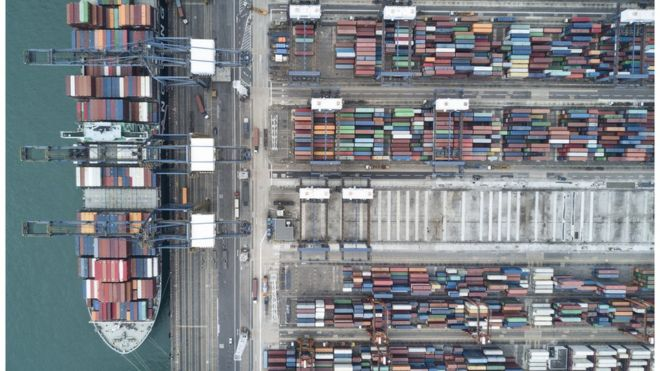
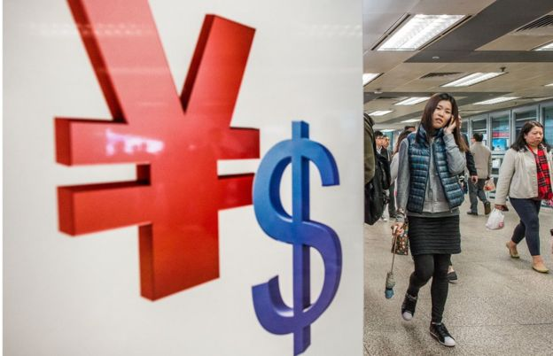
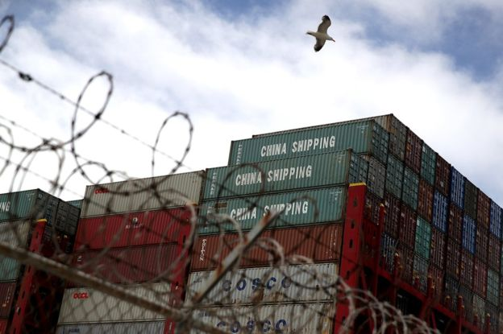
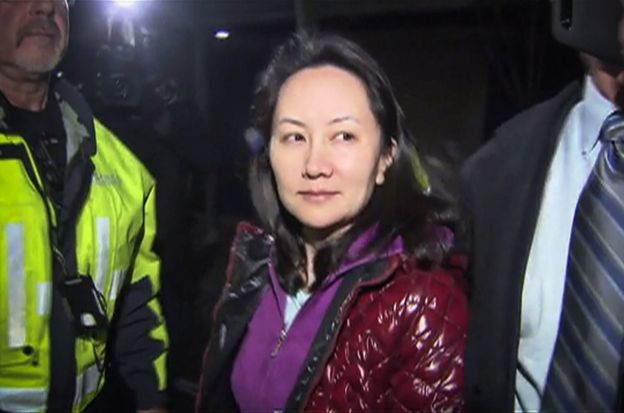

# 香港失掉独立关税区地位的可能性

李翰文 BBC中文 2018年12月20日
------

图片版权 Getty Images 

香港甚少产品是完全依赖对美出口。

近期，持有中国大陆及香港护照的华为首席财务官孟晚舟被指利用在香港注册的Skycom公司，绕过欧美与伊朗做生意，或违返联合国决议的制裁。

这宗事件再次印证了来自各界的担忧：一些企业可能通过香港的空壳公司，进行一些违规活动，隐瞒资产、避税或绕过制裁， 降低香港作为一个相对透明和独立的关税区的信誉。

十一月中旬，美国国会一个委员会早前发表报告，批评北京政府干预香港的自主事务，提议美国政府检视对香港出口军民两用科技产品的政策。报告在香港引发广泛关注，多个媒体及政客，认为如果美国政府采纳有关建议，那就是首次就个别产品，把中国与香港视为同一关税区，冲击香港作为独立关税区的地位。有香港建制派议员形容，把香港与中国视为一体，香港就会“玩完”，商界也同出现了这种顾虑。

但有观察人士向BBC中文指出，报告并没有直接提及要求取消香港独立关税区的地位，但反映美方对香港“一国两制”在经济层面上受威胁的顾虑，而最近华为涉嫌利用香港空壳公司向伊朗转售敏感美国技术产品，加拿大因而按美国要求拘捕华为副董事长兼首席财务官孟晚舟，正好反映香港政府在这方面执法力度不足。

- [观点：高铁“一地两检”──中国的强势 港人的无力](https://www.bbc.com/zhongwen/simp/chinese-news-45480618)
- [“一带一路”将把香港带向何方](https://www.bbc.com/zhongwen/simp/chinese-news-41225872)
- [“政治凌驾专业”？逾千亿港珠澳大桥在香港引发的五大争议](https://www.bbc.com/zhongwen/simp/chinese-news-45898013)
- [挑战港独“红线”的陈浩天：我没有鼓吹暴力](https://www.bbc.com/zhongwen/simp/chinese-news-44883503)

### 赴美游说

这份年度报告由美国国会属下的美中经济与安全审议委员会撰写。其中关于香港的部份以香港政府宣布取缔宣扬香港独立的“香港民族党”、香港政府拒绝为英国《金融时报》亚洲新闻编辑马凯（Victor Mallet）延续驻港工作签证等为事例，批评香港的言论和结社自由持续收窄。

报告建议美国国会指示美国商务部等部门撰写报告，检视和评估美国对香港出口“军民两用科技的政策，因为这关乎美国对香港与中国分成两个关税区的做法”。

图片版权 AFP 

香港与大陆在国际上被视为不同的关税区。

对此，香港政府发表声明指报告偏颇，强调香港作为一个单独的关税地区，致力于执行战略物品贸易管制。

报告发出后，香港商界与民主建制两派的议员都派人赴美游说，分别属民主派和建制派的两名议员郭荣铿和周浩鼎先后与美国议员见面，但两人有不一样的结论。周浩鼎引述美国国务院负责香港事务的官员指，国务院不会改变香港特殊的关税地位；而郭荣铿就指，他观察到美国政界的共识是如果香港政府有再剥夺市民的参选权、驱逐外国记者等行为，《美国──香港政策法》和独立关税区的政策就会被撤销。

报告建议不一定获美国政府采纳，美国国务院表示留意到有关报告，但重申支持“一国两制”原则，并寻求与香港作为中国一个特别行政区下合作，继续美国的香港政策法。

建制派代表周浩鼎结束访问后指出，美方十分关注早前多名香港立法会议员被法庭颁令取消议员资格的事件。他说当时向美国官员解释事件，指香港政府有“依法办事的理据”。

同属建制派的香港立法会议员钟国斌接受BBC中文访问时认为，这种解释方法可消除对方疑虑。他指，一般美国国会议员可能不明白法庭当时取消议员议席的情况，“如果我们全面去解释，让他们理解情况，就没有问题了”。

### 独立关税区为甚么引人关注

独立关税区（Separate customs territory，又译单独关税区）最初的出现，其实是关税暨贸易总协定（GATT即世界贸易组织WTO的前身）制定时，希望为未获得独立的殖民地政府而设置，令它们除了政治以外，在经济上有自主权。

起初，关税暨贸易总协定有30多个非主权政治实体，但后来，多个殖民地国家相继独立，现在世贸余下的独立关税区只有台澎金马、香港、澳门和欧盟。

加入世贸需要遵守一系列的国际规则和条约，具有约束力外，也是一个相对性的保障，例如发生贸易摩擦时，可以透过世贸进行仲裁，不过面对中美较大规模的贸易战，世贸就显得有点无牙老虎。

在“一国两制”下，广义上来说，香港只有外交及国防事务由中国直接管理，香港可以中国香港的名义参与国际组织，在经贸层面，香港可以自行与其他国家商讨双边合作，所以顺理成章，香港也是世界贸易组织一个非主权国成员，国际社会普遍承认香港在经济上的独立地位，法律、税务事宜等，也与中国大陆有所分别。

不过值得一提的是，世贸规定成员需要在对外贸易关系和参与WTO事务上享有“完全的自治权”，不得受到所属国家的干涉才能够保持成员身份，意味着一旦中国政府在经贸层面施以“干预”，世贸有权取消香港的成员身份。

在2001年中国入世前，香港起了重要作用，成为外资进入大陆市场的重要渠道。但现在，中国已成为全球第二大经济体，物流、航运与世界接轨，某程度上，香港中间人的地位正在减弱，剩下来的最主要是金融，因为中国尚未完全开放其金融体系，相对地香港有较为完善的金融体系，港元亦与美元挂勾，货币稳定性较强。

目前中国、美国互相制定的关税措施，因为香港是独立关税区，香港的进出口产品并不受到直接影响，即是香港入口到美国的农产品、科技产品不会被征税。

### 骨牌效应

如果美国不再把香港视为独立关税区，对中国实施的关税措施，将同样适用于香港，香港向美国出口的货物就会变得昂贵，而如果美国政府采纳今次国会报告，则会对科技出口加以限制，亦会打击香港近来希望发展科技城市的决心。

但有分析指出，美国要打击香港这个全球最自由经济体之一的地方，没有甚么好处，香港本身是美国第9大出口市场、第6大农产品市场，2017年，美国对港贸易盈余达326亿美元。一些观察人士认为，在这一利诱下，美国不会想轻易影响到这笔生意而在贸易战中打香港牌。

香港出口到美国的产品只有约34.6亿港元，对出口影响算是轻微，香港甚少产品是完全依赖对美出口。香港科技大学经济系教授雷鼎鸣接受BBC中文访问时也形容，这些数字让外界很容易就能评估美国取消视香港为独立关税区的影响。

但是，香港并不能免受中美贸易战影响。中国银行高级经济研究员戴道华早前撰文称，贸易战影响下，中美双边贸易量会下降，间接影响到香港的转口贸易。2017年， 2775亿港元中国产品经香港转口到美国；相对地香港转到中国的美国产品则是732亿港元，两国经香港转口的贸易货品只有3507亿港元，占香港同年8.2万亿港元的商品进出口贸易仅4.3%。

单看数字或会以为香港直接受到影响受限，但中美贸易战会影响整个产业链，不能单计算中美之间经香港的转口贸易，所以难以评估对香港转口贸易的打击。

图片版权 Getty Images 

贸易战影响下，中美双边贸易量会下降，间接影响到香港的转口贸易。

香港经济学者关焯照认为，如果只计香港进出口到美国货品被征税来说，影响有限，不过担心慢慢会演变成失去《香港政策法》，冲击香港金融城市的地位。

香港立法会议员钟国斌也警告，外国因为香港的《基本法》明确规定，香港奉行资本主义制度，而香港司法独立、言论及出版自由等特色都与中国大陆有别。如果其他国家当香港是一个普通中国城市，“代表香港没有了它的独特性，也代表其他人对香港失去信心”。

香港是世界贸易组织的成员之一，美国不再视香港为一个独立关税区并不会影响香港在世贸的地方，但钟国斌认为，美国的举动肯定会影响其他国家对待香港的方式。他举例，美国早前呼吁盟友不要使用华为制造的设备，英国、澳洲、新西兰和日本先后响应，“美国的盟友很大可能会配合美国的要求，这是可能出现的最坏情况。”

### 避税天堂

孟晚舟事件在中美贸易战背景下，被外界解读成中美谈判的筹码之一。同时它揭露了一些企业可能利用香港的空壳公司，从事一些违规活动，隐瞒资产、避税或绕过制裁。

- [华为孟晚舟事件：中国可能对美国加拿大采取的行动](https://www.bbc.com/zhongwen/simp/world-46498101)

图片版权 AFP 

孟晚舟事件让外界再度关注中资企业或个人在香港的业务，美方近期促请香港要处理空壳公司问题，并做好针对联合国制裁的执法行动。

外界一直关注香港空壳公司的事宜，特别是避税的问题。税务政策上，香港奉行低税政策，也是最自由经济体之一，很多中国以至国际公司会在香港设立公司，享用香港金融市场的优势。

虽然有一定程度的监管，香港一度被称为“避税天堂”，2015年，香港被欧洲委员会一度被列作“不合作税务管辖区”，后来则从“黑名单”移到“监察名单”；2016年12月，香港统计处公布的数据显示，香港近半外来直接投资来源是三大离岸公司注册热点，包括英属处女群岛、开曼群岛和百慕大。

中美贸易战背景下，各方正密切监察，香港企业有否为大陆企业逃避关税。香港付货人委员会主席林宣武此前曾表示，一些不法份子或会尝试这样做，但绝对瞒不过美国。

美国驻香港领事馆12月10日透露，美国国务院及美国商务部的代表团与香港政府代表会面，讨论了双边合作的事宜。美方代表团希望香港能用新法例，去限制在香港注册及营运空壳公司。这则消息传出之时，正值华为孟晚舟事件发酵之时。

美方建议香港增加资源去制裁执法，特别是针对朝鲜及伊朗的船务活动，而出口管控方面，美方寻求香港在转口货品上加入管制，防止产品成为不经授权的军用或投放在大杀伤力武器的发展及生产。

钟国斌介绍指，这种做法常见，而香港政府也有许多方式证明自己有机制如何处理这些问题。“这是十分正常的交流，也不是甚么新鲜事物，九十年代开始已经有。”

香港民主党议员林卓廷指，外国政府已提出关注，港府有责任要仔细看看现时法例或政策是否存在漏洞，是否容易让人利用本港来逃避管制或进行不寻常交易。

_BBC中文记者林祖伟对此文亦有贡献。_

------

原网址: [访问](https://www.bbc.com/zhongwen/simp/business-46589730?ocid=socialflow_twitter)

创建于: 2018-12-20 11:33:50
