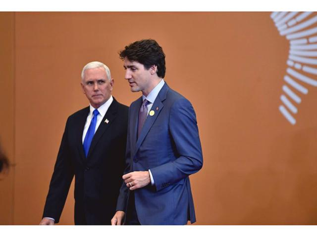

# 大愛豬瘟蔓延時 - 陶傑

2018年12月21日

iAffairs Canada

加拿大小鮮肉總理被指軟弱天真。三名人質在中國被捕，嚇得面無人色，言詞相當軟綿綿。  

豈止這一位。二十年來，靠一張俊俏或有型面孔取得西方年輕人和婦女選票的小鮮肉系列，終於全線潰敗。英國的金馬倫，雖然伊頓牛津出身，舉行了一場脫歐公投失算，沾上歷史恥辱黯然下台。  

法國靚仔總統馬克龍，黃背心大示威也遇到了滑鐵盧。至於奧巴馬，社會福利的醫療保險，也就是所謂Obamacare，或被裁定違憲，業績付諸東流。  

時間終於證明，這一代的西方民主，選民的質素和判斷力，出了大問題。由於電視、廣告、網絡視頻、護膚整容的產品，在遠東國家，加上俊男美女的韓劇，擁有一人一票權利的所謂選民，一切追求Skin-deep的瞬間視覺，Sound-bite的片刻聽覺，而不是Substance的內容和智慧。  

十年前本欄早已結合了克林頓貝理雅的成績，判斷奧巴馬其人之型格，可以做男模，可以做傳銷員，可以做夜總會司儀，可以做旅遊帶街，但不可以選總統。本人嚴正指出：左膠思潮與網絡消費合流，影響了一代人的專注力、思考力、判斷力，若要選真領袖，要與這股愚昧的主流對抗，回歸邱吉爾、艾森豪、巴頓、麥克亞瑟，甚至麥卡錫的保守主義，一切憑一張臉孔騙人的小鮮肉，一個也不要，偏偏要選一個又老又醜的首相或總統。  

對抗這股膚淺的反動力量，美國真正的民主，選出了川普此另一極端。川普只是過渡的人物，功在撥亂反正，但天天發十條推特，精神狀態永遠在亢奮的戰鬥格，又不惜時與渺小的人物如奧巴馬等罵戰，對得久了難免令人覺得疲累。  

真正的領袖人物，其實是當今副總統彭斯。  

沉穩、忠誠、一表人才，沒有口號泡沫，面對女權主義者，他說：「除了太太，我永不會與女性獨處。」  

結果造成所謂「彭斯效應」，企業管理層的男性，看見女同事全部避之則吉，左膠跳腳，但人心大快。世界就是需要這樣的領袖。  

小鮮肉變味變酸，經不起時間考驗，像大陸充斥的瘟豬一樣，很快變成不太令人入得口的臘肉。選總統當選美，奧巴馬的老婆、克林頓的女兒，一個個等上位。西方的民主變質變味，開到荼蘼。  

記住：小鮮肉不論如何可愛，靠不住的。這是豬瘟世代。

陶傑

蘋果日報 

------

创建于: 2018-12-21 23:10:24
