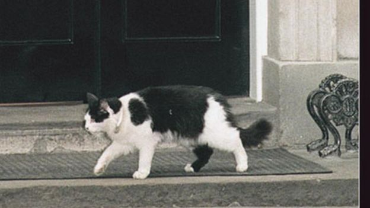
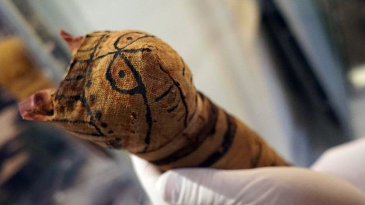
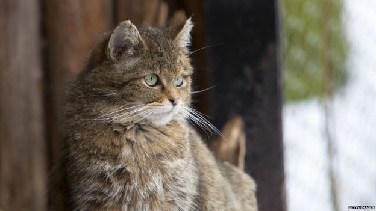
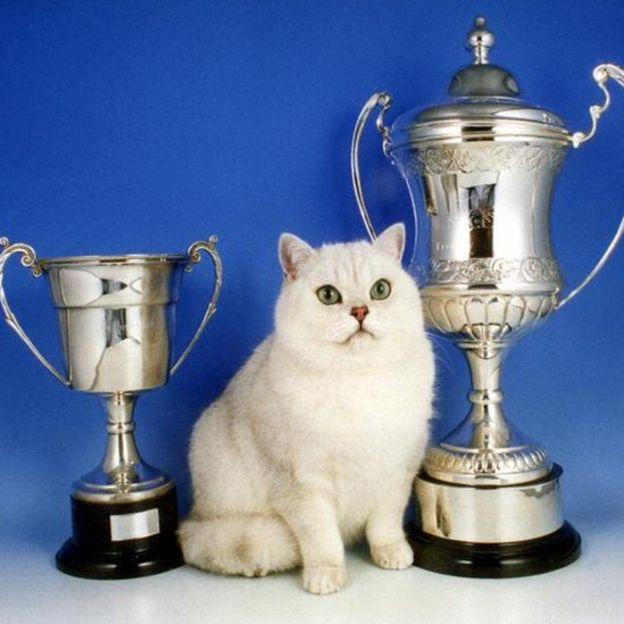

# 人猫万年情 这一切是怎么开始的？ - BBC News 中文

2017年 6月 21日

 

图片版权 Getty Images 

虎斑猫是名贵品种，基因突变导致它皮毛呈虎皮斑状图案。

俗话说猫有9条命，这点从未验证核实，但可以验证的是，人类最爱的家养宠物，不是狗就是猫，而且，猫是人类最早驯养的动物之一。

猫的远祖跟狮子老虎一样，是野生动物。根据遗传学和考古研究发现，在上万年的历史中，有两次人类驯养猫的记录，第一次发生在近东地区，第二次发生在埃及。

大约9000年前，近东文明发源地的人类远祖开始驯养野猫。

大约3600年前，古埃及人开始驯养猫，可能是让它们在粮仓抓老鼠，保护谷物。

驯养猫的做法随着商船的轨迹迅速扩大到世界其他地区。现在，地球上除了南极洲，其他地方都有家猫。

*   [调查发现英国男人更爱养猫 还爱养啥？](http://www.bbc.com/zhongwen/simp/uk-39603175)
*   [研究：聪明程度比拼 猫咪与爱犬旗鼓相当](http://www.bbc.com/zhongwen/simp/science-38751045)

 

图片版权 PA 

英国伦敦唐宁街10号首相府的猫是媒体宠儿

考古学家推测，最初是野生猫发现人类的粮仓周围有老鼠和其他啮齿动物出没，开始在那些地方流连，慢慢地就成了人类和猫类之间经久不衰的关系。

猫并非天生懒惰。它们的祖先被驯养前和被驯养后的数千年里，在商船上、在农庄、在民舍，它们一直是辛勤的捕鼠工。

*   [英内阁办公厅聘请两只猫咪担任捕鼠官](http://www.bbc.com/zhongwen/simp/uk-38270644)
*   [视频：伊斯坦布尔为什么有众多的流浪猫](http://www.bbc.com/zhongwen/simp/multimedia/2016/11/161107_vid_cats_of_istanbul)

法国雅克莫诺研究院（Institut Jacques Monod）的盖戈尔博士判断，在猫和人的关系中，应该是猫主动找人类为伴，但客观上这种关系是互惠互利的。

盖戈尔博士的团队从石器时代的遗址、埃及木乃伊和维京人墓穴中挖掘的200多只古代猫残骸提取粒腺体DNA进行研究。这种染色体是母系遗传的。研究结果发表在《自然生态和进化》杂志上。

 

图片版权 CESARE ABBATE / EPA 

意大利那不勒斯东方大学展出2500年前的埃及木乃伊猫

结果显示，猫的驯养大致始于9000年前，在人类最早开始农耕的近东地区。农民把野猫驯养成家猫，然后有意或无意地带着它们跋涉旅行，拓展了家猫的世界。

几千年后，古埃及人掀起了第二波驯养猫浪潮。古罗马时期（公元前10世纪前后），家猫进入欧洲，维京时期（公元8 - 11 世纪）进一步北上斯堪的纳维亚。

图片版权 Getty Images 

家猫是从野生猫驯养过来的。

有意思的是，虎皮斑猫最早出现的年代很晚，大约在中世纪。

DNA研究显示，大约14世纪，土耳其西部出现皮毛呈虎斑形状的家猫，而导致皮毛出现这种变化的是基因变异。随后几百年，虎斑猫在全世界繁衍，而猫的价值也从它们的实用技能转到外表长相。

猫的配种和优胜劣汰是19世纪开始的。现在，家猫有许多不同品种，外观和皮毛各具特色，无毛、卷毛、长毛的。一些名贵品种的猫千金难求。

它们大部分时间在家里被宠着、懒着，吃喝玩乐，也有被主人带去参加选美比赛。现在，它们更多被称为喵星人，以萌态博出众。

喵星人也参加选美比赛

---------------------------------------------------

原网址: [访问](https://www.bbc.com/zhongwen/simp/science-40356544?ocid=socialflow_twitter)

创建于: 2018-12-22 17:38:56

标签: `猫`

