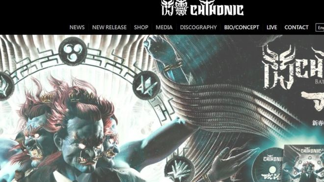
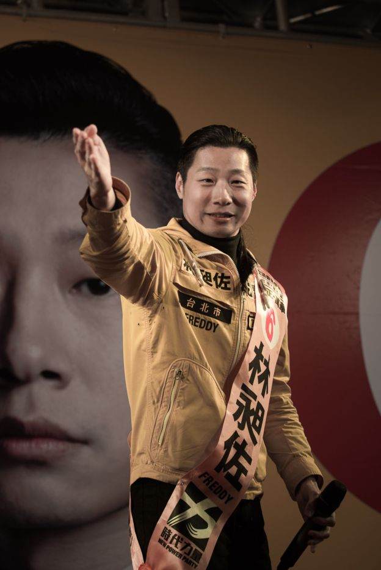

# 台湾闪灵乐队不能入境 盘点近期被香港拒签的那些人 - BBC News 中文

图片版权 ChthoniC 

台湾“闪灵”乐队，成立于1995年。本次原本计划到香港参加音乐会。

台湾重金属乐队“闪灵”因未能获得香港的入境许可，原定于周日（12月23日）在香港的演出被迫取消。

“闪灵乐队”是应香港歌手何韵诗的邀请参加音乐节，但何韵诗在脸书上透露，自11月中旬向香港入境处递交乐队的工作签证申请以来，入境处仍未作出正式回复。

她还向媒体表示，香港入境处使用的是拖延策略，使“闪灵”乐团无法成行。

香港入境处回应称，不对个别案例发表评论，但强调会根据香港法例及现行入境政策，考虑所有与申请相关的因素和情况，决定是否批准申请。

成立于1995年的“闪灵乐队”，曾获台湾金曲奖及金音创作奖最佳乐团。其成员积极参政，主张台湾独立、西藏及维吾尔族人民自决。

*   [香港出柜歌手何韵诗申请赴马来西亚演出遭“封杀”](https://www.bbc.com/zhongwen/simp/chinese-news-43070400)
*   [“港独”指控下兰蔻取消何韵诗演唱引反弹](https://www.bbc.com/zhongwen/simp/china/2016/06/160606_hongkong_lancome_denise_ho)
*   [英保守党人被拒入境香港　约翰逊表关切](https://www.bbc.com/zhongwen/simp/chinese-news-41591196)

 图片版权 Getty Images 

闪灵乐团创办人兼主音歌手林昶佐在2016年代表时代力量赢得台湾立委选举。

乐团创办人兼主音歌手林昶佐曾于2010至2014年担任国际特赦组织台湾分会会长，2016年代表主张“台独”的时代力量胜出台湾立委选举。

## 高调拒签

香港在主权移交后，曾多次出现引起外界关注的拒签事件，当事人都涉及敏感的政治问题。

1.  2018年10月，英国《金融时报》亚洲总编马凯（Victor Mallet）续发工作签证的申请被拒。马凯是香港外国记者会（FCC）署任主席，曾在8月邀请香港民族党召集人陈浩天到香港外国记者会发表演讲，引起中国和香港政府不满。提倡独立的香港民族党也已经于今年9月被香港政府禁止运作。
2.  2018年8月，日本东京千叶县白井市议会议员和田健一郎（Kenichiro Wada）被香港拒绝入境。中国方面认定他是日本政坛活跃的右翼反华分子，支持“台独”和“港独”。
3.  2017年12月，台湾中央研究院学者吴叡人、吴介民原定计划到香港中文大学出席《殖民香港：由英殖时期到特区年代》学术论坛，但没有获得入境许可。分析认为，他们二人虽无政党背景，但曾参与2014年“太阳花学运”等活动以及有涉嫌支持“台独”的记录。
4.  2017年10月，公开评论香港人权、自由倒退的英国保守党人本尼迪克·罗杰斯（Benedict Rogers），被香港拒绝入境。

中国政府一直强调香港是中国的特别行政区，中央政府负责与香港有关的外交事务；而中国中央政府和特区政府依法处置有关问题。

中国外交部发言人曾表示：允许谁入境，不允许谁入境，是中国的主权。

---------------------------------------------------

原网址: [访问](https://www.bbc.com/zhongwen/simp/chinese-news-46660313?ocid=socialflow_twitter)

创建于: 2018-12-22 23:58:19

