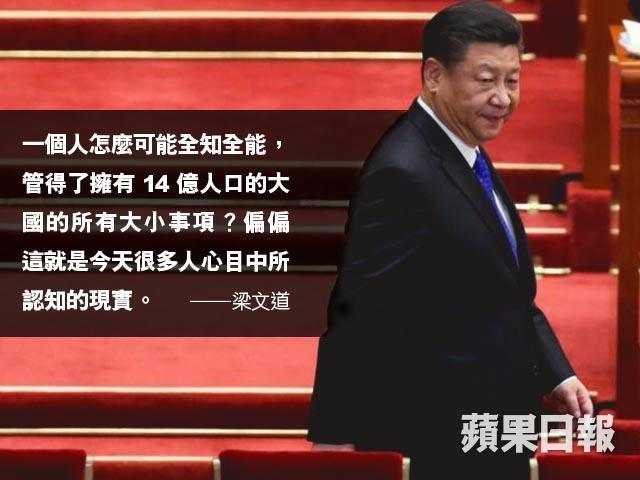

# 我在麵館裏學到的道理 - 梁文道 

2018年12月23日 

幾個月前，我在大陸一座三線城市的街頭小麵館聽見隔壁桌幾個男人高聲談話，都在抱怨政府強拆街頭店鋪招牌的事情。其中一個人還說：「這全是習近平的主意，不是吃飽了沒事幹嗎？管這種事做什麼？就是不想讓小老百姓過上舒服日子」。讓我吃驚的，還不是他這麼大膽，敢在公開場合批評「習大大」；畢竟習近平怎麼樣都還不可能擁有當年毛澤東的權威，官場之外的街頭巷尾，老百姓仍然可以「妄議中央」。這段議論最有意思的，是和幾年前相比，原來今天一般中國人對於中央政府的看法，已經產生了這麼大的轉變。還記得胡溫在位的時候，民間要是遇到什麼不開心的事情，而那些事又恰好和政府相關的話，最常見的表現就是痛罵地方政府胡作非為，然後嘆息「可惜溫總理不知道底下這些事」。那時候，「政令不出中南海」幾乎是個民間常識；而透過高超的媒體工程和公關技巧，中央（尤其是溫家寶）的形象又似乎很不錯；於是很多百姓日常遇到政府為難，他們幾乎是本能地把矛頭投向地方衙門和個別政治派系，卻不會懷疑中央政府的遠見和善意，只是覺得中央「被蒙蔽」了。這個情況就像以前傳統戲曲的老戲碼，聖上英明，壞的全是地方狗官，百姓只能期待自己的心聲上達天聽，又或者不曉得哪天來了一個欽差大臣（當然最好是皇上自己微服出巡）。同樣地，那時候香港也有很多人認為中央最高層並不瞭解香港的實況，因為中間有人堵塞了信息傳達的通道，仿佛只要中央知道了香港真實的另一面，一切問題就會改善似的。  

誇張點說，以前就算出了天大的事情，很多人仍然都不會怪罪中央政府最高領導；而現在只不過是地方上一點小事，受到影響的不滿群眾可能都會覺得這是習近平的責任。這種變化到底是怎麼發生的呢？首先是宣傳，不久之前，中國各地的大街小巷都能看到習近平的語錄和畫像，而各大新聞媒體和門戶網站也一定都會把習近平的消息放在最顯著的頭條，就是要讓你覺得他無處不在，無所不知，無所不管。再來則是他對國家機器的改造，透過另設小組凌駕原有的國務院部門，同時徹底收服軍隊，並且強化他對整個政黨的領導，於是黨政軍大權集於一身，事實上做到了無所不管的地步。最後則是雷厲風行的反腐運動，從最高層一直打到地方上的毛細管，讓很多百姓覺得他真的什麼都能知道；而且只要是他想做的事，也還當真沒有做不到的（要不鎮上一個貪污官員怎麼會被揭發逮捕？他們不都？反腐是習大大領頭的運動嗎？）。  

也就是說，在老百姓的心目當中，今天再也沒有「政令不出中南海」這回事了。不單是政令下達暢通無阻，地方信息往上傳遞的管道也一樣沒有阻礙。並且大家知道，和胡溫年代「胡溫」並稱的情況不同，習近平的地位和權威遠遠凌駕國務院總理李克強等其他中央領導。他沒有政敵，因為江湖傳說中的「江系」在大家眼裏早已潰不成軍，再也沒有人能夠挑戰他了。更要緊的是他還領導一切，習近平幾乎對所有事情都有他的一套想法，從地方公共建築物的設計方案比賽和大學裏的文學研討會，大到整個國家的社會治理，我在什麼領域都能聽到相關的負責人公開說是習近平思想起到了關鍵作用，任何一個丁點大的成就和功勞，官員都會說那是習近平英明領導的成果。而我們最近看到，就連展開了四十年的「改革開放」，好像也都是習近平的功勞。  

於是接下來的問題就是，萬一情況發生不妙的演變，哪怕是再細小的問題也好，你還能把責任推在誰的身上呢？是地方官員的不作為？是他們的腐敗？這不可能，因為聽說他們已經全部被管束成一支絕對忠誠、政治正確、紀律嚴明的隊伍。是黨內別有用心的人在搞亂？這更不可能，他們連議論中央政策都不行了，何況其他。是民間一些勢力在作怪？聳立了多少年的教堂可以被拆掉，成立了多少年的社團和民間智囊機構可以被關停，再加上人類史上前所未見的全方位監控，民間怎麼可能組織出任何足以挑戰中央的權威呢？是資本家陰謀復辟嗎？這也不對，因為經過過去幾年的「國進民退」，以及金融市場波動之後的嚴厲追查和打擊，富賈有的跳樓，有的在獄中意外身亡，有的被越境追捕，現在稍微有點規模的民企應該早都貼貼服服，甚至準備把自己變成黨領導下的「準國企」。至於知識份子和媒體輿論，那就不用說了。知識份子要不是銷聲匿跡，歸隱山野書齋；就是轉型下海，讓自己遠離雷區。所有傳媒更是被收拾的一塌糊塗，過去的一大山頭「南方系」已成不留痕跡的往事，新興社交網絡上的自媒體則可在一夕間消失過萬。在意識形態領域當中，所有潛在的危險幾乎都已經被排除掉了。大學圖書館裏的宗教書籍紛紛被下架，人文社會科學教師的教程要受到審查，上課的情況會被監視。出版界裏面流行「回頭看」，意思是八九十年代到二十一世紀初的合法出版物要經過重新審查，按照今天的嚴格標準淘汰一批以前不覺得有問題，但原來不合乎當今主旋律的東西。從明年開始，甚至要從根處抓起，乾脆減少全國書號（據說多達一半），因為書籍出少了，問題也就自然少了。現在就連上訪也都變得很困難了，稍有規模的集體上訪往往可以在苗頭階段被扼殺，協助他們的團體和律師當然全都不會有好下場。  

今天最高領導最成功的地方，就是他們幾乎消除掉了所有可能的挑戰力量，同時還要讓一般百姓感覺到這個現實；但問題是因此也失去了一切藉口。唯一剩下還能用的，應該就是所謂的「外國勢力」。就眼下局面來看，這個外國勢力還真的存在，並且逐漸加大。我們可以預測，未來一定會有更多把問題推到國際局勢和敵對勢力的說法出現（甚至是一些非常匪夷所思的說法）。然而，有些東西還真的不是那麼容易說成是外國人搞鬼，例如那天我在麵館裏面聽說的店鋪招牌被拆，這能說成是特朗普施壓的結果嗎？  

去年這個時候，北京「切除低端人口」，在短短幾天之內，讓過百萬的人民無家可歸；同時又頒佈了「北京市牌匾標識設置管理規範」，乃全國新一輪街道整治的開端，結果弄得怨聲載道，民憤不已。後來事情搞得有點大，北京市委書記蔡奇才出來做了一些安撫工作。讓我覺得非常意外的，是這位「之江新軍」的幹將，外界公認是習近平最親信的要人之一，居然表示他所做的一切全是遵循習主席的意思。這豈不是推卸責任？引導大家把怒火往習近平身上招呼嗎？這就很難怪我在那座三線城市遇到的幾個人會認為他們遇到的麻煩是習近平所造成的了，恐怕他們的地方官員也會說自己幹的事是習近平思想領導的結果。  

一個人怎麼可能全知全能，管得了擁有14億人口的大國的所有大小事項？偏偏這就是今天很多人心目中所認知的現實。一個人既然領導一切，因此當然也要為一切負責，在局勢變得惡劣的時候，除了外國勢力，他就變成了剩下的那個答案，這就是今天習近平遇到的最大麻煩。而他底下整部國家機器中的官僚，既不會負責，也根本沒有負責的空間（或者是都能想辦法讓自己不用負責）。這裏面牽涉到的官僚邏輯，我們之後有機會再談。

[梁文道  
電郵 :](https://hk.lifestyle.appledaily.com/lifestyle/columnist/%E6%A2%81%E6%96%87%E9%81%93)[bibliophile.apple@gmail.com]

---------------------------------------------------

原网址: [访问](https://hk.lifestyle.appledaily.com/lifestyle/columnist/%E6%A2%81%E6%96%87%E9%81%93/daily/article/20181223/20574823)

创建于: 2018-12-23 23:59:43

