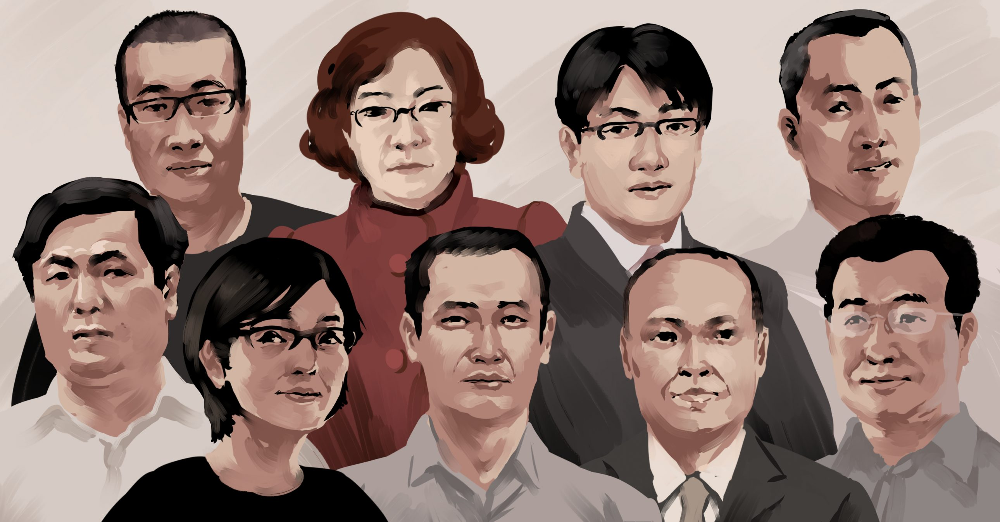
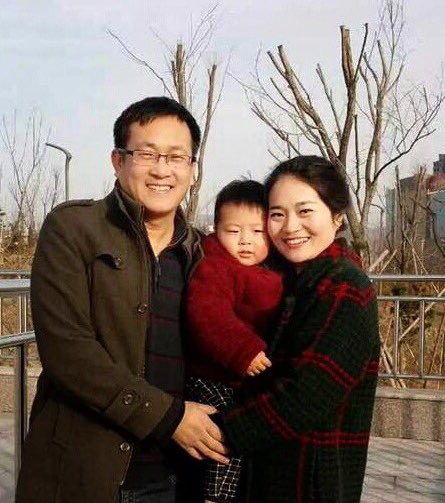
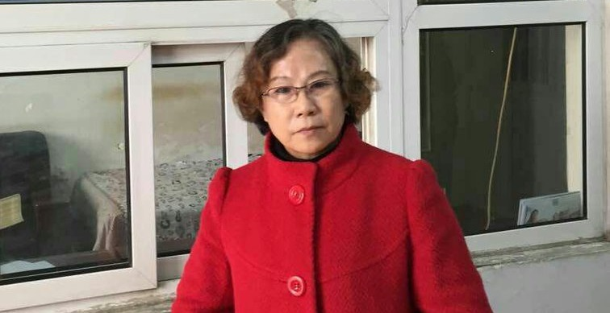
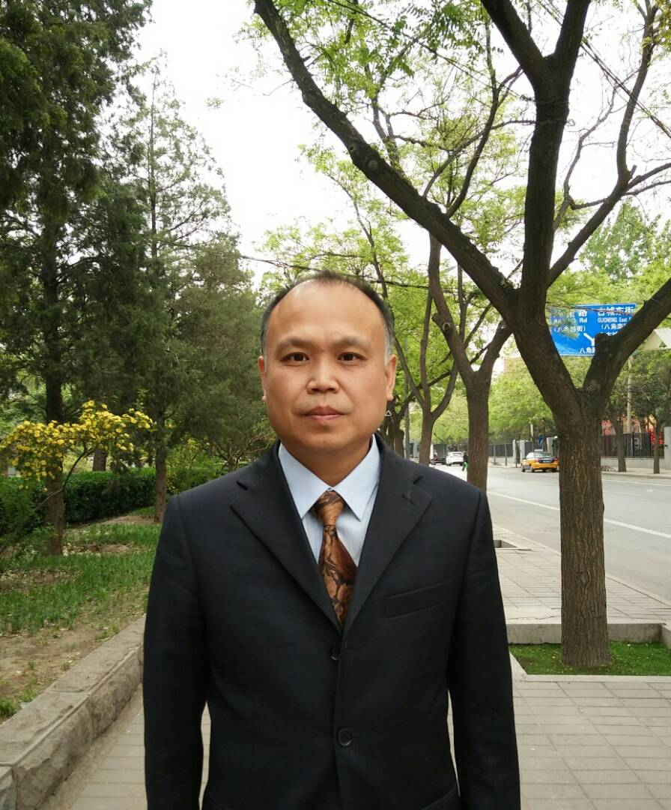

# 709大抓捕三周年：人权律师们去哪了？

© 国际特赦组织

## 三年前，中国政府对人权律师和其他活动人士进行前所未有的镇压。 时至今日，709打压仍未告终……

“709事件已经整整三年了，这个事件，凸显了权力的傲慢与任性，揭开了中共“依法治国”的虚伪面纱，使人们认清了它独裁专制的本质。这个权力不受限制、为所欲为、颟顸狂妄的政权，是那样的蛮横、霸道。法律，仅仅成为他们管控、统治人民的工具，却丝毫维护不了社会正义。三年里，王全璋律师失踪已近1070余天，仍然音讯全无、杳无消息。而为709案件辩护、发声的江天勇、余文生、李昱函律师又身陷囹圄，709隋牧青、谢燕益、李和平以及我的辩护人文东海等律师被陆续注销、吊销证照。中国的律师们为中国的法治付出了他们的血和汗！”—— 709大抓捕中首位被捕的王宇律师

> 王宇律师
>
> 我相信中国必将走向民主和法治 —— 不管前面的路有多么艰险坎坷！

## 王全璋

在所有被牵涉到这个镇压当中的人权律师和其他活动人士里，王全璋的情况最令人担忧。他曾代理多起中国政府视为敏感的案件，包括法轮功学员案件。他也曾为多名新公民运动的成员辩护。自从王全璋于2015年8月被带走，就无法会见律师和家人，没有人知道他被关押在何处、身心情况如何。他的妻子李文足尽管不断受国保的监控及骚扰，仍然持续向当局追问他丈夫的下落，可是至今还是得不到丝毫有关他的消息。

> 王全璋妻子李文足
> 
> 王全璋失踪马上就三周年了，仍然是一点消息都没有，不允许律师会见，我们现在连办案单位的人都见不到，全璋的处境我们无比担忧！

王全璋与妻儿

## 江天勇

江天勇于2017年11月21日被长沙市中级人民法院判处“煽动颠覆国家政权”罪名成立及有期徒刑两年、剥夺政治权利三年。自江天勇于2016年11月被拘押以来，长沙市公安局以“妨碍调查”、“危害国家安全”为由拒绝了律师申请会见。虽然判刑后江天勇能与他的家人会面，但他仍有遭受酷刑虐待的风险。他在美国的妻子金变玲表示在今年五月，江天勇的父亲与妹妹前往监狱探视，发现江天勇记忆力严重下降，很多家里基本的事情都要反复询问， 他担忧狱方向她丈夫施以不明药物和酷刑， 导致他脑部受损、记忆力衰退：

李昱函律师

## 李昱函

李昱函律师是王宇律师被拘押时的其中一位辩护律师。她在2017年11月被以 “寻衅滋事“罪批捕，并在关押中遭受进一步虐待。她告诉律师，她在洗澡时遭看守所人员泼冷水，由于天气寒冷，导致她昏迷不醒，几小时无人照料。仍然被拘押的她有遭受进一步酷刑虐待的风险。

## 余文生

北京律师北京律师余文生于2018年4月19日，因涉嫌“煽动颠覆国家政权”和“妨碍公务”被徐州市公安局正式逮捕。警方后来更出示声称是余文生所写的声明，要求解聘两名辩护律师，并请妻子不要为他聘请律师。但余文生在被捕之前录制的视频中，说他绝对不会解聘自己的律师，使得警方的说法不攻自破，亦不禁令人担忧他的状况。

余文生律师

> 余文生的妻子许艳
> 
> 三年了，有的709律师还没能回家。有的709的辩护律师又失去自由了。我祈祷所有处于困境中的追求法治的律师与这些普通的律师家庭都能早日摆脱困境。可以早日家人团聚！轻松工作！幸福生活！

谢燕益律师

另外，即使在这场镇压后期获释的律师，也陷入各种困境。李和平、隋牧青、文东海及谢燕益等律师相继遭当局吊销律师执照。他们不能再以其法律知识为人权被侵犯的受害者争取公义。但这群中国人权律师并没有因此而失去了希望。 正如谢燕益律师所说，“709事件的发生本质上是两种意志的较量，即和平民主意志与暴力专制意志，自由公民意志与奴役特权意志，709事件的发生以及民间的抗争唤起了众生的进一步觉醒。”

> 谢燕益律师
> 
> 尽管709事发三年以来，维稳体制造成了更严重、更普遍的人道灾难，但是我们对国家的前途命运充满了信心。

## 中国政府对人权律师和其他活动人士进行的镇压已经三年了，国际特赦组织继续要求当局：

– 立刻无条件释放王全璋、江天勇及其他因行使自己的言论与集会自由权而被监禁的人权律师与活动人士；  
– 确保王全璋、江天勇及人权律师与活动人士不受酷刑虐待；  
– 停止对人权律师及其家属的迫害，恐吓和骚扰。

---------------------------------------------------

原网址: [访问](https://zh.amnesty.org/more-resources/china-human-rights-lawyers-crackdown-third-anniversary/)

创建于: 2018-12-24 23:50:58
