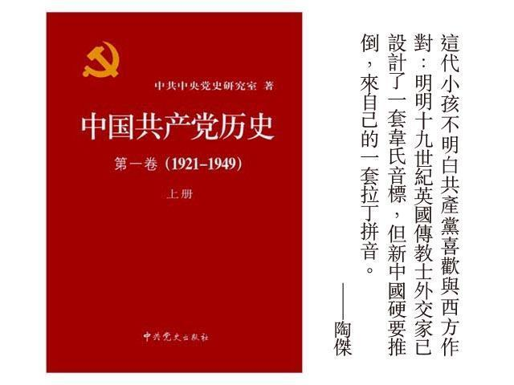

# 自小不讀中文 - 陶傑

朋友的小孩讀國際學校，升到高中，因中國日受西方重視，要用英文讀中國現代史。  

許多小朋友曾誤信「讀中文沒有甚麼用」，與整個中國歷史文化疏離，還偶爾對朋友很自豪地說：Sorry，我的中文不好。遇到洋學者用英文寫的「中國共產黨史」、「太平天國之亂」，看見一大堆大陸羅馬拼音的名字：Liu Shaoqi（劉少奇）、Peng Dehuai（彭德懷）、Zhu De（朱德）；還有太平天國那堆匪首：Hong Xiuchuan、Yang Xiuqing，還有接受過英國牧師馬禮遜面試的洪秀全的堂弟洪仁玕（Hong Rengan）當場頭昏腦脹。  

我笑說：若是你讓小孩從小讀唐德剛的中國現代史，加兩冊台灣劉紹唐多年來編輯的「傳記文學」，以及香港的春秋雜誌。這伙人物的名字奇怪拼音，若小時認方塊字，長大了就懂得分辨此七十二天罡與彼三十六地煞。  

中文一字不會，現在死記這堆字母，對於貴子弟的痛苦，我深表同情。  

這代小孩不明白共產黨喜歡與西方作對：明明十九世紀英國傳教士外交家已設計了一套韋氏音標，但新中國硬要推倒，來自己的一套拉丁拼音。我向這個不幸的小孩解釋：洪秀全的那個洪，從前英國傳教士拼為Hung，洪秀全，叫Hung Hsiu Ch'uan，現在大陸叫做Hong，Hung不是唸「掛起來」的「哼」，而是Hoong。  

小孩無辜地問：那麼為甚麼硬要分成兩套令人困惑呢？我再打個哈哈：Good Question，事涉人性刁鑽的陰暗面，這就說來話長了。  

小孩將來長大能說一口鄧永鏘爵士的英語，可以光宗耀祖。不錯，當前中國這個題目，在西方世界也開始帶有厭惡性。但是，生為黃皮膚，為現實計，最好還是懂得一點中文，加一百五十年的中國現代史，將來出國，會便宜一點。  

不要跟鬼仔比賽無知。你比他知道多一些，將來或可立於不敗之地。  

惟時至今日，若已錯過，從頭用英文再啃這堆不知所謂的中國人名，一切已太遲。然而，人生要遺憾的事太多了，叫兒女從小不讀中文，與叫兒女少讀英文而不專注學好所謂普通話一樣，皆只是九牛一毛的其中一樁。  

這兩種父母，三十年來見到盡不少。我不多說，告訴對着英文教科書愁眉苦臉的香港小孩不要再問為什麼，誰叫你投錯胎呀，總之死記：Zhu De跟Chu Teh，是同一個人。 

[陶傑  
電郵 :](https://hk.lifestyle.appledaily.com/lifestyle/columnist/%E9%99%B6%E5%82%91)[mcwriter@appledaily.com](mailto:mcwriter@appledaily.com)

---------------------------------------------------

原网址: [访问](https://hk.lifestyle.appledaily.com/lifestyle/columnist/%E9%99%B6%E5%82%91/daily/article/20181223/20574813)

创建于: 2018-12-23 23:59:55

