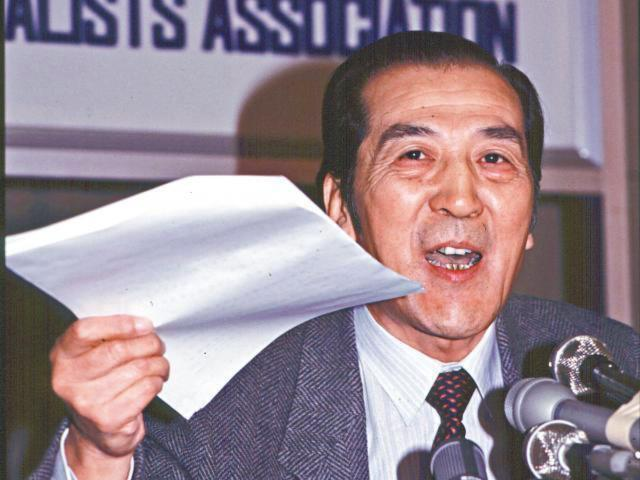

# 哲學家袁木 - 陶傑

2018年12月24日

中國前新聞發言人袁木逝世。袁木以「天安門廣場沒有死一個人」的名言深為香港人銘記而永垂青史。  

然而袁先生其實提出了一個哲學問題：六四清場的過程，若香港人沒有在天安門廣場目擊，則無人有資格反駁執行清場之官方的袁木的論說。  

袁木的邏輯，由中國外長王毅繼承，大罵加拿大女記者：你有去過中國嗎？沒有去過，沒有資格指責中國的人權。中國的人權，只中國人民有資格發言。  

世間事物，須目見感官為證，還是以腦中的意念為存在與否的根據，西方早有過著名的「洛克與柏克萊爭論」。袁木和王毅的哲學質疑，有人指出，同樣也應用於所謂「南京大屠殺死難者三十萬」此一命題。  

南京攻略戰後確實有若干人命的虐殺，包括迅速屠殺留下來的國軍戰俘。但最有資格舉證者，是戰後的南京人。死難者三十萬，包括全家屠歿者，以每人尚餘能及早逃難離城生還或在鄉間外地的堂表甥侄親戚平均三人計算，當有九十萬人挺身指證其親屬在一九三七年十二月中之後被殺了。  

但是沒有，因此「死難三十萬」這個數字，無法由最有資格發言的南京人及其親屬準確舉證，至少不可信。  

然後是當年有幾十位美國德國基督教傳教士之目擊證詞。  

傳教士確目擊若干虐殺，但據新中國的馬列階級鬥爭觀：西方傳教士是無產階級的敵人，也是中國人民的敵人。若西方傳教士的話有誠信，中共今日就不會驅趕西方傳教士、拆教堂頂的十字架。  

但是很奇怪，中國每舉證「南京大屠殺」，今日簡體字的官方網絡有大量引述並讚揚西方傳教士的「良心」和「勇氣」者。然而根據馬克思主義、無神論者、共產黨員、義和團、習近平治國思想，西方傳教士此一階級職業之言，絕不可信。  

經袁木和王毅外長的邏輯學驗證，再篩掉共產黨叫中國人民不要相信的西方傳教士，那麼「南京大屠殺」之死難者數目，甚或到底有沒有過「大屠殺」，即所餘無幾。何況袁老先生之外貌長相年齡，並非金城武吳亦凡那般小鮮肉，在影像世代容易引起偏見。  

真相不一定清楚，唯用哲學邏輯驗證，一切都很清晰。願袁先生一路走好。 

陶傑  

-----

原网址: [访问](https://hk.lifestyle.appledaily.com/lifestyle/columnist/%E9%99%B6%E5%82%91/daily/article/20181224/20575399)

创建于: 2018-12-24 23:55:00