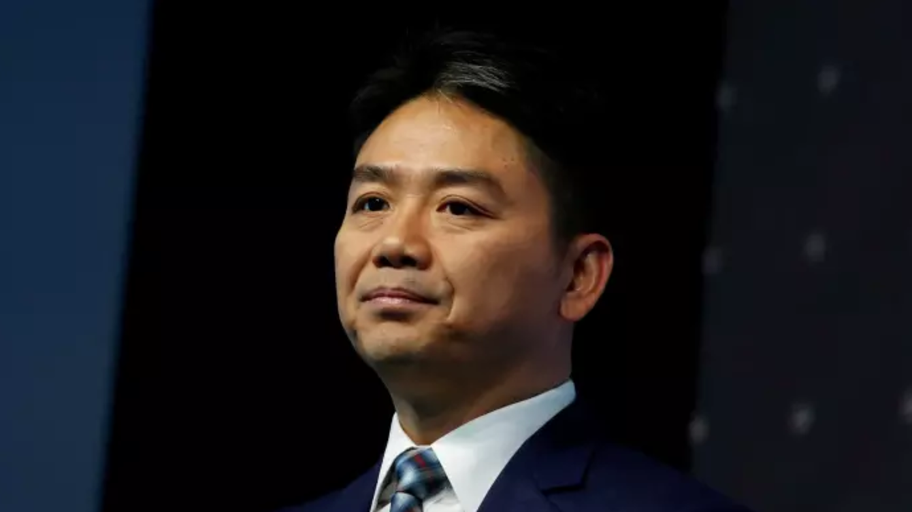

# 刘强东的“正义”，“米兔”的挫败？ - FT中文网

[MeToo](http://www.ftchinese.com/tag/MeToo)

刘裘蒂：“米兔”运动的成绩，在历史的长河中已经开始渐出成效，刘强东没有刑事责任并不代表“米兔”的挫败。

更新于2018年12月25日 07:04 FT中文网专栏作家 [刘裘蒂](http://www.ftchinese.com/search/%E5%88%98%E8%A3%98%E8%92%82/relative_byline)

日前刘强东收到“最好的圣诞礼物”：在经过三个多月的调查后，美国明尼苏达州检方宣布不对刘强东涉嫌强暴案提起诉讼，消息传出，当日京东的股价立马上扬，增幅最高曾达9%，最后以5.87%收盘。自从今年8月31日刘强东被捕的新闻传出之后，京东在纳斯达克交易的股价到此之前下降了38.3%（纳斯达克指数在同期下降了21.9%，标普500指数在同期下降了16.7%）。

中国国内的网络反应主要分为两派：有人认为不起诉代表美国司法系统的公正，在证据瑕疵的情况下，以不浪费公共资源为优先考虑；另有一派认为美国的司法系统让有钱人逍遥法外，甚至代表了#MeToo（还有它的中国版“米兔”）运动的挫败。

但是刘强东是否已经完全摆脱了明州噩梦，从此可以高枕无忧？女方的律师对检方的举措公开发表声明表示不满，并且表示将会提出民事诉讼。这容易使人联想起1990年代，美国的辛普森杀妻案，被告虽然在刑事法庭获判无罪，却输掉了民事诉讼。如果刘强东案女方决定提出民事诉讼控告刘强东人身与精神侵害，这场官司会有戏吗？就此，我采访了两名关注刘强东案的美国华人诉讼律师。

**检方不起诉的理由**

美国亨内平县检察官迈克•弗里曼于当地时间周五（12月21日）宣布，不会对涉嫌性侵犯的中国商人刘强东提起诉讼：“经明尼阿波利斯市警察局性犯罪小组的彻底调查，以及四位对性侵犯案件拥有丰富经验的资深检察官的仔细审查，确定此案在举证方面仍存在严重问题，这些问题会使任何的刑事指控都很难达到超越合理怀疑的标准。”

检方所指出的举证问题，不是如一些中文媒体报道的“证据不足”，而是证明力不足。检察官在声明中指出，检察官在审查的证据涉及三名男子和一名女子，包含一些被翻译成英文的普通话对话及信息，警方身上佩戴的摄像机录下的刘强东与女方在公寓内的对话，以及后来在刘强东被带回他的酒店之前，警方录下的女方要求与刘强东私下进行交流的部分对话。

这些谈话的实质，与其他所有证据，包括女方和其他目击者的证词，以及来自多个监控摄像机的录像，使得检方认为无法履行举证的责任要求，因此不能提出指控。检方所指的举证的责任要求是指刑事案件必须达到超越合理怀疑的标准，这比民事诉讼案件胜诉的标准要高出很多。在本文稍后我会谈到这两个标准之间的具体差别。

刘强东由于参加明尼苏达大学卡尔森管理学院项目，于8月30日和许多朋友、同事去了一家位于该市上城区的餐厅吃饭。在受邀赴宴的人中，有一名21岁的女学生。

晚饭后，这位女同学与刘强东及其他人一起乘车前往位于富兰克林大道的一所房子，并最终于当晚晚些时候回到了她位于大学附近的公寓。几个小时后，即8月31日的凌晨，这位女同学的同学兼好友打电话报了警。警察随后赶来，在这位女士的公寓中，警察向这位女士以及刘强东进行了问话。根据当晚警方从女方那里获知的消息，警方结束问话，将刘强东带回了他的酒店。当天（8月31日）晚些时候，刘强东在明尼苏达大学被捕。

女方的代表律师威尔•弗罗林对媒体表示，在刘强东仍被警方拘留时，刘的一名律师联系控诉人讨论和解问题。

刘强东的律师吉尔•布里斯博伊斯反驳这样的说法，称女方在刘强东被羁押的16个小时内与他联系，并随后威胁要公开她的指控。刘强东拒绝以钱摆平。布里斯博伊斯在对媒体发布的一份声明中，描述女学生是当晚发生事件的积极和自愿的参与者。

可以想见，女方对当晚的描述与刘强东通过律师表达的陈述有极大差异。根据《华尔街日报》所拿到的警方采访语音记录，女方告诉警方，她和刘强东在8月30日与刘强东的朋友和同事共进晚餐后喝醉了。在晚宴结束后，她被刘强东和他的一名助手塞进一辆大型车上。她在警方采访记录中说道：“我认为他们现在正把我带到某个地方，但我无法逃脱，因为那时我真的喝醉了。”她并且告诉警方刘强东蹿到了她坐的第三排，吻她并试图脱掉她的衣服，尽管她请求他停下来。

根据女方对警方的说辞，车子到达一幢女方不愿进入的大房子前。女方说她请刘强东把她带回她自己的公寓，最终他同意了。到达后，刘强东和女方进入公寓，而他的助手和司机留在车里。女方声称在公寓里，刘强东无视她的抗议试图发起性行为。“他脱下我的内衣，然后强奸了我。”事后刘强东还在她的公寓时，女方和一位朋友发了短信，这位朋友报了警。根据县检察官办公室的说法，携带摄像头的警官到达并询问了刘强东和女方。

明州刑事诉讼律师周东发指出，这个事件牵涉到前后两次报警。检方不起诉的关键因素是女方的朋友第一次报警后，警察到公寓现场的摄像头捕捉到性侵案第一时间报警后的陈述、表情，显示两个人的关系并非强迫，警方还把刘强东送回酒店，并未提出拘捕要求。这个第一时间的观察，导致警方没有相信女方后来的说法。另外公寓监控摄像头所拍到两人进屋的情况，整体而言显示证据力太弱，不构成起诉条件。

纽约州和新泽西州诉讼律师黄晓夫却认为，在没有看到证据、与证人问谈并审查警方的报告之前，仅仅依靠检察官的立场来下论断很不靠谱。理论上评论者应该亲自检阅未公开的警方随身摄像机的视频，以便分析当事人在警察到公寓查看期间的动态和互动。这里面仍有许多值得推敲之处，我们需要检视更多的法医证据。

据刘强东的律师说，那天晚上女方并没有喝醉。虽然女方在一则短信中向一位朋友说她曾被灌酒，但男方律师说是女方向刘强东敬酒，并在她自己的杯子里加了酒。晚餐后，女方主动要与刘强东和刘强东的两名助手乘坐一辆SUV，到另一位晚餐客人租用的房屋。根据布里斯博斯的说法，刘强东的助手描述了女方与刘强东在车内的互动方式是调情的。

同时，布里斯博斯指出，在公寓大楼两人手挽着手，而且另一位在大厅里看到他们的居民称，他们看起来很开心而且没有酒醉的样子。在与警方交谈后说，女方找到了刘强东，并表示误解向他道歉。警方开车送刘强东回到他的旅馆。

女方的律师弗洛林表示，刘强东的律师陈述“很容易被证据和其他目击者的证词证明推翻”。弗洛林还没有公开提供这样的证据。他解释在第一时间警方出现时，女方拒绝提出指控，是因为她受到创伤，不熟悉美国的司法系统。晚餐后的第二天星期五下午，女方去医院检查是否有可能证明发生过强奸，并提供脏污床单作为证据。然后她接受了警方的采访。

周东发认为，如其他很多州和国家，明尼苏达州有法定“性侵犯护士检验员”（SANE）的机制，由经过训练的注册护士对遭受性侵犯或性虐待的患者进行法医护理和报告。如果有强制性的性行为，通常会在检查中显示对身体部位的伤害，而且在事后短时间内都有效，不像精液可能受到时间推移而影响检验结果。周东发认为，检方的宣告中虽然没有提到这样的细节，但是他推断SANE并未显示足够人身伤害的证据。

**美国民事诉讼的标准**

与民事诉讼中“优势证据”（preponderance of evidence）原则有别，美国刑事诉讼中定罪的证据标准为“排除合理怀疑”（beyond reasonable doubt），也就是说，陪审团只有在检方提出的证据能够排除所有合理的怀疑之后，才能够判定被告人有罪。如果陪审员对被告人是否犯罪存有合乎情理的怀疑，那么陪审团会认为检察机关提供的证据还没有达到排除合理怀疑的标准，就会判定被告人无罪。

刑事法庭的假设是刑事被告人是无罪的，检方（也就是政府）想要推翻这个无罪假定，必须通过证明被告人被控犯罪的每一构成要件都排除合理怀疑，从而让陪审团员全数同意。通常刑事案件中的陪审团需要达成整体一致的判决，而民事案件中的陪审团通常在某种程度上达到多数同意的决定即可。

因此民事诉讼中的“证据优势”举证责任标准，比检方（政府）在刑事诉讼中的责任标准“排除合理怀疑” 要轻得多，基本上只要有比50%多一点的可能性证明发生了性攻击行为，就可以判定某人要负责任。

那么女方是否应该提出民事诉讼呢？根据检方不起诉的决定，可能女方的说法至少是前后矛盾的，那民事诉讼应该会面临困难。周东发指出，刑事案件定罪的标准虽高，刑事起诉的标准，其实跟民诉的标准等同，也就是超过50%的可能性就可以起诉，如果检方认为连起诉的标准都达不到，就表示民诉要胜诉有相当难度。

辛普森杀妻案最大的不同点是：辛普森的刑事案经过了庭审以及漫长的证据发现和证人交叉互审的过程，有许多对原告有利的证据，被害人才决定起诉，而刘强东案还没有达到那个阶段。因此周东发认为民事官司没戏，如果是他代理女方，他将建议女方不起诉，因为在他看来赢的几率不大。

同时，目前看来，刘强东可以控诉女方诬告，但是他应该会考虑到不想让负面新闻继续霸屏，所以不会出手。一旦女方提出民事诉讼，刘强东肯定会反诉她诬告。

黄晓夫有不同的看法，他认为女方民事诉讼仍然有戏，因为在民事法庭陪审团的眼里，整个饭局的组织和场景可能是为了让一个45岁的富豪占一个21岁大学生的便宜。在衡量证人的可信度时，必须考虑到人们可能会根据自己的私心和偏见来看一个事情，也就是说，不同的检察官可能会得出不同的结论并提起诉讼。

比方说，控告人的律师威尔弗罗林说，亨内平县检察官办公室从未要求与女方见面，也从未问过她一个问题。弗罗林还批评检察官办公室在圣诞节假期前的新闻发布会上宣布其决定，甚至没有礼貌性地先知会女方的律师。

那么弗洛林的批评是否合理？检察官采访受害者是否常见？

黄晓夫认为在一起强暴案中，男女各执一词，但是在现场的也只有两个当事人，因此受害者的证词十分重要，此案的检察官却完全没有询问受害者，这简直是不可思议。至于提出指控的女学生是否有可信度，这个问题应该是由陪审团来做决定，而不是由检察官做主。

并且，黄晓夫指出，在一个典型的强暴案件中，受害人往往处于精神和心理困惑的状态，更何况这是一个中国来的女学生，美国的警察可能也不知道如何解读中国女学生的反应。当女学生的朋友第一次报警时，她的脑子里面可能充满了各种想法。事实上，隔天她是在校方的建议之下才报警。

假如面对一场民事诉讼，刘强东可以拒绝来美出庭吗？黄晓夫认为作为一名公众人物，和一个美国上市公司的领导，从法律程序而言，很容易送达传唤刘强东出庭的通知，并且他的一举一动很难逃人眼目，刘强东如果拒绝出庭将是不智之举。

不论如何，如果女方决定提出民事诉讼，通常庭外和解几率很大。今年4月，在对美国有“慈爱父亲”人设的喜剧演员比尔•科斯比的性侵刑事指控重审开庭时，检察官表示，科斯比曾支付一名指控他性侵犯的女性和解费338万美元。女企业家吉尔•哈斯于1997年起诉特朗普，指控其违反合同，同时也起诉其非暴力性骚扰，但作为与前诉讼有关的和解协议的一部分，她撤回性骚扰的诉讼。前国际货币基金组织（IMF）总裁多米尼克•斯特劳斯•卡恩因涉嫌性侵一名酒店服务员被捕，但坚持无意就针对他提出的民事诉讼进行谈判。后来民事诉讼以未公开的金额（据报道为150万美元）私下和解。

在提出民事诉讼之前，女方和团队需要考虑的是隐私、财力以及精力消耗的问题，以及检方所顾虑的“二度心创”。如果女方提出一起民事诉讼，她想必要面对身份暴露与其所带来的种种问题。一个21岁正在就学的中国女孩，要花大量的时间和精力，与美国的法律以及刘强东的律师团和媒体团奋战，这是一个长期消耗的挑战。

虽然有报道认为女方家境优裕，但真实情况并不是很清楚。民事诉讼的律师费用极可能以“事成收费”的方式来决定；在美国个人伤害案的原告律师代理，经常以这种方式来解决原告由于经济资源有限无法打官司的问题。在这样的情况下，律师获取的报酬取决于所代理的案件获得法院判决赔偿的一定百分比。如果官司打输了，律师将得不到任何报酬，但是原告仍然必须支付律师为办理案件而支出的相关费用。律师的事成收费的比例各有不同，一般的比例是三分之一。有些律师根据案件的具体进展程度，按比例增减其所分享的报酬。

刘强东案由于被告的赔偿能力，使得女方找到愿意代理的律师相对容易。即便如此，民事诉讼如果不能在短时间解决，对于女方仍然会形成长期经济的耗损。

从这些角度来看，女方可能有的诸多顾忌是不是正印证了#MeToo运动下所发掘出的残酷现实：性侵受害者，特别是在面对财势不成比例的“大人物”之时，通常对揭发罪行表示迟疑？

**刘强东与#MeToo**

刘强东涉嫌性侵案刚爆发之际，有不少人注意到了，一个可能在中国商界常见的企业大佬饭局以及延伸的性行为，在美国#MeToo运动的语境下，提升了女学生和校方的警惕意识。也就是说，同样的状况可能在国内就不声不响地遮盖过去了。不论这种说法是否成立，至少根据女方的说辞，她开始想要与刘强东“私了”，而在与校方人员咨询的过程中，校方人士提议她报警。

在美国，从对不起诉的报道舆论反应看来，性别差异并未完全决定对刘强东案的看法，不像当下很多性骚扰案，男性与女性的性别而决定了他们的反应。从《华尔街日报》的读者评论来看，有男性埋怨不起诉的可当性，也有女性认为这位女同学把刘强东带到她自己公寓极为不智。

但是在黄晓夫看来，这也就是很多性侵犯的受害者选择不报警的原因，检察系统的确给有财力、有资源的一方优势。虽然检方数度强调警方调查和提诉与否与刘强东的财力无关，他认为像刘强东这样的富豪，可以雇用最好的律师团队，私人律师通常也有较高的素质，在美国很多大辩护律师楼的律师有当检察官的经验，在检察官办公室里有人脉；相对而言，公家的律师资源有限、薪水有限，输不起，如果不是有执着追索的毅力，可能就因害怕输掉，而不愿起诉。

在刘强东本身发出道歉函同时，他的律师发出了一封很长且具有攻击性的声明，指责女方在两厢情愿的性行为之后向他敲诈勒索。刘强东背后，不但有强大的律师团队，也有威力强劲的公关团队，这封信的作用不但是为自己洗白，也似乎想在心理上阻吓女方提出民诉。

从韦恩斯坦到福克斯新闻高管，性侵案长久以来遵循着一种类似的轨迹，就是受害者噤若寒蝉，甚至即使在控告之后，检察官仍不愿提出告诉，因为有钱的被告方总是有门路。#MeToo运动在美国尚未正式发起之前，我便发文讨论福克斯新闻在姑息多年后，终于因性骚扰炒了数位大腕（[《职场性骚扰，美国罚得有多狠？》](http://www.ftchinese.com/story/001073405)）。而韦恩斯坦的大恶背后，有利益往来的艺人、经纪公司、制片公司等“平庸的邪恶”在默默支撑着他（[《韦恩斯坦性侵背后的“经济学”》](http://www.yinhucms.com/story/001074882.html#adchannelID=2000)）。这些大腕有漫长的被控告史，但是他们一直都坚持女方是自愿的，即使有私下的指控，由检察官发起的刑事诉讼却过了数十年才成形，而这些大佬们仍然认为自己没有错。权力使他们认为自己的行为理所当然，而他们周围的人也成为他们的帮凶。

大佬有权追寻他的“正义”，但我希望刘强东不属于那些自认为有“特权”的大佬，也不希望对他不起诉形成对#MeToo运动价值的否定。众多的性侵指控案有共同处，也有个别性，我们不能一概而论来论定刘强东案。#MeToo运动的成绩，在历史的长河中已经开始渐出成效，在过去一年中，许多性侵的累犯者，从他们高高的位子上被拉了下来，因此刘强东没有刑事责任并不代表着#MeToo运动的挫败，也不代表女性与男性都将永远生存在对于性侵行为了解的鸿沟两边。我们极可能永远无法知道8月底的那个晚上在那个明州公寓里发生了什么，但无论是男性跟女性，都应该重视对性侵犯罪的教育和了解，共同探讨如何预防性侵犯罪以及行为界限的规则。

_（注：本文仅代表作者个人观点。责编邮箱bo.liu@ftchinese.com）_

版权声明：本文版权归FT中文网所有，未经允许任何单位或个人不得转载，复制或以任何其他方式使用本文全部或部分，侵权必究。

---------------------------------------------------

原网址: [访问](http://www.ftchinese.com/story/001080817?adchannelID=&full=y)

创建于: 2018-12-25 21:52:06
