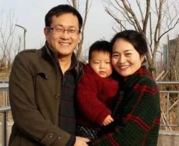
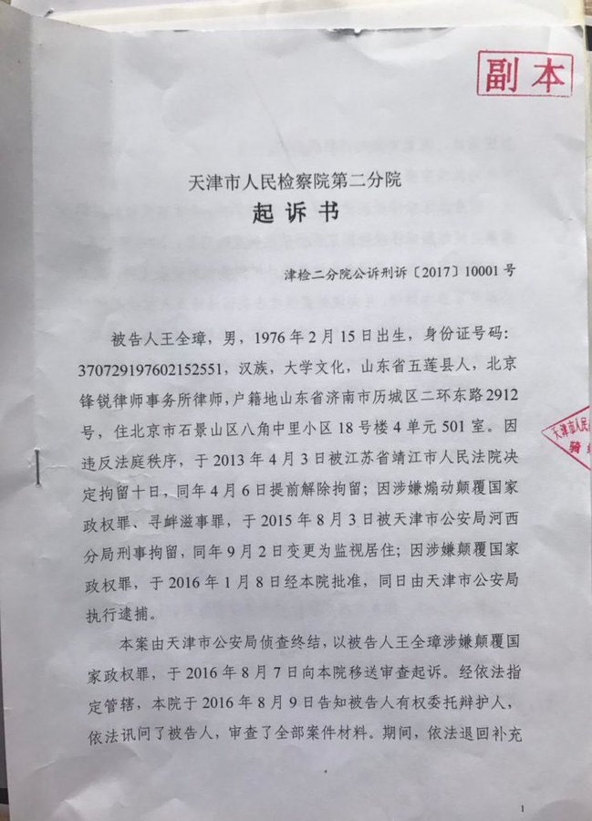
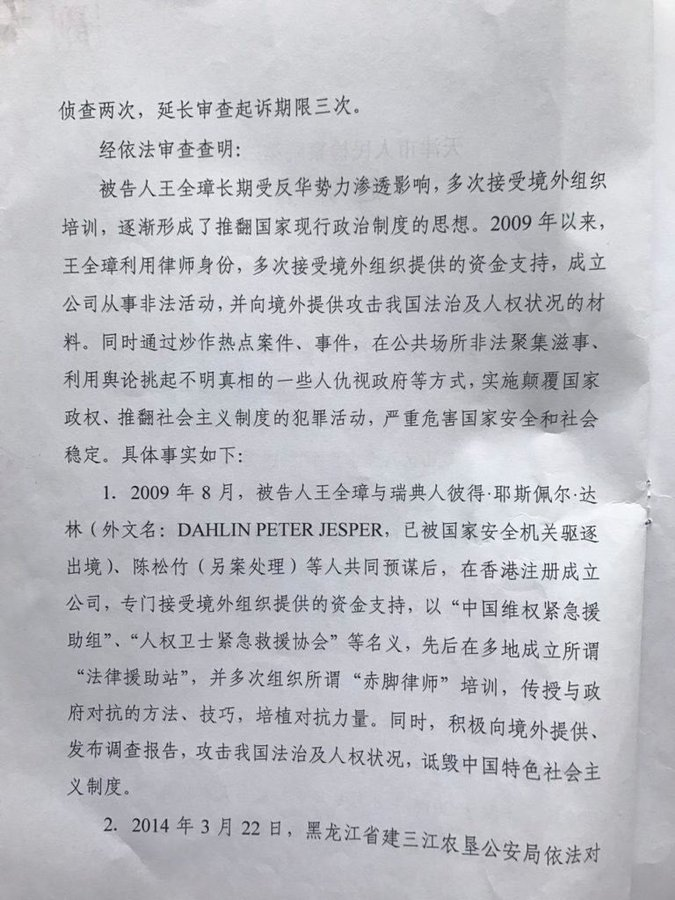
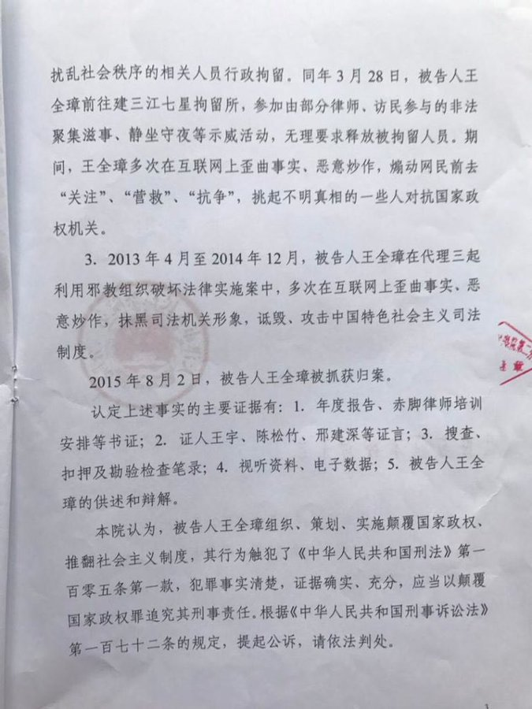
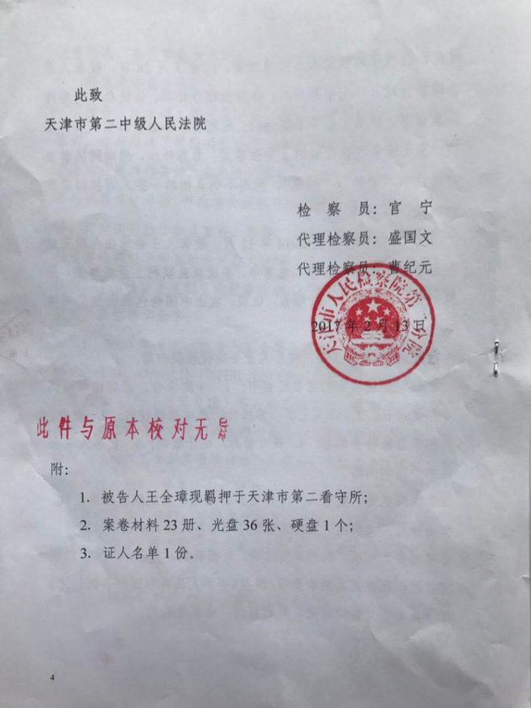
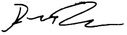

# Statement on Wang Quanzhang’s indictment, by Peter Dahlin - RSDL Monitor

By [_Peter Dahlin_](https://twitter.com/Peterinexile)

The indictment of Wang Quanzhang has circulated, with one of three points of prosecution resting on Wang’s work with what Chinese prosecutor calls “中国维权紧急援助组”, also known in English as ‘China Action’. His work for cases handled while working for Feng Rui law firm constitutes the other two points.

The co-founder of that small group, [Peter Dahlin](https://twitter.com/Peterinexile), is likewise the founder of today’s [Safeguard Defenders](https://twitter.com/SafeguardDefend) (which also run RSDLmonitor.com), and one of several people who from ‘China Action’ and controls its legacy, including managing all its old documentation. With that in mind, Peter Dahlin today issued this statement.

The very mission of ‘China Action’ was to strengthen enforcement of China’s law,s the very opposite of claims that it was in any way or form working to violate or break Chinese law. There is no legal basis for the prosecution of Wang Quanzhang as presented by the prosecutor, and the court should, without delay, have Wang Quanzhang set free. Likewise, the prosecution of Wang for participating in the now famous Jiansanjiang case have no merit in law, and any legal violations were perpetrated by Jiansanjiang police, not any of the many lawyers involved.

The evidence, as indicated by the prosecutor – according to an older, sealed, indictment, includes testimony from several other people, all but one which was effectively disappeared during their interrogations, placed into ‘residential surveillance at a designated location’ (RSDL). The indictment names Wang Yu, Chen Songzhu, Xing Jianshen and myself, Peter Dahlin. All were held in solitary confinement, without access to a lawyer, incommunicado, and as testimony released before has shown in some of those cases, some received physical and mental torture. Any ‘evidence’ collected through such interrogations should be inadmissible, as per Chinese law.

Knowing, based on what has been said either in public or in private by all those named, there is nothing in what was said in those interrogations that can qualify as evidence for the charge of subverting state power – the crime Wang Quanzhang is charged with. Many other people have been investigated in relation to this accusation, all of whom has been set free. The insistence of using this point to prosecute Wang, but no one else, makes it clear the prosecution has no basis in law and is a political statement from the Chinese government.

No part of ‘China Action’s’ work, focused on training of lawyers in Chinese law, providing legal representation and aid, nor its research and limited reporting, in any way constitute subversion of state power, especially important to note as the group’s mission was to improve the enforcement of Chinese law, the very opposite of violating or breaking said laws. Furthermore, all documentation underpinning the work of ‘China Action’, all the way back to its founding year, 2009, has been preserved and can illustrate every aspect of ‘China Action’s’ work.

More information will be released once more information from the prosecution and court hearing becomes known.

2018-11-26

---------------------------------------------------

原网址: [访问](http://rsdlmonitor.com/statement-wang-quanzhangs-indictment-peter-dahlin/)

创建于: 2018-12-26 22:44:07
