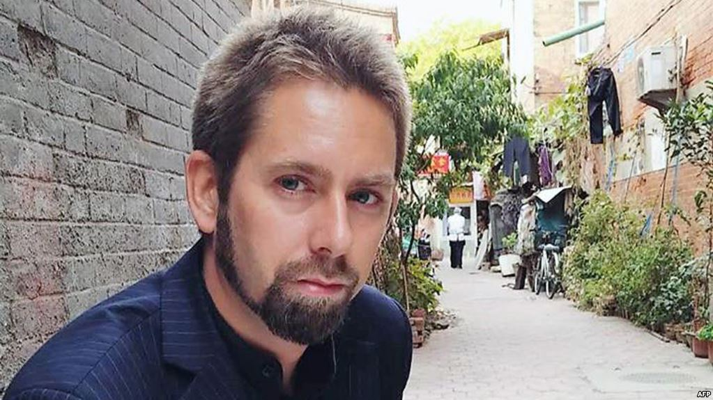

# 与彼得∙达林的对话：一个瑞典NGO工作者如何危害了中国的国家安全

2017年2月1日 05:56

[曹雅学](https://www.voachinese.com/author/24979.html "曹雅学")

瑞典非政府组织工作者彼得·达林 (资料照片)

**曹雅学女士是英文网站**[**ChinaChange.org**](https://www.voachinese.com/a/peter-dahlin-20170131/ChinaChange.org)**的创办人兼主编。这篇文章不代表美国之音的观点。转载者请注明来自美国之音或者****VOA。**

**_曹雅学：_**_彼得，你是个瑞典人，__2016__年__1__月__3__日，你被中国国家安全人员带走，你被指控__“__危害国家安全__”__。_ _九天后_[_国际媒体_](http://cn.nytimes.com/china/20160113/c13beijing/)_报道了你失踪的消息。然后，在__1__月__15__日和__19__日，中国官方媒体_[_《环球时报》_](http://opinion.huanqiu.com/editorial/2016-01/8383806.html)_和_[_新华社_](http://news.xinhuanet.com/legal/2016-01/19/c_1117827737.htm)_分别报道了你被拘留的消息。__1__月__19__日，你出现在中央电视台上_[_“认罪”_](https://www.youtube.com/watch?v=whbgVz4xKww)_，说自己“在中国的活动违反了中国法律，对中国政府造成危害，并且伤害了中国人民的感情。__”2016__年__1__月__26__日你被中国当局驱逐出境，并被禁止在__10__年内进入中国。这__23__天里显然发生了很多事情，我们希望你能讲讲这个过程。首先请你告诉我们：__2016__年__1__月__3__日发生了什么？_

**达林：** 那天晚上中国国家安全人员查抄了我在北京的住处，我是当晚被带走的。那天早些时候我就听说北京国安高层在问询我的情况，那么不到10小时后他们就带着搜查令和拘留证上门了，不光拘留了我，还拘留了我女朋友。我之前已经订了那天晚上离开中国的机票，都收拾好了东西。

**_曹雅学：_**_我对中国的维权活动算是比较了解的，但是居然从来没有听说过你们这个名叫__“__中国维权紧急援助组”__的机构_ _（以下简称“援助组”）。所以围绕你们的机构和你们的工作的确有些神秘感。_[_《纽约时报》_](http://www.nytimes.com/2016/07/10/world/asia/china-ned-ngo-peter-dahlin.html)_几个月前的一个报道提到你们办讲座、提供法律援助、举办培训等。中国官方媒体则用阴谋论的口气把你们的工作描述得很黑暗、恶意。那么你们到底在中国做了什么？_

**达林：**“中国维权紧急援助组”从2009年开始，到2016年初终止，同时运作几个不同的项目。它不太为人所知，因为我们一直比较低调。从创立开始，援助组的工作就一直在为遭到攻击的人权律师、记者和其他人权捍卫者，特别是女性人权捍卫者提供帮助。但是我们主要的工作在于为人权捍卫者提供培训和能力建设。我们着重于培养“赤脚律师”，目的是帮助强化法律维权活动和公民社会活动，发展法治。

我们最初的一个项目是“紧急援助项目”，为危急中的人权捍卫者安排律师，为受害者家庭提供所需要的经济资助，这包括房租、医药费、或者小孩的学费等。我们尤其关注女性维权者和草根活动人士，因为和比较知名的维权人士相比，他们常常缺乏人脉和支持。过去几年，我们又建立了一个下属项目，特别为那些经历了拘留、绑架和审讯的人权捍卫者提供心理健康支持。

虽然我们主要的工作是提供直接支持，但是通过紧急援助项目，我们也围绕一些案例进行了有限的倡导工作，如提请在北京的外交官注意一些案件，与联合国就一些人权特殊程序进行沟通等。我们还参与联合国对中国人权的定期审议。

许多人可能不知道，欧盟不少国家政府和机构都与中国司法系统内的部门如公安、法院、检察院合作，帮助发展“法治”，而法治的重要性不言而喻。与此同时，直到最近遭到打压为止，越来越多的国际组织、特别是位于香港的组织一直在为执业维权律师提供费用支持和培训支持，帮助他们做一些公益案例以及维权案例。不幸的是，这两种途径的协助都忽略了一个很重要的群体。

由于财力资源限制或地理限制，中国大多数权益受害者必须依靠没有律师执业证的赤脚律师，而这个群体却很少得到上述发展法治的项目的支持。这就是为什么我们的工作集中在赤脚律师上。通过培训和能力发展，我们的工作主要是弥补法律救助上这个空缺，特别是贫穷的乡村人口的法律需要。

**_曹雅学：_**_说到赤脚律师，我就不免想到陈光诚。郭飞雄在维权活动初期也是公民律师。另外一个例子是倪玉兰。这些公民都不是执业律师，但是他们都通过法律途径维护权益。_

**达林：**由于没有执照，赤脚律师基本上无法介入刑事案件。但是在中国，反对政府侵权、维护自己权益的主要程序都是行政法和规定，这是任何一个公民都可以介入的。赤脚律师因此可以成为自学成才的法律活动分子，不少被政府剥夺执业证的律师也可以从事这方面的法律工作。他们可以就政府的不法行为，如酷刑、任意羁押、强迫拆迁等状告相关政府机构。赤脚律师还带头并推广使用中国2008年颁布的《**中华人民共和国政府信息公开条例**》，在很多案例中取得了成功。

为了帮助赤脚律师熟悉并使用《行政法》、信息公开条例、以及其它程序，援助组从2009年开始开办一系列不同的培训项目，从比较深化的行政法一周培训，到比较短的信息公开条例培训，到比较具体的法律事项培训，依据受益人的需要而决定。

我们还在全国各地建立了“法律援助站”，把我们的救助项目和培训项目结合起来。这些法律援助站由在任意羁押、行政法、信息条例等方面经过培训的赤脚律师运作，他们为他们所覆盖地区的受害者提供免费法律协助。许多这样的案例都是公益案例。

**_曹雅学：_**_在你被关押期间，审问人员有没有向你指出你描述的这些活动中有哪些是违法的？哪些危害了国家安全？_

**达林：**我们一直假定他们的主要兴趣是我们的紧急援助项目，他们无疑想知道哪些律师介入了哪些案件，但是到头来他们的主要兴趣却是我们资助的赤脚律师以及他们的免费法律服务。他们很想了解我们的“法律援助站”。他们也对我们的培训活动感兴趣，但是很多这些活动已经被当地警察或者省级国安关闭。

总的来说，我被“指定居所监视居住”，多半是因为国安错误地认为我个人介入了一系列活动，但是我并不具体介入这些活动，这一点很容易证明。

他们审问我的另一个主要兴趣点是王全璋律师。他是709被抓捕的律师之一，已经被秘密羁押一年多。王全璋和我一起工作了一些年，但我们从2014年起就没有合作了。我们的合作在培训方面，为当地律师提供非正式的指导，为那些面临审判的人提供刑事辩护，以及编写培训教材等。就连国安人员都没法说清楚这些活动中那样对中国有害，更不要说违法。

**_曹雅学：_**_你说你被抓前中国安全部门就在监督你们的活动。他们怎么监督？你能不能具体说一下？_

**达林**：2013年初，我们一个同事多次被安全警察传唤，长时间问话。他们使用罗卜加大棒的方法，试图让这个人成为他们的‘内应’ – 继续为我们工作，但是向警察报告我、援助组的共同发起人麦克∙卡斯特 (Michael Caster)、跟我们合作的律师、或任何跟我们一起工作的人。安全警察要求我们这个同事拷贝他能接触到的一切文件，报告任何他做的工作。有好几次，我们发现我和麦克的名字出现在警察对和我们工作过的维权人士的审问中。

**_曹雅学：_**_你基本上是被在黑监狱关了__23__天，你说你每天都遭到审问。他们到底审问什么呢？_

**达林：**头24小时，我是被拘留，不是“指定居所监视居住”。 他们问了我的北京、家庭、教育，还有几个同事的情况，他们还提起王全璋、幸清贤和苏昌兰的名字。头三天用了一个态度恶劣的国安来审问我，这个人凶恶得过头了，越是这样的人我越不会合作。之后，他们派来一个态度好的国安审问我。我知道我的女友也被抓了，并且跟我在同一个设施内。她与我的工作毫无关系，自然没有什么可以告诉他们的，但是我担心国安认为她拒绝合作，对她刑讯逼供。

头两个星期里，他们平均每天审问我一次，一般持续五到六个小时，常常在晚上。后来他们又加上“炉边谈心”，就是一个态度好的国安到我的房间来跟我做比较轻松的交谈。他会给我烟抽，有时还给我一杯咖啡。这种谈话中我们双方都可以做一些更抽象的探讨，我则可以更详细地解释我为什么在这点上或那点上跟他们意见相左。

后来有一次审问时，他们对我进行了“测谎”，他们说是“心理测验”，“加强沟通”。他们在我的指头上系上电极，在我的眼球上使用一种专门的相机，问我一些测验问题和真实问题。但是他们弄来操作测谎仪的人怎么也操作不好，到头来他们没有得到任何东西，只得半途放弃。

我被羁押两个星期后，他们意识到不管是我本人还是援助组都与幸清贤或苏昌兰被指控的“罪行”无关。他们还意识到，我们跟锋锐律师事务所也没有关系，跟王全璋律师也数年没有合作过了。此外，当他们了解到我和王全璋所从事的活动与提供法律援助、训练律师、制定培训材料有关的时候，他们肯定意识到，用这些来抹黑他，或者给他定任何危害国家安全的罪行，是站不住脚的。

他们还意识到了我有病，而且是一种很严重的病【[_纽约时报的报道_](http://cn.nytimes.com/china/20160113/c13beijing/)_说，达林患有爱迪生氏病，一种需要每日服用药物的荷尔蒙失调症_】。他们可能是不想有一个西方人权活动者死在自己手上吧，他们在余下的日子对我的病情十分注意，这就限制了他们对我能用的施压方法。我还了解到，在我失踪后两星期，媒体开始有了大量报道，这也是我预料中的。我怎么知道的呢？因为有一天一个审问者问到路透社记者Megha Rajagopalan。她是首次披露这个新闻的。审问者的不满和气愤非常明显。

大概是这个时候，他们可能做出了把我驱逐出境、把这个案子收场的决定。在剩下的日子里，他们试图从我口中尽量多地了解非政府组织的工作以及公民社会。最后一个星期的样子，他们基本上不审问了，而是跟我进行更多的“炉边谈心”。此外，我就是打发时间，等着下一步。这包括盯着经过软包的墙发呆、做一些徒手体操、回想鲍勃迪伦的歌词等等。但是即使如此，每一天、每一分钟都十分漫长，我开始有忍受不下去的感觉。

许多人在谈到单独关押的问题时都提到，在某个时候，你的心思会转向自杀。虽然我没有真想过要自杀，但我有时候也会花好几个小时研究关我的房间，考虑自杀的可能性。但是房间的软包和设置做得如此周到，我意识到，一个人即使想自杀也是不可能的。

**_曹雅学：_**_报道说你的组织得到很多不同来源的资助，最大的资助者是欧盟，但是中国国安似乎只盯着美国国家民主基金会。为什么这样呢？_

**达林：**欧盟到目前为止是我们最大的捐赠者，但审问我的人对这个事实几乎毫无兴趣。相反他们只关心美国国家民主基金会，尽管在我们项目运行的五年里，民主基金会对我们的资助只是一小部分。他们还对爱尔兰前线等提供紧急援助的组织感兴趣。我向他们指出，欧盟资助过对中国政府机构人员无数的培训活动，我们只是针对赤脚律师做培训而已。

他们尤其想让我承认民主基金会在指使我们，告诉我们做什么。我想这是他们的思路，同时也因为他们不了解资助方和被资助人的关系。

他们还问到了位于日内瓦的国家人权服务社。这个机构提供与国际法相关的培训。还有在香港的一些机构。但是他们并不了解我们与这些机构的工作，所以基本上没什么好谈的。

**_曹雅学：_**_我读过不少中国人权捍卫者对审讯的描述。审讯者总是想知道他们的人际网络。我想象他们也想知道与你有工作关系、或仅仅是相识的每一个中国人。_

**达林：**他们似乎对人的兴趣比对我们的工作的兴趣还要大。他们向我问了一大串人。有些是出现在他们掌握的文件中的人，有些是在其它审讯中出现的人，有些则干脆是比较有名的人权捍卫者。我坚持表示，我们的工作只是集中在行政法方面，加上我中文很有限，所以我接触的人很有限。他们假定我们与中国国内的NGO有联系，但情况并不是这样。同样，我们与国际组织的合作也局限于几家而已。他们在这上面花了很长时间，但没得到什么。他们还问到锋锐律师事务所，问到王宇和李和平等人，但我跟他们接触很少。

国安还花了很多时间试图让我相信，我的一些同事出卖了我，我也应该揭发他们，表明自己的清白。但不管他们怎么尝试，我坚持捍卫这些人，最后他们只得放弃。我记得我一直重复的一句话是：这些人“不仅是中国最好的公民，而且不管在世界上任何一个国家，他们都会是最值得自豪的公民。”

**_曹雅学_**_：给我们讲讲_[_电视认罪_](https://www.youtube.com/watch?v=whbgVz4xKww)_吧。_

**达林：**到了最后当驱逐出境成为可能选项的时候，一天深夜，他们在审讯室对我进行了最后一次问话，基本上就是总结一下他们从审问我和其他人那里了解到的几个要点。

他们的重点是要找到一个角度抹黑王全璋。他们已经花了很多时间称王全璋是罪犯，尽管我差不多每天都指出，王全璋的案件还没有到检察院，更不要说定罪了。同样，他们还拒绝向我指出王全璋做的哪件事是犯罪行为，只是反复说他的工作危害了国家安全、他为“邪教”人员辩护、作为律师他在社交媒体上对自己办的案子发表意见。

第二天傍晚，一个态度比较好的国安来到我的监房，给我递烟，跟我聊天。他说一组法官将决定到底是起诉我还是驱逐我。他说，我最好能在录像机前录一段，供法官们审阅。考虑到他们已经完成了对我的审问，不会再从我这里得到任何更多信息；考虑到我不被驱逐，我的女友就会一直被扣着；考虑到我的身体情况也在恶化（到那时我已经失去了5-6公斤体重），我就答应了。

接下来的很容易想象。他出去又回来，手里拿着一张纸，上面问题和答案都写好了，在他们看来这是过去几周审问的“总结”。 他们想让我称王全璋、幸清贤、和苏昌兰为罪犯，我跟他们争论了一番，最后他们做了一些修改。

当我看到纸上最后一句话是“我伤害了中国人民的感情”时，我意识到这是给在中央电视台上认罪用的，尽管他们从来没这样跟我说。我被带到一个会议室，我看到中央电视台一个“记者”和她的摄影师已经在那里等着了。

那个中央电视台的女记者跟我年纪差不多，看上去不友好，但相当放松，显然是个有经验的访谈者。涉及我案子的大约八个国安坐在后面。我们把问答很快练习了一遍。唯一不顺的地方就是“伤害感情”这一句。在经过四次反复后，这个“记者”问我，“你真不想说这句话，是不是？”

但是“伤害感情”这句话却是我同意被录像的理由。在中国的外国人圈里，这是句笑话，每人听到这句话都会马上知道“认罪”的真相。简单说，对外国人来说，对很多明眼的中国人来说，那句话等于把逼我电视认罪的目的全部抵消了。

**_曹雅学：_**_你被驱逐后，北京大学法学教授张庆方写了一篇评论，对驱逐你的法律程序_[_提出质疑_](http://xgmyd.com/archives/23911)_。他大意说，如果你有罪的话，驱逐令应该由法庭下达；如果你违反了行政法规但是没有犯罪，驱逐令应该由公安局或者国家安全部门下达。你的案件从来没有在中国上庭，然后中国外交部发言人华春莹却宣布说你承认犯了__“__资助危害中国国家安全犯罪活动罪__”__。她是一个政府发言人，居然言之凿凿地给你定了罪！我之所以专门指出这一点，是因为这整个过程的任意性恰恰显示出你的机构所从事的工作、那些赤脚律师以及人权捍卫者所从事的工作的重要性。这些是最基本的东西，是法治的__ABC__，但却被中国这样一个大国政府任意践踏。不仅践踏，而且还动用国家宣传机器对之污名化。_  

**达林：**从法律的角度说，我在他们眼里是因为违反了第107条 -- 即使用外国资金资助非法和颠覆活动---被指定居所监视居住的。但是除了指控我支持苏昌兰声援香港雨伞运动的抗议、指控我策划幸清贤和唐志顺带王宇律师的儿子包卓轩越境，他们说不出我哪个活动是非法的。除非是指控我非法经营，但非法经营并不是一个国家安全罪行。我和苏昌兰案和幸清贤案毫无关系。

他们的说法是，我们支持的行动会挑战国家安全，但根据中国的《国家安全法》，这完全是站不住脚的。他们的确指责援助组在大陆没有登记，因此也没有缴税，但是这却又不是他们指控我的罪行，而且在他们眼里好像也不是什么大事。

最后我是在《反间谍法》下去驱逐的，而且他们不给我任何法律程序文件，如被没收物件的清单、搜查令、拘留令、指定居所监视居住通知、驱逐令、10年内不许我进中国的禁令等等。什么都没有。

另外，以刑事犯罪指控驱逐一个外国人必须有法庭命令，必须通知大使馆和我本人，必须允许我有律师 \-\-\- 哪怕是官派律师，但是任何一样都没有。也就是说，对我的驱逐本身是非法的。如果对我的驱逐是行政处罚，那么我必须被从刑事拘留释放，转移到一个行政拘留场所。中国的警察和司法系统就这样在全世界的注目下，都无法正常运作。

**_曹雅学：_** _2008__年左右，国际社会对中国拥抱国际准则相当乐观。中国社会似乎也抱着同样的乐观。我记得那时有个很热门的说法，叫做__“__与国际接轨__”__，现在你听不到这个说法了。就这么短短几年，中国的态度变了。你大约十年前来到中国做志愿者，十年后你被作为国家安全的危害者驱逐出境。在这个访谈最后，你对读者有什么话要说？_

**达林：**国际社会的反应比较慢，调整看法也比较慢，我想这也是自然的。但是外国人，包括政治领导人，越来越难以相信中国所谓和平崛起、发展法治、建立更美好社会的说辞和面具。习近平掌权时间越长，人们就越难以相信中国在朝一个正确的方向发展。对我个人来说，虽然我近十年的工作付诸东流，而且在中国患了这种伴随一生的病，但是我仍然感到我做的一切是值得的。

---------------------------------------------------

原网址: [访问](https://www.voachinese.com/a/peter-dahlin-20170131/3700656.html)

创建于: 2018-12-26 22:59:11
