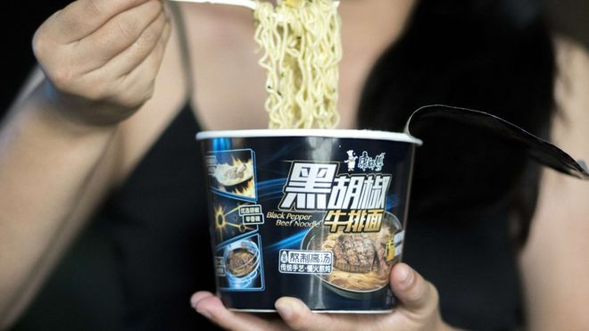
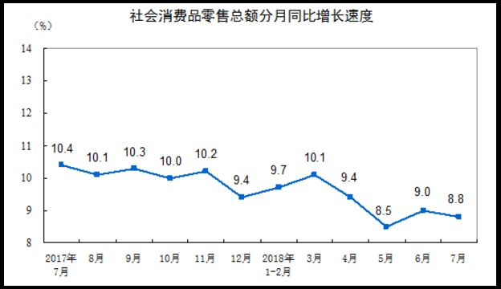
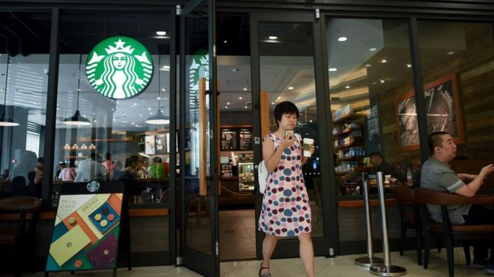
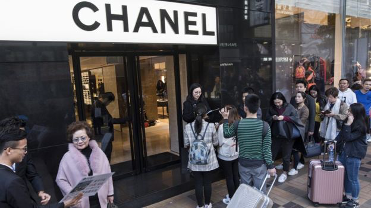
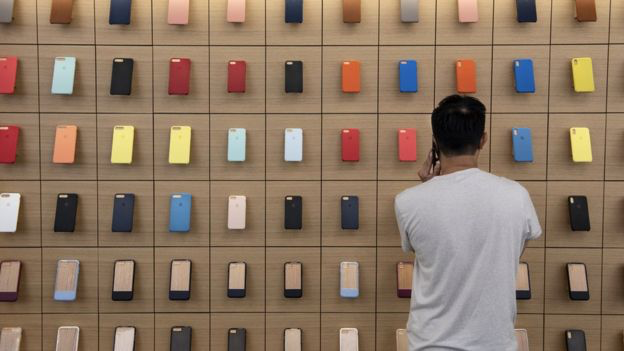

# 人民币贬值、楼价高涨：消费降级中产失去的优质生活 - BBC News 中文

王哲珺 BBC中文特约撰稿人

2018年 9月 4日

图片版权 Getty Images 

与整体消费放缓趋势相反，方便面、啤酒、榨菜等低价消费品销量反弹。

住公寓必须有配套服务，买衣服最差也要CK（Calvin Klein），吃火锅只选小龙坎大龙燚……曾经，严凯瑞在生活上诸多讲究，他的薪水也支撑得起他体面的生活。然而，最近一年在广州闯荡时，他却发现自己越来越多地方要将就。

严凯瑞有着光鲜的履历：美国纽约大学硕士毕业，曾在摩根大通总部工作。曼哈顿金融才俊回到中国闯荡，瞄准了一线城市的金融行业，这里机会多，晋升空间大。

前几年，他辗转北上广谈项目，挥斥方遒，收入节节攀升。去年，严凯瑞落脚广州，加入一家中国国有投资机构，担任项目主管。他的收入主要来自固定的基本工资和业绩激励。当他期待能在广州再续辉煌时，却发现项目越来越不好谈，花钱也要处处“留一手”。

中国经济发展放缓的同时，大多城市房价却持续飙升，今年以来人民币出现较大幅度贬值，加上股市暴跌和P2P崩盘的冲击，以严凯瑞为例的一大波城市中产阶级，正经历着从租房到日常消费品等不同方面的消费降级。

中国国家统计局今年七月份公布的CPI（居民消费价格指数）同比上涨2.1%。更让人关注的是消费走低的信号，上半年中国社会消费品零售总额增速9.4%，同比降低一个百分点，上半年消费品零售总额增速少见地低于两位数，5月份还出现15年来的最低值。

图片版权 China National Bureau of Statistics 

与整体消费放缓趋势相反，方便面、啤酒、榨菜等低价消费品销量反弹。主要市场在中国大陆的方便面厂家康师傅上半年财报称，销售额同比增长8.4%，净利润同比增长86.59%。而在2013年至2015年中国“消费升级”那三年，康师傅的净利润连续下降。

*   [博弈高房租 中国多个城市租金突涨背后](https://www.bbc.com/zhongwen/simp/business-45320702)
*   [中美贸易战：中国“精心设计”的600亿美元反制影响几何](https://www.bbc.com/zhongwen/simp/45070110)
*   [解读贸易战爆发后中国最新经济数据](https://www.bbc.com/zhongwen/simp/business-44844477)
*   [贸易战会不会将中国推向“失落的二十年”](https://www.bbc.com/zhongwen/simp/business-43595219)
*   [GDP目标五年首次未降 中国经济放缓已触底？](https://www.bbc.com/zhongwen/simp/business-43292751)
*   [为什么中国游客“特爱”英国比斯特购物村？](https://www.bbc.com/zhongwen/simp/world-43864495)

## 降低大宗商品消费

严凯瑞在公司里想晋升还不够年资，基本工资也已达到所在职位的最高薪资级别。他开始盘算节省开支，首当其冲的就是降级大宗商品消费。

刚到广州时，为了上班方便，严凯瑞在号称“广州尖东”的高消费商圈环市东，选择了一间商住两用的单间公寓。公寓有受住客调配的保安，即使忘带门卡也有人帮忙开门，还能时常预约房间打扫服务。面面俱到的物业服务，代价是比普通住宅贵数倍的管理费和水电费。

“人都有惰性，如果我收入水平是直线往上，我不会考虑换。”

不堪重负的严凯瑞搬到了附近一个居民大院，物业配套只有24小时安保。虽然房租一年只便宜5000元，但是物业费降低了很多。“服务水平就一定会体现在价格上，这种附加值的东西我可以不追求了。”

图片版权 Getty Images 

在中国被视为典型中产消费的星巴克咖啡

## 中产转向拼多多？

除此之外，严凯瑞还看上了“拼多多”。这是一个主要面向中低收入人群的电商APP，有超过60%的用户来自中国三线以下城市，常被诟病假货、山寨货泛滥。

“中产阶级有一个毛病，他们是一个最矫情的阶级，在任何国家都一样。中产阶级比上流社会更在乎这个东西到底是不是真品。当中产阶级可以凑合的时候，其实就是一种降级，”他说，“好不容易从下面混上来，打死也不想倒回去。前有狼，后有虎，你让这帮人承认狼是狼，虎是虎，说明手上是真没家伙了。”

将面子工程放在第一位的严凯瑞在拼多多上最爱买三种商品：绝对不带商标的衬衫T恤——不会丢人；高损耗的日用品，例如纸巾和洁厕灵——反正没人在乎；还有花的种子——低价消遣。

“我原来最次也买CK，”他说，“但是现在我必须思考一件事情，既然没有商标，因为商标都在衣服里面，根本看不出来，我可以考虑考虑贵人鸟。”于是，严凯瑞的衣柜里不带商标，品牌不明的白T恤、黑T恤、灰T恤多了起来。

图片版权 Getty Images 

香奈儿等奢侈品牌曾经让中国中产阶级趋之若鹜。但在消费降级潮中，他们开始节省在品牌消费方面的开支。

无独有偶，知乎专栏作家吴一4个月前分析了50万条拼多多商品数据，发现拼多多上一级类目销售额前十名当中，排名第五的洗护纸品成交额将近13亿，男装排名第七，成交额超过10亿，而三级类目的销售额当中，抽纸成交额超过5亿，排名第一。

但拼多多要在中产阶级里火起来仍有困难。在广告公司担任创意总监的陈潼潼就坚决不买拼多多。因为要想获得低价，需要在微信群或者朋友圈分享拼多多的链接，拉人拼团或砍价。她认为这样太丢脸了，不符合她对自己作为中产“过得体面”的期许。

相反，网易严选就深得陈潼潼青睐。她说，“网易严选标榜的是大牌的代工厂商，价钱低了，质量维持，所以引起了我的兴趣。”

网易严选经常被人拿来和无印良品作比较，两者在创立之初都是迎合消费者希望花低价买到优质品牌货的心理，通过把控生产的源头，直接向原料供应商采购关键零件，开发定制化产品来控制价格。

“我是典型的没有贵族命， 但有贵族精神的人，”陈潼潼说。

## 用学习取代社交

图片版权 Getty Images 

节省开销，手机是否需要从苹果换回中国品牌？

为了“有尊严”地减少高消费，严凯瑞还将消费降级与自我提升结合起来。他在过去一段时间里，报考了基金证券期货等各种从业资格证，年底还要考CFA（特许金融分析师）。他将复习考试作为一个冠冕堂皇的理由，来躲避高消费，同时也为寻找更好的工作机会做储备。

“一来我跟别人说我不出去社交的时候呢，我能说得出口，”他说。“另外一方面它会有幻想，也许我考了以后，我现在这个东家不行的时候，我可以换东家，我是不是有更多的议价筹码呢？”

同样有换工作考虑的外资广告公司高管陈雨晖，由于所在集团整体业绩不佳，今年加薪无望，奖金冻结，加上之前投资的P2P融资公司跑路，损失了20万，还有基金投资账面浮亏，她的购房和换车计划通通落空。

陈雨晖原想趁着广州在车陂兴建国际金融城的机遇在那里购置一套八十平米的两房一厅住宅，用于出租。但是一下子遭遇多重经济损失，面对最低200万的首付，她也只能望房兴叹。连原本将用了5年的代步车换成油电混合车的计划，也一并作罢。

由于一贯践行“断舍离”的生活方式，陈雨晖在日常消费上没有受到太大影响，但眼看人民币贬值，她也不能像以前一样说走就走，一年两次国外游。“出国旅游贵了很多，除非是去土耳其，”她苦笑。

面对越来越紧的钱袋子，许多人都会选择削减可有可无的娱乐消遣。严凯瑞感慨，早些年经济形势好的时候，他和朋友都是去酒吧、KTV、夜店等高消费场所，对比现在，他几乎把近期上映的电影看了个遍，以作消遣。

“只有电影可以180分钟把你框在那里而且只收你50块钱，”他说。

不过，严凯瑞最便宜的消遣方式还要数种花，他从拼多多上买回来种子。“最近太无聊了，养动物呢又怕它挂了，“他说，"你总得有点指望吧。”

（文中的**严凯瑞**、**陈潼潼**、**陈雨晖**均为化名）

---------------------------------------------------

原网址: [访问](https://www.bbc.com/zhongwen/simp/business-45371447?ocid=socialflow_twitter)

创建于: 2018-12-27 23:48:31
