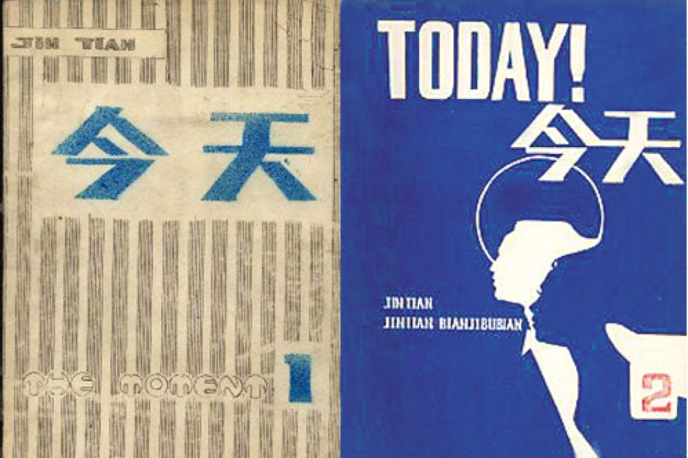

# 文學的勝利或失敗—在《今天》雜誌四十週年紀念會上的發言 - 徐曉

《今天》所給予我、並深深根植於內心的懷疑精神，使我不斷提出質疑：這是文學的勝利還是文學的失敗？面對這樣一段歷史，我們是該一味地驕傲還是也該品味一下悲哀？

2018-12-28 端传媒

* * *

《今天》雜誌第一、二期封面。網上圖片

**【編者按】**《今天》是1978年由北島等人在北京創刊的民間詩歌刊物，後被查禁，1990年復刊。徐曉，1954年出生於上海，曾為《今天》詩刊的重要編輯，1975年和2014年兩度被當局拘捕。徐曉的《半生為人》一書，圍繞1970年代末期《今天》的人物肖像，描述同時代人如何在迷信、封閉、盲從、殘酷的時代尋找獨立、智慧、尊嚴及思想。本文是徐曉女士在12月23日《今天》創刊40週年紀念活動上的演講，端傳媒經作者授權轉發。

四十年，幾乎是每個人一生中最有效的全部時間。在這期間，我們送走了趙一凡、顧城、周郿英、史鐵生、劉羽、劉迪、陶家楷、張棗、甘鐵生，就在今天上午，又為詩人孟浪送行。他們的離世給我們留下難以平復的傷痛。在此，首先讓我們一起向我們的兄弟和朋友致以最深情的哀悼！

四十年前的今天，此刻，在北京朝陽門外，中國文學的皇家出版社《人民文學》雜誌社門口，25歲的我與正在張貼《今天》第一期的北島、芒克、陸煥星三人偶遇。

我一直為能與在坐的、未到場的和已經離世的朋友們相識而深感慶幸——你們每一個人的才華和勇氣都讓我覺得高不可攀；我也曾為能成為《今天》一員而驕傲——雖然那時並沒有意識到，自己正捲入一個會被載入史冊的歷史事件。

有這本道群兄精心製作的《今天四十年》文集為證，回首往事，真不能想像，當年我們真的竟然做了這麼多——結社、出版、集會、遊行、展覽，在此之前和在此之後，這一切都是絕無僅有的，甚至完全是不可想像的。它的誕生和存在，的確改變了當時的社會人文生態。也許，自從1949年以來，文學與藝術從來沒有擔負過如此重要的使命。而且，毫不誇張地說，時至今日，仍然少有超越。

> 自從1949年以來，文學與藝術從來沒有擔負過如此重要的使命。而且毫不誇張地說，時至今日仍然少有超越。

從北京胡同裏一間小平房出發，我們各自以從《今天》雜誌獲得的自由精神，在不同的環境中，以不同的方式，獲得了不同的社會角色。

昨天，大家回顧了當年的激情與艱難，以及在世界範圍內所給予的評價與誇讚。但是，我們不應該忘記：幾乎所有成員都在或長或短的時間內被列入黑名單；我們的主編許多年被擋在國門之外，甚至有人至今不能自由出入；十年前我們的出版物被強行抄走化為紙漿；編輯部遊走在世界各地，即使改頭換面也不可能在自己的祖國出版；時至今日，我們仍然只能在香港而不是在它的誕生地舉行這一紀念，而某些作者卻因為得不到有關部門的批准而不能前來；再過10年，即使我們都仍然健康、健在，此地是否還能允許雜誌的生存、容納我們舉辦類似的活動？

> 幾乎所有成員都在或長或短的時間內被列入黑名單；我們的主編許多年被擋在國門之外，甚至有人至今不能自由出入；十年前我們的出版物被強行抄走化為紙漿；編輯部遊走在世界各地，即使改頭換面也不可能在自己的祖國出版。

現實一次次地嘲弄着「文學的歸文學」這一我們深信不疑、卻在現實中被不斷否定的信條。

《今天》所給予我、並深深根植於內心的懷疑精神，使我不斷提出質疑：這是文學的勝利還是文學的失敗？面對這樣一段歷史，我們是該一味地驕傲還是也該品味一下悲哀？也許，曾經的輝煌原本只因為我們從最黑暗的陰影中走來。

阿赫瑪託娃說，詩句，的確是從垃圾裏生長出來的。從這個意義上來說，詩人正經歷着又一個詩歌的黃金時代。

> 阿赫瑪託娃說，詩句，的確是從垃圾裏生長出來的。

《今天》的詩人們，我們已經在歷史的慣性中走了四十年，除了個體的成功，作為群體，怎樣才能始終配得上所獲得的讚譽，使這段歷史成為傳統，並且薪火相傳？也許，是時候該忘掉歷史給我們貼上的標籤了！

我們紀念逝者，同時充滿生命的緊迫感。如果說如今的《今天》仍然是走在最前面的那個，那就超越我們自己。今天，以及明天，在我們有限的生命裏，重拾最初所秉持的偏好，再出發一次，並且走得更遠一點。

祝各位平安健康。

2018年12月23日

[徐曉](https://theinitium.com/tags/_212/)

---------------------------------------------------

原网址: [访问](https://theinitium.com/article/20181228-agora-xuxiao-today-40-years/)

创建于: 2018-12-28 20:06:18

标签: `今天`

