# 在这17本书里读懂中国 - 纽约时报中文网

Dec. 21, 2018

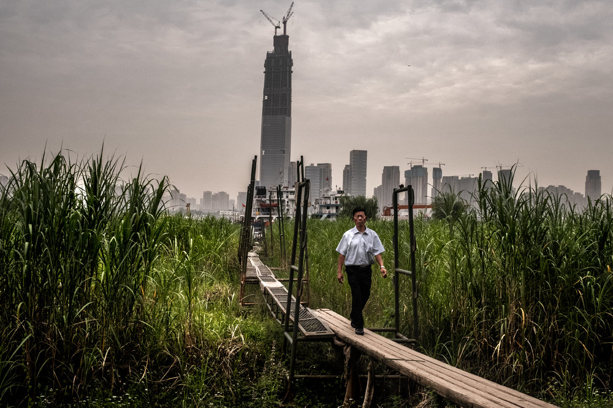

武汉长江边的一处栈桥。 Bryan Denton for The New York Times

上个月，《纽约时报》发表了五篇关于中国不断崛起的影响力和波及范围的[系列文章](https://www.nytimes.com/zh-hans/interactive/2018/11/18/world/asia/china-rules.html)。一些读者来信询问有什么书可以推荐，让他们能更深入地了解这个题目。下面是一个远非完整的起步书单。

一般兴趣

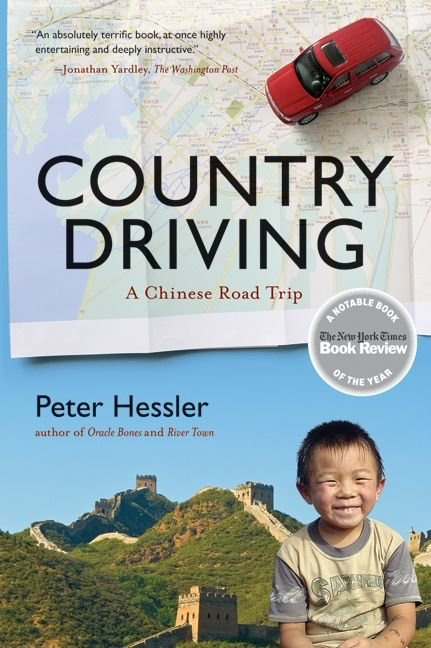

**《寻路中国》** **(Country Driving)，** **何伟(Peter Hessler)/著**

何伟的《寻路中国》“探索了中国快速发展的高速公路系统，书中当然少不了一些漫长而艰难的旅程：比如，何伟在中国北方做过一次长达1.12万公里的旅行，沿着长城从东海一直开到青藏高原，他租来的汽车上带有帐篷，还有足以让人牙疼的食物供应：可口可乐、奥利奥饼干、糖果，以及佳得乐。”

本书最重要的信息是，中国是一个“马不停蹄向前飞奔的国家”，正在走出“农业和民间传统，进入新城市和工厂如雨后春笋般出现的未来”。

这里是[本报发表的书评](https://www.nytimes.com/2010/02/24/books/24book.html)。

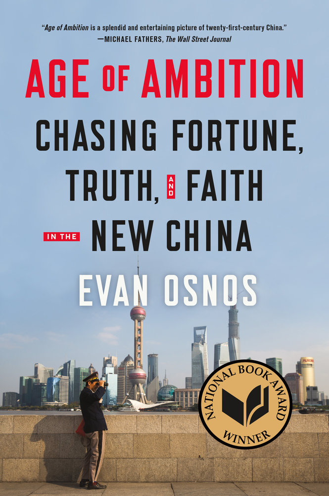

**《野心时代：** **在新中国追求财富、真相和信念》(Age of Ambition: Chasing Fortune, Truth, and Faith in the New China)，欧逸文(Evan Osnos)/著**

《野心时代》是一个“对自己的身份认同、价值观和未来极度焦虑的民族引人入胜且令人不安的写照”。书中，“欧逸文笔下的中国被道德危机和激增的挫折感所撕裂，中国人为获取财富不顾一切，同时他们也害怕一无所得。欧逸文写道，中国共产党的领导层已在道德上和理智上彻底破产，只能靠‘以繁荣换忠诚”的不会持久的交易，来保持表面上的合法性。即便如此，‘中国社会的精英集体领导神话与其寡头政治现实之间的距离正变得日益清晰明显。’”

这里是[本报发表的书评](https://cn.nytimes.com/books/20140528/t28chinabooks/)。

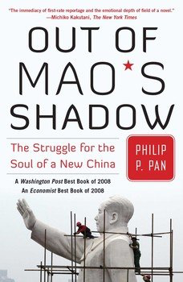

**《走出毛泽东的阴影：为新中国的灵魂而奋斗》(Out of Mao’s Shadow: The Struggle for The Soul of a New China)，潘公凯(Philip P. Pan)/** **著**

潘公凯的《走出毛泽东的阴影》对“这个世界上人口最多的国家的现状进行了评估，既注意到中国公民日益增长的个人自由，也思考了中国共产党对权力的持续垄断。他指出，经济繁荣已提高了人们的预期和获取信息的途径，同时也帮助政府先发制人地阻止了民主化：许多以前可能会成为异见人士的公民已越来越多地把注意力集中在自己的私人生活和快速致富上，而‘在这个新的资本主义经济中常常能决定谁成功、谁失败的’党内官员们‘对新兴的私营商人和企业家阶层（行使着）巨大的影响力，这个阶层的人否则可能会支持政治变革’”。

这里是[本报发表的书评](https://www.nytimes.com/2008/07/15/books/15kaku.html)。  

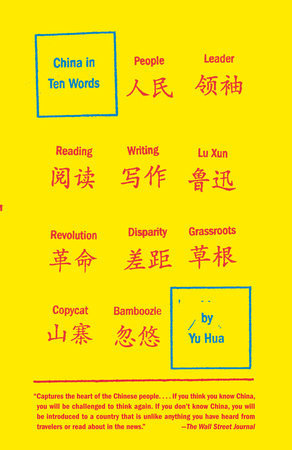

中国人的声音

**《十个词汇里的中国》(China in Ten Words)，余华/** **著**

《十个词汇里的中国》是余华的随笔集，他“描述了一个道德上做出妥协的国家，这个国家被不断增长的失业、阶级分化、难以摆脱的腐败和浪费所困扰。其极端之处在于，一方面是农民为以最高的价格卖血而四处奔波，另一方面是千万富翁建造的、酷似白宫的豪宅。”

这里是[本报发表的书评](https://www.nytimes.com/2011/11/13/books/review/china-in-ten-words-by-yu-huatranslated-by-allan-h-barr-book-review.html)。

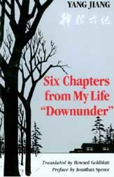

**《干校** **六记》** **(Six Chapters From My Life Downunder)，杨绛/** **著**

“在丰富性、道德紧迫性和戏剧性方面，中国历史上几乎没有发生过比文化大革命更具有文学潜力的事件了。[杨绛](https://www.nytimes.com/2016/05/27/books/yang-jiang-chinese-author-and-translator-dies-at-104.html)的《干校六记》用不多的文字记述了她被‘下放’到‘五七干校’接受再教育的两年，是那个时期为数不多的回忆录之一，因此更为珍贵。”

这里是[本报发表的书评](https://timesmachine.nytimes.com/timesmachine/1984/11/25/106406.html?action=click&contentCollection=Archives&module=LedeAsset%C2%AEion=ArchiveBody&pgtype=article&pageNumber=99)。

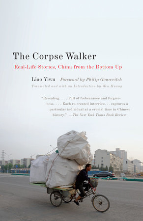

**《中国底层访谈录》(The Corpse Walker: China From The Bottom Up)，廖义武/著**

《中国底层访谈录》收集了作者所做的访谈，是一部“下大力气精心制作的口述历史记录，几乎全部来自西南省份四川。……四川是一个有极大反差的地区：有山也有平原，有工业也有农业，有新近富裕的阶层也有永远贫困的阶层。四川人普遍接受的观念应有尽有，从万物有灵论、道教到毛泽东的无神论，再到四川最大的名人邓小平推行的半资本主义”。

这里是[本报发表的书评](https://www.nytimes.com/2008/09/07/books/review/Meyer-t.html)。

治国才能

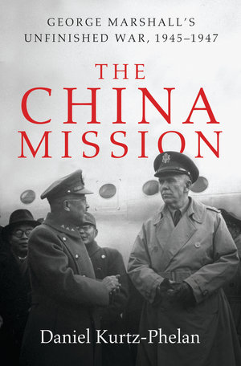

**《中国任务——乔治·马歇尔未完成的战争，1945–1947》 The China Mission: George Marshall's Unfinished War, 1945-1947)，** **丹尼尔·库尔茨-费伦(Daniel Kurtz-Phelan)** **著**

“库尔茨-费伦的书《中国任务》讲述了马歇尔在中国未能成功完成的任务。本书对这段历史做了深入研究，情节描述引人入胜，既有对性格和领导力的揭示性刻画，也有对在冷战早期历史中有关键作用的一段往事的生动重构，以及对美国影响力的局限性——即使是在这种影响力的鼎盛时期——的深刻思考。”

这里是[本报发表的书评](https://cn.nytimes.com/culture/20180607/daniel-kurtz-phelan-china-mission/)。

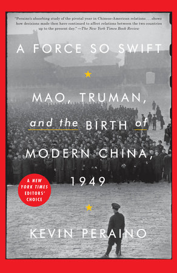

**《动如脱兔：毛泽东、杜鲁门和1949年现代中国的诞生》(A FORCE SO SWIFT：Mao, Truman and the Birth of Modern China, 1949)，凯文·珀雷诺(Kevin Peraino)著**  

“凯文·珀雷诺的这本精彩纷呈的书讲述了1949转折之年的故事。是年，毛泽东的中国共产党上台，发生剧烈变化的不只是中国国内的局势，还有中美关系。美国曾在数十年间与蒋介石的国民党保持密切的联系，其中包括组建战时联盟，此后一头扎进与中国的冷战，随后是热战（在朝鲜半岛），接下来的几十年，两国外交几乎完全中断。”

这里是[本报发表的书评](https://cn.nytimes.com/china/20171010/kevin-peraino-a-force-so-swift-mao-truman/)。

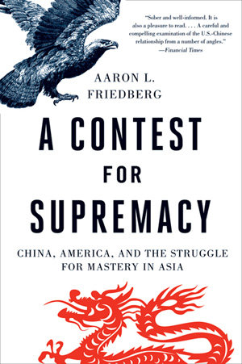

**《美国回得了亚洲吗？》(A Contest for Supremacy: China, America, and the Struggle for Mastery in Asia)，罗亚伦(Aaron L. Friedberg)/著**

“在《美国回得了亚洲吗？》中，罗亚伦概述了中美两国可以建立更密切关系的几点理由：经济上的互相依赖；中国可能会变得更开放、更民主的前景；中国持续融入国际体系；诸如[气候变化](https://www.nytimes.com/section/climate?inline=nyt-classifier)、核武器等共同威胁。即便如此，他认为另两个因素——日益加剧的利益冲突和深刻的意识形态和政治差异——将会更具决定性，也将使得这一关系更紧张、更具竞争性。”

这里是[本报发表的书评](https://www.nytimes.com/2011/09/25/books/review/a-contest-for-supremacy-by-aaron-l-friedberg-book-review.html)。

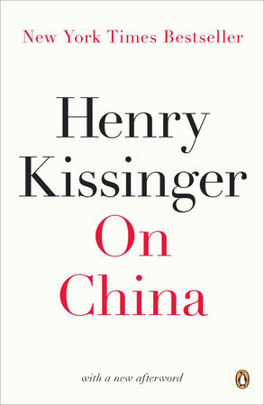

**《论中国》(On China)，亨利·基辛格(Henry Kissinger)/著**

基辛格不仅是前往共产主义[中国](https://www.nytimes.com/topic/destination/china?inline=nyt-geo)的第一位官方美国特使，而且40年来，先后50余次往返其间，覆盖双边7任元首。外交上，他享有特权；他在《论中国》(On China)一书中……回顾了自己的非凡历程。  

这里是[本报发表的书评](https://cn.nytimes.com/china/20121205/c05kissinger/dual/)。

历史

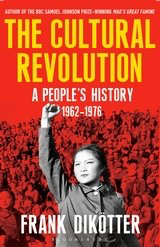

**《文化大革命：一部人民的历史，1962-1976》(The Cultural Revolution: A People’s History, 1962-1976)。 冯客(Frank Dikötter)/著**  

“冯客的《文化大革命：一部人民的历史，1962-1976》引人入胜、令人震惊，有时也有点耸人听闻，这是他撰写的毛泽东时代三部曲的第三卷，该书挑战中国人民，让他们去正视历史中这些缺失的年份。书的素材来自数百个英文和中文的目击者描述、新近开放的档案记录、在线的记录文革的项目，以及国外和中国的学术研究，书中对毛泽东和共产党执政的描述带有巨大的谴责意味。”

这里是[本报发表的书评](https://cn.nytimes.com/china/20160509/c09shapiro/dual/)。

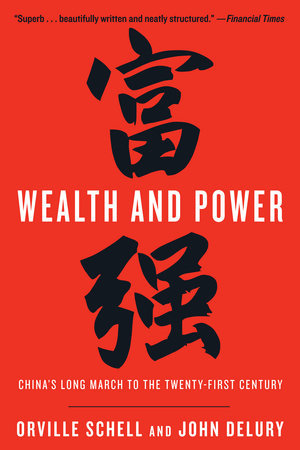

**《富强：中国通往21世纪的长征》(Wealth and Power: China’s Long March to the Twenty-First Century)，** **夏伟(Orville Schell)和鲁乐汉(John Delury)/著**  

在本书中，夏伟和鲁乐汉“认为，对一代又一代有影响力的中国人而言，羞耻则激人奋发”。他们审视了“中国文化中一种不同寻常的特性是如何渗透在政治和学术生活中，这是一部调和中国目前的成功与过往的苦痛的佳作。该书还为今天这个更加富强的中国所面临的最大挑战之一打下铺垫，因为中国不可能永远和自己已经驱逐的幽灵作斗争”。

这里是[本报发表的书评](https://cn.nytimes.com/culture/20130722/c22kahn/ "Link: https://www.nytimes.com/2013/07/21/books/review/wealth-and-power-by-orville-schell-and-john-delury.html")。

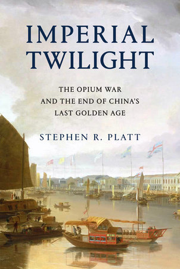

**《帝国的黄昏：鸦片战争及中国最后的黄金时代的终结》The Opium War and the End of China’s Last Golden Age 裴士锋(Stephen R. Platt)/著**  

“在一个财富和权力不可阻挡地从东方转向西方的世纪里，英中两国走向了战争，裴士锋对此做了动人的描述。但是，如果在这个财富和权力同样不可避免地从西方转向东方的时代，这段历史还能给人们提供什么教训，那肯定是卡尔·马克思(Karl Marx)在鸦片战争十年后做出的结论——历史是人类自己创造的，但他们并不能随心所欲地创造历史。”

这里是[本报发表的书评](https://cn.nytimes.com/culture/20180703/stephen-r-platt-imperial-twilight/)。

妇女和儿童

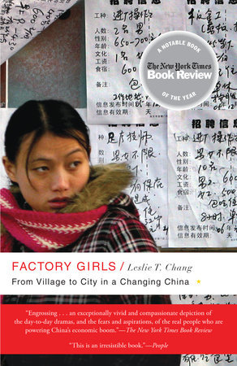

**《工厂女孩：在一个变化的中国，从乡村走向城市》(Factory Girls: From Village to City in a Changing China)，张彤禾** **(Leslie T. Chang)/著**  

“关于中国巨型制造基地的出现，近年来见诸于无数的书籍文章，但张彤禾的选择不是去聚焦在其中发挥作用的广大市场劳动力，而是关注个体，其中大部分是妇女，那些离开村子，到这个经济体前线去寻找财富的她们。”

这里是[本报发表的书评](https://www.nytimes.com/2008/11/09/books/review/Keefe-t.html)。  

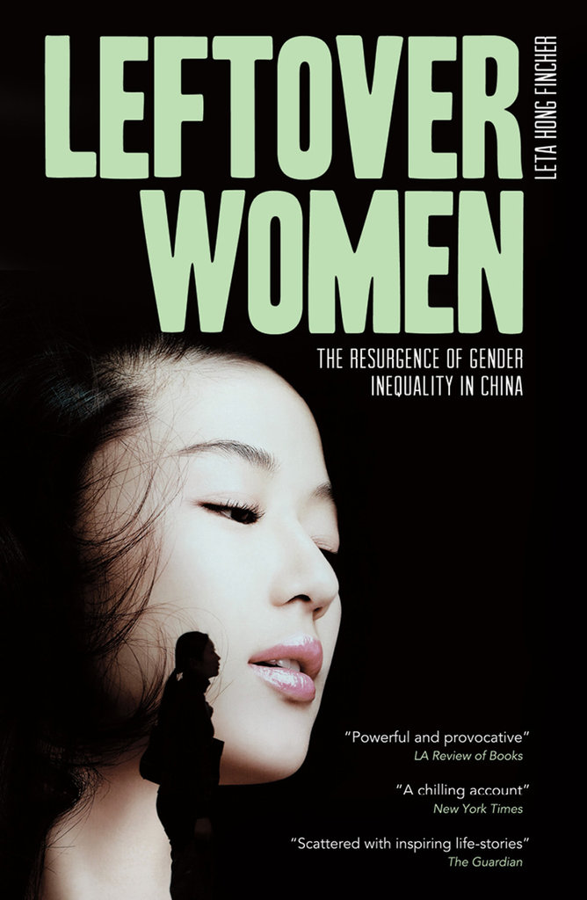

**《剩女：性别不平等在中国的复活》(Leftover Women: The Resurgence of Gender Inequality in China)，洪理达(Leta Hong Fincher)** **/著**

在《剩女》中，洪理达认为，中国女性在25岁左右感受到压力，接受不适宜的婚姻。她认为，性别失衡、单身男人可能造成社会不稳定的潜在可能性，乃至没有安全感的父母的焦虑导致了这一局面，如果她们延迟结婚就会被称为“剩女”。由于父母与配偶的压力，这些女人被系统地剥夺了房子的所有权，必须把不动产记在丈夫名下，就算她们或她们的父母在买房中有很大贡献也是如此。

这里是[本报发表的书评](https://cn.nytimes.com/books/20140528/t28chinabooks/dual/)。

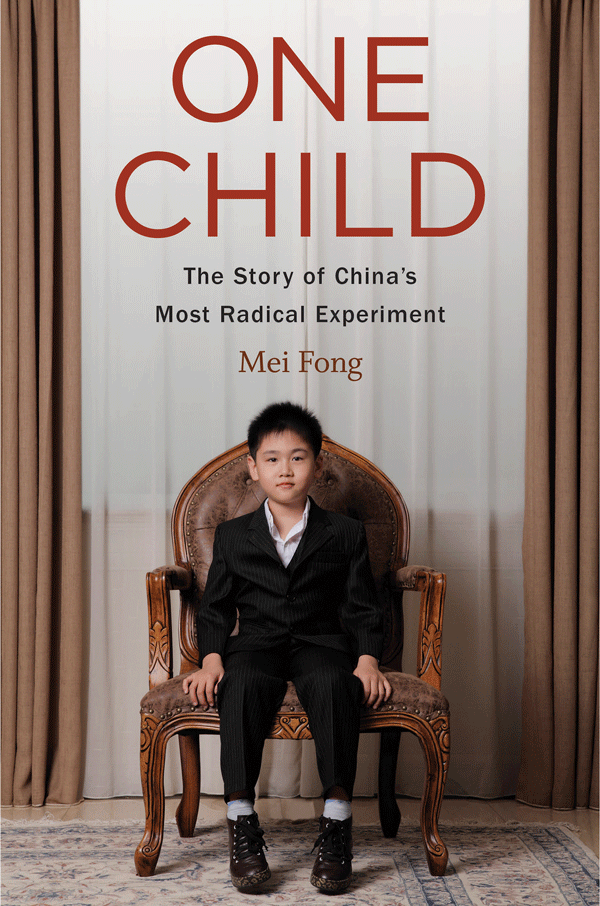

**《独生子女：中国最激进实验的过去与未来》(One Child: The Past and Future of China’s Most Radical Experiment)，方凤美(Mei Fong)/著**  

《独生子女》探讨了“人口控制所带来的后果还将持续在整个中国造成影响”。本书最大的优势在于方凤美的报道。她“采访过梁中堂，后者在20世纪80年代曾经数次徒劳地劝说中国领导人放弃计划生育政策。她也曾采访过收养机构的人，他们被怀疑扣押二胎生育的孩子，并将这些孩子卖给西方人”。她着重强调了地震及其他自然灾害，表明“中国人口政策的悲剧是多么出人意料”。

这里是[本报发表的书评](https://cn.nytimes.com/culture/20160117/t17parker/dual/)。

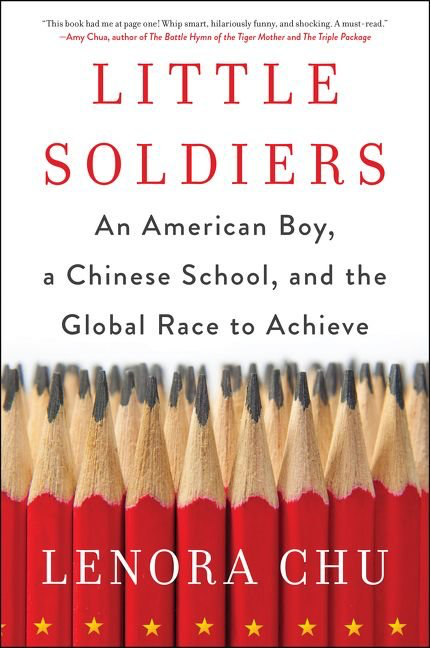

**《小战士 ：一个美国男孩、一所中国学校和一场全球竞赛** **》(LITTLE SOLDIERS) ** **，莱诺拉·朱(Lenora Chu)著**

“中国是一个地域辽阔、矛盾重重的国家，大部分与之有关的具启发性的著作，通常都是集中在某一个话题来一探究竟......教育是一扇特别透明的窗户，这在富有见地的《小战士》中得到了证明。本书在探究中国学校系统的同时，思考了从贿赂到城乡差距的文化困境。中国的学校制度深深根植于古代儒家思想和共产主义信条。”

这里是[本报发表的书评](https://cn.nytimes.com/china/20170825/little-soldiers-lenora-chu/)。

此外，还有其他无数关于中国的好书。例如：张戎(Jung Chang)的《鸿》(Wild Swans)、张彦(Ian Johnson)的《中国的灵魂》(The Souls of China)、马利德(Richard McGregor)的《党》(The Party)、维克拉姆·塞斯(Vikram Seth)的《从天堂湖》(From Heaven Lake)、史景迁(Jonathan Spence)的《毛泽东》(Mao Zedong)、彼得·霍普柯克(Peter Hopkirk)的《世界屋脊的闯入者》(Trespassers on the Roof of the World)。如果有你特别喜爱的书，请在留言中告诉我们。

翻译：纽约时报中文网

[点击查看本文英文版。](https://www.nytimes.com/2018/12/21/books/do-you-want-to-read-more-about-china.html)

---------------------------------------------------

原网址: [访问](https://cn.nytimes.com/culture/20181228/do-you-want-to-read-more-about-china/)

创建于: 2018-12-28 20:12:36

标签: `书评`

