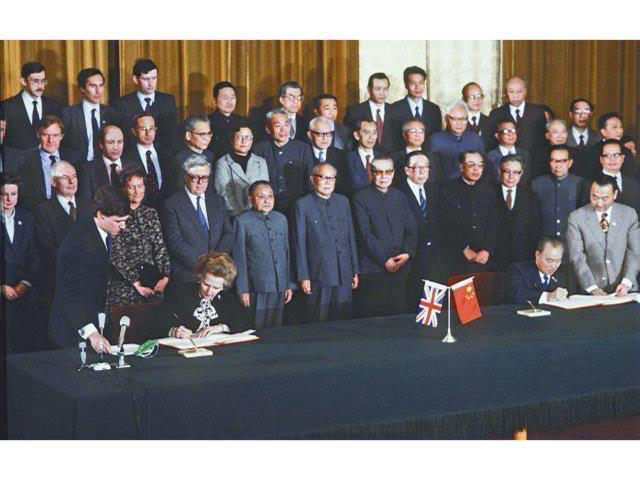

# 協議是為了反口 - 陶傑

2018年12月28日 蘋果日報

美中貿易戰，美國永遠吃不定中國的原因，是根據中國國情，中國人通常不遵守協議。  

連「中英聯合聲明」也可以作廢，變成「歷史性文件，不具有現實意義」，何況簽署的知識產權合同。  

雖然中國傳統裏也有打指模畫押的那種紙頭，但「缺乏契約精神」。中文在本質上不是精確的法理語言，何況還有帝皇意志，高於任何契約。  

在這方面，不是第一天發生的，「西方文明國家」只能怪自己不做功課。  

譬如太平天國內戰，英國軍人戈登來中國，協助清政府李鴻章剿匪。進攻蘇州，統領太平軍守城的，是一個封為「慕王」叫做譚紹光的司令。  

但慕王下還有「四王」和「四將」，不服這個司令領導。戈登與李鴻章指揮清軍，久攻不下，戈登提議另與這八個小鬼洽降，叫他們內應，幹掉譚紹光，戈登與八王將代表在陽澄湖邊密會，折箭為盟，答應投降後一個不殺。  

八個王將聽命起事，殺了慕王而投降。入城之後，李鴻章卻速將八人擒拿斬殺，並虐殺所有太平軍戰俘。上報曾國藩，這位讀孔孟仁義禮智信聖賢書的大臣，回信大讚：殺得好。  

但英國人戈登大怒。他認為協議了的事，不能反悔，這樣令他身為軍人與紳士，信譽全失。戈登提劍怒找李鴻章說理，李鴻章躲了起來。戈登還向北京投訴，要朝廷解除李鴻章之職，「中央」當然不允。  

戈登後來意興闌珊，離開中國，去了非洲蘇丹作戰，死於喀土穆。至於不講信用的李鴻章，後來日清戰爭慘敗，在馬關被伊藤博文索要賠償、割讓台灣，欺負得很慘。馬關條約，戰敗的李鴻章，再也沒有反悔的本錢。太平天國也全部覆沒，沒有一個有好下場。惡人自有惡人磨，森林定律，倒也正常。  

平情而論，在中國國情範圍內，李鴻章真的沒有殺錯。一九四五年蔣介石邀毛澤東去重慶談判，在美國人監督下，保證毛澤東人身安全。就是因為太過遵守「協議精神」，蔣介石才敗失了大陸，幾淪為烏江項羽。  

所以，中西文化的問題，不是契不契約能說得清楚的。中國人在骨子裏的壞，西方打交道了近兩世紀，還不了解，到今天還純情得像一個白雪公主。

[陶傑 
電郵 :](https://hk.lifestyle.appledaily.com/lifestyle/columnist/%E9%99%B6%E5%82%91)[mcwriter@appledaily.com](mailto:mcwriter@appledaily.com)

---------------------------------------------------

原网址: [访问](https://hk.lifestyle.appledaily.com/lifestyle/columnist/%E9%99%B6%E5%82%91/daily/article/20181228/20578120)

创建于: 2018-12-28 18:01:05
