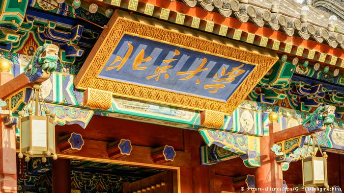

# 北大撤换马克思主义学会会长 学生抗议

德国之声  28.12.2018

北大左派学生在毛泽东诞辰日被警方带走事件继续发酵：校方对邱占萱所领导的马会进行改组，撤换核心成员。多名学生28日在校内举行了抗议。这些学生希望实践的马克思主义，显然不符合习近平对于“马克思主义进校园”的预期。

作为中国的马克思主义发源地之一，北大多年来保持著"马列主义学会"活动的传统

（德国之声中文网）在北京大学马克思主义学会会长邱占萱26日被警方带走、校方宣布改组学会之后，多名北大学生周五在校内举行示威，抗议校方撤换学会会长的决定。从推特上发布的一些未经证实的"现场视频"来看，参与示威的学生紧挨着站立，举着抗议学会改组，"要工农之马会，不要官僚之马会"的标语。

据法新社报道，现场有安保人员介入，试图将抗议学生带离现场，其间有一些人被推倒，还有一些人被安保人员推向路边。有一辆黑色轿车停在路边等候。

截至记者发稿时止，北京大学校方没有回应法新社记者的相关问询。

周四，校方宣布决定对马克思主义学会进行"改组"，撤换了学会核心成员，包括在毛泽东诞辰125周年当日被警方带走的前会长邱占萱。据悉，邱占萱在被带走的次日已经获释返回学校。校方称，邱受到了"公安机关治安管理处罚"。此前，邱占萱和几位马会成员曾经声援深圳佳士工人维权运动。

北大团委学生团体部发布公告称，原马会负责人"严重背离学期初注册时向指导单位、指导教师的承诺，拒不接受指导，拒绝提交马会会员信息，且屡次违规举办活动，已严重失职"。校方召集的32名该会发起人，均为共青团员或中共党员。

中共总书记习近平曾要求重新关注共产主义思想来源，而且还在2018年5月参观过北京大学马克思主义学院，强调坚持"马院姓马，在马言马"的"鲜明导向和办学原则"，"巩固马克思主义在意识形态领域的指导地位"，推动"马克思主义进校园、进课堂、进学生头脑"。

但是，像北大马会这样的学生社团，显然引起了当局的担忧--尤其是在学生尝试着将一些马列理论付诸实践的时候。

今年夏天，多名声援深圳佳士工人维权行动的大学生被警方带走，其中就有北大毕业生岳昕。自8月24日在广东惠州被警方带走后，公众再也没有得到有关她的消息。

雨涵/凝炼（法新社等）

---------------------------------------------------

原网址: [访问](https://www.dw.com/zh/%E5%8C%97%E5%A4%A7%E6%92%A4%E6%8D%A2%E9%A9%AC%E5%85%8B%E6%80%9D%E4%B8%BB%E4%B9%89%E5%AD%A6%E4%BC%9A%E4%BC%9A%E9%95%BF-%E5%AD%A6%E7%94%9F%E6%8A%97%E8%AE%AE/a-46884908)

创建于: 2018-12-29 23:29:41

标签: 举着红旗反红旗
