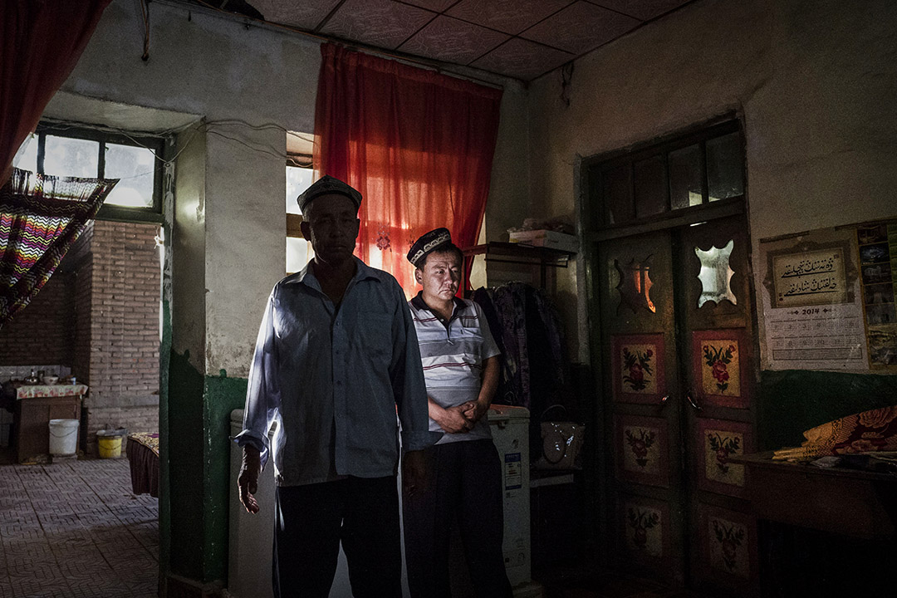
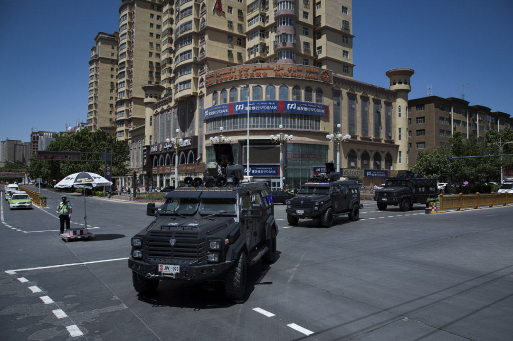
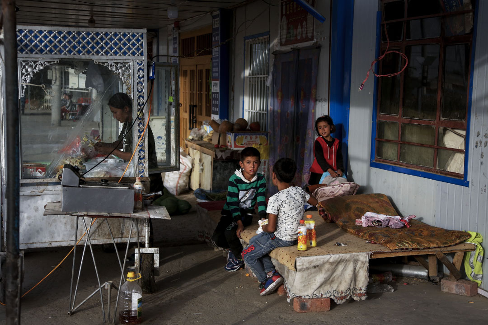
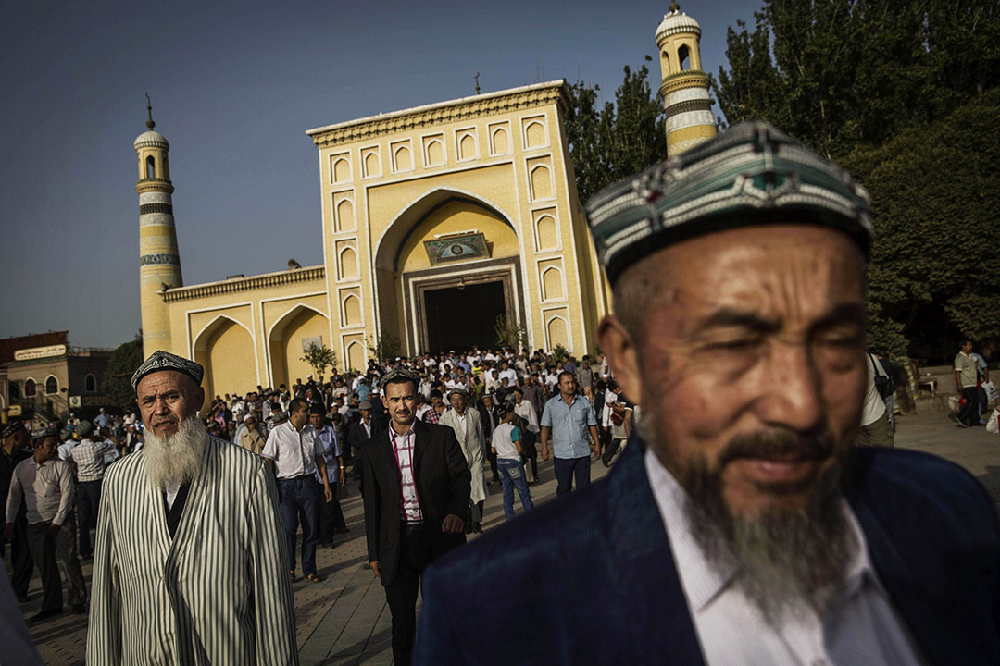
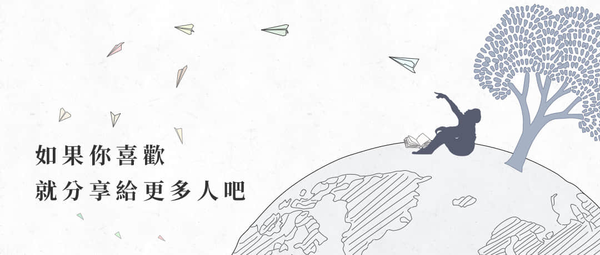

# 讀者來稿：「世界上最幸福的穆斯林」們難以承受的「幸福」

端傳媒  [廣場](https://theinitium.com/channel/notes-and-letters/)讀者來稿

他拜訪了將近200家維吾爾餐廳。在過去的一年半里，一些餐廳倒閉了，一些維吾爾人「不在了」

作者：斌吉恩 (Gene Bunin) 譯者：Dawutjan2018-12-29

* * *

對很多人來說，新疆的局面像是一頭喬裝成老鼠的大象，大家都心照不宣地知道它確實存在，然而卻常常不能明確它到底是什麼。 攝：Kevin Frayer/Getty Images

編按：本文原以英文發表，首發於[The Art of Life in Chinese Central Asia](https://livingotherwise.com/2018/07/31/happiest-muslims-world-coping-happiness/) ，後於衞報發表[精簡版](https://www.theguardian.com/news/2018/aug/07/why-uighur-muslims-across-china-are-living-in-fear)。譯者Dawutjan獲得作者斌吉恩授權向端傳媒投稿 。本文為原文全譯版，僅有幾處微小改動。

**譯者注：本文主旨是敘述作者過去一年半裡，觀察到的生活在新疆及大陸其它地區維吾爾人的言論、觀點和行為。為保護提到的人物，作者模糊處理了相關的人名、地名、時間，及其他一些細節，以免任何當事人的具體身份被指認出來。引語對話是維吾爾語，沒有錄音，因此可能有記憶和翻譯的疏漏。儘管可能導致敘述含糊，但作者認為保留了核心信息，望讀者諒解。**

我第一次走進卡里木 (Karim) 的餐廳大概是一年前。我計劃編撰一本關於中國大陸維吾爾餐廳的指南，這家餐廳是其中一部分。為了編撰指南，我走到了中國 50 多個城市，拜訪了將近 200 家餐廳，而卡里木的餐廳給我留下了尤其好的印象。除了有出色的辣抓飯之外，那裏還很温暖，有種社群的感覺，讓你想愉快地多待一兩個小時。卡里木是個很棒的主人，不同桌的食客也會聊起來，談論重要的熱門話題，但又不失輕快和幽默。

我有一次拜訪時，大家談到了歧視——維吾爾人在這座漢族為主的大城市遭遇的歧視。幾位食客提到的一個主要例子是找住處，當地的賓館常常藉口沒有空房而拒絕維吾爾族住客。一個人笑着說，就連一位維吾爾族警察也被拒絕入住。卡里木見過世面，會講多種語言，常常被當成中東人。他講到，自己有時去酒店會跟前台講英語，前台誤以為他是外國人，就告訴他有空房。但在請他出示證件看到中國身份證上寫的「維吾爾」之後，又會改口。

他坐在我對面，向我講述了在中國的非洲人的故事，這個群體同樣長期抱怨在中國受到歧視、遭遇種族主義。據他說，有一次在地鐵上，[一名黑人被人喊「黑鬼」，之後他抓住出口傷人者打了又打](http://www.xinhuanet.com/legal/2016-07/29/c_129188593.htm)。卡里木稱，這個故事受到了國際媒體報導，之後那座城市涉及歧視的法規也有所加強。接着，他問我有沒有什麼好辦法能聯繫到 BBC 這樣的媒體，好讓維吾爾人在這座城市的處境也能有類似的結果。不過他最後還是權衡，聯繫外國媒體恐怕風險太大了，畢竟可能會遭到政府的報復。

然而後來的事顯示出，這種「温和」的歧視是維吾爾人遭遇的問題裏最微不足道的一個。2017 年春天我和卡里木有上述交談之時，他的家鄉新疆——那裏是超過一千萬維吾爾人的家園——正在遭遇一場突如其來的「全面攻勢」，中國政府宣稱要打擊所謂的恐怖主義和宗教極端勢力。之後的一年裏，鎮壓的種種手段層出不窮：新疆全境變成了一個警察國家，維吾爾人生活的每個方面都受到嚴密監控，可能有一百萬名（編者按：這一數據引自[聯合國反種族歧視委員會報告](https://tbinternet.ohchr.org/Treaties/CERD/Shared%20Documents/CHN/CERD_C_CHN_CO_14-17_32237_E.pdf)維吾爾人被陸續關進集中營、投進監獄，或者「被失蹤」。根據親歷者講述，集中營和監禁中心裡不僅生活條件不健康，而且暴力、拷打、洗腦司空見慣([相關報導](https://apnews.com/6e151296fb194f85ba69a8babd972e4b))。項目招標和招聘信息似乎顯示，新的集中營仍在建設（[相關報導](https://cn.nytimes.com/opinion/20180516/china-re-education-camps/)）。鎮壓手段如此全面，政府還作出很多努力，把生活在新疆以外的維吾爾人召回新疆，許多生活在中國大陸或國外的人被責令返回家鄉([相關報導](https://www.ft.com/content/0ecec4fa-7276-11e7-aca6-c6bd07df1a3c))。經常有海外維吾爾人的父母和親屬遭到羈押，並被當成人質以防不服從（[相關報導](http://www.asianews.it/news-en/Dolkun-Isa:-Beijing-also-persecutes-the-Uyghurs-abroad-43417.html))。

從去年春天開始，許多人失去了很多事。人們喪失了權利，喪失了生計，失去了自己的身份，失去了基本的自由。一些人還失去了自己的生命，就像卡里木。

卡里木屬於一個尤其危險的群體：過去曾合法地在穆斯林佔多數的國家旅行或居住過的維吾爾人。他在三個這樣的國家生活過。有一天，他被戴上手銬抓走，投進了監獄，這是我最近又拜訪那個街區時得知的情形。緊接着我又得知，他「因為長期重體力勞動去世了」。

這至少是政治上妥當的措辭。取決於你的立場，你可能更願意說：他被國家系統性地謀殺了。

又或者，你想要斷然否認這整件事。

畢竟，如果有人試圖就這些問題質問中國政府，政府的反應就是斷然否認。去年夏天，新疆黨委外宣辦副主任艾力提·沙力也夫聲稱[「世界上最幸福的穆斯林生活在新疆」](http://xj.people.com.cn/n2/2017/0825/c186332-30654892.html)。接着，今年稍早中國外交部發言人華春瑩更是表態：「新疆各族人民都能夠安居樂業是有目共睹的」，接着有表示對於維吾爾人遭受不公的關切是「無端指責」，是「干涉中國內政」。西方外交官曾提出討論這個議題，但中國官方回絕了此番邀請。

還是取決於你的立場，你可能會選擇不同的詞語來形容上述表態：正確、偏頗、抵賴扯謊。至於普遍的共識，現在還沒有達成。不過，我想請所有人都承認這一點：幸福這種主觀的事，最好還是讓維吾爾人自己來說。

不幸的是，要聽到他們的聲音十分困難，因為政府悄無聲息但又十分堅決地要把新疆變成信息真空。許多維吾爾人被迫返回新疆，另一些人的親屬則被當成人質，以此防範他們吐露消息，否則就把親戚關押起來（[相關報導](https://www.washingtonpost.com/world/china-detains-relatives-of-us-reporters-in-apparent-punishment-for-xinjiang-coverage/2018/02/27/4e8d84ae-1b8c-11e8-8a2c-1a6665f59e95_story.html))。此外，還有很多舉措直接或間接地讓生活在中國的外國人更難與普通的維吾爾人進行任何對話。記者尤其受到了十分嚴密的關注，哪怕他們能採訪到人，採訪對象也會因為太害怕而不敢正常地、誠實地講話([相關報導](https://www.wsj.com/articles/twelve-days-in-xinjiang-how-chinas-surveillance-state-overwhelms-daily-life-1513700355))。至於前往新疆的外國遊客，今年和我交談過的那些人裏，有很多人告訴我在前往新疆的火車上，以及新疆不同城市之間的檢查站受到過盤問。一個朋友告訴我，去年秋天他走進一戶維吾爾人家裏才幾分鐘，就被帶去了派出所。他形容這件事的用詞讓我記憶猶新：「喝茶四分鐘，警局四小時」。兩位學者告訴我，他們試圖前往之前可以去的村鎮，卻未被獲准入內，甚至可能在出發時都無法登車，並且絲毫沒有理由。一位長期居住在新疆的人被審問了兩個星期之後，被中國徹底禁止入境了。

到 2018 年，就連非正式的閒聊都變成了道德困局。和維吾爾友人多聊了一分鐘，警察就可能來敲門 —— 不是敲你家的門，而是他家的門。一個餐廳老闆曾對我說：「你也該好好注意我們的安全，因為你跟我們聊天以後，說不定會有警察來盤問我們，問我們跟你談的是什麼等等。你不會有事，就是我們會有」。由於擔心自己的安危，許多維吾爾人從（受到嚴密監控的）微信上刪除了大多數（乃至全部）外國朋友和聯繫人。而更安全（編者按：指免受監控）的外國 app 很早以前就不能用了。使用那些 app 需要 VPN，但 VPN 軟件反覆遭到壓制([相關報導](https://cn.nytimes.com/china/20151124/c24chinavpn/))，何況新疆居民的手機裏都被迫安裝了政府的間諜軟件([相關報導](https://chinadigitaltimes.net/2017/07/xinjiang-residents-forced-install-spyware-phones/))。撥打和接聽國外的電話也成了危險的事。

警察詢問外國人有哪些本地的維吾爾朋友或聯繫人，包括姓名和手機號，這在盤查的時候已經成為一種慣例。同樣，對中國官方——特別是出入境的時候，提及「新疆」或「維吾爾」這樣的詞，幾乎可以肯定招致警覺，乃至長達數小時的盤問。在申請中國簽證的表格上寫上這樣的字眼，就有很大的風險導致申請被拒，一個維吾爾導遊告訴我，他帶隊的一些從歐洲去新疆的旅遊團簽證就被拒了。

對我個人來說，官方的舉動到了 4 月底把我趕出喀什的地步。他們首先利用「防火安全」的藉口關閉了我住的那一整家客棧，緊接着在任何其他可能留宿我的地方下令禁止我入住。之後，我在距離新疆 4000 公里的國際商貿樞紐城市義烏，日常與維吾爾人的交談也招致了特別的關注。有兩次，當地警察告誡我要「遵守中國法律」，「不要和什麼新疆壞人打交道」（這是借指維吾爾人）。

儘管受到了警告，但過去一年半里，我絕大部分時間恰恰是和這些「新疆壞人」在一起度過的，其中有三四個月在新疆，別的時間在大陸的維吾爾餐廳。猜想一下，我感覺在這段時間與我交談過的維吾爾人有一千至兩千人之間，他們當中大多數是男性，有在餐館打工的，有店主、商人、小販、街頭小吃攤主（以及他們的家庭成員）。在絕大多數的情況下，我們並不會談政治 —— 那是一個禁忌話題，而且我主要做語言學研究，與政治也沒什麼關係。儘管如此，與我交談過的幾乎每一個人都受到了新疆打壓的嚴重影響，有時候如果不想談這個話題，就無話可談了。許多情況下，尤其是過去幾個月裏，是別人主動找我談這些話題。

我明白，我所概括的所見所聞畢竟無法替維吾爾人講話——這樣的使命還是要留給維吾爾人自己，在一個不再需要恐懼的環境裏。不過，我仍然希望我呈現的情景是有洞察的，儘管並不完美，至少能讓讀者從一個重要的視角，了解維吾爾人在新疆和中國全國是如何應對當前的局面的。

2017年9月6日，新疆喀什市公安局特警大隊組織警力進行街面武裝震懾。圖：Imagine China

## 「我們的心情糟透了」

在新疆一座城市一條街後的一條小巷，有一家我尤其喜愛的餐館，這裏口碑最好的是烤鴿子串和奶茶。只要在這附近，我總想過來坐坐。不過我上次來的時候，心裏有些歉意，因為已經很久沒來光顧了。

「我還以為你肯定回國了呢，」店主驚訝地對我說。

他請我坐下，放下打着二維碼的菜刀（編者按：據報導，新疆部分地區規定居民使用的刀具必須打上二維碼，以進行實名管控），旋即走過來坐在我旁邊。

距離上次碰面已經有十一個月了，中間發生了很多變故。他的大部分員工，總共大概十個人，被迫回到了南疆的家鄉，要麼接受「再教育」，要麼「回鄉關押」，於是他人手不夠，只能依靠朋友和家人的幫助。烤串和奶茶都不見了，客人也不來了，過去熱鬧的餐館突然空空蕩蕩。我一次又一次見到想吃飯的食客走進來問有什麼菜，發覺選項不多後失望而歸。用店主的話形容，維吾爾族幫廚人手現在極端缺乏，幾乎不可能找人接替。

儘管害怕知道答案，我還是問他，他的侄子哪去了，因為以前他常常過來幫忙。他告訴我說，他進監獄了，因為以前在一個中東國家待過一年。

他坦白地對我說，「我們的心情糟透了。」

因為當時已經在喀什待過幾個月，我清楚地知道他是什麼意思，我知道他說的「我們的心情」是指所有維吾爾人，不只是他的家人。畢竟只要長着眼睛，就能看到普遍的抑鬱，新疆比比皆是的電子眼對此熟視無睹。比如，人們會面帶絕望的神情，空洞地看着前方。再比如，人們總體上的倦怠神色。更抽象的，你能在空氣中感受到能把人壓垮的沉重，這種感覺如此令人不安，以至於我作為一個免於受到壓迫的外國人，出門前都會猶豫 —— 因為害怕無法承受這種看不見的力量。警車拉響警笛在街巷裏不停穿梭。過去，我到在喀什的街頭，總會有一個精神不正常的喀什人迎上來跟我握手，有時候褲子拉鍊都是開的。他臉上洋溢着笑，一再問我同樣的問題。不過，就連他都被如今的局面改變了，去年秋天他不再衝過來找我，我經過的時候，他只是靜靜地坐在椅子上。到最後，他完全從街上消失了。

糟糕的情緒從另一個角度也能觀察到，那就是去年我注意到，許多維吾爾商人的口吻變得直白而消極。別人問起近況時發牢騷，或者坦陳自己眼下的麻煩，並不符合維吾爾人的禮儀。妥當的回應是，告訴對方近況還不錯。但當我問起別人「近況如何」時，越來越多的人開始回答「不怎麼樣，生意很糟」。去年我撞見一位當導遊的朋友，我對他說與一年之前見到他時相比，他瘦了很多。

「過去一年我們都瘦了很多！」他說。

我在拜訪大陸一些餐館的時候也感受到過這樣的抑鬱，只是局部一些。有一次，我走進一家簡陋的小飯館，女主人只好起身給我做飯。我在吃飯時，她問我是不是記者。我說不是，但她還是跟我講了自己家的故事。她說，就在幾個月前，他們還是那座城市若干家維吾爾餐廳的老闆，生意都很紅火。但現在，大多數員工被迫返回新疆，他們自己的生活也淪落到了這步田地。她、她丈夫、他們的孩子得以留下來，是因為當地警察擔保他們「可以信任」。

餐廳內破敗的陳設、下雨的天氣，以及她語氣裏的頹唐，都讓這段故事尤其難以忘懷，但這樣的情節遠遠稱不上出奇。我在大陸相熟的兩百家左右的餐廳裏，過去一年裏至少有六分之一關門大吉，原因要麼是缺少員工，要麼是缺少客人，要麼二者兼有。

## 「現在，我連你也不認識了。」

一方面是難以承受的抑鬱，另一方面是難以承受的恐懼。後者並不意外，因為抓捕、關押常常是盲目的，有名額的要求([相關報導](https://www.rfa.org/english/news/uyghur/camps-10092017164000.html)) ，而且完全沒有法律保護，不允許律師對新疆關押的人員做無罪辯護([相關報導](https://chinadigitaltimes.net/chinese/2017/12/%E6%B4%AA%E6%B5%81%E6%B3%95%E7%9C%BC-%E8%BF%99%E9%87%8C%E6%98%AF%E6%96%B0%E7%96%86/))。我親眼目睹過這個體系的運轉，可以親身證實它迅速而殘暴。

最難忘記的一次是在喀什，我夜裏正往家走。迎面走來了一個維吾爾族三口之家，中年的丈夫和妻子，以及他們二十多歲的兒子。父親喝醉了揮舞着胳膊，妻子和兒子則攙扶着他。一輛警車在街道的盡頭冒出來，妻子告訴他不要亂動，但他不肯聽。於是這輛麪包車停下來，五六個警察跳下來，沒有問任何問題也沒有索要證件，就把男人抓到車裏，而且把妻子也帶走了。他的兒子則留在街邊。整個過程不超過兩分鐘。

在大陸，我目睹了同樣卑劣的情形，只是更加隱蔽。在餐館工作的小夥子，前一天似乎還很輕鬆地如常生活，第二天就突然明顯地開始焦慮，因為他們收到了警察的命令，要立即返回新疆的老家（對大多數人來說，這意味着三、四天的火車旅途）。一次，一位廚師讓我出主意，接下來應該去哪家餐廳打工 —— 他兩個月前拿到了離開新疆的許可，但最後沒有在任何一家餐廳落腳。他聽了我的建議，決定第二天就買張火車票，前往一座沿海城市。然而，僅僅三個小時之後，他就又一次發消息告訴我，老家的警察打電話了。因為他還沒找到穩定的工作，他們想讓他儘快回去「重新辦許可」。於是，他第二天上的火車，目的地變成了新疆。

像他這樣沒有錢、沒有關係的人，只得聽任體制的擺布。然而時間告訴我們，就連最富有、最著名的那些([相關報導](https://www.rfa.org/english/news/uyghur/wealthiest-01052018144327.html))，都無法保證萬全。就連一些我拜訪過的相對成功的餐廳，都被迫打點行裝，無限期地返回新疆。

有些地方，還有一批類似秘密警察的人物在活動。我住在義烏的時候，有次在和一個維吾爾朋友閒談時，一名警察走過，這名警察也是維族。於是我們暫時停下，等他走後才繼續聊。之後，我的朋友告訴我：

「那種穿制服的警察其實沒關係，他們並不逮捕人。要小心的是那些便衣警察，有維族也有漢族，他們每個月從杭州下來一次。就在上個月，有幾十個維族人就被他們逮捕了。」

有一種恐懼倒很好笑，只是又太可悲了，那就是對宗教名字的恐懼。在新疆，一個朋友竟然改了名字，因為裏面有「哈吉」(Hajim)（編注：粵語譯為「哈哲」，伊斯蘭教稱謂，意為朝覲者 ） 這個詞 —— 之前政府只是禁止新生兒取宗教色彩太強的名字，後來又將這一禁令延伸到了16歲以下的人([相關報導](https://www.rfa.org/english/news/uyghur/ban-06012017165249.html))。另一次，一個店主拿起我在讀的一本維語書，隨便翻到一頁就發現了「哈吉」這個詞，然後她低聲告訴我，有的人因為書裏有這個詞，會被關五到十年。

在微信上大量刪除外國好友和聯繫人的做法，就是在網絡上體現了這種恐懼。一個朋友宣稱刪除了超過400人。另一個則把我加了又刪、刪了又加，之後打定主意徹底刪掉我，還退出了我們共同的聊天群。在海外生活或求學的維吾爾人稱，新疆的維吾爾友人和親屬把他們刪掉了。這樣的局面 —— 再加上打電話的危險 —— 實質上讓人們無法在恐怖的時期相互支撐。

去年在新疆的時候，我試圖見一個朋友。他把我刪掉了，但我確實得去見他。通過一層層的人脈，我約定了時間地點，於是才見到。回過頭看，我幾乎希望當時沒見面。我們一同吃的那頓午飯異常安靜、異常尷尬 —— 要說的事情很多，但似乎每件事都是禁忌，有時候一連幾分鐘我們就靜靜坐着。好像也並沒有人監視我們，但我的朋友仍舊覺得相當擔心。我把自己正在寫的書的樣張遞給他，他只是瞟了一眼，並沒有拿起來翻閲。我問他我們一個共同的朋友是不是還在這裏。他告訴我，他已經「不認識」那個人了。緊接着他又說：

「現在，我連你也不認識了。」

言談間的某些時刻，我感覺他幾欲落淚。老實講，我也是。

在南疆，一個朋友把我拉進他的商店裏，非常簡短地告訴我，他跟外國人說話已經不安全了。在之後的幾個星期裏，我們就只能通過肢體語言相互問候，接下來是用眼神接觸，再接下來就是徹底忽視對方了。

對一些人來說，恐懼似乎如此深入，以至於都有了套路化的反應。有一次我隨口問一個維吾爾小女孩（她是中國中部一家小餐廳老闆的女兒），她爸爸在哪裏，待會兒會不會來餐廳。我驚訝地聽到她說：

「我們只是來這裏老老實實做生意的。我們不是來做壞事的。」

一次，我坐下跟中國東部一家餐廳的經理聊天。因為無法避開這個話題，我就跟他分享了新疆的壓迫情形已經到了多麼嚴重。我具體轉述了這樣一件事，一個朋友被判刑十年，罪名顯然是擁有「錯誤的」書籍。我一提「監獄」這個詞，他的表情就開始怪異地抽搐，往我們背後那一桌的方向使眼色。

「有警察在！」他低聲說。說罷站起身來走開了。

在另一個場合，我與餐廳的員工還算直率地談論了新疆的局面，不過還是被叮囑，說話要小心。用他們的話講就是「隔牆有耳」。

有時候這樣的恐懼相當明顯。我至今還會想起那個放鬆、自信的玉石商人，他有一次過來問我最近有沒有見過一個共同的朋友，當時他臉上有着異乎尋常的焦慮。他告訴我，已經有大概兩天沒見到那人了，擔心會不會是出了事。幸運的是，那是絕少的一次沒出什麼事的情形，那個熟人還在，我們不久以後就見到了他。

2018年9月20日，新疆和田。攝：Andy Wong/ AP via Imagine China

## 「那你知道我們民族都在經歷什麼嗎？」

對很多人來說，新疆的局面像是一頭喬裝成老鼠的大象，大家都心照不宣地知道它確實存在，然而卻常常不能明確它到底是什麼。如果不可避免地要談到它，比如假如有人不明就裏地問起某個被送回新疆、送進集中營、送進監獄的人，慣常的做法是使用委婉語。

最最常用的詞是 yoq，在這裏或許可以譯為「走了」或者「不在了」。在過去的一年裏，adem yoq（「人都不在了」）可能是我聽到最多的一句話，其中指的人有員工、顧客，或者泛泛談到的人群。談到被迫返回家鄉（下場是回鄉被捕、關進集中營甚至更糟）的人時，典型的說法是「回老家了」。更具體地，在大陸的人會說他們「回新疆了」，而北疆的人則可能會說他們「回喀什了」。

「你懂我的意思嗎？」我試圖打聽某人究竟發生什麼的時候，我的一個朋友這樣問我。「那哥們『不在了』(yoq)，他現在有了別的『家』。」

在談到集中營的時候，自然不會說「集中營」。要談論身陷其中的人，人們會說「在學習」(oqushta/öginishte)、「在受教育」(terbiyileshte)，有時候也可能會說「在學校」(mektepte)。我有一次還聽到，一個年紀不小的人形容他的朋友「在上大學」(dashöde)，不過旁人沒有聽明白，因為這個委婉語不是十分「標準」。

相似的，如果談論新疆總體的局面，人們不會用「壓迫」這樣的詞語。而是傾向於說「weziyet yaxshi emes」（「情況不好」），或者形容新疆的情況很「ching」（「緊、嚴苛」）。

但毫無疑問，這個話題普遍存在於維吾爾人的頭腦裏。一次我去一家餐館的時候，一提我在新疆待過，兼職做服務員的女生就問我：

「那你知道我們民族都在經歷什麼嗎？」

另一次，一個餐館員工坐着和其他員工聊天時開玩笑說這整件事有多荒唐。他列舉了大約十個被帶走的家庭成員和親戚之後，總結道：

「我家就只剩下我一個了！」

在一家餐館裏，一名廚師唐突地跟我說南疆「都沒人了 (adem yoq)」。另一家餐館裏，老闆痛心地說，員工都沒了，他花大錢開的新店也活不下去了。另一家餐館裏，經理問我去過的維吾爾餐廳裏有多少還開着。

在和一個住在大陸的老朋友聊天時，我很努力地迴避政治，只談更「正常」、更世俗的話題，結果根本做不到。這時我才真切地感覺到，這個問題有多麼普遍。我問他，那天他都做了什麼。他說去參加了一場政治會議，那座城市的所有維吾爾人都必須參加。我問他業餘時間還會盡量讀書嗎，他回答說大陸的警察也開始打擊了，讀任何一本書，都會招致官方的懷疑和不必要的警覺。我問他未來有什麼打算，他告訴我理想的話，希望成為一個像樣的土耳其菜廚師，開一家自己的土耳其餐廳，但很不幸這件事就足夠讓他在新疆進監獄了，因為國家一直在壓制和摧毀維吾爾人與海外其他突厥、穆斯林民族的所有聯繫。

但就算是他，也不準備直接批評當前發生的局面。

另一個做廚師的朋友對我說，「我們談起來的時候，就會說所有的事都很好。」一週後，他也「yoq」了，「回老家去了」。

「如果你看警察，他就問你看什麼看，要是看地板，就問你為什麼盯着地板。」

有幾次，我遇到的人因為種種原因似乎到了相當絕望的境地，什麼話都敢說。在這些情況下，就沒什麼自我審查了。

這種事情的第一個例子是去年秋天在喀什，一名穿着制服的保安在茶館裏請我坐到他對面。保安這個工作主要是維吾爾族在做，是南疆城鎮穿制服的底層執法人員([相關報導](https://www.economist.com/briefing/2018/05/31/china-has-turned-xinjiang-into-a-police-state-like-no-other))。他那天下午不上班，剛做完上面鼓勵職員做的體檢回來([相關報導](https://www.theguardian.com/world/2017/dec/13/chinese-authorities-collecting-dna-residents-xinjiang))
。

接下來的交談有些緊張。他問我對維吾爾的歷史有什麼了解，之後又問我對維吾爾民族有什麼看法。我在新疆的這些年裏，後面這個問題被人問起過若干次，我常常感覺這是一種從外界來印證維吾爾身份的方式。數年前一個具體的事件，一個年輕人問完我這個問題之後，又接着問：「我們是一個壞民族嗎？我們是被壓迫的民族嗎？」老實講，我從來都不願意回答這個問題，因為我根本不知道該怎麼回答，而且一直都覺得這個問題充滿了政治涵義。所以這個保安問完之後，我就用慣常的方式回答說：「維吾爾族就像任何一個民族一樣，有好的地方也有壞的地方。」

不過，他不打算讓我用這樣一個搪塞的答案脱身。

「你在掩飾真實的想法。」他質問我。「你就看看你周圍。你都親眼見到了，我們這個民族被毀掉了。」

鑑於我對中國穿制服的人有種普遍的不信任，不管他是維吾爾族、漢族還是其他 54 個民族，我並不準備開誠布公地講出任何政治觀點，因為他可能會彙報給上級。（想來想去，我後來意識到那是一種真實的絕望，願意相信他的話是真心的。）幾天之後他就不見了，在他距離喀什夜市不遠的崗哨那裏，我再也見不到他了。

另一個我頭腦裏永遠無法忘記的情景發生在大陸，我來到一家之前來過幾次的餐館。除了一個服務員之外，幾乎所有其他的老員工都不見了。他一見到我，就放下手上的事，坐到我對面攀談。中間我提到我被趕出了喀什。這彷彿刺激到了他，於是他講了很多那裏的局面，幾乎每一句話都是禁忌。

他告訴我「幾百萬維吾爾人」被關進了集中營，餵他們吃的都是十五年的剩大米，他們受到了怎樣的毒打。（儘管關於大米的話未能證實，親歷者的證詞的確印證了營養狀況糟糕、集中營裏暴行纍纍。）他告訴我，住在這座大陸城市的維吾爾人現在要參加政治會議，他們很快就必須要參加一場關於中共十九大這種事情的考試，考試不及格的就會被送回新疆。中國這個國家曾經弱小過，他說，但現在更強大了，正在對維吾爾人發動全面攻勢。我對他提起，美國可能會用《全球馬格尼茨基法案》(Global Magnitsky Act) 對中國採取措施([相關報導](https://www.apnews.com/13ee0b95c05249a8be7c0467bf413b6e))，他說他不指望美國人幫維吾爾人，因為美國只做「有利於美國」的事情。奧巴馬政府在這方面已經讓他失望了。他還聊了很久當地政府機關對維吾爾人的森嚴防範，還會用他們能想到的任何藉口逮捕或判刑。
 他指着一個極有可能拍到了我們的攝像頭問：「你看見那裏的攝像頭了嗎？外國人在這裏租房的話，允許租不帶攝像頭監控的房子。維族人租房的時候，就必須在有攝像頭的樓裏。警察一跟我們說話，就懷疑各種事情：『你抽煙嗎、你喝酒嗎？』如果不抽煙不喝酒，他們就問為什麼不抽不喝。他們還會問你做禮拜嗎。他們會問你想不想出國，問你以前有沒有申請過護照、有沒有護照。如果你看警察，他就問你看什麼看，要是看地板，就問你為什麼盯着地板。每次我們坐火車的時候，要進站就必須過一個單獨的小屋，他們在那裏檢查證件、盤問我們。」

有些巧合的是，在那之後一名見習警察不經意間對我證實了確實存在這樣的天羅地網。那次因為我沒有把護照揣在身上，儘管當時我就在酒店門外，還是被帶到了當地的派出所。在閒談間，我提到喜歡到穆斯林餐廳吃飯。那個見習警察不知道我在新疆住過，接着說道：

「我們中國也有穆斯林，從新疆來的。他們在這裏的時候，我們就要非常非常嚴密地監控。」

我的服務員朋友還告訴我，維吾爾人當中也相互不信任，就連這家餐廳的員工之間都不行。我猜想，這是因為拘禁是隨意的，而且好像針對一家家的餐廳也是有指標的，不久以後，至少一定比例的維吾爾族員工註定要離開。

在基本空着的屋內兩人坐一桌，如此公開地與我交談，讓我有點替他擔心。不過我感覺他完全理解這些風險，又或者他認為自己反正很快就要被帶走了。我還猜想，一千人裏也只有我這樣一個能真的和他聊這些。漢人肯定不可能，維吾爾人和其他少數民族難以信任，其他外國人根本不知道新疆發生的事情，甚至連維吾爾人是誰都不知道。 一週之後，又來了一輪打壓。那座城市的維吾爾年輕人裏有很多都受到衝擊，被迫離開的人裏就有他。「回老家了。」

## 「現在人們感覺真的安全了」

還有第三段對話讓我感受到了對方的絕望。他是著名的老闆、經理、導演，有着傑出的履歷。他最近開了一家餐廳，但現在只能與妻子共同經營，其餘的員工都回到了新疆。跟他聊天時，能感覺到他已經垮了。

我向他問候，又問他近況。他說：「人都沒了，都進監獄了。」

然而我們坦率的交談有了一個諷刺的轉折。他最後說，這些政策歸根結底是有益的。他告訴我，現在被關押的維吾爾人在現代中國會更成功，因為經過「教育轉化」之後，就有了新技能，漢語水平也會提高。他說，維吾爾人傳統上教育程度不太高。

準確地說，確實有人對當前的局面說好話。我偶爾會遇到對這些政策有正面評價的人。儘管我的主觀判斷未必等同於事實，我還是指出，絕大多數這種說辭像是認知失調、斯德哥爾摩症候群和自欺欺人的綜合體，證據就是那些話往往前後矛盾，講話者也並不是那麼篤定。

我還在體會新疆的新現實，艱難地讓自己接受的時候，一次與在新疆從事旅遊業的朋友敘舊，讓我受到了最嚴重的衝擊。聊了片刻，我談到全城各處布置的安全設施十分緊密，我想表達的是這樣做太過分了。他對新體系也有些抱怨，說自己騎着電動車走兩、三公里，就被攔下來檢查了七次身份證，而且每次檢查他的時間都更長，因為他的身份證上寫着他是外地來的。不過，他很快就補充說：

「但現在人們感覺真的安全了。以前讓女兒自己去上學我會擔心，現在我就不用擔心了。」

這些話幾乎像是準備好的，我聽到後感到很驚訝。他接着說道，這都是為了保護人民不要遭受恐怖襲擊，只要俄羅斯和美國趕快把 ISIS 打敗，一切都會變好的。不過，我對他講了自己的觀點，這樣的武力沒辦法擊敗恐怖主義之後，他也很快就表示同意。 在一些場合，我也見到過熱烈擁護中國執政黨的情形，而且可能是真心的。我在東北去過的一家餐廳裏，老闆問我是不是讀過習近平的書（談治國理政）。他在手機上讀到的一則新聞說，這本書風靡全世界。我反駁說，並沒有。接着他把那篇維語的新聞報導展示給我看，文章中間的圖片顯示一名白人男子在書店裏瞅着這本書。對他來說，這就足以證明了，不過我堅持說這個新聞來源不可信。我這種「不受歡迎」的觀點似乎與他、他的太太，以及餐館的一些員工相左，我與他們道別時有些尷尬。在這以前，同一位老闆還抱怨過，在當前的局面下，投資大型維吾爾餐廳風險太大了，但他還是會翹起大拇指告訴我，他認為習近平的治理「是這樣的！」

在另一座城市的另一家餐廳，另一個朋友對我抱怨，當地警察在檢查維吾爾人時恣意妄為。我還記得他當時越講越生氣，說一些警察的舉動彷彿他們就是法律本人。但最後他還是補充說，政府的上層是好的。

有一次，新疆一位年邁的店主熱切地稱讚他不用太擔心晚上保管貨品了——因為到處都是攝像頭，「都沒有賊了」。接着我們就談到他的兒子，後者現在住在大陸其它地方。我告訴他，兒子在大陸其它地方而不在新疆是件好事，老人讚許地笑了。

「是啊，你很了解。」他說，「他確實應該待在那裏。」

去年秋天我在新疆與一位四處出差的商人交談過，他那時似乎不理解我為什麼要問他加我微信是不是安全。我悄悄地用委婉語告訴他：「現在情況不好」(weziyet yaxshi emes)。他搖頭說，沒怎麼聽說過那種事情。當時聽到這樣的話，很罕見也很讓人困惑。然而今年我又見到他時，他告訴我已經不去南疆出差了，因為很多城鎮都空了 (adem yoq)，也沒生意可做。他說會在新疆北部碰碰運氣。

我仍然記得一個有點好笑的例子。一個玉石販子在大陸的一家餐館裏與其他維吾爾人談論新疆的政策有多「嚴」。他大體上贊同這些政策，但是又評價說：「或許有一點點過頭了。」

中共十九大的時候網上發生的一些事情算不上好笑，而是很悲哀。我那些基本不會說多少漢語的維吾爾朋友，突然開始用流利的漢語長篇大論地讚美習近平、讚美大會。幾個月後，我還聽說有一個微信小程序讓你很方便地「發聲亮劍」，幫你把名字放進預先準備好的漢語或維語聲明裏，承諾忠於共產黨及其領導人，承諾擁護社會主義核心價值觀，並表達許多立場，諸如堅決擁護「民族團結」、反對極端主義。接着，就可以讓用戶把生成的圖片很方便地發到喜歡的社交網絡上，以此表忠心。

我在大陸拜訪過的很多餐廳裏，這種忠誠在視覺上比在語言上明顯得多。在一整條街上，只有維吾爾餐廳門前會飄揚着一面面五星紅旗，偶爾還會懸掛堅決反恐的紅色橫幅。有時，餐廳內飾也有小旗子，還有習近平的照片（常常是習近平坐在傳統維吾爾民宅的照片），畫着習近平像的紀念盤，宣揚「民族團結」的標語，比如呼籲中國各民族「像石榴籽一樣緊緊抱在一起」。一些餐廳裏甚至還在前台擺着關於習近平和黨的維語書。

我從來沒有問過這樣的擺設是自願的還是法律要求的。但我懷疑，就像中國言論審查的總體情形，這兩種因素都有（有些是自發揣測的，另一些是被迫的）。至少有一樁個案，一個在餐廳工作的朋友告訴我這只是為了安撫，他似乎把這當成「無所謂」的形式主義。在另一個餐館裏，店主告訴我警察要求他們賣酒（編者按：伊斯蘭教禁酒），反正他的客人們本來也以漢族為主，對此他似乎有一種「（保守到不喝酒的人）不來才好呢」的心態。他說，漢族客人賴的時間短、花錢多，不像一些維吾爾族食客那麼麻煩，有些說不定是小偷或罪犯呢。

在中國大陸的各個大城市，清理本地維吾爾族罪犯的景象通常是政策的「正外部性」，與我交談的人偶爾會給予讚揚。然而我還是不禁覺得，這種稱讚從來不是不偏不倚的評價，而是講話的人試圖把自己與「那家飯館裏的維族壞人」，或者「住在那片兒的壞維族壞人」區別開，他們不想與後者聯繫起來。儘管許多老實人會被這樣以偏概全地籠統判斷，但這也只是第二位的。

像是一場巨型的「囚徒困境」博弈，恭順和逢迎似乎讓一些人免於陷入集中營或監獄，儘管這可能會讓不那麼恭順的同胞付出代價。攝：Kevin Frayer/Getty Images

## 「穆斯林世界的一場考驗」

像是一場巨型的「囚徒困境」博弈，恭順和逢迎似乎讓一些人免於陷入集中營或監獄，儘管這可能會讓不那麼恭順的同胞付出代價。有錢、有關係、有漢族配偶、受過正規的漢語教育似乎也有幫助，但這些都無法保證。最後，通過賄賂警察和官員也可以避免護照被收繳、避免被送回家鄉，若干個與我交流過的人就用過這樣的辦法。在常常讓人感覺無助、無法逃脱的體制下，這彷彿是一條口子。

不過對大多數人而言，監禁和對監禁的恐懼已經成了日常生活中無法避免的事實，必須要想些辦法才能捱過去。受到影響的人們承受着匪夷所思的恐懼，但仍要繼續尋找某種正常的生活。

在我看來，多數人的應對方式就是強忍着「往前走」。儘管親戚不見了、蒙受了經濟損失，也害怕有朝一日自己也會進去，我的許多朋友和熟人都盡其所能，把精力傾注在如何維持生計上，然後繼續努力維生。把痛苦埋在心裏，繼續切蘿蔔、做生意、賣東西。對很多人來說，現在最重要的事情似乎是孩子的未來。

對於沒有孩子的人，可能有簡單、實際的個人目標。比如，一個知識分子朋友希望能繼續做這份工作，慢慢賺夠錢買套公寓。他告訴我，最近他也有了繞着城市長途散步的習慣。

一位年輕些的大學生朋友有個表兄弟進了監獄。他有次坐下來跟我聊天，告訴我他是班上唯一的維吾爾族，其他同學都是漢族。

「我有時候會把維吾爾民間傳說和神話翻譯成漢語，分享給同學們。」他對我講，「他們好像蠻喜歡的。」

對他來說，現在的目標是找到實習，完成學業，之後再盼着找份工作。

有一個朋友尤其令人難忘。他在大陸經營着一家小店，當地警察最近沒收了整整幾個貨架的進口商品，理由是「沒有漢語標示」。他對我說，當時告訴警察自己身體不舒服要關門了，否則還會沒收更多東西。現在貨架空了一半，生意也急轉直下，他感覺過不了多久就要關店了。雖然他觀察到政策開始無差別地針對維吾爾族年輕男性，但是他說自己並不害怕，儘管他自己就很年輕。

「我人生中已經經歷過太多了，」他告訴我。「所以如果他們要來抓我……那就抓吧。要發生的總會發生的。這裏的很多維吾爾人太害怕了，都不敢在微信上加外國人。可我不在乎。」

儘管如此，也並不是說他完全絕望了。泛泛地談到當前的局面時，他的視野更寬也更宏大。

「現在是穆斯林世界的一場考驗。你看看敘利亞和其他地方發生的事，穆斯林世界總體上都在經受一場試煉。不過當下發生的每一件事真主都知道，我們只是需要熬過這一段。」

對於維吾爾人來說，做禮拜幾乎被徹底禁止了。於是他告訴我，他想到了折衷的做法，這樣官方就不會注意到了，比如坐在椅子上張開腿暗地裏禱告，或者在人行道旁整齊排列的樹中挑一棵，在樹下禱告。

不過，極少有人會這麼勇敢。對其他人來說，希望之所以存在只是出於必要，而理性則可有可無，是第二位的。與我交流過的維吾爾人當中，許多人提到「事情很快會好起來」，但沒有解釋相信這種說法的任何邏輯基礎。有些人似乎會因為「他們已經被關進去那麼多個月了」，而相信朋友或親人很快就會被放出來。另一些人則認為，「恐怖主義一被擊敗」，局面就會回歸常態。我在大陸那些失去了大量員工的維吾爾餐廳交談時，他們會告訴我，「只要員工們完成學習」，就能回來。

「不然的話，要是我們連維吾爾廚師都沒有，怎麼能開維吾爾餐廳呢？」

然而對這些樂觀的聲音來說，當下的局面相當殘酷。幾個月變成了幾年，而遭到關押的人仍不得脱身，餐廳流失的員工和客戶也越來越多，情況一直是越來越糟。

## 後記：想像這一切都不是真的

有時候，我仍然會想像，這場悲劇只是一場噩夢。去年的某個時候，我告訴自己，我肯定是掉進了「兔子洞」，還沒有找到出口。

我閉上眼睛，感覺自己彷彿又坐到了卡里木的餐廳裏。他們都活着，他們都很開心。卡里木時而在一桌桌客人之間穿梭，問候寒暄，時而走到門前握手迎接剛剛到來的食客。他的太太從餐廳一頭跑到另一頭，讓客人點菜，但上菜的速度卻跟不上點菜。他們的兒子在上幼兒園，女兒在上小學，兩個娃娃幫不上什麼忙，淨是添麻煩。廚師把剛做好的一道菜從廚房的窗戶裏遞出來，用高音喇叭的音量報出菜名。卡里木的女兒終於決定幫把手，於是跑過去端起碗遞給食客，這樣媽媽就不用奔忙了。不過她把菜上錯了桌……

當地的生意人阿不力孜 (Abliz) 問餐廳裏的食客，「你們聽說了嗎？阿卜杜外力 (Abduweli) 今天拿到護照了。他下週就要去申請美國簽證了。」

「早聽說了！」另一桌的生意人麥麥提 (Memet) 說。「我有十個朋友上星期拿回了護照。他們總算放鬆管控了，維吾爾族又能出國了！」

「然後呢？」卡里木開玩笑說。「維吾爾族人當上了國家主席嗎？」

大家放聲大笑。接着，燈光暗下來，我能聽到的就只有哭泣。 
(作者斌吉恩 (Gene Bunin)是獨立學者、活動人士。)

[維吾爾](https://theinitium.com/tags/_215/)[新疆](https://theinitium.com/tags/_214/)

### 評論 14

登入或註冊賬號以評論

*   NoHellToPay1 小時前
    
    房间里的大象。 寂然无声可耻么，战胜自己学会热爱可悲么，一切早已注定。 Syria和Yemen的血仍旧流淌，这边的集中营景象一比较就显得体面文明多了，毕竟armored vehicles都放弃使用了不是，显人进步。
    
*   LonelyCat1 小時前
    
    可是不用暴力那用什么呢？目前这个问题真的无解 未来也看不到解决的希望
    
*   塔森4 小時前
    
    以暴制暴無疑是最糟糕的反恐做法。中國政府如果不是傻或殘酷，就是對自己的能力太過自信。
    
*   十年一梦4 小時前
    
    有点片面！笔者可以更加深入的到内地的一些穆斯林集中的地方与其他民族交流！就可以更加深入的了解原因了！
    
*   Fai4 小時前
    
    反人類罪行了。我不敢想中共的監獄是什麼光景。中共如果哪天倒了，這些事得以攤在陽光下，那才叫好看呢！不知道要多幾個國殤日了。
    
*   青灯长伴4 小時前
    
    如果不这样做，很难想象新疆目前的状况，目前中东isis的暴行可以参考，请那些以自由人权为旗帜而不在大陆生活的同胞不要站着说话不腰疼，那是因为和你的利益无关。
    
*   青灯长伴4 小時前
    
    怎么说呢，应该是少数有暴乱意向的穆斯林的作乱，影响了全国人民对其的恐惧，窃以为不是歧视。大家都要为自己的安全着想，虽然可能绝大部分新疆维吾尔族同胞都是善良的，但其他同胞为了自己安全着想而有时候拒绝维族同胞有什么错误的呢
    
*   愛莉絲5 小時前
    
    中共這樣對付維吾爾族，其他中國老百姓不發聲，悍衛他們的人權，改天中共也會這樣對付你們，那時無人為你們發聲，你們像螻蟻般，隨人踐踏吧！
    
*   Malloy5 小時前
    
    看评论令人心更寒
    
*   147526 小時前
    
    每个黄金周，新疆几乎游客爆满！多的人都看见这头大象，可是呢？
    
*   LonelyCat9 小時前
    
    可是恐怖活动的阴影又如何能消除呢？这个问题现在几乎无解 哎 对这个世界感觉无力
    
*   xiaobingbing85610 小時前
    
    回复kaiwwww。参与恐怖活动的只是穆斯林中的少数人，现在几乎所有穆斯林都被当作犯罪分子或者潜在犯罪分子对待，难道这样就是合理的吗？我也不是穆斯林，但是这样对待任何一个民族都是不合理，不公平的。
    
*   kaiwwww11 小時前
    
    我能看到的就是通篇不提之前的恐怖活动。
    
*   LYanngyu12 小時前
    
    维吾尔，反抗吧！
    

---------------------------------------------------

原网址: [访问](https://theinitium.com/article/20181217-notes-uyghur-xinjiang-china/)

创建于: 2018-12-29 22:29:25

标签: 新疆

