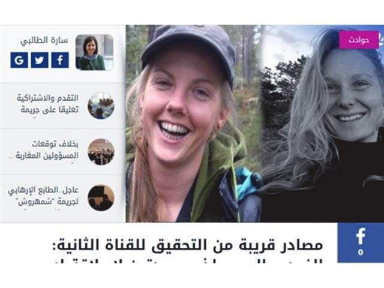

# 闖地獄的兩種人

蘋果日報 2018年12月29日

兩名北歐女大學生遭伊斯蘭男子砍頭殘殺（圖片來源：www.alyaoum24.com）。

兩個北歐女大學生去摩洛哥野外旅行，遭到四名伊斯蘭男子砍頭殘殺。  

二〇一七年七月，美國華盛頓一對年輕夫婦，辭掉工作，去乘腳踏車橫越世界，完成「夢幻單車旅行」（Dream Cycling）。去了非洲和歐洲，最後想跨越中亞。有朋友勸喻：中亞細亞有幾個伊斯蘭國家，要小心恐怖襲擊。  

這對美國年輕夫婦笑容純潔燦爛，答：不是所有伊斯蘭國家的人都是恐怖分子，我要用愛與和平去除偏見。單車一到塔吉克斯坦，即遭恐怖分子殘殺。  

只是去年的事。北歐兩名大愛金髮女生，又去巴巴的送死──對，我當然知道每天在中東，都有許多義工、記者、專家，在最危險的地方做人道工作，西方白人文明，有崇高的價值觀，並非凡俗之貪生怕死，被殘殺者只是少數──但這兩宗不同，是無端的送上去，死於對這個世界的誤解與無知。  

這種征伐的死亡，與哥倫布遠征新大陸或無數探險家攀登額菲爾士𥧌不同。天然的峻險，若經足夠求生訓練，可以挑戰，因為你知道海洋和冰山、森林和極地，「讀者文摘」告訴過你，有巨大的風險，是理性的。  

但這等大愛純情西方年輕人，口袋裏一本Lonely Planet，加上從小在溫暖寬敞的西方家居客廳，看了太多的National Geographic和Discovery， 將整個伊斯蘭世界當做「文化多元」的和平時空、進出自如的遊樂場。這樣的犧牲，與太陽神登月或挑戰者號的意外不同，是對生命的愚昧輕擲和浪費。  

這個世界的宗教仇恨，不是愚盲的大愛能感化的。拒絕和區隔，只是自衛的基本。但若有人規勸：整個中東都不適宜背囊旅行，他會很憤怒，說你偏見歧視。你若解釋：不，當一個國家發生過人肉炸彈，國際社會發出黑色旅遊警告，並不是說這個國家每一個人都是恐怖分子，也不是歧視這個國家的民族，而是勸告：這個國家旅行風險高，若要硬闖，後果自負。  

但這種人會很情緒化地，繼而指責你看了太多的FOX TV洗了腦，覺得你是所謂的右翼。他們堅持美國應該不設關卡，收容洪都拉斯的「難民」。看到有難民兒童死亡，他們熱淚盈眶，指川普是殺人兇手。  

這種人漸漸就會將他們幼稚的意識形態，化為行動，去叩鬼門關。看到這種不知是悲劇還是黑色喜劇的事件，只能說：這是他們自己的選擇，也將只是人類步向劫毀的血海中，翻騰又轉瞬間湮沒的三兩點小小的波瀾。 

[陶傑  
電郵 :](https://hk.lifestyle.appledaily.com/lifestyle/columnist/%E9%99%B6%E5%82%91)[mcwriter@appledaily.com](mailto:mcwriter@appledaily.com)

---------------------------------------------------

原网址: [访问](https://hk.lifestyle.appledaily.com/lifestyle/columnist/%E9%99%B6%E5%82%91/daily/article/20181229/20578994)

创建于: 2018-12-29 23:57:56

标签: 左派幼稚病

