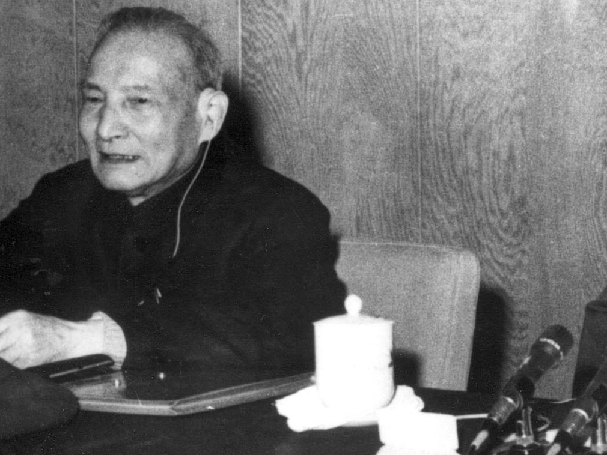

# 鲍彤：陈云险取代邓小平成为一把手-多维新闻网

2018-12-30 10:08:21

原中共中央主席毛泽东去世后，华国锋执掌党政军大权。但是，当时的元老派邓小平与陈云深孚众望，有一定的实力。在改革开放初期的20世纪80年代，中国呈现双峰政治，两人分别是一二把手。中共原总书记赵紫阳秘书鲍彤认为，在中共十一届三中全会上，邓小平险被陈云取代。

陈云出席中共十一届三中全会（图源：VCG）

在1978年12月18日召开的十一届三中全会前，1978年11月10至12月15日，中共中央工作会议在北京召开。时任中共副主席的邓小平访问新加坡、泰国等地，会议由时任中共主席、国务院总理华国锋主持。  

1978年11月12日，陈云在东北组的分组讨论中发言，提出需要解决一些文革遗留的和历史遗留问题，平反一批重大冤假错案。  

法国国际广播电台12月29日援引鲍彤的观点称，陈云的发言改变了会议主题，由“向前看”（发展经济、改革开放）变成“向后看”（平反冤假错案、清算文革）。邓小平彼时正在外访，不知实情。他回来一看，形势已经大变，不知道该怎么收拾。邓小平本来在离开北京的时候，交待写作班子成员胡乔木，告诉他会议主题是向前看，不要向后看，要求胡乔木为他写一份发言。邓小平一回来，胡乔木就把那篇发言稿送给邓小平。  

鲍彤指出，听说邓小平看都没有看，就把文章放在一边，说现在这篇不行了，要重新写。就找了中组部部长胡耀邦，说另外找几个人，重写一篇稿子。后来大概就找了经济学家于光远等人。这就是后来我们看到的文章，而不是不是此前胡乔木起草的稿子，也就是不是邓小平原来意图的内容，基调完全变了，变成了：要发扬民主、没有民主就没有社会主义，变成：要让大家讲话、让大家讲话天不会塌下来……这些名言就是这么出来的。如果邓小平不把主题改了，那么中国的第一号人物就是陈云，而不是邓小平了！

#### 相关阅读

- [【改革开放40年】鲍彤：十一届三中全会不是改开起点](http://news.dwnews.com/china/news/2018-12-30/60108959.html)
- [【改革开放40年】中共元老陈云：被低估的十一届三中全会英雄](http://culture.dwnews.com/history/news/2018-12-24/60107425.html)
- [【改革开放40年】日媒：邓小平提出的特殊关系发生巨变](http://news.dwnews.com/global/news/2018-12-24/60107622.html)

邓小平和陈云都是文革受害者，清算文革平反冤假错案达成一致，但二人对改革开放有分歧。两人势均力敌，互相制衡，谁也推不倒谁。中共一些重大问题，需要两人都同意才行得通。所以，改革开放初期的中共政治力量呈邓陈双峰状态。  

邓小平阵营中有胡耀邦、赵紫阳、万里、胡启立、习仲勋、李昌、周扬、乔石、项南、任仲夷、田纪云以及一大批支持改革的官员。陈云阵营中有李先念、宋任穷、姚依林、宋平、王震、余秋里、胡乔木、邓力群等左派以及中共元老中若干人士。  

曾遭整肃的中国杂志《炎黄春秋》前总编辑徐庆全认为，在整个20世纪80年代，双年反左，单年反右。与之相随的是，邓小平和陈云领衔的双年与单年的格局。1978年中共十一届三中全会召开，1979年坚持四项基本原则出台，1980年提出改革党和国家领导制度，1981年整顿媒体和文艺，1982年中共十二大召开，1983年清除精神污染，1984年通过关于城市经济体制改革的决议，1985年反对资产阶级自由化，1986年中宣部提出“三宽政策”，1987年胡耀邦辞职，1988年物价闯关，1989年六四事件。  

虽然政见分歧严重，但邓小平和陈云一直坚持“斗而不破”。当出现分歧时，要么一方放弃自己的观点，要么彼此求大同存小异。无论哪种情况，他们都把维护中共的团结和改革开放大业作为最高原则。

「版权声明：本文版权归多维新闻网所有，未经授权，不得转载」

撰写：惠风

------

原网址: [访问](http://culture.dwnews.com/history/news/2018-12-30/60108961.html)

创建于: 2018-12-30 10:47:31