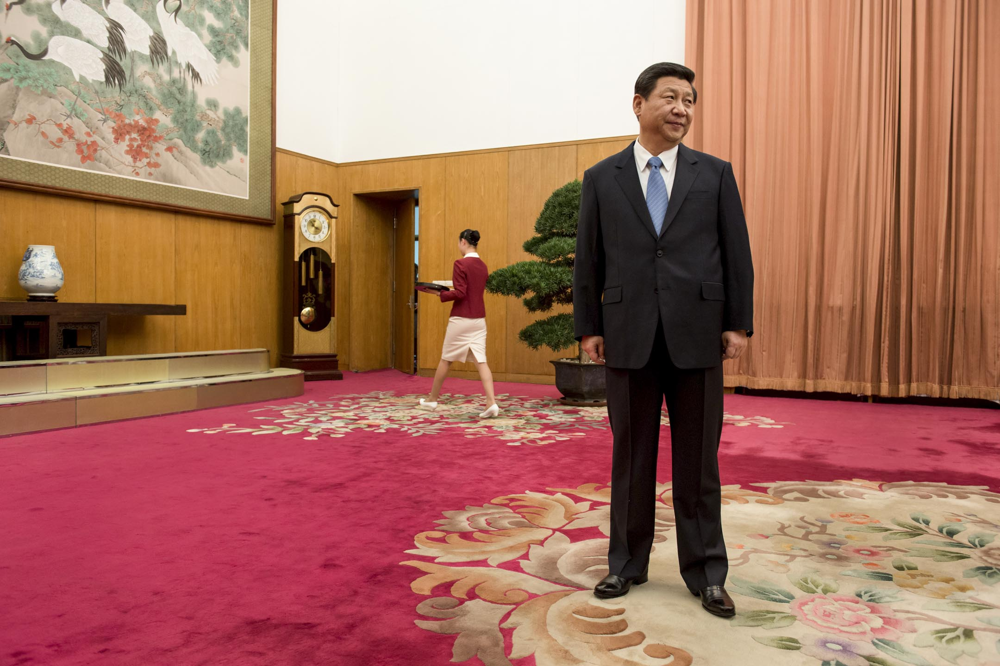

# 《端》2018年回顧：最受端會員關注的新聞 - 端傳媒

[深度](https://theinitium.com/channel/feature/)2018年度回顧

端傳媒盤點過去一年獲得最多會員閱讀的文章，解析來自不同地區的會員關注的議題，讓有力的筆觸免於「時效」的羈絆。

端傳媒2018-12-30

------

中央決定設立河北雄安新區的消息，仿如一個巨大的天幕罩住了雄安新區。禁錮在幕下的人們，只能看着天幕繪出五彩未來，但沒有人知道，未來什麼時候來、會以怎樣的姿態來，他們能做的唯有等待。攝：林振東/端傳媒

激盪的2018年，在端留有回聲。修憲、台灣選舉等重大新聞引起熱議，而言論自由受限、食品安全相關新聞持續發生。過去一年，正是在這樣的「變幻」與「循環」中跌宕，人們也在「習以為常」與「保持警醒」中不斷切換。

端傳媒自2017年7月推出會員制，獲得了來自中國大陸、香港、台灣及海外各地區的華文讀者的支持。會員們有著更為深度、規律的閲讀習慣，我們根據會員所在地進行區分，得到了2018年最受端會員關注的新聞榜單，藉此我們跳出新聞熱度，還原不同會員所關心的世界。

以前去新聞現場，都是過2、3天會收到禁令；後來在去現場的路上就會收到禁令，但還是會去把採訪做了，萬一之後還能發出來；但是現在根本不會去現場了，因為絕不可能有機會發出來。圖為2015年8月，天津大爆炸現場。攝：VCG/VCG via Getty Images

## 過去一年，這7篇文章在不同地區的會員中都備受矚目

我們發現中國修憲、台灣選舉、言論自由等議題的文章不止在事件發生地激起浪花，也在不同地區間得到較多關注。中港台及海外會員共有的警惕與關注，在這裏逐漸成形。

**全面審查時代：中國媒體人正在經歷什麼？** [點擊閲讀](https://theinitium.com/article/20180910-mainland-censorship-journalist-in-china/)

這是一篇中國當代新聞傳媒從業人員的口述史，在全面審查時代下，他們無一例外地經歷了越來越不自由的從業狀態。

高雄市國民黨候選人韓國瑜，晚上宣布當選高雄市長，終結民進黨在高雄20年的執政。攝：Stanley Leung/端傳媒

**自邊陲出發的奇襲：韓國瑜如何從「林園」走上高雄市長大位** [點擊閲讀](https://theinitium.com/article/20181124-taiwan-han-kuo-yu-kaohsiung/)

在外地人的驚訝與不解中，韓國瑜將成為下屆高雄市長。關於韓國瑜的討論眾多，但你是否想過，造出韓國瑜的「高雄」是怎樣的地方？

**孟晚舟獲釋，你關心的十個法律問題都在這裏** [點擊閲讀](https://theinitium.com/article/20181209-mainland-huawei-mengwanzhou/)

保釋過程可能持續數年，將不可避免地加入政治的考量，同意引渡對孟來說也並不是完全不值得考慮。

中共中央委員會提議，刪除憲法第七十九條第三款中對國家主席、副主席「連續任職不得超過兩屆」的規定，外間普遍反應是修憲為中國最高領導人習近平繼續執掌黨、政、軍大權鋪路。攝：Ed Jones-Pool/Getty Images

**除了取消任期限制，習氏修憲還將帶來哪些深遠影響？** [點擊閲讀](https://theinitium.com/article/20180227-mainland-constitutional-revision/)

修憲——這一以習近平為核心的黨中央對國家體制改造提出的系統性建議，是了解其集權之後將展開哪些新動作的最佳觀測點。這次修憲中，哪些改動最為關鍵？它們又會怎樣影響未來的中國？

**專訪余英時：沒有一個政權能全恃暴力而傳之久遠** [點擊閲讀](https://theinitium.com/article/20180806-interview-luosiling-yuyingshi-china-regime/)

這位名滿天下的歷史學家，儘管已經從講壇上退隱，但仍然密切關注著中國的發展。他承認在眼見的未來，現狀似乎沒有改變的可能；但同時表示，絕不認為「黨資本主義」專政已一統天下、無可撼動。

**雄安手記：被凝固的雄安** [點擊閲讀](https://theinitium.com/article/20180319-mainland-xiongan/)

2017年4月1日的一則消息，像一個巨大的天幕罩住了雄安新區，幕下的人們什麼也不能做，唯有等待。

**結石寶寶的母親：十年了，毒奶粉仍在繼續傷害我兒子** [點擊閲讀](https://theinitium.com/article/20180726-mainland-melamine-ten-year-mother/)

他仍然血尿，不時發燒；晚上出汗很多，會莫名其妙地哭，問他為什麼哭，他就說自己難受。

此外，各地區會員讀者的最多閲讀列表，如實地記載著這一年裏他們最關心的議題。其落點不止在於當下與自己息息相關的，也放眼四周，注視這些新聞對未來的啟示。

根據中國教育部的統計，2017年赴陸就讀的台生人數已達11329人。令人好奇的是，過去這些年赴陸就讀的台生，其對自身身份或政治的認同有了轉變嗎？攝：Lam Yik Fei/Bloomberg via Getty Images

## 台灣會員較關注的議題：「政治」與「民生」

台灣會員的關注點更具台灣本土性；而一篇逃離消費主義，找尋適合自己的生活方式的文章，似乎透露了台灣會員在日復一日的平實生活中，有一些微特別的冀望。

**盧宸緯：到大陸唸書的台灣學生，政治認同會「轉統」還是「更獨」？** [點擊閲讀](https://theinitium.com/article/20180705-opinion-chenywei-taiwanstudent-mainland-identity)

**美台軍售案公布，打開台灣自製潛艦20年僵局** [點擊閲讀](https://theinitium.com/article/20180418-taiwan-submarine)

**公投效應、蔡英文與中間選民——導致綠營崩盤的，不是統獨，是什麼？** [點擊閲讀](https://theinitium.com/article/20181125-opinion-taiwan-election-statistics)

**賈選凝：一個金馬，各自表述，電影可以超越語言嗎？** [點擊閲讀](https://theinitium.com/article/20181118-culture-goldenhorse2018)

**日本「廢柴」大原扁理：我在台灣「隱居」的快樂生活** [點擊閲讀](https://theinitium.com/article/20180619-japan-taiwan-oharahenri-madao)

政府還將研究人工島附近的「交椅洲」與「喜靈洲」兩地的分階段填海，並提出1700公頃的填海面積。圖為愉景灣觀景台遙望下的填海區域。攝：林振東/端傳媒

## 香港會員最多閲讀的文章：「本地文化」與「中國」

香港的榜單中，出現了兩篇關於香港本地文化的報導；同時，兩篇報導中國的上榜文章似乎顯示着，去了解、認識中國究竟是如何的，已經是港人理解未來的題中之義了。

**伍美琴：「明日大嶼」填海計劃，為什麼不是香港理所當然的首要選擇？** [點擊閲讀](https://theinitium.com/article/20181011-opinion-hongkong-reclamation)

**曾在新疆學維語的漢族生：我們的就業方向是監控維族人** [點擊閲讀](https://theinitium.com/article/20181008-china-xinjian-student-autobiography)

**就算政制不向前：黃子華對香港的諫言是什麼？** [點擊閲讀](https://theinitium.com/article/20180712-culture-wongtszwahgoldenbasin)

**從獨生子女到鼓勵生育：六十年後，中國人會告別「計劃生育」嗎？** [點擊閲讀](https://theinitium.com/article/20180820-mainland-opinion-demography-birth-control)

**MC仁專訪：香港的「香」去了哪裏？我無Freedom如何Freestyle？** [點擊閲讀](https://theinitium.com/article/20180830-culture-mc-yan)

彭軻在《了解中國：一本21世紀的導讀》一書的導言中，回憶了1989年的那段經歷。他這樣描寫自己當年的判斷：「無論過去它有多受歡迎，共產黨都已經丟掉了它的合法性，只剩苟延殘喘。它的死亡將只是時間問題。」但在同一節文字中，他立刻又將話鋒拉回當下——「20多年過去，這些對中國的判斷被證明是錯誤的。」攝：Andrew Wong/Getty Images

## 港台之外會員最多閲讀文章：「政治」與「經濟」

港台之外、其他地區的會員（包括中國大陸），最多閱讀的文章則涵蓋了經濟大變局、民生議題等。榜單中的「金庸逝世」，也許正是2018年度，華人的共同記憶點了。

**專訪漢學家彭軻：中共體制依然牢固，但治理模式正在喪失平衡** [點擊閲讀](https://theinitium.com/article/20180911-mainland-anxin-frank-pieke-merics)

**千億空洞、百萬「金融難民」，誰埋下了P2P的雷？** [點擊閲讀](https://theinitium.com/article/20180914-mainland-p2p)

**他們以為，七位數人民幣就能買進哈佛** [點擊閲讀](https://theinitium.com/article/20180918-mainland-ivy-league-application-money)

**除了「低端人口」，400多個花市、菜市場等也被切除了** [點擊閲讀](https://theinitium.com/article/20181212-mainland-where-to-go-one-year)

**在武俠小說之外，報人金庸的「決定性時刻」** [點擊閲讀](https://theinitium.com/article/20181031-opinion-journalist-jinyong-obituary-laifu)

[2018年度回顧](https://theinitium.com/tags/2018_1/)[端會員](https://theinitium.com/tags/_7079/)

------

原网址: [访问](https://theinitium.com/article/20181230-review-membership-topread/)

创建于: 2018-12-30 22:56:24
