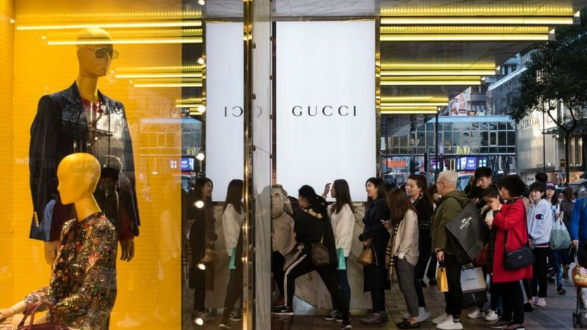
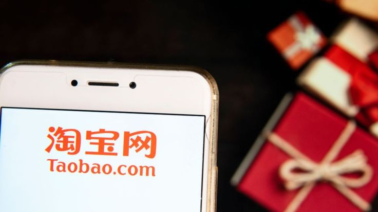
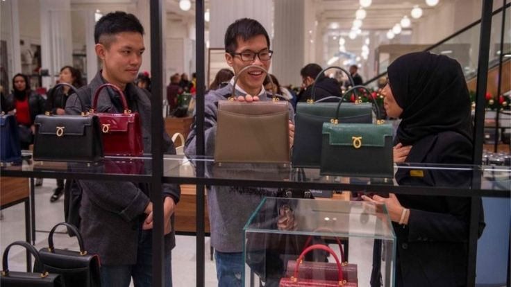
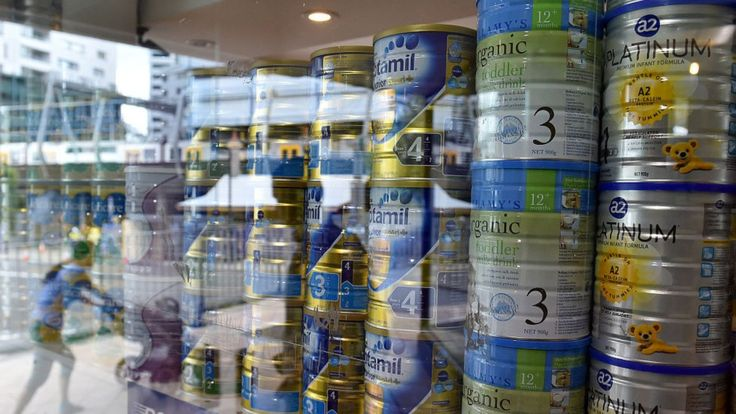
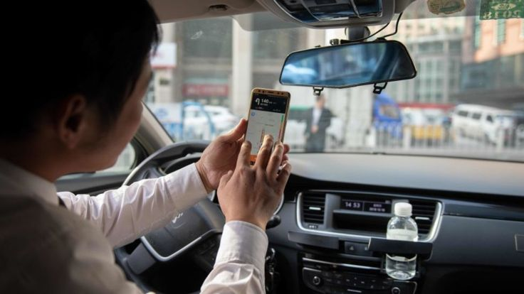

# 中国首部电商法：要管假货，还要管代购和打车 - BBC News 中文

苒苒 BBC中文记者

2018年12月31日

 图片版权 Getty Images 

中国《电商法》实施后，游走在灰色地带的代购们可能会感到“压力山大”。

在电子商务越来越发达的今天，一名普通上班族的一天可能是这样的：早上上班用手机软件打车、中午吃饭在网上点外卖，晚上回家网购日用品、交水电费……最近几年，电子商务已经渗透了人们生活的方方面面。不过，在电商“野蛮生长”背后，仍存在许多法律的盲区。

8月底，中国人大发布了《中华人民共和国电子商务法》（以下简称《电商法》），并定于2019年1月1日起实施。BBC中文记者访问了多名商法教授和律师，解读这部法律值得关注的三大焦点问题。

## 假货和侵权：平台要担责

电子商务快速发展的同时，中国一直因假货泛滥备受批评。一些电商经营者仿制国外正品，以低廉的价格出售赚取利润。

阿里巴巴集团旗下的淘宝网曾多次因售卖“山寨货”受到指责。2018年1月，美国贸易代表办公室再次把阿里巴巴集团旗下的淘宝网列入“恶名市场”名单，指淘宝网上仍然充斥“大量的侵权物品”。美国贸易代表办公室2011年2月发布首份“恶名市场”名单以来，中国著名的电商百度、搜狗、京东等都曾被列入其中。

 

图片版权 Getty Images 

阿里巴巴集团旗下的淘宝网曾多次因售卖"山寨货"受到指责。

中国对外经济贸易大学法学院教授苏号朋对BBC中文表示，新法在保护知识产权方面的规定十分全面、详尽，加大了对电子商务平台经营者知识产权侵权的打击力度。

《电商法》第八十四条规定，电子商务平台经营者对平台内经营者实施侵犯知识产权行为未依法采取必要措施的，由有关行政部门责令限期改正；逾期不改正的，处5万至200万人民币的罚款。

苏号朋解释，根据中国《侵权责任法》和《消费者权益保护法》，如果电商平台内经营者侵犯知识产权，电商平台经营者可能需要向被侵权人承担民事责任。但是，根据《电商法》第八十四条规定，平台经营者不仅要承担民事责任，还要承担行政责任。

他举例，如果有网店在淘宝上卖假耐克，耐克在取得有力证据的情况下要求淘宝对该网店采取必要措施，但淘宝并未行动，则耐克可以告淘宝，淘宝需要承担民事责任；此外，根据《电商法》的上述规定，中国政府还将对淘宝进行行政处罚。

- [新百伦获赔千万 中国罕见重罚侵权者](https://www.bbc.com/zhongwen/simp/business-41034811)
- [淘宝网被列美国黑名单 阿里巴巴指美贸易保护](https://www.bbc.com/zhongwen/simp/business-42673624)

不过苏号朋也指出，虽然《电商法》对知识产权保护做了全面、完善的规定，但是能否有效遏制侵权现象仍要看执法力度，以及中国的企业和个人有没有守法意识。

## 海外个人代购凉了？

 

图片版权 AFP 

2018年节礼日，伦敦商业中心里的亚洲面孔。中国代购已成为一些欧美品牌店的重要消费来源。

从澳洲的奶粉、美国的奢侈品包包、到韩国的护肤品、日本的马桶盖和淋浴头，都是近年来中国消费者追捧的产品。一批批海外代购嗅到商机，从海外购买商品，使用社交媒体宣传，再通过网络平台加价卖出获得利润。不过，中国《电商法》实施后，游走在灰色地带的代购们可能会感到“压力山大”。

一些海外代购已经风声鹤唳。日本代购小花（化名）对BBC中文表示，她将货品带回国有两种方式，一种是从日本邮寄回中国，还有一种是人肉带回国。从明年1月1日开始，她将停止人肉代购、开始观望，因为“据说机场（海关）查验力度会很大”。她还称，许多同行已经转行。

海外代购一直存在涉嫌偷逃税甚至走私的争议。早在2012年，一名海南航空的空姐就因网售走私化妆品行为一审被判刑11年，罚款50万元人民币。2013年12月，法院二审判决该空姐有期徒刑三年。

图片版权 Getty Images 

北京德恒（深圳）律师事务所合伙人、律师吕友臣对BBC中文指出，一般可以将跨境电商分为两类，一类是完全规范的、通过海关系统进出的跨境电商；另一类则是包括人肉代购、邮包代购等非典型跨境电商。

此次《电商法》要求，电子商务经营者应当办理市场主体登记并且纳税。“通过朋友圈等渠道进行的个人代购一般都没有注册，也没有缴税，（新法）对这一类代购群体影响非常大，”吕友臣说。

吕友臣还表示，除了《电商法》之外，海关总署今年的一些新规也会打击海外个人代购。

2018年海关总署第164号公告公布，11月30日起，海关总署与中国邮政集团公司通过建立总对总对接的方式实现进出境邮件全国联网传输数据。

吕友臣指出，以往许多代购通过邮包寄送物品，海关没有邮包的数据，只能进行抽查，存在税款缴纳的漏洞；而海关和邮政数据互通后，海关将全面掌握邮递物品进出的信息，包括寄件人名称、内件品名和数量等，可能会进行后续稽查。

## 消费者安全保障

今年5月，河南郑州一名21岁的空姐回家途中使用滴滴出行APP约了一辆顺风车，随后被发现遭到司机奸杀。该案发生仅3个月后又出现类似事件，一名20岁女孩在浙江坐滴滴顺风车时被司机杀害。这些“滴滴”血案引发公众对于平台应如何担责的讨论。

新法回应了公众的疑问。《电商法》第三十八条规定：“对关系消费者生命健康的商品或者服务，电子商务平台经营者对平台内经营者的资质资格未尽到审核义务，或者对消费者未尽到安全保障义务，造成消费者损害的，依法承担相应的责任。”

图片版权 Getty Images 

这些"滴滴"血案不但引发民众对嫌疑人的谴责，也引发平台应如何担责的讨论。

在《电商法》的审定过程中，这款条文就极富争议并经过数次修改。根据内地媒体报道，《电商法》（草案）三审稿中规定，这一条款最后一句是“依法与该平台内经营者承担连带责任”，四审稿中又修改为“依法承担相应的补充责任”，经过各方博弈，最终才定下现在的版本。

在苏号朋看来，《电商法》最终出台的这个条款在一定程度上降低了对消费者的保护力度，"按照《食品安全法》的规定，如果在食品领域出现了类似情况 ，作为平台要承担'连带责任'，这是一种比较重的责任，对消费者保护力度更大，而现在改为'相应责任'而不直接用'连带责任'，和《食品安全法》相比，对消费者的保护程度明显降低。"

- [滴滴司机杀人案背后的三个争议漩涡](https://www.bbc.com/zhongwen/simp/chinese-news-44093798)
- [滴滴网约车再酿命案引质疑　下线顺风车业务](https://www.bbc.com/zhongwen/simp/chinese-news-45318172)

中国人民大学法学院教授刘俊海则认为，“相应的责任”这个说法有些模糊，是《电商法》的一大遗憾之处。“‘相应的责任’应该既包括相应的民事责任（主要是连带责任），也包括相应的行政处罚，还包括相应的刑事处罚与失信制裁措施，”刘俊海说。

他对BBC中文指出，既然平台对于涉及消费者安全保障权的普通商品或服务尚应究其过错对消费者承担连带责任，那么对关乎消费者生命权与健康权的商品或者服务，平台更应对消费者遭受的实际损害承担连带责任。因为在这种情形下，法律保护的法益（生命权与健康权）比前一情形下的法益（包括财产权）更重要，平台的主观过错更大，消费者损害的后果更严重。

------

原网址: [访问](https://www.bbc.com/zhongwen/simp/business-46700678?ocid=socialflow_twitter)

创建于: 2018-12-31 22:50:08