# 中国在厄瓜多尔建了一座大坝，它带来了什么？ - 纽约时报中文网

NICHOLAS CASEY, CLIFFORD KRAUSS

2018年12月26日

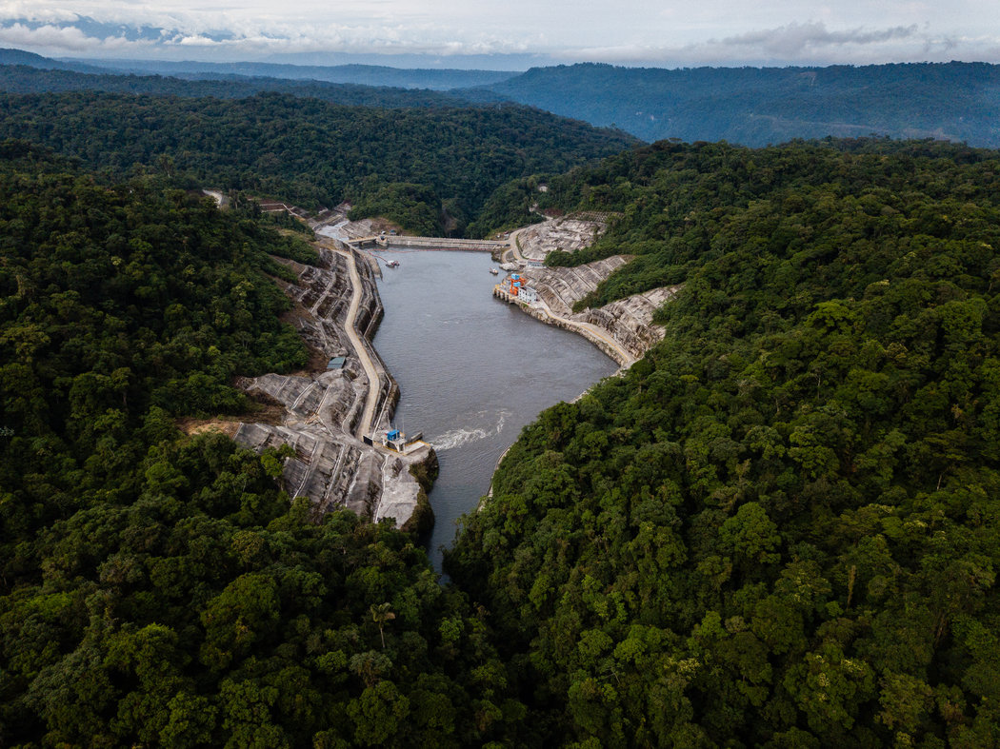

Federico Rios Escobar for The New York Times

厄瓜多尔雷文塔多火山——大坝坐落在一座活火山下，缕缕火山灰喷入天空。

数十年来，官员们一直对这座大坝发出警告。地质学家表示，一场地震就能将其抹去。

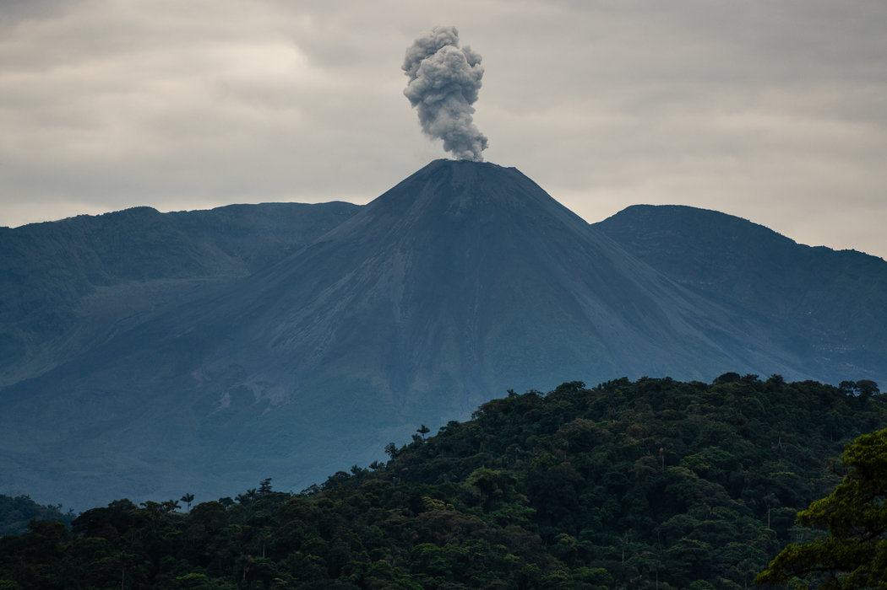

大坝附近的雷文塔多火山在喷发火山灰。 Federico Rios Escobar for The New York Times

如今，就在大坝投入使用仅仅两年后，数千道裂缝正在瓦解坝体。水库被淤泥、沙子和树木堵塞。而工程师唯一一次让设施进入全面运行，就出现了剧烈震动，导致国家电网短路。

这座巨型大坝坐落在丛林中，由中国出资并且承建，它原本应当实现厄瓜多尔的雄心，解决其能源需求，帮助这个南美小国脱贫。

然而，如今它却成了一个令国家陷入腐败、危险的高额债务——以及受制于中国的未来——的全国丑闻的一部分。

几乎每个涉及大坝建设的厄瓜多尔官员都遭监禁或因贿赂指控被判刑。这其中包括一名前副总统、一名前电力部部长，甚至还有一名监督该项目的反腐官员，对他的监听发现，他在和人讨论来自中国的贿赂。

还有价钱：约190亿美元中国贷款，这笔钱不光是用于这座名为“[科卡科多辛克雷水电站](http://cn.nytimes.com/world/20150722/c22chinalend)”的大坝，还用于大桥、高速公路、灌溉、学校、卫生诊所及其他六座大坝的建设，政府为如何支付这些项目的费用伤透了脑筋。

厄瓜多尔付不起这些钱，没关系。

无论如何，中国都能得到回报。

为了收回成本，中国得以获得厄瓜多尔价值最高的出口商品——石油——的80%，因为许多合同都是以石油而非美元偿付的。实际上，中国是以折扣价获得这些石油，然后将其出售，获得额外利润。

对厄瓜多尔来说，抽出足够的石油来还钱给中国已变成了头等大事，于是它正在亚马孙进行更深层的钻探，带来更多滥砍滥伐的威胁。

但这还不够。受到债务拖累，总统莱宁·莫雷诺(Lenín Moreno)削减了社会支出、汽油补贴、多家政府机构和超过1000个公共就业岗位。大多数经济学家预计，该国将慢慢陷入衰退，引发众怒。

“中国占了厄瓜多尔的便宜，”厄瓜多尔能源部长卡洛斯·佩雷斯(Carlos Pérez)。“中国的策略很明显。他们要控制他国经济。”

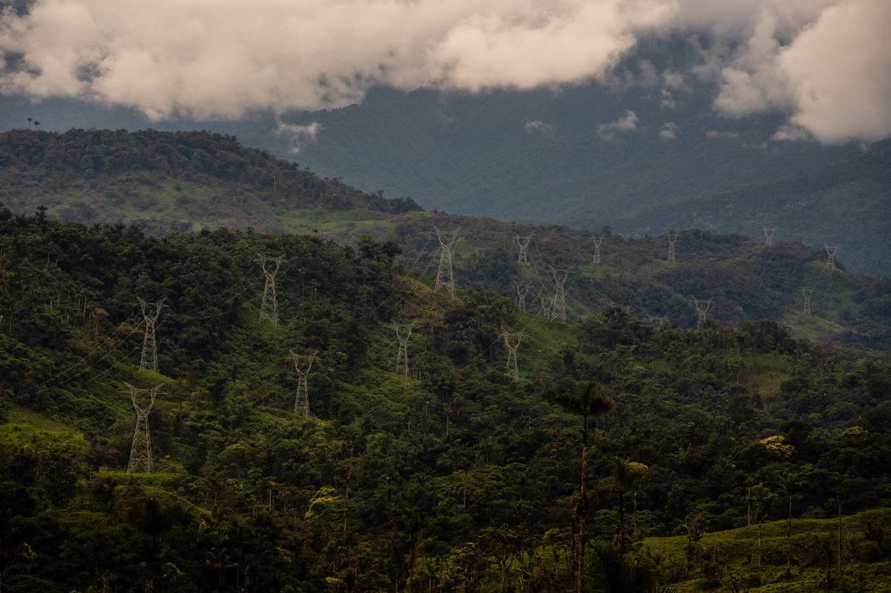

在丛林中央为科卡科多辛克雷项目修建的输电线。 Federico Rios Escobar for The New York Times

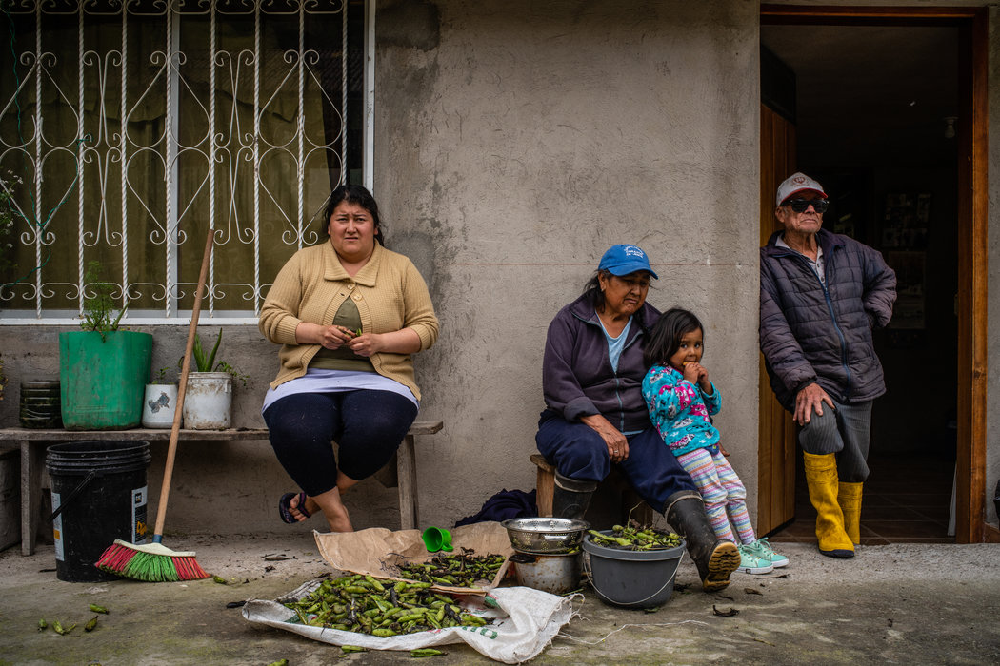

在库尤哈镇，一家人在自家门廊前剥豆子。他们每月大约要付60美元电费。 Federico Rios Escobar for The New York Times

这座大坝如何被建造起来的故事，将两个天然的盟友拉到了一起，两方都急切希望改变南半球的走向，替代美国在该地区作为无可匹敌大国的地位。

 [中国的计划](http://cn.nytimes.com/world/20180730/china-latin-america/)十年前就很明确了，当时它在全球金融危机期间横扫拉丁美洲，给各国政府扔来一条经济救生索，并且承诺“平等相待”，这明显是在影射美国的主导地位。

这个计划奏效了。如今中国是南美最大贸易伙伴，在这个地区播下基础建设及数额惊人贷款的种子。这也重塑了政治利益，让拉丁美洲国家[与台湾切断外交关系](https://cn.nytimes.com/asia-pacific/20180822/taiwan-el-salvador-diplomatic-ties/ "Link: https://cn.nytimes.com/asia-pacific/20180822/taiwan-el-salvador-diplomatic-ties/")。

但就像是厄瓜多尔的巨型大坝所体现的那样，这两方远算不上是平等的伙伴。

这两个国家都愿意忽视设计缺陷、存在问题的经济及来自第三方的警告。警告称这座大坝的技术研究已过时几十年。

但通过沿用中国[在发展中国家用过的数以十亿计美元的贷款方式](https://www.nytimes.com/zh-hans/interactive/2018/11/19/world/asia/world-built-by-china.html "Link: https://www.nytimes.com/zh-hans/interactive/2018/11/19/world/asia/world-built-by-china.html")，中国从未面临过多大的金融风险。

风险都在厄瓜多尔那里，而如今，这个国家正在寻找新的贷款来填补资金缺口，包括更多来自中国的钱。

就在本月，莫雷诺飞到北京，为该国一部分债务进行重新谈判——并且要另外再借款9亿美元。

“中国人放出了饵，”约翰·霍普金斯大学(Johns Hopkins)经济学家史蒂夫·汉克(Steve Hanke)表示。“最终，这些国家有什么呢？竹篮打水一场空。”

 **“我们知道这种关系不会很容易”**

当1980年代的能源部长费尔南多·桑托斯(Fernando Santos)发现，科卡科多辛克雷水电站已经开始建设时，他几乎不敢相信。

在他供职政府期间，官员否决了一个规模小的多的方案。他说这个想法注定要失败，因为附近有一座火山。1987年，一场大地震摧毁了该地区的石油基础设施。

“自从16世纪西班牙人来到厄瓜多尔以来，这座火山一直在喷发，”桑多斯还说“在这么一个充满风险的地方”投入如此多资金“很荒谬”。

还有其他警报。

2010年一项对该项目的独立评估警告，该地区为大坝提供电力的水量已有近30年没有研究过了。《纽约时报》取得了这项由一个墨西哥政府机构进行的评估报告。

自那之后，厄瓜多尔一直遭受着严重干旱，人们还担心由于气候变化，该国冰川也在融化。

尽管有这些建议，大坝前总经理卢西亚诺·塞佩达(Luciano Cepeda)表示，由于“一项新研究将花费数年”，厄瓜多尔最高官员还是继续推进了该项目，因为他们不想放慢进度。

甚至一名驻厄瓜多尔中国外交官都表示，他对这个项目有疑问。该外交官未获公开发言的授权。

“我们没有对环境报告予以足够的关注，”该外交官表示。

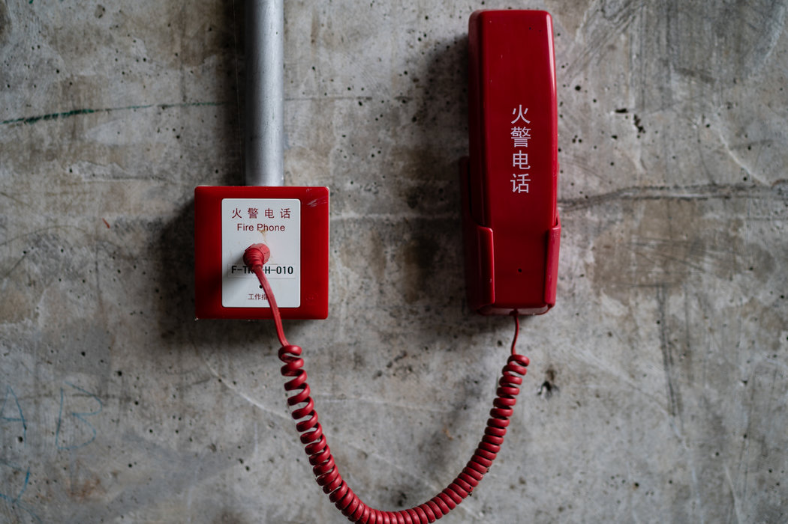

火警电话上的标记，清楚地表明是谁修建了这座大坝。 Federico Rios Escobar for The New York Times

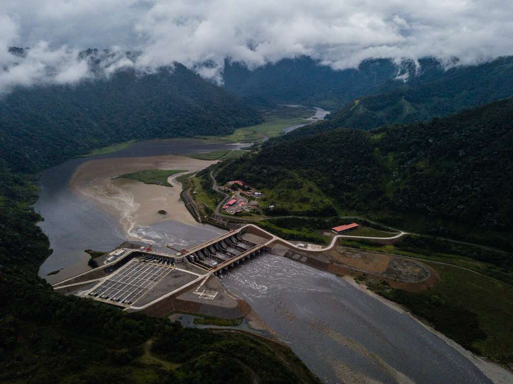

厄瓜多尔官员曾经否决一个比该大坝规模小得多的方案。 Federico Rios Escobar for The New York Times

中国的过往行为既提供了鼓励，也引来担忧。该国庞大的三峡大坝将长江一分为二，让其水位升高了600英尺，三峡还是世界上最大的水电项目，设计目的是产出20倍于胡佛大坝的电力。

但不当的安全措施导致100名工人死亡，这座大坝导致100多万人要背井离乡，此外还有严重的环境破坏，包括森林被毁。

除了警告，其中还有更大的地缘政治力量。[厄瓜多尔时任总统拉斐尔·科雷亚(Rafael Correa)](https://www.nytimes.com/2006/11/28/world/americas/28ecuador.html)是一名左翼民粹分子，他誓言要让自己的国家进入现代化，不再围着美国转。

2006年，拉丁美洲掀起一股左翼当权的潮流，科雷亚也是在那一年当选总统。他用一场充满火药味的、反帝国主义的讲话将美国列为目标。2008年，他拒绝给一项美国缉毒侦查飞行行动所需的厄瓜多尔空军基地租约续期。

很快，西方金融机构也被科雷亚针对。他谴责国际货币基金组织(International Monetary Fund)，称其对自己的支出设限。后来在2008年，他拖欠了该国32亿美元的外债，然后邀请中国来填补缺口。

“科雷亚想摆脱西方银行及机构，”科雷亚前经济协调部长迭戈·博尔哈(Diego Borja)表示。“我们知道这种关系不会很容易。”

中国的贷款条件让博尔哈及其他官员感到震惊。大部分贷款来自大型国有贷款机构中国进出口银行，利率很高，且要求厄瓜多尔让中国公司承建，有效地把竞争排除在外。

中国似乎对厄瓜多尔的石油特别感兴趣，该国是石油输出国组织(OPEC)最小的成员国之一。在2009年的一项交易中，中国借给厄瓜多尔10亿美元，偿还方式是向中国国有石油公司中石油输送石油。

“可是我们别无选择，”博尔哈回忆道。“通往西方的大门是关着的。”

科雷亚突然间得到了资金，但一个新危机出现了：该国的电力即将枯竭。一场干旱正在耗尽国家的水库，导致大坝瘫痪。但科雷亚非但没有寻找其它来源，反而加倍使用水力发电。

官员们说，是科雷亚的电力部长阿列克谢·莫斯克拉(Aleksey Mosquera)头一个提到了科卡科多辛克雷：一个本该供应国家三分之一电力的大型工程，也是厄瓜多尔史上最大的投资。

结果它被直接建在了雷文塔多火山(Reventador)下面——并且是几十年前被拒的拟建大坝的近两倍之大。

2016年底，当它终于要启用时，中国主席习近平飞到厄瓜多尔参加庆祝活动。

而就在访问前两天，大坝还在混乱之中。

工程师们一度尝试将项目的1500兆瓦容量全部启用，但无论是大坝设施还是厄瓜多尔的电网都无法负荷。官员们说，设备很危险地颤动，导致全国大面积停电。

厄瓜多尔人始终不知道有这个故障，并且自那以后再也没有尝试过满负荷测试。

如今，大坝一般半负荷运行。专家说，由于它的设计——以及厄瓜多尔的干湿季循环气候——它将能够在一年的6个月、每天的短短几小时内进行满负荷发电。

前提是一切都完美运转。

不过，厄瓜多尔还有贷款要还。来自中国进出口银行的17亿美元贷款对中国而言利润丰厚：15年内7%的利息。仅利息一项，厄瓜多尔每年就欠1.25亿美元。

现在，很多厄瓜多尔人说负担落到了他们身上。

在大坝输电塔持续发出的嗡嗡声中，库尤哈镇居民担心，这些塔会在经常发生的泥石流冲击下倒塌。地理学家说，中国人没有把塔的基座建在岩床中。

另一个不满是账单。玛利亚·埃斯特·特洛(Maria Esther Tello)上月为家中的照明支付了60美元，这让她吃惊，因为政府保证过电价会下降的。

“我老母亲的税去了哪里？”她女儿伊莎贝拉·诺莱(Isbela Nole)一边说着，一边在帮忙采收和剥取蚕豆，以便缴钱给政府。

 **涉嫌受贿的证据**

大坝入口处刻有如下大理石碑文。

“共和国副总统豪尔赫·格拉斯·埃斯皮内尔(Jorge Glas Espinel)”，上面写道。“他设想并实现了这一不朽的工程。”

格拉斯如今在厄瓜多尔监狱中，被判六年监禁。

他[被判收受贿款](https://www.nytimes.com/2017/10/03/world/americas/jorge-glas-ecuador.html)——来自中国在拉美大部地区基建项目的主要竞争对手：巴西建设巨头奥德布雷赫特集团(Odebrecht)。美国检察官称，作为其赢取业务的全球计划的一部分，奥德布雷赫特在厄瓜多尔支付了3350万美元贿款。

眼下，厄瓜多尔官员正在调查中国人是否也给格拉斯和他身边的人付过钱。

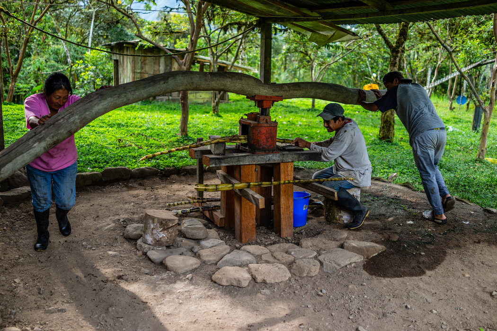

蔗农卡洛斯·乌萨马和家人在手工榨甘蔗。去年附近一座大坝泄洪，导致他们家失去了一名亲人。 Federico Rios Escobar for The New York Times

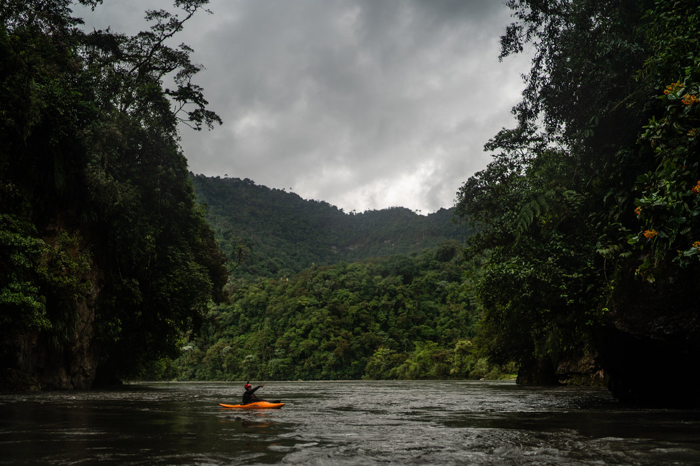

当地皮艇手雅伊尔·罗布雷斯在大坝附近的吉柯斯河上。 Federico Rios Escobar for The New York Times

“我不认为所有这些项目都由同样的人员管理是个巧合，”能源部长佩雷斯说。

涉案官员包括前电力部长莫斯克拉，目前正因收受奥德布雷赫特100万美元在服五年徒刑；前反贪官员卡洛斯·波利特(Carlos Pólit)，被控收受该公司数百万美元贿款；以及格拉斯的另一位亲密伙伴里卡多·里维埃拉(Ricardo Rivera)，他也被控收取巴西人的贿赂。

但表明官员们收受中国人贿款的证据也已浮现。

厄瓜多尔的执法官员称，他们确认了由奥德布雷赫特高管录制并交给巴西检察官，继而泄露给巴西新闻媒体的一段秘密录音。在这段录自反腐官员波利特家里的录音中，两人在商讨贿赂一事。

可以听到这名高管说厄瓜多尔副总统格拉斯在“要很大一笔钱。”

高管随后解释，他当时被告知“这是一项义务，因为中国人已经付了钱。”

据厄瓜多尔执法官员表示，录音引发了一项调查，特别是围绕里维埃拉，他在多次赴中国的访问中以副总统的代表自居。

他们说，他们在调查里维埃拉授权汇至香港一个汇丰银行账户的13笔价值为1740万美元的银行转账。执法官员称，他们认为银行转账是真实的，并想知道里维埃拉何以在中国存了这么多钱。

此前总检察长保罗·佩雷斯(Paúl Pérez)一直在领导一项涉及中国人的贪污调查，并于11月到访中国寻求帮助。

但在11月13日回国后不久，佩雷斯突然辞职。他没有回应采访请求。

格拉斯的一名律师否认他的客户参与了科卡科多辛克雷贪污案，称格拉斯是一个“受人尊敬的、诚实的人”，并形容大坝的问题是“小瑕疵。”

前总统科雷亚如今流亡在比利时，因谋划绑架对手被通缉。他的多名副手已因贪污被判刑或者也在逃亡。

波利特和里维埃拉的一名律师未回应置评请求；修建该大坝的中国国有建设巨头中国水电亦未回应。

 **大坝机械出现7648道裂缝**

沿着吉柯斯河走向科卡科多辛克雷水电站时，你根本无法看出来你是在靠近一座大坝。

储存该项目供水的水库大部分地方都塞满了小树和灌木。由于沉淀物太厚，船只有时会被搁浅。

大坝的工作人员说，设计缺陷导致的淤塞只是诸多问题中最新的一个。

早在2014年，技术人员就注意到中国制造的不锈钢设备出现了裂隙。那年12月，一条隧道出现进水和坍塌，13名工人因此丧生。

据《纽约时报》看到的文件显示，一名高级工程师把有关记录递到了科雷亚总统那里，要求向他做简报介绍存在的问题。据前官员说，这名工程师几天后遭解雇。

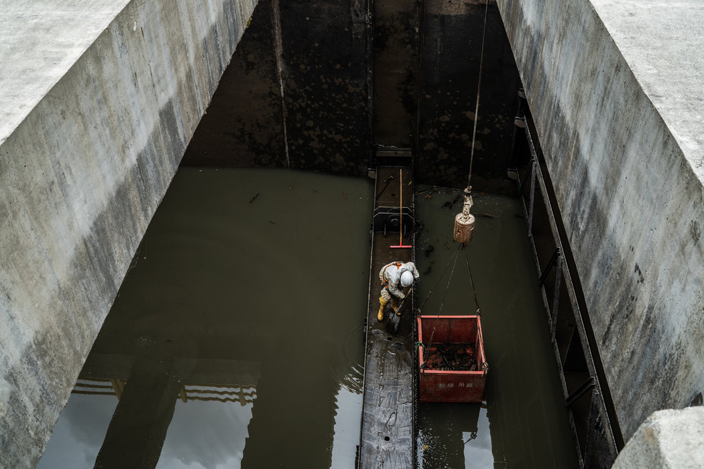

由于设计问题，水库出现了泥沙和树木的堵塞。 Federico Rios Escobar for The New York Times

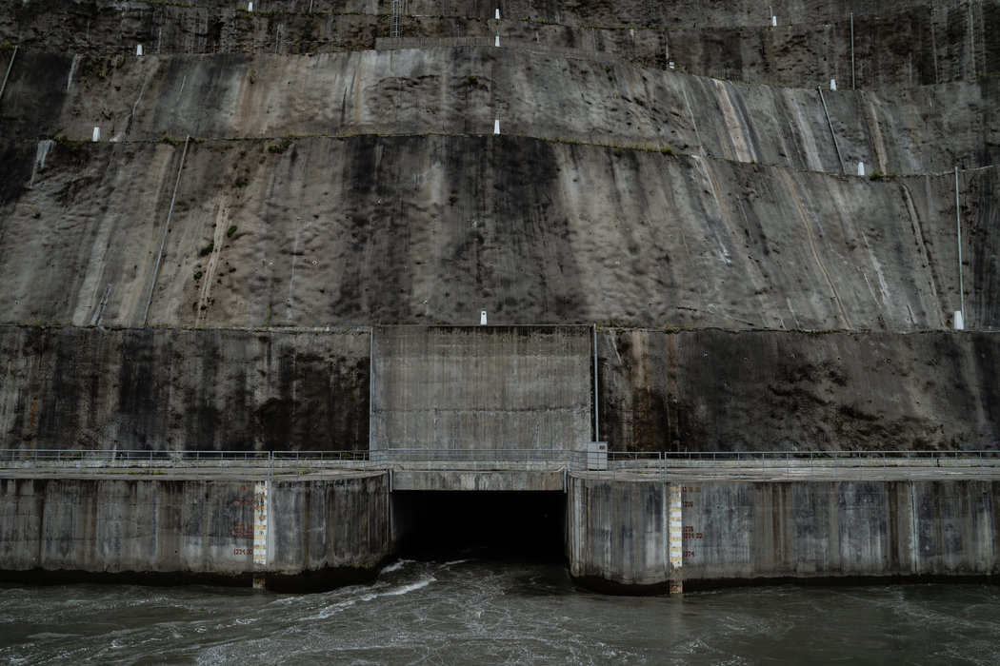

为了支付修建大坝的费用，中国占据了厄瓜多尔最珍贵的出口资源——石油——出口量的80%，因为许多合同是以石油而非美元付款的。 Federico Rios Escobar for The New York Times

反腐官员波利特进行了审计。但他们只是对中国人不痛不痒地批评了几句，比如工作延误，并处以轻微罚款。

厄瓜多尔执法官员表示，他们正在调查波利特及其他官员的玩忽职守是否因为收受了中国人的贿赂。他们说，这是佩雷斯辞职前所做调查的一部分。

根据政府的数据，由于钢材质量不合格和中国水电的焊接不当，大坝的机械设备目前已经出现了7648处裂缝。泥沙淤积也是一大问题，因为它们会损坏重要设备。

在最近的一次巡查中，一名工程师紧张地看着显示沙子流入大坝的读数。但工人们表示，有时糟糕的翻译让他们很困惑。

有一块牌子上的中文是正确的：“直流泵组压力”。

西班牙语则变成了：“来自华盛顿特区的压力组”。

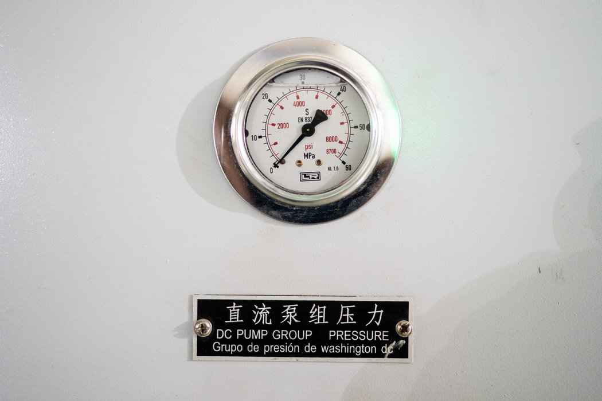

一块用中文、英文和西班牙文写的设备标牌。中文是正确名称：“直流泵组压力”。西班文则变成了“来自华盛顿特区的压力组”。 Federico Rios Escobar for The New York Times

沟通问题还会影响到下游。

严重的泥沙淤积意味着工程师们偶尔会通过大量放水的方式来清理这个系统，导致蔗农卡洛斯·乌萨马(Carlos Usama)住的地方洪水爆发。他表示，事先没有接到警告。

他说，去年12月，他的兄弟和一个朋友在另一座中国修建的大坝附近钓鱼时，一场类似的洪水把他们冲走了。

他说，尸体两天后才找到。

 **“贷款上瘾”**

因为债务堆积如山，该国的新任领导人对中国的指责不亚于对美国的指责。

“我们不会付钱的，”能源部长佩雷斯在谈到修复科卡科多辛克雷水电站可能需要十几亿美元的资金时表示。

但咨询公司欧亚集团(Eurasia Group)的分析师里莎·格赖斯-塔戈(Risa Grais-Targow)说，摆脱中国的影响会很困难。

她说：“他们知道自己没有太多的融资来源，所以他们会回去敲中国的门。”

中国已经向厄瓜多尔做出了一些让步，比如每桶油多支付92美分。厄瓜多尔输往中国的石油份额也从90%下降到80%。

但分析人士称，政府仍然需要117亿美元来为债务融资，而且仍有数十亿美元的缺口。

除了中国以外，新政府还回到了被科雷亚妖魔化的机构：世界银行和国际货币基金组织。有人担心，厄瓜多尔只是在找另一群金主而已。

“我们对贷款上瘾，”前能源部长桑托斯说。

在科雷亚时期修建的一个水处理设施工作的莱奥波尔多·戈麦斯(Leopoldo Gomez)也同意这种看法。

“现在我们意识到，”他说，“有些东西是我们不需要的——比如大坝。”

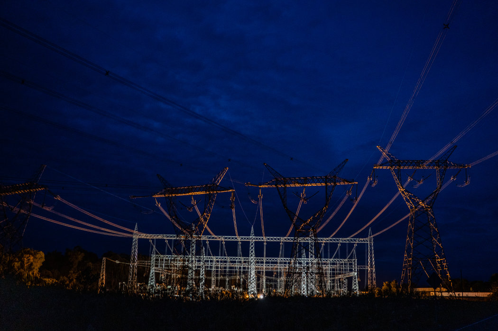

自2016年启用时满负荷发电发生故障之后，大坝再也没有进行满负荷测试。 Federico Rios Escobar for The New York Times

Nicholas Casey自雷文塔多火山、Clifford Krauss自厄瓜多尔基多报道。Jose María León Cabrera自基多对本文有报道作用。

翻译：纽约时报中文网

[点击查看本文英文版。](https://www.nytimes.com/2018/12/24/world/americas/ecuador-china-dam.html)

------

原网址: [访问](https://cn.nytimes.com/world/20181226/ecuador-china-dam/)

创建于: 2018-12-31 22:55:55

------
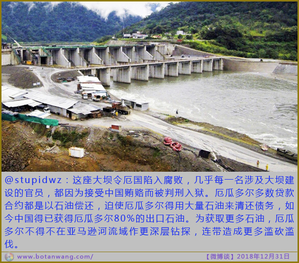
