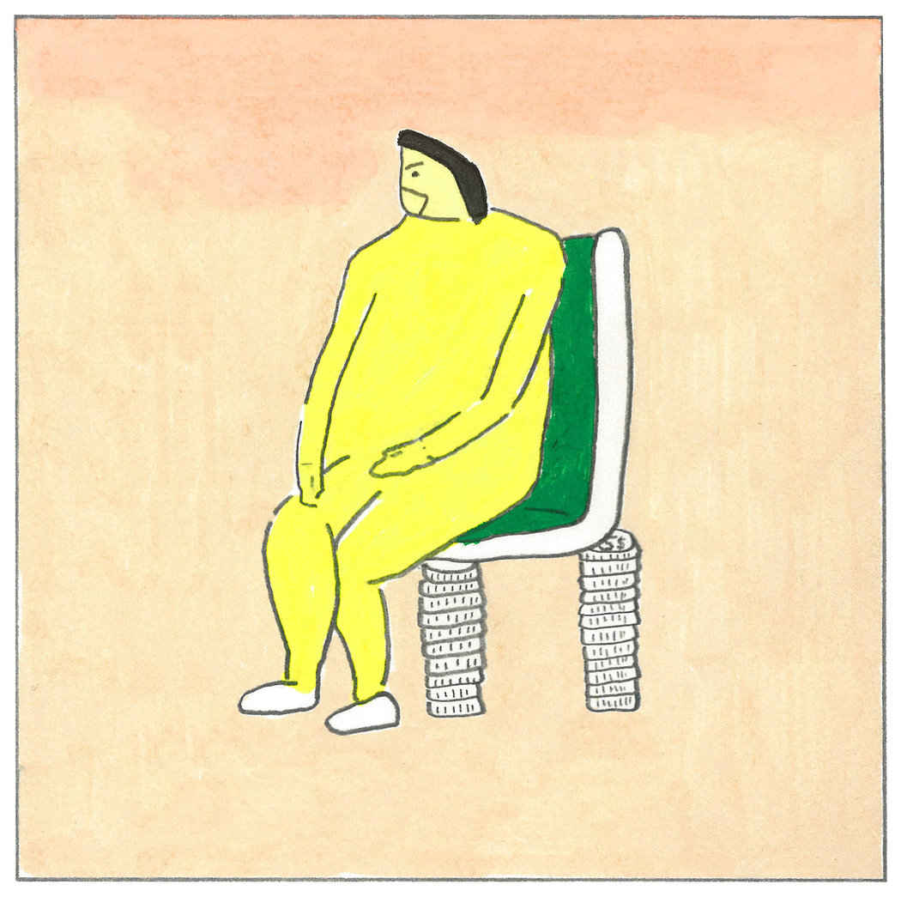

# [如何在2019年成为一个更好的人 - 纽约时报中文网]

2018年12月28日

Illustrations by Ruohan Wang

在我们回望2018这一狂躁之年的同时，有一件事很清楚：我们可以做得更好！进入我们每年总结出来的经验教训，看看该如何在2019年学以致用吧！这些都是根据今年最受读者欢迎的风尚版文章总结出来的。

Illustrations by Ruohan Wang

**1\. 去做。**

每年都会反复出现一个主题，那就是性很重要，我们都应该努力有性生活*。在一篇阅读量很高的“摩登情爱”(Modern Love)文章中，卡琳·琼斯(Karin Jones)分享了她与已婚男子偷情所学到的：“让我吃惊的是，这些丈夫并不是想要更多的性生活，他们只是想要有性生活。”

这不是说如果没有性生活的话，你的伴侣就会出轨，只是在确认我们都基本已经知道的东西：性对人类有益（也对感情关系有益）。

_故事链接：__[《和有妇之夫发生关系教会了我什么》](https://cn.nytimes.com/style/20180413/modern-love-sleeping-with-married-men-infidelity/)(What Sleeping With Married Men Taught Me About Infidelity)__，作者：卡琳·琼斯(Karin Jones)_

_相关阅读：[《当缺少性生活的原因是——男人》](https://www.nytimes.com/2018/03/10/style/sexless-relationships-men-low-libido.html?action=click&module=RelatedLinks&pgtype=Article)(__When the Cause of a Sexless Relationship Is — Surprise! — the Man) ，作者：珍·冈特(__Jen Gunter__)_

_*_当然了，是在双方完全同意的情况下。

**2\. 问问别人关于他们自己的事情。**

当你在现实生活中与他人聊天时，采取一下“新鲜空气”(Fresh Air)节目主持人特里·格罗斯(Terry Gross)的小建议，用她喜欢的开场白打破僵局：“给我讲讲你的事吧。”

_故事链接：[《特里·格罗斯教你如何与人交谈》](https://www.nytimes.com/2018/11/17/style/self-care/terry-gross-conversation-advice.html)(How to Talk to People, According to Terry Gross)，作者：乔莉·克尔(Jolie Kerr)_

**3\. 更少新闻=更多快乐。**

一位名叫埃里克·哈格曼(Erik Hagerman)的男子将封锁消息的概念发挥到了极致——自从2016年大选后，他就完全没看过新闻了——但结果是，他可能是2018年地球上唯一一个可以说“我的情绪感觉比以往任何时候都更健康”的人。

尽管他是因为有特权，才能过上这种日子，而就像很多人指出的那样，这种方式可能甚至在道德上存在问题，但略加限制你接收的新闻数量可能是一件有益健康的事情。只要有哈克曼在场，他的一位朋友就被禁止谈论新闻，这惹恼了他的这位朋友，但即使是他也承认，“不谈政治其实挺好的。”

_故事链接__：__[《如何在特朗普时代过一种“一无所知”的生活》](https://cn.nytimes.com/usa/20180316/the-man-who-knew-too-little/)(The Man Who Knew Too Little)__，作者：萨姆·多尔尼克(Sam Dolnick)_

_相关阅读：《如何制造一个错过的夏天》(__How to Make This the Summer of Missing Out)，作者：海莉·费伦(Hayley Phelan)_

**4\. 考虑使用大麻二酚(CBD)？**

大麻二酚的形势很乐观。今年夏天，美国食品和药物管理局(Food and Drug Administration)首次批准了一款基于CBD的药物，并且纽约大学医学院(N.Y.U. School of Medicine)的一位著名研究员将大麻二酚称为“过去50年来，针对神经精神疾病最有前途的药物出炉了”。曼迪·摩尔(Mandy Moore)在使用它！全称为“cannabidiol”的大麻二酚是大麻植物所富含的一种化学物质，可能可以帮助治疗各种疾病，包括帕金森、癫痫及癌症，还有失眠和焦虑。

_故事链接__：[《为什么到处都是大麻二酚？》](https://www.nytimes.com/2018/10/27/style/cbd-benefits.html)(__Why Is CBD Everywhere?)，作者：亚历克斯·威廉姆斯(Alex Williams)_

**5\. 藏起手机。**

我们都知道了屏幕的害处，但令人惊讶的是——而且这不是一个好迹象——制造出这些设备、发明出如何使用它们的那些人，却让自己的孩子远离这些设备。在硅谷，孩子们[被要求重新发现纸牌游戏、棋类游戏和户外活动](https://www.nytimes.com/2018/10/26/style/silicon-valley-nannies.html?module=inline)的乐趣。也许我们其他人也该这么做。

_故事链接__：__[《“手机里的恶魔”？硅谷父母对电子产品说不》](https://cn.nytimes.com/technology/20181030/phones-children-silicon-valley/)(A Dark Consensus About Screens and Kids Begins to Emerge in Silicon Valley)__，作者：内利·鲍尔斯(Nellie Bowles)_

_相关阅读：[《难以专注？也许这不是你的错》](https://www.nytimes.com/2018/08/14/style/how-can-i-focus-better.html?action=click&module=RelatedLinks&pgtype=Article)(__Finding It Hard to Focus? Maybe It’s Not Your Fault)，作者：凯西·__ 施瓦兹(__by Casey Schwartz__)_

**6.** **留意你的开支。**

参与“FIRE”（经济独立、早早退休\[financial independence, retire early\]）运动的人致力于过节俭的生活，并把节省下来的花销用于投资，这样他们就可以在30或40多岁的时候退休了。即便你还没有准备好全面采纳他们的信条，削减一些开支（如果能的话）总是有帮助的。

_故事链接__：__[《](https://cn.nytimes.com/style/20180905/fire-financial-independence-retire-early/dual/)__[如何在30岁时实现财务自由，早早退休？](https://cn.nytimes.com/style/20180905/fire-financial-independence-retire-early/dual/)__[》](https://cn.nytimes.com/style/20180905/fire-financial-independence-retire-early/dual/)__(__How to Retire in Your 30s With $1 Million in the Bank__)__，作者史蒂文·克鲁兹(Steven Kurutz)_

**7\. 警惕所谓的健康专家。**

（除了这位作者）珍·甘特(Jen Gunter)博士提醒我们，虽然如今追求健康前所未有地重要，但要警惕兜售木炭、膳食补充剂和铺地床单之类万能药的“蛇油商”。主要关注已证明行之有效的自我护理方法：睡眠、锻炼和科学。

_故事链接：_[_《崇拜虚假的健康偶像》_](https://www.nytimes.com/2018/08/01/style/wellness-industrial-complex.html?module=inline)_(Worshiping the False Idols of Wellness)，作者珍·甘特(Jen Gunter)_

_相关阅读__：_[_《自我护理：一个有效的定义》_](https://www.nytimes.com/interactive/2018/08/11/style/how-i-self-care.html?action=click&module=inline&pgtype=Article)_(Self-Care: A Working Definition)，时报风格板块_

**8\. 一如既往，穿出喜悦。**

而不是毫无意义地听命于你的年龄。“穿你喜欢的，”84岁的多丽·杰克布森(Dorrie Jacobson)呼吁，她现在就是这么做的，并记录在她的Instagram账号@[seniorstylebible](https://www.instagram.com/seniorstylebible/?hl=en) 上。“这和与年龄相衬没什么关系。”（其它给人以启发的账号有：@[baddiewinkle](https://www.instagram.com/baddiewinkle/?hl=en), [@Jennykeeoz](https://www.instagram.com/jennykeeoz/?hl=en), @[iconaccidental](https://www.instagram.com/iconaccidental/?hl=en) 和 @[silver_isthenewblonde](https://www.instagram.com/silver_isthenewblonde/?hl=en)）。

_故事链接：_[_《Instagram上的魅力大妈》_](https://www.nytimes.com/2018/06/20/style/instagram-grandmas.html?module=inline)_(The Glamorous Grandmas of Instagram)，作者露丝·拉·费拉(Ruth La Ferla)_

_相关阅读：交一些你年龄段__之外的朋友。_[_《新的女性小组注重代际组合》_](https://www.nytimes.com/2018/11/10/style/intergenerational-womens-groups.html?module=inline)_(New Women’s Groups Focus on Generational Mix)，作者艾比·埃林(Abby Ellin)_

**9\. 拥抱你的夜猫子倾向**

或者至少找一份有弹性工作时间的工作，越来越多的企业都有。成功的范式似乎正从到公司比谁都早的早鸟模式转为“深夜程序师、数字游民、自由职业大鳄和共用工作空间的创业者，”亚历克斯·威廉姆斯(Alex Williams)写道（很可能是在深夜）。

近期的数据支持他关于夜猫子并非一无是处的假设：一些研究显示，他们能承受更多风险，甚至可能更聪明。

_故事链接：_[_《也许你的睡眠问题不是问题》_](https://www.nytimes.com/2018/08/25/style/sleep-problem-late-night.html?module=inline)_(Maybe Your Sleep Problem Isn’t a Problem)，作者亚历克斯·威廉姆斯_

**10\. 治疗通常有帮助**

如果其它尝试都失败了，找一个本职就是帮助你不要失败的人。专业咨询师谢丽尔·史翠德(Cheryl Strayed)和史蒂夫·阿尔蒙德(Steve Almond)给出的建议往往回到同一条推荐理由：从长远来看，有时候治疗师能给你最好的帮助。

_故事链接：_[_《如何克服迷恋心理》_](https://www.nytimes.com/2018/01/16/style/how-to-get-over-an-infatuation.html?module=inline)_(How to Get Over an Infatuation)，作者谢丽尔·史翠德和史蒂夫·阿尔蒙德_

_相关阅读__：_[_《给建议（和说再见）的艺术》_](https://www.nytimes.com/2018/12/25/style/cheryl-strayed-and-steve-almond-will-miss-you.html?module=inline)_(The Art of Giving Advice \[and Saying Goodbye\])，作者同为谢丽尔和史蒂夫_

**11\. 拿回你的时间。**

生活就是一群蜂拥而至的要求，包括职业上的和个人的。你必须做你时间的守卫，允许自己更多地说不。否则，你可能会被耗尽，以至于厌恶所有的人和事，包括你的朋友、家人和以往称之为“有趣”的事情。2019年，别再让这样的事发生了。

_故事链接：_[_《这个节日季如何说不》_](https://www.nytimes.com/2018/11/19/style/self-care/how-to-say-no-social-obligations.html?module=inline)_(How to Say ‘No’ This Holiday Season)，作者达茜·维尔德(Darcie Wilder)_

[点击查看本文英文版。](https://www.nytimes.com/2018/12/27/style/11-ways-to-be-a-better-person-in-2019.html)

------

原网址: [访问](https://cn.nytimes.com/style/20181228/11-ways-to-be-a-better-person-in-2019/?utm_source=tw-nytimeschinese&utm_medium=social&utm_campaign=cur)

创建于: 2019-01-01 15:17:59