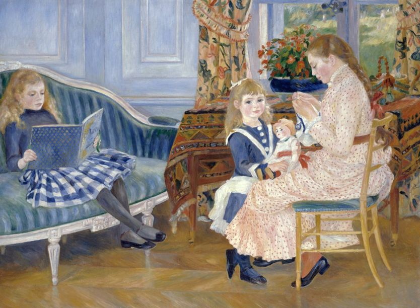
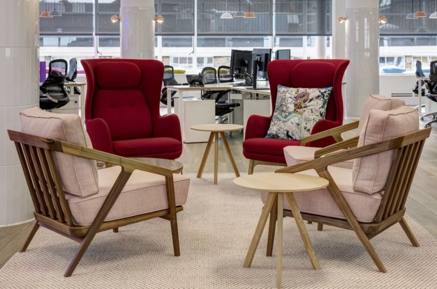
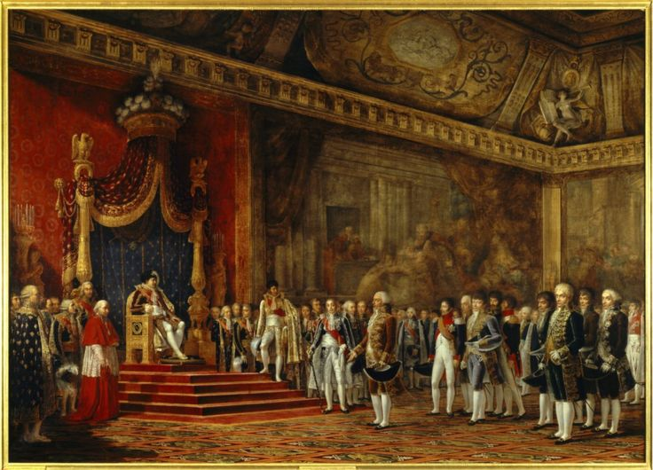
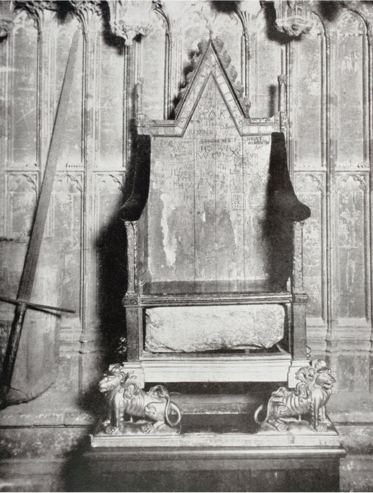

# 为什么我们生活在充满椅子的年代 - BBC 英伦网

2018年 12月 14日

Image copyright Fine Art 

虽然椅子在近代早期（1500-1800年）开始出现，但直到工业革命期间才变得更加普遍。

为什么《圣经》和3万行长的《荷马史诗》中都找不到椅子一词？写于1599年的戏剧《哈姆雷特》中也没有。但到了19世纪中期，情况完全变了。在狄更斯（Charles Dickens）的《荒凉山庄》（Bleak House）中，椅子一词出现了187次。世界发生了什么变化？

久坐有时被认为是“新式吸烟”，我们也知道久坐对健康不好。椅子除了不益于身体健康外，还和空气污染一样，是现代人无法避免的问题。

我因为写书要进行研究，了解我们所创造的世界对我们的身体产生了什么样的影响。我很意外地发现椅子曾经非常罕见，但现在却随处可见——在办公室、火车上、咖啡厅、餐厅、酒吧、汽车、音乐厅、电影院、医生的手术室、医院、剧场、学校、演讲厅、家里，都是椅子。（我可以保证，你拥有的椅子比你想象中的多。）

如果要我对世界上椅子的数量做一个保守估计，我觉得数量很难低于人均8到10把椅子。按这个逻辑计算，地球上可能有600多亿把椅子。椅子当然应该成为“人类世”开始的标志之一吧？椅子就和其他划时代的标志物一样，在地球的每一个大洲都可以找到。

至于为什么突然出现了这么多椅子，仍然没有明确的原因。它是时尚、政治、不断变化的工作习惯以及对舒适的渴求共同作用的结果。其中最后一个需求无需过多解释，因为当下强调放松和舒适的文化正是驱动消费者决策的最大因素之一。

- [如何避免职场中的尴尬对话](https://www.bbc.com/ukchina/simp/vert-cap-45936336)
- [从断头台到电椅注射：对死刑方式的重新思考](https://www.bbc.com/ukchina/simp/vert-fut-44521376)
- [“外语效应”与情感距离：用外语讨论头脑会更冷静](https://www.bbc.com/ukchina/simp/vert-cap-44393512)
- [探索未知：绘制世界海床地图的征程](https://www.bbc.com/ukchina/simp/vert-fut-43854595)

Image copyright Getty Images 

虽然椅子在近代早期（1500-1800年）开始出现，但直到工业革命期间才变得更加普遍。

18世纪之前，椅子比较常见，但大部分人还是用不到。即使在今天，在一张硬木椅子上久坐也不是件容易的事，而当时有软垫的椅子又异常昂贵。但新的放松文化从18世纪的法国宫廷推广开来，使椅子开始被普遍使用。

Image copyright Getty Images 

Image caption 1809年的拿破仑画像，现藏于凡尔赛宫。法国皇帝拿破仑坐在椅子上，其他人则站着。

此前的几个世纪，椅子一直和权力、财富、社会地位有关。无论是农夫还是君主，在广泛的范围里椅子的使用规则都是一样。在《李尔王》第一幕中，也有一条舞台指导意见指出：李尔王进场时应该坐在仆人抬着的“椅子里”。如今，人们仍会认为椅子是地位的象征。我所在的学术领域，最高级别的首席教授被称为“Chair”，这个词本义就是“椅子”。主持会议的主席也被称为“Chair”，而公司的最高领导——董事长也是“Chairman”或者“Chairwoman”。而且一个公司大楼里最好的椅子永远是大老板专座，这也是普遍认可的真理。

椅子开始普遍使用（尤其是法国大革命和1832年英国宪章运动之后），与人们慢慢变化的工作模式相吻合。维多利亚时期的大多数职业都是体力劳动或工厂工作。

但到了19世纪末，随着打字机、电报的发明，以及用电的进一步推广，第二次技术革命得以更快推进，劳动力市场也开始发生变化。办公室文员成为这一时期后半段增长最快的新工作岗位。1851年人口普查显示，只有不到4.4万人在做行政工作。仅过了20年，在办公室坐班的人就变成9.1万人，是原来的两倍多。

现在，大部分人都在办公室坐班。而且在整个20世纪期间，还出现了一系列坐着进行的活动，与我们新的工作模式相匹配。

 

Image copyright Getty Images 

椅子在人类历史上的绝大多数时间里都象征着权力，而皇座就是一个典型的例子。

19世纪时，读小说变得大受欢迎——随着电影院、收音机、电视机的诞生，也出现了越来越多坐着的活动。近几年，电脑游戏、在线视频以及其它用屏幕打发时光的活动让我们坐着沉思。“人类世”的人需要椅子来完成上述所有的“活动”。

现代生活让我们坐着进行活动，如果这像一束花，那么椅子就是这些花朵的茎。椅子无疑是现代生活不可或缺的成分，如果缺少了椅子，我们的活动如何进行，就难以想象了。英国心脏病基金会（British Heart Foundation）开展的研究表明，我们每天约有9.5个小时是坐着的。这意味着现代人75%的时间都不活动，这给我们造成了些许问题。

我们的软硬组织健康与否，可以简单归纳为“用进废退”。无论是增加负重，还是停止使用，肌肉和骨头都会对此作出反应。骨骼的密度也会相应地变高或变低，肌肉也会变得更强壮或羸弱。久坐靠在椅背上时，我们大部分的背部肌肉都会变得松散。这无疑让脊椎支撑力减弱和背部疼痛成为全球第一大导致残疾的原因。

- [宜居城市：过去十年排名不断上升的五个城市](https://www.bbc.com/ukchina/simp/vert-tra-45655857)
- [发人深思的博物馆建筑](https://www.bbc.com/ukchina/simp/vert-cul-44020849)
- [居住地与健康：住在农村是否真的更幸福](https://www.bbc.com/ukchina/simp/vert-fut-44499126)
- [写字楼内的空气：上班族健康的“隐形杀手”](https://www.bbc.com/ukchina/simp/46110855)

 

Image copyright Getty Images 

人们在进行打游戏机、上网、看电视等现代活动时都要坐着。

我们生活在“人类世”，因此也可能把我们自己划分为“人类世”人类。旧石器时代的人类最容易在婴儿时期死亡，那时暴力和受伤也是成年后常见的死亡原因。但现代人类绝大多数死于新陈代谢紊乱，例如：二型糖尿病、心脏病和某些癌症——这些疾病都与久坐不动，即使用椅子有关。

一项2012年的研究是针对久坐不动造成的影响，研究收集了7813名女性的数据。结果发现，那些每天坐10个小时的人端粒更短（端粒越短，细胞老化越快）。久坐的习惯让她们在生理上年老了8岁。有的研究甚至指出，少量锻炼并不能抵消久坐带来的负面影响。

上述研究和许多其他的研究表明，对于花很多的时间坐在椅子上享受悠闲，我们应该仔细想想这应不应该。

**_请访问_** [BBC Future](http://www.bbc.com/future)**_阅读_** [英文原文](http://www.bbc.com/future/story/20181108-the-anthropocene-should-be-known-as-the-age-of-the-chair)**_。_**

------

原网址: [访问](https://www.bbc.com/ukchina/simp/vert-fut-46562934?ocid=socialflow_twitter)

创建于: 2019-01-02 15:42:16