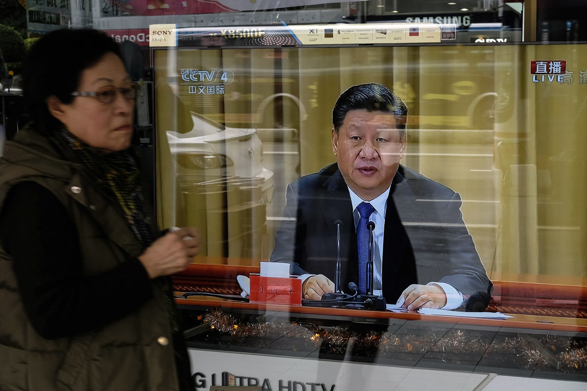

# 習近平提出一國兩制「台灣方案」，是兩岸問題的解藥，還是毒藥？- 端傳媒

有學者認為蔡講話中首次使用的「中華民國台灣」一詞或為一種信號，對於蔡英文的新年談話及1月2日的回應，你又有什麼看法？

端小二 發起2019-01-02

* * *

2019年1月2日，告台灣同胞書40年，電視正播放習近平的講話。攝：Sam Yeh/AFP via Getty Images

### 不少評論指出習近平1月2日對台談話雖多次提及「統一」，但並未有確切「時間表」，對此有人認為其「急迫感」已很清楚，有人則表示不過是對過去政策的重申，你怎麼看？

### 習近平談話提到或探索「『兩制』台灣方案」，這份方案是台海問題的「解藥」，還是「毒藥」？

中共中央總書記習近平1月2日在《告台灣同胞書》40週年會中發表講話，再度呼籲「統一」，重申「九二共識」，並表示將「探索『兩制』台灣方案，豐富和平統一實踐」。台灣總統蔡英文同日[回應](https://www.president.gov.tw/NEWS/24002)重申其新年談話時提及的「四個必須」與民生、資訊和民主等三個防護網，指不接受「一國兩制」，更表示大多數台灣民意也如此，稱「這也是『臺灣共識』」。

據[端傳媒統計](https://theinitium.com/article/20190102-message-to-the-compatriots-in-taiwan-40-years/)，習近平1月2日上午發表的談話中，僅出現兩次「九二共識」，數度強調「統一」（47次），指「統一」是「新時代中華民族偉大復興的必然要求」，而「台獨」為「禍害」，並表示不承諾放棄使用武力，習近平同時提出探索「『（一國）兩制』台灣方案」，認為是「實現國家統一的最佳方式」。

台灣總統蔡英文當日下午回應稱，台始終未接受「九二共識」，因北京當局定義的「九二共識」實質即為「一個中國」、「一國兩制」，更表示反對「一國兩制」亦是獲多數民意的「台灣共識」。

蔡英文同時重申其1月1日[新年談話](https://www.president.gov.tw/News/23999%E4%B8%AD)關於台海關係的內容，包括「必須正視中華民國臺灣存在的事實；必須尊重兩千三百萬人民對自由民主的堅持；必須以和平對等的方式來處理我們之間的歧異；也必須是政府或政府所授權的公權力機構，坐下來談」的「四個必須」，及「民生安全、資訊安全及制度化的民主監督機制」三道兩岸交流的防護網。

此外，蔡英文在1月2日的回應與新年談話中還提到要調整過去過度依賴中國的經貿戰略，並強調不久前結束的「九合一」選舉結果，「不代表台灣基層的民意想要放棄我們的主權」。

台灣陸委會也發布對習近平談話的回應新聞稿，認為中方對台談話顯示出「加速統一的急迫性」，提及「一國兩制」在香港的施行情況，指中方所提的「『一國兩制』台灣方案」是為消滅中華民國主權，「不過是中共介入臺灣社會的藉口」。

華盛頓智庫史汀生中心中國政策研究員 Yun Sun 對[《紐約時報》](https://www.nytimes.com/2019/01/01/world/asia/xi-jinping-taiwan-china.html)表示，習近平稱兩岸問題根源在政治體系不同這一點是正確的，「但台灣民眾不太可能視一國兩制為答案」。華盛頓戰略與國際研究中心的中國外交政策專家 Bonnie S. Glaser 認為，習談話是對當前政策的重申，並指出儘管其數度提及「統一」，但並未有表明最後期限。

《聯合報》[撰評指](https://udn.com/news/story/7331/3569854)，習近平談話中，首次把「國家統一」與「民族復興」掛鉤，而大陸涉台部門去年曾以「時機並不成熟」為由給學者下禁令要求勿將二者簡單聯繫，《聯合報》認為，習講話顯示將台海關係談判躍升至國家層面而非僅涉台部門，而再度強調「心靈契合」與「兩岸融合發展」，則可能繼續同台灣人分享大陸發展機遇。另外，縱然在談話中並未提及「統一進程」的「時間表」，但其「使命感和急迫感」已很清楚。

「北京有其紅線......總統也給出了她的紅線」，曾任台灣智庫副總裁的賴怡忠對[《南華早報》](https://www.scmp.com/news/china/politics/article/2180250/taiwan-wont-give-ground-sovereignty-tsai-ing-wen-says-new-year)解釋蔡英文新年談話時表示，蔡劃出的紅線不僅是對大陸的回應，也是對台灣的親北京派的回應。

中國官方媒體[《環球網》社評](http://opinion.huanqiu.com/editorial/2019-01/13949033.html)稱蔡英文的新年談話是「裝腔作勢自欺欺人」，認為其提出的「四個必須」和「三道防護」，表明蔡英文的態度朝着向深綠方向靠攏退了一大步，她的新年談話已經接近了陳水扁時期的「一邊一國」論。

事實上，在剛剛過去的2018年，中台關係曾數次出現摩擦和緊張。《台灣旅行法》（HR535）於當地時間2月28日在美國參議院無異議投票通過，3月16日經美國總統川普簽署生效；4月25日，中國大陸民航局發函44家外國航空公司要求更改對台灣、香港及澳門的標示，一個月內近20家公司把台灣列為中國一部分；8月19日，蔡英文2參觀美國國家航空暨太空總署（NASA）旗下中心，是台灣領導人首次造訪美國官方機構；8月21日，中美洲國家薩爾瓦多總統桑切斯（Salvador Sánchez Cerén）公布與台灣斷交，並隨即與中國建交，成為2018年年內與台斷交的第3個國家，目前台灣邦交國僅剩17個；而12月，非洲豬瘟也引起台灣方面的警惕和抗議。

蔡英文1月2日的回應中表示，「施壓國際企業塗改臺灣的名稱，不會帶來心靈契合；買走臺灣的邦交國，也不會帶來心靈契合；軍機、軍艦的繞臺，更不會帶來心靈契合。」

**習近平談話提到的「『兩制』台灣方案」，究竟是「解藥」，還是「毒藥」？**

端傳媒實習記者任彤瑤對本文亦有貢獻

### 聲音

> 沒有新意。兩岸現在最重要的是把防疫工作做好，若是中國真的有誠意，就應該分享豬瘟疫情，同時做好關卡管理，不要影響台灣養豬產業每年2千億的產值。
> 
> 民進黨主席候選人卓榮泰

> 習近平這次講話態度溫和，與此前中共武力威脅相比態度大逆轉，這顯然是受到了台灣這次地方選舉結果的鼓舞。習近平表面上釋放善意，實際上是暗助台灣內部的親共勢力，這套手法非常暗黑，台灣人千萬要警惕。
> 
> 王丹

> 【公投門檻要提升，統獨問題不能公投。】習近平操作台灣民意，現在已不反對台灣舉行統獨公投。整個談話都是在勸台灣人接受 「和平協議」。也許2020，也許 2024，台灣就可以為「和平協議」舉行公投。一旦公投下去，當然各種結果都可能。我是悲觀的，就算喜樂島另提公投與之對戰，也可能只會衝高和平協議的票數，就跟這次同婚議題對戰一樣。我還是主張提高公投門檻。這是最安全的做法。
> 
> 顏擇雅

[福爾摩沙](https://theinitium.com/tags/_6594/)[中國因素](https://theinitium.com/tags/_1375/)

* * *

### 討論 61

圓桌禮儀

0發表

*   熱門發言
*   最新發言

*   大員乃一國2 小時前
    
    481
    
    一國兩制的好，香港朋友最知道。  
    不如請香港朋友分享一國兩制，五十年不變，如何讓香港蒸蒸日上
    
    *   NO_COMMENTS  我支持香港独立，那请问您认为香港独立出去后怎么蒸蒸日上？
    
*   非灰也2 小時前
    
    31
    
    等中国民主化了再说统一吧,不然统一就是祸害台湾同胞
    
*   AshTsai1 小時前
    
    19
    
    唉呀，外蒙古怎麼還沒一國兩制啊  
    唉呀，中國維族人怎麼還沒回家啊  
    唉呀，隔壁律師怎麼多天不見人啊  
    唉呀，香港議員怎麼就被DQ了啊  
    唉呀，中共涉貪官員怎麼都政敵啊  
    這麼多唉呀，又何苦要台灣人去了國民黨又來個共產黨，夠了吧，一直被荼毒的中國人
    
*   tonyPchan2 小時前
    
    173
    
    習近平認為台灣被中國吞併的好處是台灣能擁有中國的聲譽，但是台灣的形象很好，倒是中國形象野蠻。
    
    *   NO_COMMENTS  台湾的国际形象真的好吗？政治无赖是东南亚许多国家或地区领导人的共同形象，恐怕台湾当局领导人也是其中一份子正被写进西方国家政治学课本资料里呢！！看看台湾当局的政治举措跟台湾的政治体系，肮脏得要死，真是侮辱了民主两个字。台湾电信诈骗也是举世界闻名吧，请不要空口说白话“台湾形象很好”。
        
    *   netf  不好意思，台湾形象并不好，一说台湾，大陆人第一反应就是电信诈骗，因为大陆捉的诈骗集团全部都是台湾的
        
    *   TWISNOTPRC  台灣人形象比不上日本歐洲，但是跟中國比綽綽有餘，真要比形象，等中國護照拿到歐盟美加免簽後，再開始比吧
    
*   柯尔克bla1 小時前

    615

    我的观点：台湾是中国领土毋庸置疑。台湾是不可能独立的。但现在谈统一时机是否成熟？我觉得还可以等等。 原因有三。第一，两岸同胞目前政治制度差异太大。拿社会的先锋群体—大学生来说，大多数大陆大学生政治参与度较低，而台湾大学生对政治参与度相对而言会高一些。台湾居民习惯性地恐惧「政治参与度低」这种大陆居民习以为常的生活方式，香港回归祖国20年了，许多人仍然反对「低政治参与度的生活方式」，最近的案例就是爆发了14年所谓“要真普选”的民主运动。 第二，两岸民众之间相互交流了解程度不高。许多大陆居民只停留在「台灣是中國領土」、「反對台獨」这种言语表达层面，却缺少对「台獨」更深層次的思考。而许多台湾居民则不了解大陆政治制度的必要性和合理性，它们忽视了大陆居民物质生活水平日渐提高、国际影响力扩大的事实，也只停留在「共产党是邪惡的」、「中国人都是愚民」的言语表达层面，不了解大陆「提高人民物质生活水平」的动力和紧迫性。 所以，我认为当前大陆应该继续拼经济，提高人民生活水平，再有意识分阶段地提高民众的参政议政热情。 台湾则应该加强对大陆的了解，客观看待大陆成就和生活方式，特别要明确认识“制度差异”同“独立国家”之间的区别，不能混为一谈。

    *   minimalistn  台湾是中国领土毋庸置疑？ 拜托你自己去好好学习一下历史再出来讲话
        
    *   NO_COMMENTS  @minimalistn: 咦？这位是在台湾哪所高校做历史教授呢？
        
    *   柯尔克bla  @minimalistn: 二战结束后，台湾就是中国领土，中华人民共和国成立后，台湾就不是中国领土了吗 - -
        

    查看另外 12 則回覆
*   阿卡或阿廷1 小時前

    115

    沒法跟別人說，在這裡說幾句。牆內一般大眾多麼無知，新聞出來只會喊武統。戰爭不是靠個人一拍腦袋就能觸法的。戰爭的發動，需要歷史條件成熟。現代戰爭的勝負不在謀略和裝備，而在社會關係，在於作為後勤力量的社會支持有多強大。美國能立刻集結一萬艦載機飛行員，中國不行，沒那個社會條件，培育不出來，人的素質上不去。如果爆發大規模海戰，在海空雙線的戰鬥中，面對美國輾壓性的強大，中毫無還手之力。資本必然從東南沿海撤離，企業倒閉，工人失業，戰後，中國必然會進入經濟封鎖階段（那就是靠糧票過日子）。這一步趙家肯定能算到，有無必要走到這一步，要看經濟問題是否會逼它這麼走。口號底下，根本上還是如何鞏固自己的權力的考量。我認為蔡總統強硬應對沒有問題。不說美剛簽了對台定期軍售是一個支持的信號，就從美的角度，中如有動作，無疑是提供了一個吊打中的最好理由，讓世界看看，是中先破壞和平的，那麼中改革開放的成果會毀於一旦，沒有人要和戰犯做生意。現代國家，進入了資本全球化就不可能退出，退出就是粉身碎骨。如果真到了即使付出這樣的代價也要打的時刻，也說明真是到了亡命路上了。

    *   NO_COMMENTS  @阿卡或阿廷: 您倒是给大陆安排得明明白白了，你哪里来的自信美国会帮台湾？即使战争中大陆失利，你哪里来的自信台湾主权完全还掌握在台湾人手里？至少美国在台湾驻兵台湾人都不会在意的吗？
        
    *   阿卡或阿廷  @NO_COMMENTS: 幹嘛不幫？逼中改革好才好做生意啊。老美要台的主權幹嘛？台灣獨立了又不會鎖國，對美台兩邊的生意都好。賺錢不是最要緊的事嗎？我是這麼想的
        
    *   NO_COMMENTS  @阿卡或阿廷: 你先弄清楚美国在韩国日本有没有驻兵。美国人不当台湾地区所谓总统就是台湾有主权？您对主权一词的理解也太狭隘了吧。
        

    查看另外 2 則回覆
*   牆奴1 小時前
    
    101
    
    中國目前需要在兩岸問題上搞事情以轉移國內矛盾的視線。
    
    *   kongxian  说反了
    
*   zzzlllzzz2 小時前
    
    162
    
    中國共產黨下台讓中國民主化，我支持統一，同意的點讚
    
    *   umaru  @zzzlllzzz: 我所能见到中国民主化的唯一可能只会是gcd内部改革，可能身处中国局限了我的视野
        
    *   Nicknmae  醒醒，別做夢了...
    
*   jasonz042 小時前
    
    10
    
    這個問題還是請香港朋友回答較好。
    
*   塔森2 小時前
    
    7
    
    對於支持維持現況或獨立的台灣民眾來說，所謂「台灣方案的一國兩制」根本沒有任何意義。習這次的講話對台灣政治若有任何影響，一是表明中國政府對九二共識的詮釋，瓦解國民黨的自我催眠；二是幫蔡英文2020年的連任助選。蔡1月2日不卑不亢的回應可說是台灣總統處理兩岸關係的最佳典範。
    
*   alexames1 小時前
    
    41
    
    習近平明確定義「九二共識」是「海峽兩岸同屬一個中國，共同努力謀求國家統一」。這樣的九二共識是多數台灣人不能接受的，也戳破九二共識的戰略性模糊。蔡英文則明確反對九二共識。個人覺得兩岸統獨即將攤牌，2020總統大選如果還能舉行的話，很可能是台灣民眾是否認同九二共識，甚至表態是否統獨的關鍵性選舉。
    
    *   嘿嘿哟呦  比較贊同，但我認為這只是signal了大陸會對台灣採取更主動的統戰，主要通過對台灣居民的國民待遇來實現，以及更公開發展台灣內部支持統一的力量。我不認為這個談話是攤牌的信號是因為中共目前並沒有做相應的政經軍準備，尤其在國內經濟下行壓力下攤牌代價巨大。而且跡象表明中共應該是吸取了上次台灣飛彈實驗造成的反效果，軍事上應該也不會有類似上次的舉動。最重要的是中共應該很清楚現在在整體台灣統獨民意的對自己並不利的情況下逼台灣人選邊是不夠明智的，因為一旦在政治攤牌下台灣還是選了蔡那大陸就騎虎難下了。武統本身對大陸也是最差的選項。
    
*   NO_COMMENTS49 分鐘前
    
    31
    
    失望，我极尽思考写了这么半天，都不如前面的几个段子受关注的人多。 现在重新回答，一国两制可能是毒药吧，但请台湾方面提出更好的两岸关系方案，至于独立？大陆就算倾其国力所有都不会给台湾独立的机会的，大陆也绝不会先动武。
    
    *   強仔  是中國要學著放手啊，兩個人如果做朋友更能長久的話為何一定要死命堅持錯誤的過去而勉強彼此做一家人呢？
    
*   舟自橫30 分鐘前
    
    2
    
    其實吧，只要有中國政治問題就提外蒙古，新疆，西藏之類話題的人應該是被外媒忽悠得不清或者真心實意不希望中國好的人。是去過新疆西藏外蒙還是接觸過多少當地人呢？對當地的歷史，人民生活現狀有多少了解？簡直像僅憑看了中學物理科普文就大談相對論一樣可笑誒。
    
*   嘿嘿哟呦37 分鐘前
    
    11
    
    我認為這確實是暗示了大陸會對台灣採取更主動的統戰，估計主要通過對台灣居民的國民待遇來實現，以及更公開發展台灣內部支持統一的力量。我不認為這個談話是攤牌的信號是因為中共目前並沒有做相應的政經軍準備，尤其在國內經濟下行壓力下攤牌代價巨大。而且跡象表明中共應該是吸取了上次台灣飛彈實驗造成的反效果，軍事上應該也不會有類似上次的舉動。最重要的是中共應該很清楚現在在整體台灣統獨民意的對自己並不利的情況下逼台灣人選邊是不夠明智的，因為一旦在政治攤牌下台灣還是選了蔡那大陸就騎虎難下了。武統本身對大陸也是最差的選項。
    
    *   嘿嘿哟呦  補充一點，當然這也可能只是對蔡和最近美對台政策壓力下的反應而已
    
*   舟自橫48 分鐘前
    
    2
    
    不要讓ideological obsession矇住雙眼。話說年初的時候我去日本玩，在東京住的膠囊旅館，退房的時候打算在留言區寫些感謝的話，結果看到有人貼了“台灣國獨立”的那個貼紙。我沒有做甚麼，只在旁邊寫上了“歡迎來中國”和“謝謝”以及日語。唉，感到悲哀，畢竟最初兩岸分離就是甲午戰爭後日本造成的，到現在還是這種局面。
    
*   藏鋒2 小時前
    
    4
    
    如何破解民族（国族）问题与意识形态绑定的难题？悲观一点看，无论大陆是谁执政、采取什么样的政治制度，台湾都不会主动要求统一……历史上台湾的数次控制权更迭，都是以武力开始，且以武力结束。现在的台湾，应该只剩下光复（吞并大陆）派和独立派了，还能怎样寄希望于“台湾同胞“呢？
    
*   Irisamourkiss36 分鐘前
    
    1
    
    北京的「九二共識」本就跟台灣所認知的不一樣，在中間搖擺的台灣人民只不過是為了生計因而將其模糊化，其實心底仍對「統一」兩字不瞭解，也不知若是真的實現習近平所說的理想又會如何？  
    在經濟衰弱的局勢之下，同樣也苦了主張民主自由的蔡總統，她提出守護台灣民主之講法，總是被認為是高知識份子，不知民間疾苦的言論，但其中字句間的意義卻相當重要。  
    如果我們連「自由」的空氣都妥協了，台灣人怎麼還會奢望中國能給出自由經濟、參政權、言論自由等權利呢？  
    昨日香港、今日台灣，香港經歷過的事情，台灣避不了，唯有提高自覺，才能保護自己。
    
*   包子哥37 分鐘前
    
    1
    
    “中国人不打中国人”的论调又使中共陷入逻辑困境之中。  
    如果承认台湾人是中国人，那么就不能打；如果不承认台湾人是中国人，那么台湾问题就不属于中国内政，相当于武力干涉别国内政 颠覆它国政权
    
    *   netf  台湾还没独立的，台湾想和平独立是不可能的，美国当年独立脱离英国也是有独立战争死了很多人，现在台湾有多少人愿意当兵？兵役就那么几个月的国军，对抗大陆2年兵役的人，谁的实力强大点，台湾人真的在做梦
    
*   jerrysone1 小時前
    
    1
    
    意識形態影響民族統一問題的典型案例，兩岸先前都認為是中國正統，互不承認，都想滅掉對方，代表中國。如今兩岸實力失衡，中華民國台灣無意大陸，只想代表台灣，成為事實上的獨立國家，但大陸政權卻只視你為地方政權，身分不對等。所以除非兩岸意識形態發生較大變化，否則一國兩制只是大陸的自說自話，至於武力統一，不到萬不得已，不會出現，如果真的有那一天，絕對是中華民族的悲哀。
    
*   NO_COMMENTS1 小時前
    
    32
    
    关于一国两制，台湾已逝学者李敖生前已经在多个场合谈论过了，可惜台湾部分政客光顾着分享李敖争取到的言论自由权利用来哗众取宠博取功利，不少台湾人忘掉了李敖的思想与个人价值。最有权利谈一国两制感受的恐怕确实是香港人，但绝非那些在港的极少数极端异见分子，同时评价一国两制好坏的标准绝非仅是“民主自由”的老套说辞：港人治港有实现吗？中央与地方的关系是不是应该有？香港现在的民主李敖说了学的是台湾啊！香港城市治理以市政规划为例明显跟大陆城市不是一套思路啊！所以，请觉得一国两制害了港澳的台湾同胞们说出你们的理由。大陆认为一国两制核心是一国，两个制度以此为前提可以坐下来谈。蔡英文的观点实质是企图从对谈形式直接让大陆承认台湾主权的方式否认一国，坐下来她要谈的是经济两岸要互利互惠，但她又谴责了北京用经济政策吸纳台湾资本与人才，还说了要以“台湾优先”，好话都让蔡英文说尽了，留给中共的选择大概只剩下直接给台湾拨款了吧。蔡英文最近总是用非洲猪瘟批评中国大陆，首先明确，瞒报确实有地方官员私心的成分在，但另一方面不大规模报道非洲猪瘟恐怕也有不制造舆论恐慌的考虑，这一点还是请资深传播学者评判比较好，治理疫情也应该让专业人员来操作跟科普，黄色新闻潮过去都多少年了没念书的人听一两句煽动总想着揭一揭别人的丑，难道中共官员都疯了吗瞒报疫情等着大陆猪猪都死光吗？很多措施都已经采取了肯定不要着急。另，非洲猪瘟在全世界都有发生，俄罗斯可以养猪的地区离中国大陆这么远都传过来了，疫情面前全人类应该统一战线而不是台湾某些政治家把大陆人当成瘟疫一样写进他们的政治宣言中，也不应该罔顾事实抓住中共官员贪污腐败知情瞒报作为政治攻击的武器。蔡英文的内政治理都做不好，整天说漂亮话有什么用！！台湾独立真的有前途可以看得到希望吗？恐怕跟几十年前反攻大陆的口号一样只是让人们安安分分看到所谓希望让社会正常运转而已，等幻想破裂事实更加沉重罢了。
    
    *   Eagle  就猪瘟这个话题来说，真是够了，又被岛内政客拿来政治化，猪瘟已经科普过非常多，只传猪不传人，得了猪瘟就扑杀，影响农场是有限的，对人身体更是无虞
        
    *   NO_COMMENTS  @Eagle: 可是我也看到，非洲猪瘟是可以通过祝肉制品、昆虫、人体衣物传播的，很难失活。。正常的预防没问题啦，蔡英文脸书还有她的讲话总是谈这个真的烦，没水平，好像中共故意针对她台湾所谓2000亿产值的猪肉养殖业似的。
    
*   WIYF51 小時前
    
    1
    
    不覺得兩岸問題是這個世紀能夠解決的。統一、獨立都不是眼下的優選。
    
*   強仔20 分鐘前
    
    共產黨都能用本當作為保命的小兒疫苗奪人性命了，就算他們說這個是解藥，那也是讓你解脫時絕對不痛快的毒藥。
    
*   桃太郎952729 分鐘前
    
    我支持统一，但是不能是大陆管理模式的统一。统一应该多元化，否则统一以后像大陆这样专制，还不如现在这种态势，至少可以读读两岸不同的书。
    
*   NO_COMMENTS48 分鐘前
    
    1
    
    也请部分认为一国两制伤害了你们的香港同胞说出理由。我们可以讨论。
    
*   wzk20131 小時前
    
    1
    
    说实话，如果哪天大陆真的民主化了，想不武统都难了，任何执政党为了争取选票都会把台湾往死里打
    

---------------------------------------------------

原网址: [访问](https://theinitium.com/roundtable/20190102-roundtable-tw-zh-the-compatriots-in-taiwan-40-years/)

创建于: 2019-01-02 22:25:12

