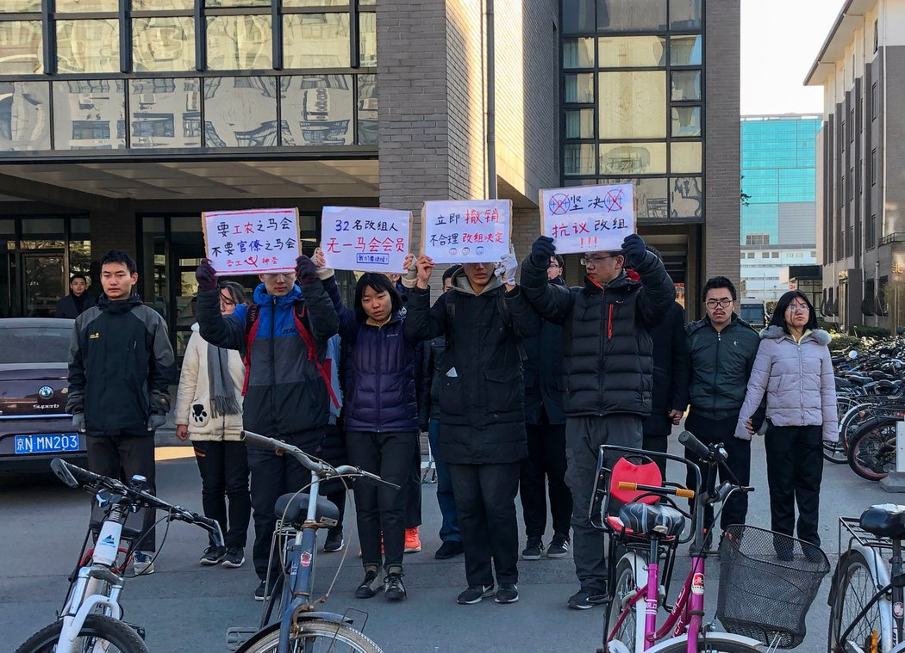

# 中国压制左派青年，北大学生举行抗议活动 - 纽约时报中文网

赫海威

2019年1月2日

周五，学生举行示威，抗议北京大学强行改组一个马克思主义学会的领导层。 Eva Xiao/Agence France-Presse — Getty Images

北京——上周五，中国一所顶尖高校的学生谴责政府压制学生领导的争取工人权利运动的做法，这场运动令执政的共产党难堪。

来自北京大学的十几名学生上周五在校园举行抗议活动，希望各界关注北大试图惩罚参加工人运动学生的做法，这次抗议是对当局的罕见谴责。

这些学生属于一个人数不多但意志顽强的[年轻共产主义者](https://cn.nytimes.com/china/20180929/china-maoists-xi-protests/)群体，他们用左派意识形态来揭露中国各地的虐待劳工现象，呼吁更好地保护工人阶级。

这些学生将政府置于尴尬境地，因为他们引用[国家主席习近平提倡学习](https://cn.nytimes.com/china/20180629/chinese-classrooms-education-communists/)的毛泽东、马克思和列宁的教导，指出中国社会存在不平等、腐败和贪婪等问题。

活动人士说，校方迅速采取行动制止了周五的抗议活动，他们将学生关在教室里，进行通宵讯问。学生们已在周六上午被放了出来。

学生在网上发布的视频显示，[保安推搡抗议者](https://drive.google.com/file/d/1yByqTtV5Zk0ZZAymfDjIJwKNG-CoaJ14/view)，老师拉住学生不放，不让他们离开。

在一段用Twitter发布的视频中，一个手指被割伤的活动人士说，是警察弄伤了他。“他们想阻止我们传播真相，”他说。

当局的严厉做法反映了中共对年轻共产主义者及其不同寻常的工人运动活动的深切焦虑。

中共长期以来一直担心学生领导的抗议活动，特别是在1989年的民主运动之后。那场运动与学生有密切关系，并在天安门广场周围遭到血腥镇压。中共领导人可能担心，今年6月将到来的那次大屠杀的30周年纪念日，可能会引发新的抗议活动。

“他们不想对学生组织政治活动怀侥幸心理，”康奈尔大学(Cornell University)劳工问题学者伊莱·弗里德曼(Eli Friedman)说。由于前不久对学生工人运动活动的镇压，康奈尔大学在去年10月[暂停了](https://cn.nytimes.com/china/20181030/cornell-university-renmin/)一个与北京人民大学合办的交流项目。

上周五的抗议活动发生之前，北京大学校方曾试图阻止学生团体马克思主义学会纪念毛泽东诞辰125周年的活动。学生们说，上周三，学会会长邱占萱被安全官员带走问话，之后遭撤职。上周五，学生们举着标语，要求学校恢复邱占萱和其他几名学生的学会职务。

北京大学没有回应记者上周五提出的置评请求。

这些年轻的共产主义者去年夏天开始组织起来，数十名左派学生在中国南方的工厂聚集，与那些寻求组建未得到中共官方支持的工会的工人站在一起。

在支持工人运动的整个过程中，这些活动人士一直坚定地表示支持习近平和共产主义教义。例如，在上周庆祝毛泽东诞辰时，他们唱着歌颂社会主义的歌曲，高呼“毛主席万岁！”“工人阶级万岁！”的口号。

虽然左派学生对社会的批评在大学校园里得到了少数学生的支持，但随着政府加大了拘留学生工人运动活动领导人的力度，他们的人数最近几周有所减少。

过去几个月里，已有二十多名活动人士被拘留、失踪或被软禁。据目击者说，去年11月，参加过这场运动、最近从北京大学毕业的学生张圣业在校园里[遭殴打后被拖进](https://cn.nytimes.com/china/20181112/china-student-activists/)一辆汽车带走。

自2012年上台以来，习近平一直试图遏制异见，尤其是在大学校园里。维权人士说，对年轻共产主义者的镇压表明，政府对批评的容忍度越来越低。

“传递的信息很明确，”国际特赦组织(Amnesty International)驻香港研究员潘嘉伟(Patrick Poon)说。“没有人不受控制，就连马克思主义者也不例外。”

赫海威(Javier C. Hernández)是《纽约时报》驻北京记者。欢迎在Twitter上关注他 [@HernandezJavier](https://twitter.com/HernandezJavier)。

翻译：Cindy Hao

[点击查看本文英文版。](https://www.nytimes.com/2018/12/28/world/asia/chinese-university-crackdown-students.html)

---------------------------------------------------

原网址: [访问](https://cn.nytimes.com/china/20190102/chinese-university-crackdown-students/?utm_source=tw-nytimeschinese&utm_medium=social&utm_campaign=cur)

创建于: 2019-01-02 23:06:24

标签: 扛着红旗反红旗

