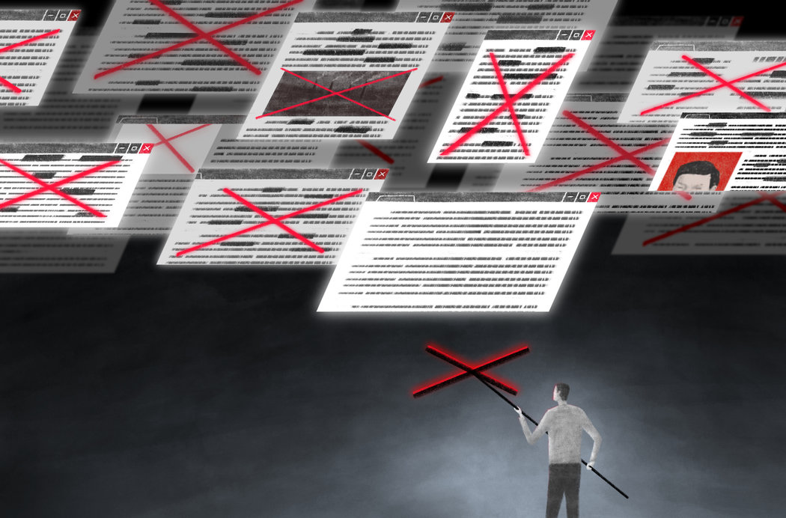

# 互联网审查工厂：一个有中国特色的新生行业 - 纽约时报中文网

新新世界

袁莉

2019年1月2日

Jialun Deng

刚开始干专业审查员的工作时，李城志有很多东西要学。

和[中国的许多同龄人](https://cn.nytimes.com/technology/20180807/china-generation-blocked-internet/ "Link: https://cn.nytimes.com/technology/20180807/china-generation-blocked-internet/")一样，这位刚大学毕业不久的24岁年轻人对[1989年天安门镇压](https://www.nytimes.com/2014/06/04/world/asia/times-coverage-of-tiananmen-square-25-years-ago.html "Link: https://www.nytimes.com/2014/06/04/world/asia/times-coverage-of-tiananmen-square-25-years-ago.html")知之甚少。他从未听说过中国最著名的异见人士、诺贝尔和平奖得主[刘晓波](https://www.nytimes.com/topic/person/liu-xiaobo)。刘晓波两年前[在监禁中去世](https://cn.nytimes.com/china/20170713/liu-xiaobo-dies-at-61/)。

经过培训，现在他知道应该找什么——以及应该屏蔽什么。他花大量时间浏览网络，帮中国媒体公司寻找任何可能激怒政府的内容。他知道如何辨别那些[影射中国领导人和丑闻](https://cn.nytimes.com/china/20151021/c21sino-jiang/)的暗语，或者那些[中国政府不希望人们读到的话题](https://www.nytimes.com/2009/03/12/world/asia/12beast.html)的[网络笑话](https://www.nytimes.com/2018/11/19/fashion/china-social-media-weibo-wechat.html)。

脸上仍有青春痘痕迹的李城志对待自己的工作非常认真。“这个肯定帮助净化网络空间，”他说。

对中国企业来说，在网络审查上[确保顺从政府意愿](https://cn.nytimes.com/business/20170804/china-internet-censorship/)是关乎生死的大事。同时，政府要求企业进行自我审查，不少公司不得不雇佣数千人来监管其内容。

这催生了一个增长快速、利润丰厚的新行业：审查工厂。

李城志为总部在北京的科技服务公司[博彦科技](https://www.beyondsoft.com/)工作，其业务包括为其他公司承担审查工作。他在该公司位于成都市的办公室工作。那里位于高科技产业区的中心，光线充足，很像北京和深圳等科技中心那些资金充裕的初创企业的办公室。公司是最近才搬到这个地方，博彦的客户抱怨它以前的办公室太拥挤，员工没法好好工作。

“漏出去一条就是严重的政治错误，”博彦互联网服务业务主管杨潇表示。（博彦以签署了保密协议为由，拒绝透露其为哪家中国媒体或网络公司工作。）  

中国建立了世界上[最广泛、复杂](https://www.nytimes.com/topic/destination/internet-censorship-in-china)的网络审查制度。在中国国家主席习近平的领导下，这个审查体系变得愈加强大。习近平希望互联网在加强共产党对社会的控制方面发挥更大作用。更多的内容[被认为是敏感的](https://cn.nytimes.com/business/20180413/china-bytedance-duanzi-censor/)。惩罚[变得越来越严厉](https://cn.nytimes.com/technology/20180412/china-toutiao-bytedance-censor/)。

中国以前对互联网审查三缄其口，现在却[宣扬由政府监管互联网的愿景](https://cn.nytimes.com/china/20171204/china-internet-censorship-wang-huning/)。这一愿景在其他一些国家[引起了意想不到的共鸣](https://cn.nytimes.com/china/20171017/china-internet-cyber-control/)。就连西欧和[美国](https://www.nytimes.com/2018/04/11/business/zuckerberg-facebook-congress.html)等传统的言论自由堡垒也在考虑数字世界的极限。[Facebook](https://www.nytimes.com/2018/07/25/technology/facebook-revenue-scandals.html)和[YouTube](https://www.nytimes.com/2017/12/04/technology/youtube-children.html)等平台表示，它们将再雇佣数千人以更好地管理自己的内容。

而李城志这样的从业人员展现了网络审查的极端——它控制着中国8亿多互联网用户每天看到的内容。

博彦科技在其内容审查工厂雇佣了4000多名像李城志这样的员工，日夜浏览和审查网络内容。2016年，这样的员工只有200名左右。  

“我们是数据行业的富士康，”杨潇把自己的公司比作为苹果生产iPhone和其他产品的最大代工厂。

许多网络媒体公司都有自己的内部内容审查团队，有时可以多达数千人。他们正在探索让人工智能来做这项工作。一家大型网络媒体公司的人工智能实验室负责人说，该公司有120种机器学习模型。

但成果是不稳定的。用户可以很容易地欺骗算法。  

“机器人虽然智能，但没有人的思维灵活，”李城志说。“它们审查内容的时候漏掉了很多东西。”

博彦科技在成都有一个160人的团队，每天分四个班次，在一个新闻聚合应用程序上审查可能带有政治敏感性的内容。

对于同一款应用，博彦在中国西部城市西安还有另一个团队，负责审查可能存在的粗俗或污秽内容。和世界其他地方一样，中国的互联网上充斥着色情内容，以及其他许多用户可能会觉得受冒犯的内容。

在成都的办公室，工作人员必须把自己的智能手机放在走廊的储物柜里。他们的电脑上不能截屏或发送信息。

工作人员几乎都是20多岁的大学毕业生。他们通常不了解政治，或是对政治漠不关心。在中国，许多家长和老师告诉年轻人，关心政治只会带来麻烦。

为了克服这个问题，杨潇和同事们开发了一个复杂的培训系统。新员工从为期一周的“理论”培训开始，在此期间，老员工会向他们传授他们以前不知道的敏感信息。

“我隔壁就是一个大培训室，”杨潇说。“经常会听到里面的嗷嗷嗷惊讶的声音。”

“现在小孩六四是什么东西都不知道，”他指的是1989年的天安门镇压。“他们真不知道。”

博彦科技基于这些信息开发了一个庞大的数据库，杨潇称其为公司的“核心竞争力”之一。他们还使用反审查软件定期访问被中国政府屏蔽的所谓反革命网站，然后更新数据库。

新员工就像准备高考一样学习这个数据库。两周后，他们必须通过考试。

每台电脑的屏幕保护程序都是一样的：中共最高领导机构中共中央政治局现任和前任常委的照片和名字。工作人员必须记住这些面孔：只有政府网站和经过特别批准的政治博客——一个所谓的“白名单”——才可以贴出最高领导人的照片。

在每个班次开始时，工作人员会听取客户发出的最新审查指令，这些指令是客户自己从政府审查机构收到的。然后，工作人员必须回答大约10个测试记忆力的问题。考试的结果影响到他们的工资绩效。

最近一个周五，其中的一个考试问题是：以下哪个名字是中国前总理[李鹏](https://www.nytimes.com/2003/03/11/world/li-peng-retires-but-his-infamy-for-tiananmen-massacre-endures.html)的女儿？正确的答案是李小琳，长期以来，因为[昂贵的时尚品味](https://cn.nytimes.com/china/20150315/c15frugal/)，并且是[许多身居高位或富有的高干子女](https://www.nytimes.com/2012/05/18/world/asia/china-princelings-using-family-ties-to-gain-riches.html)之一，她在网上一直是嘲笑的对象。

这是个相对简单的测试。更难的考验是识别中国互联网用户在谈论时事时为逃避严格的审查体系而采用的迂回方式。

以香港一家新闻网站2017年的[评论](https://hk.on.cc/hk/bkn/cnt/commentary/20170723/bkn-20170723002026055-0723_00832_001_cn.html)为例，它将自毛泽东以来的六位中国领导人比作汉朝的皇帝。一些中国用户在提到领导人时使用皇帝的名字作为代称。博彦的员工必须知道哪个皇帝的名字对应哪个领导人。

还有那些摆着一张空椅子的照片。它们指的是[诺贝尔奖得主刘晓波](https://cn.nytimes.com/china/20170713/liu-xiaobo-dies-at-61/)，他被禁止离开中国出席颁奖典礼，由一张空椅子代表他。此外，引用乔治·奥威尔(George Orwell)的小说《1984》也是被禁止的。

博彦的软件在网页上搜索，用不同颜色标记可能犯禁的词语。高管们说，如果一个页面上到处都是按颜色分类的单词，通常就需要仔细查看。如果只有一两个，基本上可以安全通过。

据[博彦的网站](http://img01.beyondsoft.com/cate/tag_142.pdf)介绍，其内容监控服务“彩虹盾”收录了10多万个基础敏感词和300多万个衍生词。政治敏感词占其总数的三分之一，其次是色情、卖淫、赌博和刀具方面的内容。

像李城志这样的工作人员每月收入在350到500美元之间，这在成都大约是平均水平。每个工人在轮班期间要阅读1000到2000篇文章。上传到新闻应用的文章必须在一小时内得到批准或拒绝。杨潇说，与富士康员工不同的是，他们不经常加班，因为加班时间长可能会影响准确性。

出错是很容易的。比如一篇关于中国第一夫人彭丽媛的文章，错误地使用了据谣传与另一位领导人有关系的著名歌手的照片。杨潇说，它在发出去之前被人发现了。

年轻的审查员李城志说，最严重的错误几乎都与高层领导有关。有一次，因为太累，他错过了一个不在白名单上的网站发的一张习近平的小照片。他至今为此而自责。

当被问及是否与家人和朋友分享了他在工作中所学到的东西，比如天安门事件时，李城志强烈表示没有。

“这个因为本来就不是外传的东西，”李城志说。“传出去知道的人多了就谣言四起，传着就变味了。”

但是那场镇压是历史，不是谣言。他怎么跟自己解释呢?  

“有些东西，”他说，“就是要遵纪守法。”

欢迎在Twitter上关注袁莉：_[@LiYuan6](https://twitter.com/LiYuan6)。_

翻译：纽约时报中文网

[点击查看本文英文版](https://www.nytimes.com/2019/01/02/business/china-internet-censor.html)。

---------------------------------------------------

原网址: [访问](https://cn.nytimes.com/technology/20190102/china-internet-censor/?utm_source=tw-nytimeschinese&utm_medium=social&utm_campaign=cur)

创建于: 2019-01-03 23:31:50

