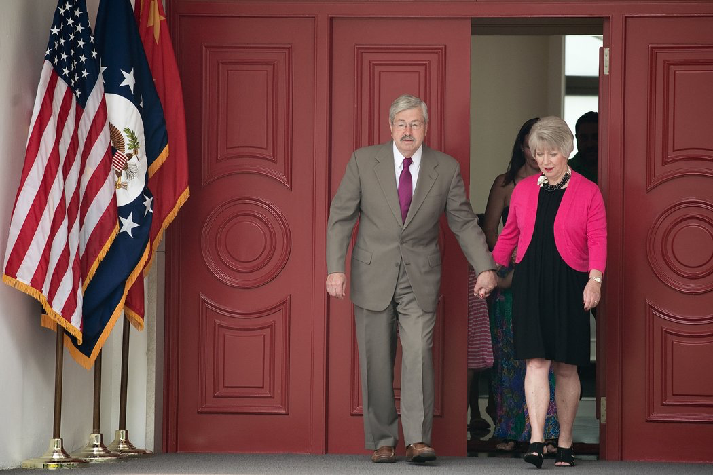
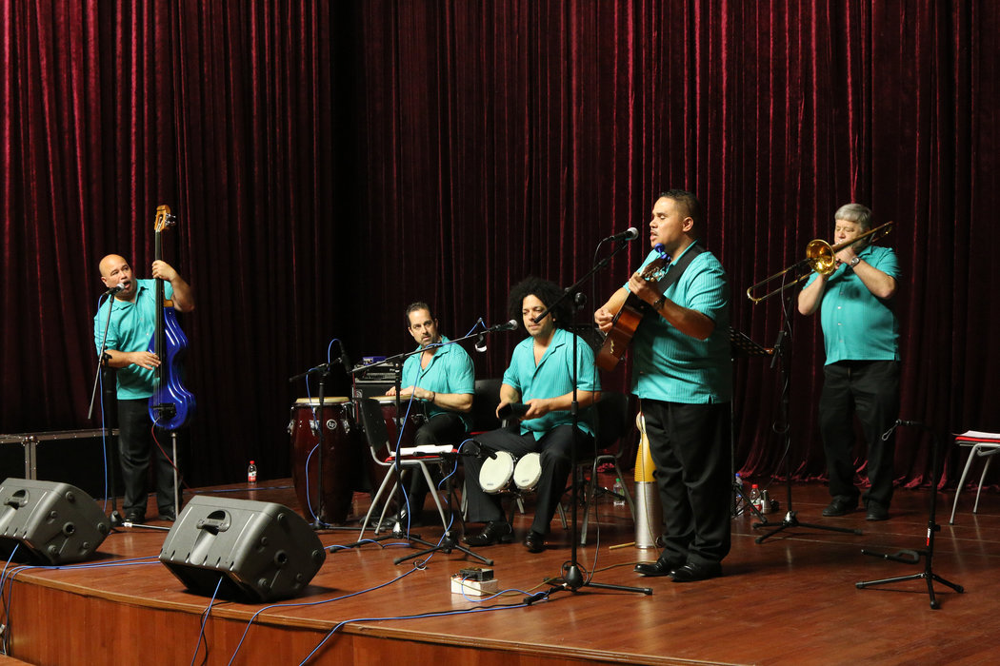
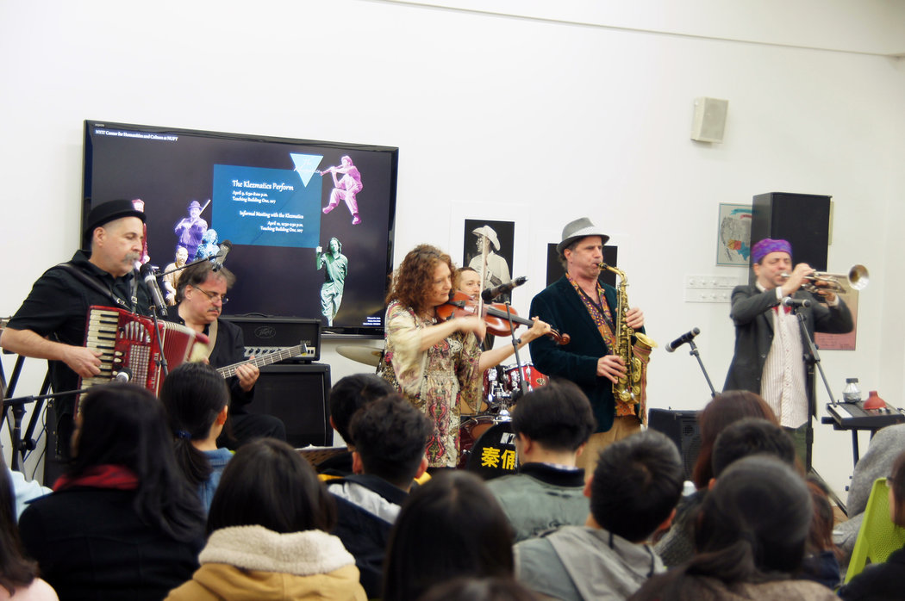
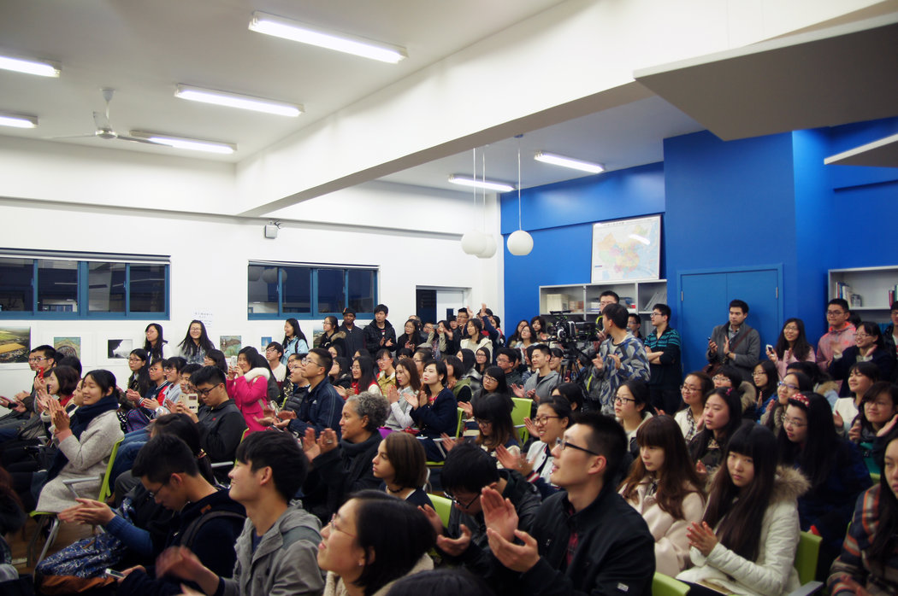

# 文化外交受挫，在华美国中心纷纷关闭 - 纽约时报中文网

JANE PERLEZ, LUZ DING

2019年1月3日

美国驻华大使特里·布兰斯塔德(Terry Branstad)与妻子克里斯汀(Christine)在北京住所。今年秋天，一所中国大学拒绝了他访问美国文化中心的请求。 Nicolas Asfouri/Agence France-Presse — Getty Images

北京——美国驻中国大使特里·布兰斯塔德(Terry Branstad)本想进行一次在大多数国家都属稀松平常的参观访问。

艾奥瓦州立大学(Iowa State University)是他最喜欢的学校之一，该校在中国的一个内陆省份有一个推广美国文化的中心，这位随意放松的前艾奥瓦州州长期待着能够回答中国学生的提问。

这个中心主要由美国国务院资助，课程安排上追求安全，以免触犯中国政府的敏感神经。它不涉政治。英语课的重点放在时尚、音乐和体育上。它还有一个以两国的标志性动物命名的写作大赛“[白头鹰与大熊猫](https://pandabaldeagle.wordpress.com/)”。

但是河南师范大学在没有给出任何解释的情况下，断然拒绝布兰斯塔德今年秋天参观该中心。河南师范大学位于黄河边，校园前面有一尊醒目的毛泽东塑像。

这一拒绝突显出，美中两国不仅在贸易和技术层面展开了竞争，在定义两国社会的价值观和信仰上也在一较高下，这是美苏间冷战的一种再现。

在中国，这样的一些项目绕过共产党的过滤，提供了了解美国文化的窗口，而这些项目的退出，可能加深世界上两个最大经济体的社会分歧。

拒绝布兰斯塔德的这个中心，是美国国务院过去10年里在中国的大学校园开设的20多个中心之一，它们通过提供英语课、放映电影、举办来访的音乐和舞蹈表演，宣传美国文化，对反美宣传作出反击。

今天，在中国有关当局拒绝美国官员进入这些中心，国安人员审问了一名在中国校园工作的美国学者之后，这些美国中心已经关闭。

北达科他大学(University of North Dakota)的珍妮弗·塔林(Jennifer Tarlin)说，“一段时间之后，情况很明显了，这些中心不再是美国人的资产，而是变成了可怕的负担。”她曾于2011年夏天开始担任上海一所大学的美国中心主任。

2015年在上海理工大学美国文化交流中心举行的拉丁音乐演出。 Zhang Jiawei

该计划启动之际，恰逢中国的民族主义情绪上升。中国国家主席习近平六年前上台后不久，就发起了一场反对西方价值观的运动，让学界的共产党人掌握权力，给美国文化中哪怕最无害、最无涉政治的表达方式划定红线。

随着特朗普政府致力于疏远各国，并对北京在美国的宣传活动感到愤怒，出钱在中国推广美国文化的做法在华盛顿变得尤其不受欢迎。

中国外交部没有回应记者的置评请求。

美国中心在10年前设立的时候，可谓逆势而上。在海外推广美国文化曾是美国外交政策的一个亮点，后来被认为过时了，冷战结束后，这个做法就遭放弃。

上世纪90年代初，[保守派共和党人](https://www.nytimes.com/1995/03/16/world/helms-seeks-to-merge-foreign-policy-agencies.html "Link: https://www.nytimes.com/1995/03/16/world/helms-seeks-to-merge-foreign-policy-agencies.html")和克林顿的民主党人合力撤销了美国新闻署(United States Information Agency)，削减海外文化项目的预算。当时认为，民主已经占据上风，互联网使文化外交变得不必要了。

但中国是一个特例。美国政府担心的是受到严格控制的中国官媒对美国的负面描述。

在美国的大学校园里，中国政府出钱建起了一个孔子学院网络，北京方面来任命教师，并指定课程安排。它从[奥巴马政府时期](https://www.foreign.senate.gov/imo/media/doc/S%20Prt%20Another%20US%20Deficit%20China%20and%20America%20Public%20Diplomacy%20in%20the%20Age%20of%20the%20Internet%2003042011.pdf "Link: https://www.foreign.senate.gov/imo/media/doc/S%20Prt%20Another%20US%20Deficit%20China%20and%20America%20Public%20Diplomacy%20in%20the%20Age%20of%20the%20Internet%2003042011.pdf")的大约70所，发展到今天的100多所。

2011年，在中国只有5个大致相当的美国机构——它们位于美国使领馆，这些地点受到中国安全部门的密切关注，当地民众不得入内。

奥巴马政府感到有必要采取行动。

到2012年，美国国务院已经向20多所美国大学每所提供10万美元的拨款，用于在中国大学开设中心。为了避嫌，国务院敦促这些中心从美国的私人渠道寻求额外的资金来源，并且不插手课程设计方面的决策。

时任俄亥俄州立大学(Ohio State University)国际事务副教务长的威廉·布鲁斯坦(William Brustein)，回忆起2011年在北京跟美国驻华大使洪博培(Jon M. Huntsman Jr.)会面的情形。

大使向布鲁斯坦介绍了国务院的这个新项目。

“他们就像孔子学院——这是与之相当的美国机构，”布鲁斯坦回忆大使这么说。“‘你应该开一个中心——尽量不要选北京或上海这样的地方。’”

2015年，纽约乐队Klezmatics在南京邮电大学美国文化中心演出。 Huang Wei

俄亥俄州立大学为自己已经有许多自费中国留学生而感到自豪，该校认为，建立这样的中心会吸引更多学生。该校的很多学生来自湖北，所以布鲁斯坦很容易就说服了武汉大学（当地的一所重点大学）提供一个展示美国主题的地方。

2012年，该中心在一个类似大开间公寓的空间启用，里面有厨房，有英语烹饪书，由俄亥俄州立大学的英语老师鲍勃·埃克哈特(Bob Eckhart)牵头，他请来了爵士乐团和舞蹈团体进行表演。

埃克哈特说，最成功的演出是一群非裔美国舞者表演的踢踏舞。“我们强调，我们不仅仅是美国的拉拉队长，我们展示的是真正的美国文化。”

其他中心也在中国各地的大学落成。

节目时常显得有些怪异。在上海理工大学，塔林请来美国音乐家表演大萧条时期的民谣。她采用女权主义作家卡罗尔·吉利根(Carol Gilligan)的剧本，做了歌剧《红字》的工坊演出。

没过多久，这些中心就与习近平主席的正统观念及其[反对民主自由的运动](https://cn.nytimes.com/china/20150130/c02textbook/ "Link: https://sinosphere.blogs.nytimes.com/2015/01/30/china-warns-against-western-values-in-imported-textbooks/")产生了冲突。

2015年年初，教育部长袁贵仁宣布了一项严厉的法令，表明了官方的不满。他说绝不能让传播西方价值观念的书籍进入课堂，中国的大学必须确保习近平思想处于前沿和中心。

突然，大学官员不再接待美国文化团体和演讲者。前外交官和现任外交官说，中国将注意力集中在这些中心与美国国务院的关系上，怀疑美国以它们为幌子，传播民主思想。

2015年，中国国家安全官员在南京约谈纽约理工学院(New York Institute of Technology)的项目负责人莫妮克·泰勒(Monique Taylor)，进行了数小时的问讯。

泰勒负责由该学院主办的、设于南京邮电大学的美国中心，她还负责另一个纽约教员访问南京校区的学术项目。

据三位知情人士透露，这一审讯令这所美国大学感到不安。该校发言人拒绝置评。

欣赏Klezmatics乐队表演的观众们。 Huang Wei

此事发生后，该大学拒绝了美国国务院的一项新拨款，并从该中心的名称中删除了“美国”一词。它被重新命名为Campus Commons（校园公共空间）。

在2017年[对驻华大使馆的评估](https://www.stateoig.gov/system/files/isp-i-18-04_0.pdf "Link: https://www.stateoig.gov/system/files/isp-i-18-04_0.pdf")中，美国国务院总监察长描述了中国政府如何将美国公共事务外交官称为“外国敌对势力”。报告指出，从2016年1月到2017年4月，共有153起中国人阻挠美国公共事务官员工作的事例，其中包括这些中心。

21世纪初，随着孔子学院在美国蓬勃发展，那些想宣传美国软实力的人最终占据了上风，在中国开设了这些中心。但负责文化的美国外交官永远无法让这些中心打开局面：一些前外交官说，在华盛顿，经济关系被认为要重要得多。

在担任国务卿期间，约翰·克里(John Kerry)向刘延东提起了美国中心的问题，后者曾任中国副总理，是中国主管文化的最高官员，直到今年才卸任。

当时负责公共外交和公共事务的副国务卿理查德·斯坦格尔(Richard Stengel)说，中方对克里的投诉不予理会。

“根据我的经验，中国的方案是，先合理化，然后最小化，”斯坦格尔在解释中国高级官员否认有任何问题时说。“他们首先说，‘你也这样做了’。然后他们说：‘这不是我的责任，这发生在地方层面’。以及最后：‘反正这也没什么大不了’。”

美国国务院在29个中心总共投入了510万美元，但其中10个中心从未开放过。总检察长的报告得出结论说，这项努力“基本上是无效的”。

美国国务院表示，已停止为所有中心提供资金。

布兰斯塔德不是首个因为这些中心而陷入麻烦的美国使节。

克里曾向中国驻华盛顿大使崔天凯投诉，时任美国驻华大使马克斯·鲍卡斯(Max Baucus)也被禁止前往其中一个中心。

据当时参与了对话的斯坦格尔说，克里转向崔天凯，并问他：“我们有哪一次限制你去那些可以去的地方？”

崔天凯回答：“目前还没有。”

本文最初发表于2018年12月31日。

翻译：纽约时报中文网

[点击查看本文英文版。](http://www.nytimes.com/2018/12/30/world/asia/china-american-centers-culture.html)

---------------------------------------------------

原网址: [访问](https://cn.nytimes.com/china/20190103/china-american-centers-culture/?utm_source=tw-nytimeschinese&utm_medium=social&utm_campaign=cur)

创建于: 2019-01-03 24:45:33

