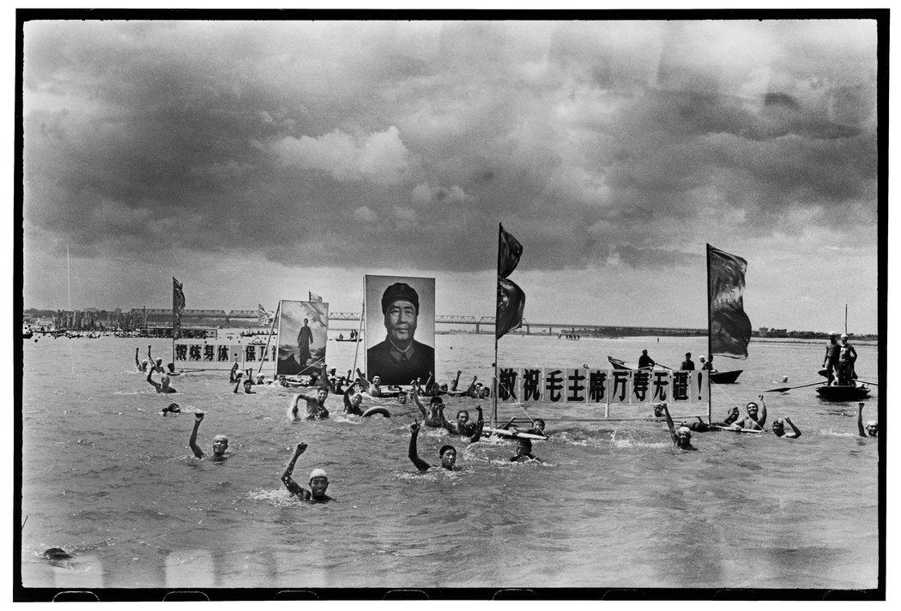

# 重拾文革记忆：挑战中共历史叙事的摄影师 - 纽约时报中文网

AMY QIN

2019年1月4日

1966年，摄影师李振盛在哈尔滨的一座体育馆参加了一场批斗会。一名党委书记和同样身为干部的妻子受到了批判，两人身上还被泼了墨水。 Li Zhensheng, via Chinese University Press

香港——摄影师李振盛的使命，是让他的同胞们记住中国现代史上最动荡的一段时期，而执政的共产党正越来越决意要将其洗白。

“全世界都知道文化大革命期间发生了什么，”李振盛说。“只有中国不知道。很多人都不知道。”

现年78岁的李振盛身穿深蓝色的摄影背心，最近在香港接受了采访。香港中文大学出版社10月出版了他的[《红色新闻兵》](http://red-colornewssoldier.com/ "Link: http://red-colornewssoldier.com/")一书的首个中文版。

这本集历史与回忆录于一体的影集汇集了李振盛于上世纪60年代在东北一家报社工作时拍摄的照片。自2003年以来，这些照片已在[60多个国家展出](https://lens.blogs.nytimes.com/2012/09/10/through-a-thwarted-cinematographers-eye-chinas-cultural-revolution/)，让世人见证“文革”——从1966年开始的一场令学生和老师、儿子和父亲、朋友和朋友反目成仇的十年动乱。

借由这次新版，李振盛成了一个小群体的一员——他们在毛泽东的极端统治中幸存下来，在习近平试图压制外界对中共的不堪历史进行批评之际，他们决心挑战官方的历史叙述。在习近平统治下，当局对不同的声音进行了广泛的意识形态打压，使得努力客观地记录历史的人身处险境。

1968年，5岁的小女孩康文洁（音）在哈尔滨为红卫兵表演忠字舞。 Li Zhensheng, via Chinese University Press

在中国，“文革”越来越成为一个禁忌话题，官方曾经多次阻止李振盛发表这些照片。他的新书只能在半自治城市香港发行，但他仍然希望这本书能进入中国大陆。

“我们会把这些书一本本地带到大陆，”李振盛说。“就像蚂蚁搬家一样。”

毛泽东发动“文革”后，这场最初旨在重新掌控高层的政治行动，很快就变成了一场席卷全国、撼动社会各阶层的运动。激进的青年组织红卫兵互相斗争，打击所谓的“阶级敌人”，包括知识分子、官员和其他人。

数千万人受到迫害。据估计，多达150万人死于这场运动。许多人被迫自杀。

李振盛说，“在中国近代历史上，还没有哪场政治运动像‘文革’那样持续如此之久、影响如此之广、伤害如此之大。”

他还表示，他担心如果没有深刻的历史反思，中国可能还会再次发生类似的事情。习近平努力把自己抬高到跟毛泽东一样的地位，并[无限延长任期](https://cn.nytimes.com/china/20180225/china-xi-jinping/)，已经让很多人想起那段一个人说了算的时代，当时毛像神一样受到崇拜，最终导致了文化大革命这样的灾难。

人民解放军的飞行员正在阅读《毛主席语录》。 Li Zhensheng, via Chinese University Press

李振盛从那时起收集的照片细致入微地描绘了这场运动带来的痛苦与激情。在相机稀缺的年代，他获得了参加官方活动的宝贵机会，并拍摄了三万多张照片，其中许多被他小心地藏在哈尔滨家中的地板下面。

在这些照片里，红卫兵强迫一座寺院的僧人[公开谴责佛经](https://contact.photoshelter.com/gallery-image/Li-Zhensheng-Red-Color-News-Soldier-Book/G0000rN8yxCx.Bk0/I0000LjAuQmeIi0k/C0000czlAAq16AeA)；他们还扯掉一名官员的头发，因为觉得他长得太像毛泽东了。在松花江游泳的人们高声向毛主席致敬。还有许多官员和普通人的照片，他们有的站在椅子上、有的身上溅满黑墨，许多人低下头，任凭群众谴责他们所谓的罪行，判处他们服劳役，或者[把他们处决](https://contact.photoshelter.com/gallery-image/Li-Zhensheng-Red-Color-News-Soldier-Book/G0000rN8yxCx.Bk0/I0000RvA4WjFPdkQ/C0000czlAAq16AeA)。

2003年，李振盛的照片首次在海外引起广泛关注，当时他与纽约市联系图片社(Contact Press Images)总监罗伯特·普莱奇(Robert Pledge)合作，出版了《红色新闻兵》。

几乎是在同时，中国的出版商开始联系李振盛，当时他为了能离孩子们近一些，已经搬到纽约。他知道这些照片不太可能获得中国官方审查机构的批准，因此，他和中国编辑们为该书中文版制定的方案是：将有争议的照片淹没在大量文本之中。

但是审查机构没有给出任何解释就否决了这本即将完成的书。

愤怒的李振盛向中国高层领导人写信抗议。他的主要论点之一是：2000年，邓小平的女儿出版了一本关于她父亲的书，书名是《邓小平与文革：一个女儿对那个重要年代的回忆》（Deng Xiaoping and the Cultural Revolution: A Daughter Recalls the Critical Years，中国大陆版名为《我的父亲邓小平》。——译注）。

“我很生气，”李振盛回忆。“为什么邓小平能分享他的文革经历，李振盛就不能？”

1967年，人们一边畅游松花江，一边高呼拥护毛的口号。 Li Zhensheng, via Chinese University Press

如今，距离文化大革命开始已经过去了半个多世纪，中国公众对那段时期的讨论很少。近年来，随着中国领导人发动对本国近代史的重新审视，被一些人称为中国的“集体失忆”的情况变得更糟。

去年，《南华早报》报道称，一家国有出版社显然[对一本中学历史教科书进行了修改](https://www.scmp.com/news/china/society/article/2127817/controversy-over-chinese-textbooks-cultural-revolution-chapter)，删去了毛泽东在煽动文化大革命过程中犯下的“错误”。最近在北京首都博物馆举办的一场展览中，中国官方通讯社新华社摄影师提供的历史照片没有提到文革。

文化大革命并不总是禁区。1988年，一个全国性摄影比赛的组织者向李振盛提出了一个在中国当前政治气候下几乎无法想象的要求。

“在这么大的一场比赛中，我们不能无视整整十年的历史，”李振盛回忆一位组织者的话。那么，他可以考虑提交自己的照片参赛吗?

李振盛在比赛中获胜。当地新闻媒体和观察人士对这些照片感到震惊，它们比以往的照片更加完整地描绘了文化大革命。

自那以后，李振盛目睹中国的氛围发生了极大变化，他希望看到自己的照片在中国发表的决心变得更加坚定。

1980年，文化大革命期间的造反者王守信（左）被处决。一名警卫正在将一颗子弹交给行刑手。 Li Zhensheng, via Chinese University Press

“一些人批评我，说我把中国的家丑外扬，”他说。“但是德国已经正视了它的纳粹历史，美国仍然在讨论它的蓄奴历史，为什么我们中国人不能讨论我们自己的历史呢?”

尽管李振盛的照片无法在中国大陆发表，但他曾在清华大学和北京大学等几所中国大学发表过有关文化大革命的演讲。

2017年，四川省一个小镇开设了一座新博物馆，专门展示李振盛的生活和摄影。这是由房地产开发商与历史爱好者樊建川开设的[一系列私人历史博物馆](http://www.jc-museum.cn/en/)的一部分。和李振盛一样，樊建川也非常熟悉中国审查制度的推拉策略。

但是走这条路意味着要做出妥协。在香港的酒店房间里，李振盛提到了一本新书，他准备在其中收入1989年天安门广场民主抗议者遭到镇压期间，他在北京拍摄的照片。

当被问及是否计划出版这本书时，这位通常固执己见的摄影师沉默了下来。他说，他在犹豫，因为他担心四川的博物馆可能会因当局报复而遭关闭。

“我们先别说天安门那本书，”他说。“一次一件事。”

Zoe Mou自北京对本文有研究贡献。

欢迎在Twitter上关注本文作者Amy Qin _[@amyyqin](https://twitter.com/amyyqin)。_

翻译：纽约时报中文网

[点击查看本文英文版。](https://www.nytimes.com/2019/01/01/world/asia/china-cultural-revolution-photography.html)

---------------------------------------------------

原网址: [访问](https://cn.nytimes.com/china/20190104/china-cultural-revolution-photography/)

创建于: 2019-01-04 21:06:02

