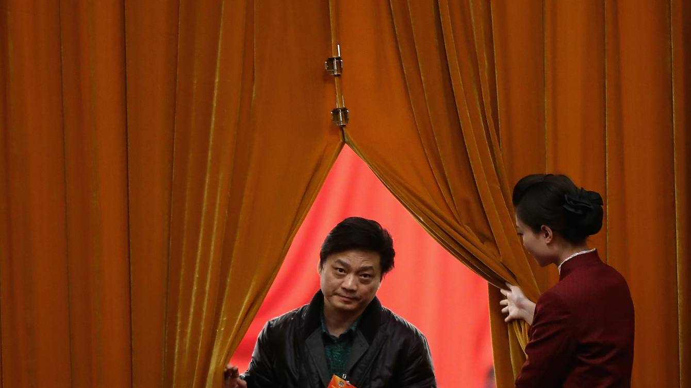

# 从最高法院卷宗失踪案看中国的“人治”与法治 - - FT中文网

[法律](http://www.ftchinese.com/tag/%E6%B3%95%E5%BE%8B)关注

> 刘裘蒂：中国未来改革开放的方向，必须要朝依法治国而深耕。对于依法治国目标，司法独立和媒体监督的力量更重要。

更新于2019年1月5日 16:12 FT中文网专栏作家 [刘裘蒂](http://www.ftchinese.com/search/%E5%88%98%E8%A3%98%E8%92%82/relative_byline)

这是电视剧《人民的名义》续集里的情节？这是最高法院还是“黑社会”？当我们看到一名中国最高院的法官通过网上流传的视频，描述一起法院内离奇的“千亿矿权案”卷宗失踪事件，并为了保命而留下证据时，除了感到不寒而栗，难道不在心里打了几个大问号？

2018年12月26日深夜，崔永元发微博称：“最高院有贼？！陕北千亿矿权案卷宗被盗两年至今无下落！！！”接下来数天，通过像子弹一样的微博，他公开向最高法院的最高领导挑战。

如果票选2018年中国媒体（和法律）界的第一风云人物，非崔永元莫属。他一手揭穿了范冰冰“阴阳合同”，连同带动了整个影视圈乱象的曝光，顿时，一些曾经叱咤一时的超级巨星，风声鹤唳，变成欺骗人民的逃税蛀虫，公开声明乞求原谅。

而针对最高院卷宗案，崔永元穿插“国骂”连珠炮式的微博，隐隐指向所有当代中国社会让人颤栗的关键问题：国有资产分配、契约精神、“以权代法”、司法独立……

崔永元的微博表面上好像是为了原告发声，但原告已经在2017年底胜诉，那么他的目的到底是什么？而什么样的原因促使受理卷宗的法官在两年后打破沉默？为什么选择用这种方式打破沉默？这个事件是否会变成中国法律界的“临界点”？

《法制日报》一篇署名“督君按”的文章认为，“引发‘海啸’的真正原因或是最高院的判决执行受阻，有成为‘司法白条’的可能。那么，到底谁有如此能耐可令最高院的判决成为‘白条’？这或许是崔永元这次操盘的真正目的。”

**崔永元爆料时间轴**

2018年12月26日崔永元在新浪微博发表言论称：“该案二审全部卷宗一次性丢失”，“卷宗被盗两年无下落。” 有媒体报道《陕北千亿矿权案卷宗在审理机关丢失》。

2018年12月27日，最高人民法院通过媒体表示，“陕北千亿矿权案”二审全部卷宗目前完整保存在最高法院档案处。“上述报道和言论所称该案二审卷宗一次性丢失和卷宗被盗两年无下落，均没有任何事实和证据证明，属于谣言。”崔永元连续质疑认为法院撒谎，并说要发布证据。

2018年12月28日，崔永元的微博公布一个来自最高院内部的信息来源：“今年5月至8月间我院民一庭庭长程新文，多次让书记员李海燕同志通知合议庭成员，让他们补签一份凯奇莱案2013年中止审理的合议笔录。合议庭成员都觉得不妥给婉拒了。同时他们解释，即便签了字也没意义，因为那份笔录是由奚晓明副院长签发的，他已经被判刑入狱了，他的签名怎么办？即使他们签了没有奚院长的签名还是假的。但最后迫于压力他们还是签了，背后是什么力量，大家心里都明白，但落款时间是2018年。这事只要有人查，我觉得民一庭所有在职不在职的都会如实讲。”

2018年12月29日，《华夏时报》的公众号发布了一则视频，一名被认为是最高法院法官王林清的人通过视频现身，亲自说明卷宗离奇消失的始末，并且说“我想通过这个视频的目的，就是要给自己，为保护自己免遭不测，留下一些证据。”

根据王林清的记述，2016年11月下旬他准备写判决书的时候，该案二审的一本正卷和一本副卷竟然不翼而飞。对于如此重大的案子，如果这个案卷一丢，他可能就会被开除。王林清当时立即报告程新文庭长，后来程庭长调取监控回来，发现监控录像能够显示出王带着卷宗回到了自己的办公室，一会他就空着手走出了办公室。第二天监控就坏了。王林清对着镜头说：“我一听就感觉这个事情非常蹊跷，监控怎么可能说坏就坏，而且是安装不久的监控，并且我的办公室门口有两个监控，坏一个也不可能两个都坏呀。”

12月29日晚间，针对该事件，最高法机关纪委做出回应：“2018年12月29日13时32分，微博账号‘崔永元’发博文并附四张图片。经核实，其中两张图片所载内容与目前保存在最高人民法院档案处的（2011）民一终字第81号案件副卷的有关内容相同（其他两张为媒体报道截图）。我们已经启动调查程序，欢迎崔永元教授等知情人向我们提供情况。如发现我院工作人员违反审判纪律问题，将依纪依法严肃处理。”

2018年12月30日崔永元的微博说：“首先，最高院承认我披露的内容是真的，然后要追究违反审判纪律的人。那么，@最高人民法院应该向我道歉，我没造谣，是你们造谣。第二，不知道你们审判纪律是什么？高法大楼里丢案卷不报案、内部监控能黑屏，这能保护当事人利益吗？这属于遵守纪律吗？这是渎职违法！我要是在最高院工作，会冒死把这些问题案卷全拿出来交给中央！维护正义、维护法律尊严就是维护国家形象维护中国共产党的形象！任何人多大官职，都不能触碰这个底线。”

**“千亿矿权案”时间轴**

榆林凯奇莱能源投资有限公司（凯奇莱）与西安地质矿产勘查开发院（西勘院）因合作勘查合同产生纠纷，该案诉讼历时12年，历经六任陕西省长，三任陕西省高级法院院长，因双方争夺的探矿权价值已至千亿元，被称为“千亿矿权案”。

事情追溯到2003年，凯奇莱与西勘院签订合作勘查协议。凯奇莱探明菠萝井田储煤15.6亿吨后，西勘院在未提出解除合同情况下，于2006年与香港益业投资（集团）有限公司（香港益业）在同一标的上签订合作勘查协议，形成所谓的“一女两嫁”。

凯奇莱的控股人赵发琦向媒体提供的一份2005年详查数据显示，该协议勘查区的279.24平方公里区块下储藏着约19亿吨优质动力煤。根据当时的动力煤坑口价估算，这片矿区估价高达3800亿元。凯奇莱曾经支付1200万的前期探矿权费用，但是赵发琦声称签署协议前，他并不知道能不能挖到“黑金”：“勘查投资就跟赌博一样”，因为没有人知道地下到底有没有矿、质量怎么样。

根据《香港商报》的报道，香港益业的控股人是一位曾在陕西省政府担任打字员的女港商刘娟，她 17岁进入文工团，19岁进入陕西省农业机械化领导小组办公室，22岁时进入陕西电视大学中文系学习三年，后就读于深圳经贸大学涉外经济法律系。1990年毕业后，在政府工作两年，任打字员。后赴港建立香港益业。刘娟是如何拿到合作勘查协议的采矿权？目前尚不得而知。

2006年10月19日，陕西省高院做出一审判决，判凯奇莱胜诉，认为2003年8月25日原被告的合作勘查合同有效，双方继续履行。西勘院不服该判决，向最高人民法院提起上诉。最高法院审理该案期间，2008年5月4日陕西省政府办公厅向最高法院发出一份《关于西勘院与凯奇莱公司探矿权纠纷情况的报告》（《情况报告》），内容包括“西勘院与凯奇莱的合同没有完成备案，没有实施，应属无效合同”；“省高院一审判决对引用文件依据的理解不正确”；“执行一审判决将造成国有资产严重流失”等意见。

《情况报告》也提到，“如果维持省高级法院的判决，将会产生一系列严重后果”，“对陕西的稳定和发展大局带来较大的消极影响”。根据《财经》的报道，《情况报告》发至最高法院的一个背景是，2008年4月底，时任最高法院副院长奚晓明（后因受贿罪被判无期）就该案邀请陕西省政府官员到最高法院“商议案情”。此后，陕西省政府发送了《情况报告》。

2009年11月4日，最高人民法院以一审判决认定事实不清为由将该案发回重审。

2011年3月，陕西省高院推翻原一审判决，认定原被告双方所签合同行为违反省政府21次常务会议纪要精神，其行为实施将损害国家利益，应为无效合同。

2011年8月19日，榆林市公安局拘捕了赵发琦，理由是涉嫌虚报注册资本罪。赵发琦在看守所待了133天后被取保候审，后被判无罪。2013年赵发琦再次将该案上诉至最高法。与此同时，他公开举报了多名官员。

2015年7月，最高法原副院长奚晓明被调查。2017年2月16日，天津市第二中级人民法院公开宣判：对被告人奚晓明以受贿罪判处无期徒刑，剥夺政治权利终身，并处没收个人全部财产。

2017年11月，西勘院原院长陈磊被调查。此前陕西省国土资源厅原厅长王登记、陕西省地矿勘查开发总公司原董事长梁枫等人也被调查。

2017年12月21日，最高法院终审判决，认定双方合作勘查合同有效，继续履行，凯奇莱胜诉。

2018年12月初，央视报道称，千亿矿权案在陕西省高院执行近一年，毫无进展。

**王林清求自保的视频**

王林清的视频可以说是目前把卷宗离奇消失案带到新高度的关键。他的陈述具有“证词”的力度。

根据网络上搜索到的公开资料，王林清是山东烟台人，中国政法大学商法学博士、中国社会科学院金融学博士后、中国人民大学经济学博士后，是全国政法系统第一位“双博士后”，在2014年被评为第三届“中央国家机关青年五四奖章标兵”，2016年荣获第二届“首都十大杰出青年法学家”提名，从事民商事审判二十年，曾以最高法院办案标兵身份被《人民法院报》报道。裁判文书网和其他公开资料显示，王林清最后参与审理的案件停留在2017年，他是最高法院二级法官，但王林清没有在2017年成为最高法院首批入额法官，也未入围最高法院在2018年11月公布的第二批入额法官名单。

一反王林清过去西装笔挺的公开照片，视频中的王林清头发紊乱，穿着一件充满皱褶的短袖白衬衫，这也象征着最高法院的“人设崩塌”：一个在最高司法单位的法官居然必须以私人视频举证和自保。这个短视频是在一个房间的角落拍的，可能是当事人不想曝光所在地更多的背景，但由于在视觉上显现的是一个角落，很像被“逼到墙角”的感觉。视频显示，最高法院的法官的尊严已经遭到践踏。

《凤凰周刊》在今年1月3日发布了另一段9分钟的视频，王林清谈到审理另外一件王见刚与王永安的山西铁矿转让权益纠纷案时，受到上级的压力指使他做出对王永安有利的判决。由于王林清拒绝与领导苟同，也拒绝王永安巨额行贿，他不但受到王永安的威胁，也遭受到了一连串“奇特的经历”，包括对于他个人不同的调查和骚扰。这段视频的内容还没有得到第三方的核实，但是片首同样有一个开场白，王林清表示录制这个视频的目的是为了“保护自己免遭不速之测，留下一定的证据”。这则视频在《今日头条》发布后的15个小时被删。

当一名最高司法机构的成员，竟然不相信机构程序的公正，要选择自我暴露来伸张正义，这显示他不但是怕“丢官”，更怕“丢命”。更可见（指使）拿走卷宗的人后台不但很硬，也很嚣张。王林清已经用他的行动投出了他对于司法制度的不信任票。最高法院的法官竟然会担心自己的人身安全，这给人的印象是法院运行的逻辑像“黑社会”。

**“先判后审”**

为什么要偷卷宗？崔永元认为，卷宗失窃风波的关键是“先判后审”。其实，更确切地说，在“先判后审”之前还有“先批”！在1月2日发布的微博图片中，崔永元曝光了（如果经过核实将成为）最高法院高层直接干预审判过程的书面证据：陕北凯奇莱和陕西西勘院千亿矿产争夺案终审前，最高法院院长周强已经做出对判决的指示，还要求对案件的相关情况高度保密。周强的指示，乃是通过最高院原副院长奚晓明以批示方式，出现在不对外公开的副卷里。

在中国法院系统里“副卷”的机制有明文的法律依据。1984年最高人民法院、国家档案局颁发的《人民法院诉讼文书立卷归档办法》规定了正、副卷分别订立。1990年最高人民法院制定的《关于保守审判工作秘密的规定》指出，案件的请示、批复、领导批示、有关单位意见、合议庭笔录、审委会记录必须装订在副卷里。副卷的材料非因工作需要，又未经本院领导批准，任何单位和个人不得查阅。

1991年的《人民法院诉讼文书立卷归档办法》进一步明确了副卷的内容。2006年颁发的《人民法院执行文书立卷归档办法（试行）》规定了“上级法院及有关单位领导人对案件的批示”等不宜公开的资料。

最高人民法院2009年发布的《关于“五个严禁”的规定》及《关于违反“五个严禁”规定的处理办法》指出，违反规定泄露合议庭及审委会讨论案件的具体情况及其他审判、执行工作秘密的行为属于“泄露审判秘密”的行为，如果严重违反需要追究法律责任，甚至是刑事责任。

署名印波在《民主与法治周刊》所发表的“法院副卷制度：阶层主义的残余” 一文中指出，“由法院副卷制度的规范史观之，副卷制度原先只是出于便利审判的考虑，后逐渐演化为各种权力干预的‘遮羞布’，并进一步被神秘化处理。”

也就是说，根据法院系统的潜规则，副卷包含了大量的“领导说了算”，将来有人查的时候就可以作为保护自己的掩护。背后的思维仍然是“人治”的社会，与专业、公开、透明的法治社会理想背离。如果正如崔永元的揣测，当领导居然派人偷了属下用来自保的副卷，那意味着什么？

崔永元的观察是：“副卷保密是法院规定，可以理解为一些材料不方便让更多人看到。但它的前提一定是依法合规，如果是因为纪录了权力私通 官场勾兑 黑手操纵 布局设套 而保密，那就是窝藏犯罪证据的问题了。那样的副卷一定要防止被偷防止丢，因为将来写起诉书用得上的。”

**“司法独立”之争**

最高人民法院官方微博@最高人民法院在2017年1月15日发布了题为《亮剑西方“司法独立”有法可依》的文章，解释为何要坚决抵制西方“司法独立”的错误思潮影响：

“2017年1月14 日，最高人民法院党组书记、院长周强在北京谈及全国各级法院做好意识形态工作必须掌握的几项内容：要坚决抵制西方‘宪政民主’、‘三权分立’、‘司法独立’等错误思潮影响，旗帜鲜明，敢于亮剑，坚决同否定中国共产党领导、诋毁中国特色社会主义法治道路和司法制度的错误言行作斗争，决不能落入西方错误思想和司法独立的‘陷阱’，坚定不移走中国特色社会主义法治道路。”

当时再度引起了关于“司法独立”的辩论。而最高法官方微博对此的诠释是：

“中国的最高权力机关是人民代表大会，宪法第三条第三款规定：国家行政机关、审判机关、检察机关都由人民代表大会产生，对它负责，受它监督。

以上可见，宪法确立的中国共产党的领导地位，确立的中国特色的社会主义道路，即政权和制度，是不可动摇的宪法根本。宪法也规定了各政党应以宪法为根本的活动准则，说明党大还是法大不必进行讨论。人民代表大会既是国家最高权力机关，又是立法机关，行政机关与司法机关均由人民代表大会产生。

因此，在现有宪法框架下，行政权与司法权不可能独立于人民代表大会，行政权与司法权不可能与人民代表大会的权力同等高低、并驾齐驱。

但是美国的司法权，与立法权、行政权分立行使，无分高低，甚至‘最高法院在美国人生活中处于核心地位’，这与我国的宪法规定的司法机关地位必须在人民代表大会之下，是完全不同的，这便是中国法治与美国的‘宪政民主’、‘三权分立’、‘司法独立’制度的相异的根源。……

宪法第一百二十六条、第一百三十一条分别规定了人民法院和人民检察院依照法律规定独立行使审判权、检察权，不受行政机关、社会团体和个人的干涉。可见，西方的‘司法独立’与我国宪法规定的独立审判权、独立检察权，有重合的内容，即司法权不受非法干预！”

姑且不论这样的诠释是否代表了在中国体制下有“合法的对司法权干预”的情况？我们先考虑如何实践司法权不受“非法干预”：如果最高法院有内贼，而且可能涉及高层领导，那么应该由谁来调查？美国司法独立的精神就是为了防范“监守自盗”。

《人民网》在2017年1月18日发文指出“司法判决不能成‘白条’（论政）”，认为“政府成‘老赖’，裁判变‘白条’。近年来类似的问题并非孤例，无论是2010年陕西省国土资源厅以内部会议的方式否定生效的司法判决，还是去年陕西华阴市政府始终对送达的败诉判决置之不理，无不暴露出某些行政机关‘以言代法’‘以权压法’的恶习，无不直指行政诉讼‘执行难’这一沉疴痼疾。”

到底谁有如此能耐可令最高人民法院的判决成为“白条”？这难道是崔永元这次出击的真正目的？但这样的以权力干预司法判决及执行，是不是已经成为中国社会里的“瞎子吃汤圆——心中有数”？这是不是代表了系统性的问题？最高人民法院必须给人民一个说法，因为在许多人心中，这些已经不是“怪现象”，而恐怕是日常生活中随手可拈的“正常现象”。

去年一年来由于国内经济下行，各种险象环生。不少朋友找我（一个居住海外的前法律人），希望通过媒体的力量，揭发他们所受的冤屈。开始的时候我觉得很惊讶，为什么这些受过高等教育，有资产、有人脉的人，不选择法律途径或是找国内的媒体揭发呢？

我发现，不少人对国内的司法体系和媒体公正缺乏信心，他们告诉我，国内的当地媒体经常在发声之前已经被当地的势力所打压。

很多人认为，中国强调的法院独立审判，并非真正的司法独立，法院的审判仍会受到外部和内部权力的左右。当审判机制不改变，以“法治”之名行“人治”之实，副卷便成为权力的载体。

在美国，如果政府机构对案例有看法，可通过“法庭之友”（拉丁文 amicus curiae）的方式提出意见，目的是通过提供信息、专业知识协助法院判决，而法院自行决定是否参考法庭之友的看法。但是最重要的是，“法庭之友”不应该以行政干预的形式出现，更不应该具有“权力运作”的目的，提出意见的过程必须透明。

美国的法院文件虽然在特定情况下因当事人有不同程度的密封，但是并不是为了掩藏政治干预。密封法院记录的要求因司法管辖区，甚至民事和刑事案件而异。保护信息的目的包括青少年犯罪身份保密、证人保护、商业机密、国家机密等种种考虑。通常记录密封可以定义为从公众视野中删除与法院案件有关的记录，但是一般情况下记录不会完全消失，在有限的情况下仍可能进行审查。在大多数情况下，需要法院命令在密封后开封记录。记录密封的公共政策是为了在这两者之间取得平衡：当事人及相关人的信息被披露所带来的负担，对应保存可能对国家或其他公民有益的记录的权利。

纽约州立大学布法罗分校的“公民自由与透明”实践所负责人乔纳森•缅思写道：“法律承认获得司法程序和记录的公共权利。近40年前，最高法院认为，美国宪法第一修正案（新闻自由）保障公众有充分的宪法权利参加刑事诉讼。几十年以来，几乎每个联邦上诉法院都扩大了参加民事案件程序的权利，并且更重要的是，延伸了与此类诉讼有关的文件。因此，寻求密封法庭记录的一方承担了证明密封理由的法律负担，才能克服公众的知情权。”

正如中国国际政法研究院院长陈中华的评论，“中央纪委和国家监委，对崔永元举报不能无动于衷，应当尽快介入查处，绝不能让最高人民法院自己查自己，对贪赃枉法的法官必须严惩不贷，让人民群众在每一个案件中感受到公平正义。”

我认为更重要的是，依法治国除了要有立法体系，更需要有司法机构和独立媒体之间的互相制衡。没有独立的司法机构和媒体发言权，无异于把所谓“法治”建立在两条瘸了的腿儿上。我们要思索：为什么类似这样的一个事件，居然不能通过正规的举报方式，不能够通过媒体深度报道、事实证据分析，而要通过类似娱乐新闻“爆料”的方式？

在中美贸易进行谈判之际，新的《外商投资法》草案已经出台，而中国最高法院已经在1月1日正式设立了知识产权法庭。在中国法庭的公信度受到重大考验之时，司法执行力度将是重中之重。我们不希望再听到美国媒体对于中方姿态的形容词：忽悠、拖延、说一套做一套。

中国未来改革开放的方向，必须要朝依法治国而深耕。对于中国“依法治国”的目标，立法只是其中一个关键，司法独立和媒体监督的力量更重要。没有可以让人预期、公正靠谱的司法系统，就没有友善的营商环境可言，也没有可持续性的创新创业动力。

至于司法是否应该独立，我认为不让黄鼠狼去看管鸡圈，这是洪荒以来所有文明的常识，大可不必假“国情”之名而反之。

_（注：本文仅代表作者个人观点。责编邮箱bo.liu@ftchinese.com）_

版权声明：本文版权归FT中文网所有，未经允许任何单位或个人不得转载，复制或以任何其他方式使用本文全部或部分，侵权必究。

---------------------------------------------------

原网址: [访问](http://www.ftchinese.com/story/001080950?adchannelID=&full=y)

创建于: 2019-01-05 19:15:38

标签: ==赵乐际==
