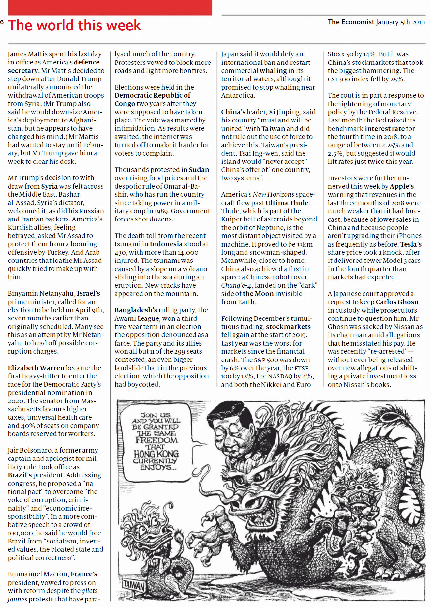

# 台灣人不笑香港人笑 - 陳沛敏

蘋果日報 | 果籽 | 名采 | 20190105

應該是1989年吧，因為我記得那是經歷六四之後的暑假。參加了學校國是學會一年一度的台灣交流團，本來差點要取消，結果還是成行。這交流團不是官方「救國團」辦的那種，雖然也有到訪國民黨單位，但行程由北到南，主要是與前「黨外」人士、雜誌社和公民社會的組織接觸。  

時值台灣戒嚴解除初年，一群香港大學生，走訪了《人間》等幾家雜誌社、參觀了抗議房價飆升的「無殼蝸牛運動」，還到宜蘭縣希望一會著名的首位非國民黨籍縣長陳定南。台大法律系出身的陳定南在美麗島事件和林宅血案後從政，39歲之齡選上縣長，那些年在地方的政績超卓，取締污染，改善環境，革新官僚，還廢止戲院播國歌、公共場合掛蔣像等慣例。當然，途上少不了跟接待我們的台灣大學生宵夜喝酒，吹水唱歌，揮霍青春。這交流團還有一個傳統，就是每次都會將台灣禁止出版、販賣的書刊，從香港帶過來，送給台灣的同學們。那年代，香港是殖民地，卻享有左、中、右言論立場並存的自由。台灣戒嚴時期，卻連金庸的《射雕英雄傳》也被列為「匪書」，何況是左翼思潮之類書籍。每年的交流團，我們就將這些在香港的平常讀物書放在行李裏，當作手信帶到台灣送給他們。  

這樣的行程、這些的手信，在當時仍未完全脫離威權統治的台灣，自然引起情治機關的關注。起程前我已聽參加過往年交流團的師兄師姐說，每次出行例必有人跟蹤監視。那些人還非常戲劇性地拿着報紙，當你回望他時，會佯裝看報，樣板得如黑色喜劇。  

我去的那一年，台灣已經解嚴兩年。誰知行程中段的一個早上，被一陣嘈雜聲吵醒，只見已起床的同學在房間之間轉來轉去，氣氛緊張。原來有人來帶走了我們的團長和副團長。年紀較大的同學立即打電話給國民黨的相關單位交涉，說若不立即放人，就會開記者會之類。幾小時後，兩位同學終於安全歸來。據他們說，情治人員把他們帶走「循例問話」，盤問的內容包括「你相信共產主義嗎？」等諸如此類。當時年輕的我們，都把這段插曲，當作笑話看待。  

那樣荒謬的年代，已經是30年前的事，30年來台灣已第N次直選總統、政黨輪替了。幾年前台灣亞太文化學術交流基金會出版了一套三冊的《百年追求》，分別以「自治的夢想」、「自由的挫敗」、「民主的浪潮」，梳理百年來台灣人追尋主體性和民主化的歷史。基金會董事長吳仁輔在卷首語提到成書經過：「（台塑董事長王永慶）曾不只一次跟我提到，說你們親身參與了台灣民主運動的發展，為什麼不找人將這些點點滴滴寫一寫，翔實記錄下來，讓後人也能多少了解前人辛苦走過的路。」台灣如今當然還有很多問題，但多少人犧牲付出才能走到今天，沒可能走回頭路了吧。  

回看香港過去廿幾年，卻發現當年在台灣覺得匪夷所思的事，開始逐漸變成我們的日常。不表態反對港獨？連選村長的資格都被剝奪；主持過港獨人士擔任嘉賓的座談會？已經不能再來香港；堂堂律政司長公然搬龍門損法治，還要給提問的記者反一下白眼。  

這種時候，習大大隔岸喊話，提出探索「一國兩制」台灣方案。這笑話台灣人覺得怎樣我不知道，作為香港人，就覺得很可笑。

陳沛敏

---------------------------------------------------

原网址: [访问](https://hk.lifestyle.appledaily.com/lifestyle/columnist/%E9%99%B3%E6%B2%9B%E6%95%8F/daily/article/20190105/20583907)

创建于: 2019-01-05 19:40:50

标签: 一国两制

