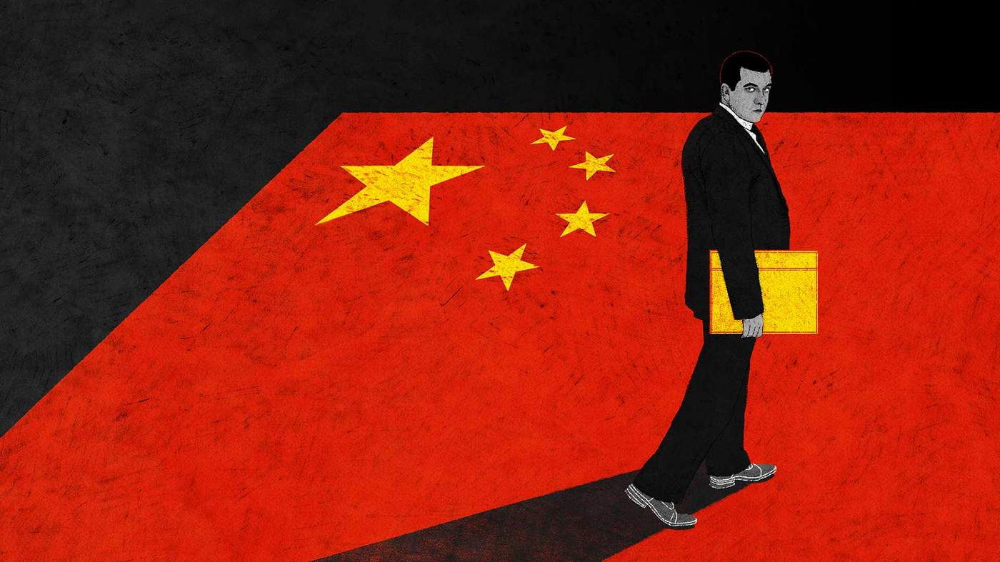
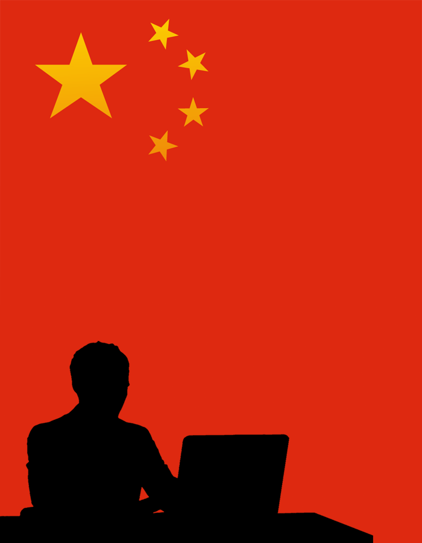
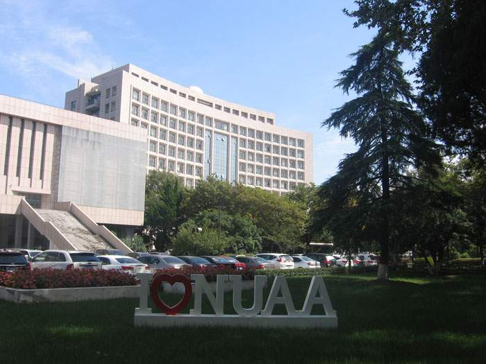
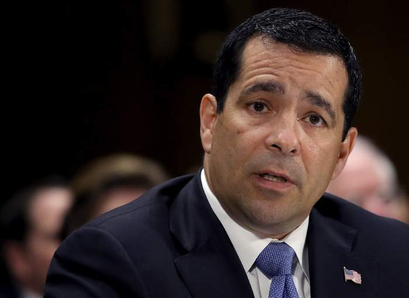
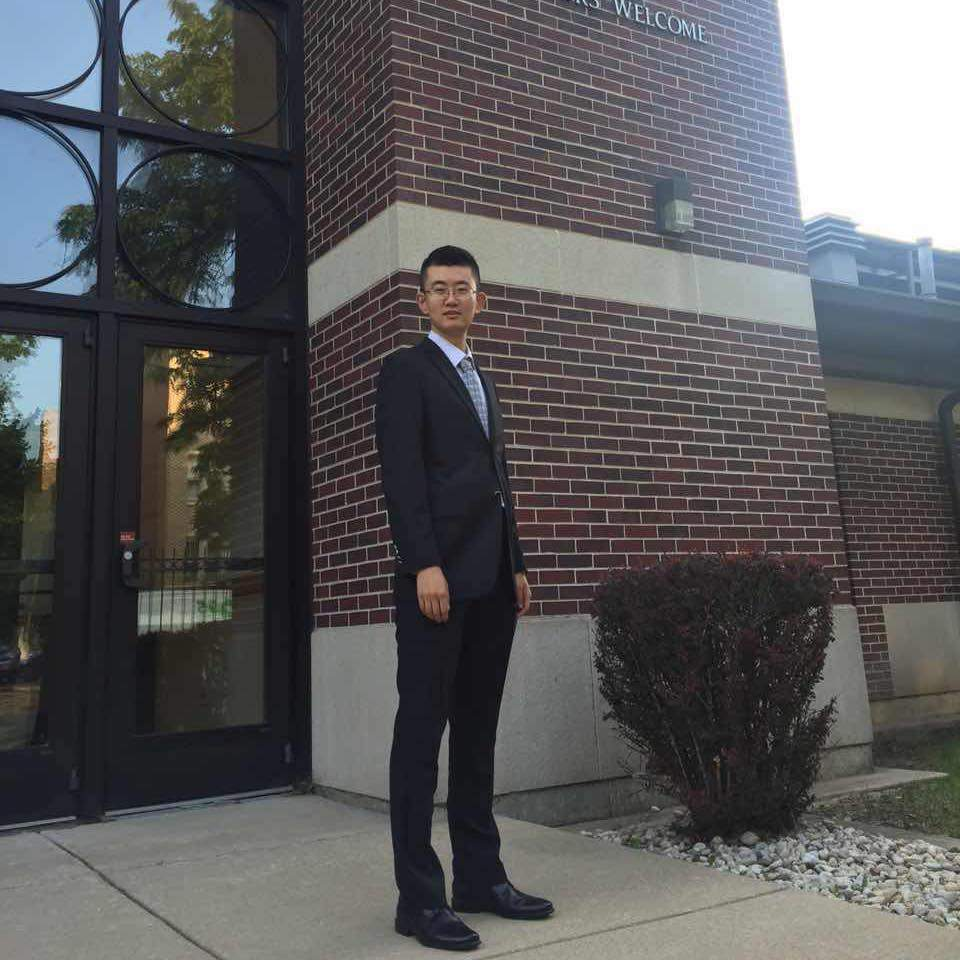
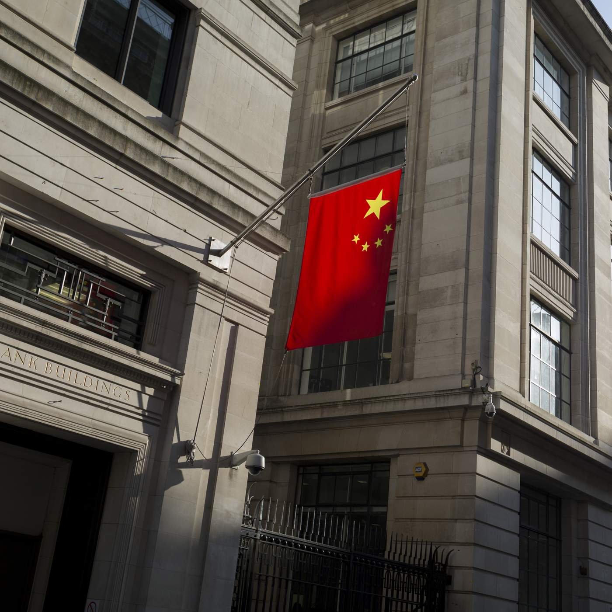
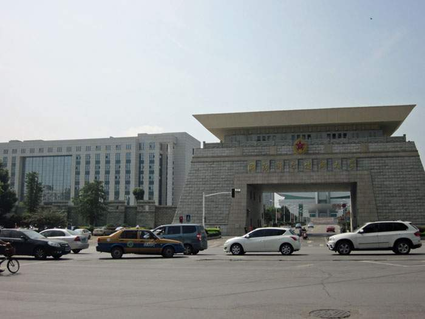
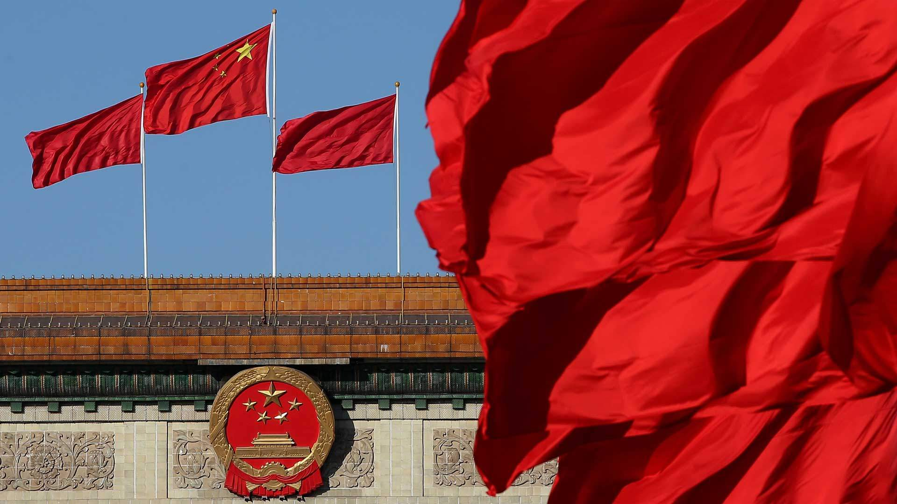

# 尋找中國間諜 - BBC 中文网

戈登·科雷拉（Gordon Corera）

美國開始對中國人試圖竊取機密的行為進行打擊。  

美國官員稱，中國通過政府行為幫助本國公司成長。  

但英國人並未採取類似的打壓行動。

## **機密**

2018年4月1日， 復活節週末，離布魯塞爾大廣場不遠處的聖凱薩琳區酒吧和餐館熙熙攘攘，徐彥鈞（XuYanjun，音譯）來到了這裡。

徐坐飛機到了阿姆斯特丹，又開車到了比利時，開始了他歐洲之行的第一部分。

但在美國當局看來，他並非遊客。

徐被指控是來會見通用電氣航空（GE Aviation）的一位美國員工，一位飛機引擎設計專家。通用電氣航空幾十年來投入了數百萬美元開發更輕質、更結實並且更便宜的複合材料，用於引擎內部的扇葉和主機殼。

美國當局認為，徐是中國國家安全部的一名間諜，在美方的起訴書中，他是來向這位美國員工拿機密的。

但結果卻讓徐大吃一驚。

美國聯絡人沒來，來的是比利時警察，手拿美國聯邦調查局（FBI）發出的國際逮捕令將他逮捕。

**被捕不久後的徐彥鈞**

徐彥鈞被指控自2017年3月開始有計劃地竊取機密。通用電氣航空為商用和軍用飛機製造引擎，起訴書指出，該公司的一位美國員工收到了一封來自南京航天航空大學（南航）的電子郵件。

問這位工程師想不想來中國「交換」？旅費全包。

起訴書指，2017年5月，這位員工拿出了一份技術含量頗高的報告，是關於通用公司新的標誌性引擎材料。這位員工去了中國一周，6月2日還做了一場講座。

他在中國見到了徐彥鈞，而徐的真實身份是中國國家安全部下屬江蘇省國家安全廳六局的副主任。

但徐給這位工程師的名片上寫的卻是瞿輝（Qu Hui，音譯），在一間機構從事科學技術的推廣工作。徐表示是他承擔了工程師的食宿費用，並且還會支付3500美元的講座費。

二人一直保持著聯繫，工程師又給徐發了很多資料。越來越能看出，徐在要求工程師給他提供一些敏感的公司資訊。

2018年2月，工程師發去了一份演示文檔，首頁有公司標誌，並警示文檔內容屬於通用公司且為機密。徐被指向工程師不斷提問。

起訴書指二人有資訊往來。工程師表示徐的要求涉及商業機密，徐表示二人可以當面討論這個問題，還說工程師應該直接從公司電腦裡拷貝某份文件。

為避免敏感資訊，文件編號沒有列出。

通用電氣航空那時已經發現了問題，工程師已經開始配合通用公司和執法調查，他目前未被起訴。

徐並不知道他的連絡人正在跟他對著幹，他被指控是來拿一個帶到歐洲會場的硬盤，裡面存滿了資料。他說：「如果我們想要合作，這不會是最後一次，對吧？」

4月1日，徐到了比利時，美國決定收網。

美方表示徐的工作是獲取美國及歐洲航空航天公司的技術信息。起訴書提到，他從2013年起就與中國的大學及機構合作，尋找並以掌握了中國所需機密的工程師為目標，將資料提供給政府部門、科研機構以及公司。徐的美國律師拒絕評論，但中國外交部表態稱這「純屬捏造」。

南航是中國一所頂尖的工程大學，隸屬於中國工業和信息化部，也與中國的飛機製造商有合作，徐被指控與南航的人員有往來。

南航承認徐曾在本校兼讀碩士學位，但也附和了外交部對指控的否認，表示「本校促進並合法使用知識產權，一向尊重並保護知識產權，從不支持竊取知識產權的行為。」

**南京航空航天大學**

起訴書指，2014年4月，徐討論了獲取軍用空中加油飛行器相關資料的計劃，且將資料發給了中國一家引擎零件公司的相關人員。另有一位其他公司的工程師給徐發了無人機方面的技術資料，而徐又把資料給了南航。

徐被拘留六個月後被引渡到美國，被指控密謀並試圖進行商業間諜活動及竊取商業機密。案件可能會在明年開庭，徐否認有任何不當行為。

通用電氣航空集團在聲明中表示：「得益於發現及時、公司先進的系統和內部流程，以及與執法部門的合作，通用電氣航空所受的影響很小。」

以商業間諜活動為指控引渡情報官員，像徐這樣的情況還是頭一次。此舉被視為美國對抗中國的升級。

## **如何選定目標**

美方表示徐的案件典型地體現了中國模式——情報官員與中國公司緊密合作，從西方竊取技術機密，用於發展本國經濟。

埃文尼納（Bill Evanina）曾在FBI工作，現在是美國反情報與安全中心的總監，與美國國防部合作打擊外國間諜。他表示：「就對美國國家安全和國家利益構成威脅的角度而言，中國人是目前最大的威脅。」

**埃文尼亞說：「就對美國國家安全和國家利益構成威脅的角度而言，中國人是目前最大的威脅。」**

徐的案件可不是唯一一個涉及航空領域的。在幾周後披露的另一個案件中，幾位情報官員和黑客被起訴，也被指與中國國家安全部江蘇分局有關。

這起案件發生自2013年11月，一位中國間諜被指控與法國某航天公司的一位中國員工會面，該公司在蘇州設有辦公室。

美方在詳盡的起訴書中寫到，間諜在見面前表示「今晚給你木馬，我們就不用在上海見了。」提議二人應該假裝是在飯店偶遇。

木馬指的是特洛伊木馬病毒，要拿來感染這家法國航天公司的電腦。

根據起訴書的說法，2014年1月25日，這名員工把U盤插到了這家法國公司的電腦上。當天晚些時候他發資訊給情報官員說：「木馬今早已植入。」

第二個月，這家公司的電腦「被指引了路線」，連上一個被中國黑客控制的網絡域名。美國發現了問題並通知了法國情報機關，後者聯繫了這家公司並展開調查。

但是黑客佔了上風。公司在中國的一位IT員工也參與其中，美國在起訴書中指他跟黑客進行了短信溝通，幾小時後，他們所用的網絡域名即被刪除，以隱匿行蹤。

美國指控說，從2010年到2015年，這群人以一位中國情報官員為首，與這家公司在中國的員工一同竊取敏感資料，資料與商用飛機的渦輪風扇發動機有關。

這些身在中國的被告應該都不會受審。美國通過起訴書向公眾披露中國的所作所為，藉以向中國政府施壓。

兩起案件都清楚地告訴我們，在網路間諜活動中，人仍舊很關鍵。公司員工可以在知情或不知情的情況下洩漏機密。

中國情報部門是如何選定目標的呢？

2017年11月1日，在美國俄亥俄州，季超群（Ji Chaoqun，音譯）的家遭到搜查。季在中國出生，2013年8月來到美國，在芝加哥的伊利諾伊理工學院攻讀電子工程專業的碩士學位，2016年報名參加美國陸軍。

美國指控他受命提供八位工程師的生平資料並進行背景調查，這些工程師都是在台灣地區或中國出生的美國公民，在科學技術領域工作或剛剛退休，且有些是在航天領域。

八位之中，有七位當時正在，或之前曾在美國國防部的承包商公司工作，接受過安全調查。季給中方連絡人發送相關資料時檔案名用的是《期中考試題》，以掩飾行徑。

2018年2月到5月期間，季跟兩位自稱中國情報機構方面的人士會面，但他們其實是FBI的臥底。

起訴書指，季自稱是在中國的一個招聘會上被人找上，之後被要求對一些人進行背景調查。他的一位律師拒絕評論，但之前的報導顯示季否認了指控。

季超群

關於中國網路攻擊的報導有很多，但美國官員表示，內部的威脅遠比遠程的黑客入侵更加危險。

埃文尼亞說，中國的情報部門在從領英（Linkedin）一類的社交媒體網站上選定目標，「產量很高」。「發送三四萬封郵件，當中有幾十個人回復說『我有這項技術，我能去演講』，這對情報部門而言風險低，產出大。這個方法對他們而言卓有成效。」

一年前，德國的安全部門警告說，有一萬名德國人曾被假冒的獵頭、諮詢師、智囊團成員或是學者聯繫過，而這些人其實來自中國的情報機關。

中國間諜應該也正在對英國的機密下手，但英國政府卻一直避談這個問題。

英國國家安全機構的工作人員私下表示，在英國也有和美國規模一樣的中國情報活動。相比於美國發出的一系列起訴書以及特朗普政府高官所發表的聲明，英國政府到目前為止沉默得多。

美國官員私下表示希望英國的態度能強硬一些，但英方至今還是小心謹慎。

美國政府正在向盟友施壓要求一起行動，也有跡象表明英國可能會就中國的某些行為發聲。據稱美國正在計劃對中國的間諜活動發起新一輪起訴，並可能會採取制裁。

漢尼根（Robert Hannigan）2014年到2017年期間掌管英國通信總部（英國的通信情報機關），他說：「竊取知識產權的問題由來已久，譬如與中國政府有關的黑客會從英國的大學以及主要工程公司那裡竊取。」

「英國的反應很低調，繼任政府不想對抗中國，而且英國也沒有美國那樣的全球執法能力去對中國，或是對其他國家的網上竊取行為提出訴訟。」

英國警方現正在調查一起類似案件，但這類案件的起訴和開庭都要少得多。

## **威脅**

英國安全部門的官員對大學成為研究和知識產權方面的目標尤其關注。

關注點在於大學是經濟間諜活動的軟目標，個人受邀去中國，或是情報人員以學生身份來到西方國家然後帶著知識產權回國都有可能，就連學校間正規的合作交流都有危險。

一家大型英國工程公司正與一所大學合作開發前沿材料，這所大學也在與中國政府合作。工程公司會定期清理所使用的房間以確保沒有竊聽設備。

位於長沙市的國防科技大學是一所中國頂尖學府，由國防部和教育部共同管理，與中國人民解放軍關係密切，在中國的太空及超級電腦項目上首屈一指。

它與西方的大學合作也很緊密。

**長沙的國防科技大學**

BBC在資料庫中發現，許多英國大學都與國防科技大學合作過論文，很多都與太空及航天領域相關。

目前還看不出來這些合作涉及間諜活動或者有任何問題，但一些研究中國影響力的學者對這些合作的深度感到擔憂。

「英國與國防科技大學之間的合作非常令人擔心。估計英國的大學已經給幾百名國防科技大學的科學家們培訓過，這是中國軍方在利用外國的非軍方專家來增強軍事實力。」研究這一問題的澳大利亞研究員喬斯克（AlexJoske）說到，「目前而言，對這方面活動的監管還很少。」

但也有一個幫助大學免於風險的計劃——[學術技術審核](https://www.gov.uk/guidance/academic-technology-approval-scheme)，由英國政府執行。

埃文尼亞說，大多數威脅是來自那些非間諜。「他們利用科學家、工程師和商人的身份。他們可以到國外來，進入機構當中，融入文化，參與某個機密或非機密的重大項目，可以獲得資料但動機不良，然後將數據傳回本國。」

當然每個國家都有間諜活動，英美兩國也都有針對中國和中國公司的間諜活動。

但西方官員說中方的手段不同，首要任務是竊取商業情報來幫助中國企業——大多都與政府有關。西方的間諜則不做這些。

中國政府否認與大型機密竊取活動有關。

中國外交部的一位官員在談到美方最近的制裁時表示：「美方的所作所為有損中方的權利和利益，破壞了中美間的相互信任，給中美關係蒙上了陰影。我們要求美方立即停止這些誤導性的評論以及行動。」

## **反擊**

特朗普政府決心打擊中國的間諜活動，近幾個月來已經開始採取行動，起訴了徐彥鈞等中國個人。

其他[起訴](https://www.bbc.com/zhongwen/simp/world/2015/05/150520_china_espionage_threat_us)還涉及竊取半導體晶片、泡沫材料，乃至[轉基因大米](https://www.justice.gov/opa/pr/chinese-scientist-sentenced-prison-theft-engineered-rice)等技術。

> _權力、金錢以及政治正在轉向東方，這是我們所需要適應的政治現狀_

—— 揚格，英國軍情六處

埃文尼亞說：「我敢說還會有更多案件發生，正在發生的也有很多。」他認為中國是比俄羅斯更嚴重的安全威脅。

擔憂並不僅僅在於中國通過間諜活動贏取經濟發展，還在於中國政府正在越來越多地利用自身的重要性在全世界施加影響。

特朗普政府將注意力更多地放在中國而不是俄羅斯的身上，在政治層面肯定是有意義的，美國的國家安全官員們認為威脅已經迫在眉睫。

在涵蓋了貿易和科技等領域的經濟對抗中，對間諜活動採取強硬態度只是其中一部分，美國政府希望同盟國們在這個過程中與自己保持一致。

澳大利亞對中國影響力的討論一直都比較充分，在政治上和大學中都是如此。6月份的時候，澳大利亞通過了一項新的反間諜活動法案，認定「干擾民主進程或向外國政府提供情報的隱藏、欺騙或威脅行為」都屬犯罪。

法案旨在將之前可能沒被定義為間諜活動的行為也包含進來。

而英國到目前為止還都非常小心謹慎。英國軍情六處的處長揚格（Alex Younger）說：「權力、金錢以及政治正在轉向東方，這是我們所需要適應的政治現狀。」

一位政府發言人說：「我們不會定期評論情報問題，或是任何所謂威脅的詳情。政府對英國面臨的一系列潛在威脅保持警惕，並極為重視國家安全。」

但英國高官也表示措施要巧妙，擔心會在中美有消極作用的較量中受到影響。一定要在特朗普政府和中國之間選邊選的話英國一定會選擇美國，但更希望不用做這樣的選擇。

漢尼根說：「我們不確定中國的崛起究竟是威脅還是機遇。事實上二者都有，應對中國的崛起並非易事。」

許多美國官員認為如今應對這一挑戰已是至關重要，但也有人擔心中國可能已經取得了足夠的經濟發展，能夠保證其在全球的影響力。

雖然打擊行動正在進行，但也有人私下擔心，可能已經來不及阻止中國的計劃了。

## 鳴謝

作者：

戈登•科雷拉（Gordon Corera）

插圖：

瑞貝卡•赫登（Rebecca Hendin）

故事監製：

伊莫金•安德森（Imogen Anderson）

克雷爾•里德（Claire Read）

摩根•傑斯霍•米納德（Morgan Gisholt Minard）

圖片來源：

Getty Images

Creative Commons

Facebook

網上製作：

本•米爾恩（Ben Milne）

編輯：

費羅•羅勒（Finlo Rohrer）

2018年12月19日

所有圖片均受版權保護

---------------------------------------------------

原网址: [访问](https://www.bbc.com/zhongwen/resources/idt-sh/Looking_for_Chinas_spies_chinese?ocid=socialflow_twitter)

创建于: 2019-01-06 23:35:51
