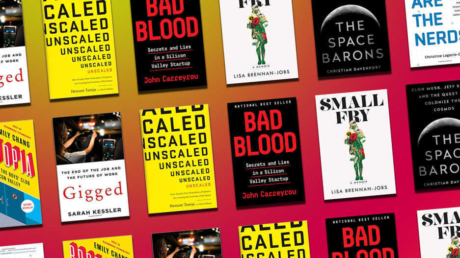
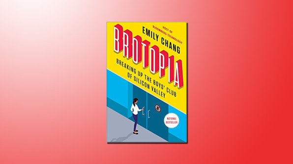
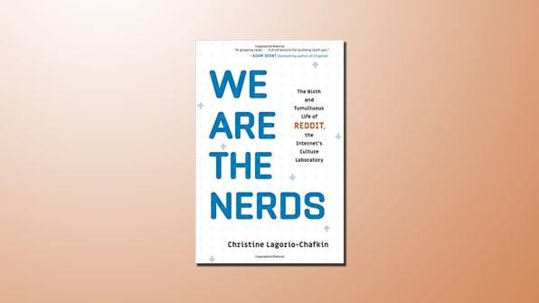
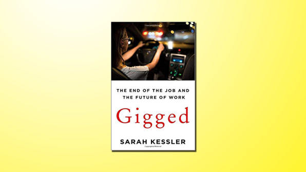
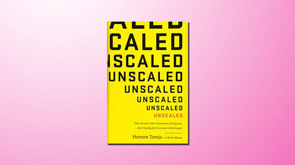
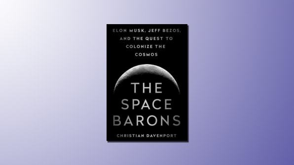
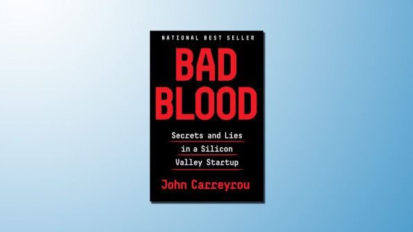
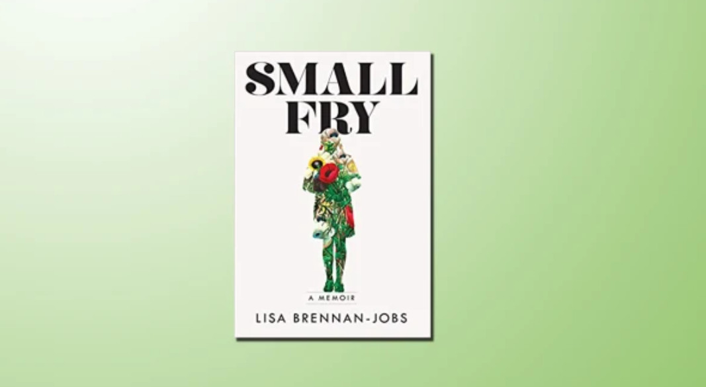

# 2018 年最值得阅读的 7 本科技书籍 - 36氪

[尺度](https://36kr.com/user/15332834) • 2019-01-06 • 读书

​如果你正在寻找好书，那可以把这些书放入你的书单。

编者按：近日，《快公司》杂志发布年度书单，总结归纳了2018年最值得阅读的7本科技类书籍。这7本书籍既包括硅谷创业故事分享、人物传记，还包括未来科技趋势预测等方面。

2018年，是科技行业有史以来丑闻最多的一年。Facebook被迫正视自己在2016美国大选中的所作所为，在公众一无所知的情况下，对当时的美国大选产生了操控性的影响。谷歌、Facebook和Twitter的律师正在国会进行辩论，试图解释关于它们平台所产生的一系列问题。

优步、谷歌就知识产权纠纷达成了和解，优步不再使用谷歌Waymo部门的无人驾驶技术，这场纠纷对之后的专利申请合法性研究产生了重要影响。特朗普在Twitter上威胁说要使用一款强大的按钮，用来对抗核武器攻击。

美国网络红人保罗（Logan Paul）早前发布了一条在日本“自杀森林”拍摄的片段，片段中有一具挂在树上的尸体。这条视频的拍摄尺度超过了用户的接受范围，引来众多批评。

WhatsApp上的虚假谣言导致了一系列严重的暴力事件。一名泰国的专业洞穴潜水员向埃隆·马斯克提出质疑，认为Space X提供的技术对救援帮助不大。诸如此类，关于科技的负面新闻层出不穷。

尽管如此，幸运的是，也有很多好书帮助我们在这样的社会环境下正确认识科技的作用，明确自身的立场。这些书囊括了科技产业的基础、独角兽的情况以及太空竞赛等科技的方方面面。以下是我们评选出来的今年最受读者喜欢、认可的7本科技书籍。

### 第一本书：《兄弟乌托邦》(BROTOPIA)，作者：艾米丽·张（Emily Chang）

这本书的故事以一项简单的发明作为起始，这项发明的诞生标志着硅谷计算机实验室第一次将女性拒之门外，这项发明就是图像传输。因为这项发明，南加州大学的科学家们获得了一笔资助，用于图像压缩算法的开发创建，这个压缩算法可以让人们在各种设备之间发送传递大型图像。因此，这个项目需要图片样本，对图片样本的要求也很高，需要满足各种细节、纹理和颜色的要求。

南加州大学的一位研究生带来了一本《花花公子》杂志，其中有一张模特莉娜•索德伯格(Lena Soderberg）的插页图片，所有研究人言都认为，这张图片是一个很大的测试范本。随后，这张图片被采集制作成了一个数据集，在其他图像研究人员之间广泛分享，并成为各种潮流论文报告中的分享例子。

这只是一个简单的小故事，但这个小故事为本书的基调奠定了基础，书中非常详细地描述了在这个拥有巨大财富的科技行业中，女性被缓慢地拒之门外的过程。同时，这本书有很多明显的性别歧视描写。比如女性在一个特别淫荡的场景中充当寿司卷。作者艾米丽的这本书是一本引人入胜的著作，讲述了在这个世界上最赚钱的科技行业中，仍然是男性在起主导作用的现实。

### 第二本书：《WE ARE THE NERDS》，作者：克里斯汀·拉戈里奥（CHRISTINE LAGORIO）

如果说互联网是社交活动的狂野之地，那么Reddit就是这片狂野之地中最疯狂的地方。就在前几年，Reddit还是一个匿名社区，网友在匿名的保护下可以畅所欲言。在这里，有很多难以想象的粗俗仇恨言论，未经批准的色情图片被广泛传播，阴谋论甚嚣尘上。

随后，在2016年美国大选的时候，Reddit平台遭到了清算。克里斯汀·拉戈里奥(Christine Lagorio)是一家出版社的记者，她在Reddit创立之初就一直在观察Reddit，对Reddit的发展了如指掌。她在书中详细描述了Reddit的三位年轻企业家关于创业的痛苦经历，他们创建Reddit时抱有创建一个伟大的社交网络想法，但最后他们的产品却变成了一个怪物。这个故事是典型的硅谷故事，这个故事对未来的创业者有很强的警示作用。

### 第三本书：《零工：工作的终结和工作的未来》（GIGGED: THE END OF THE JOB AND THE FUTURE OF WORK ），作者：莎拉·凯斯勒（SARAH KESSLER）

当人们想到“零工经济”(gig economy，指由工作量不多的自由职业者构成的经济领域，他们会利用网站或应用程序在网上签订合同)时，这个短语很快就过时了。提到零工经济时，人们经常回想起Uber、Lyft等应用程序的司机，或者Postmates、Instacart或DoorDash等应用上的的物流快递员。

但其实，零工经济的范围很广。打零工，即不定期的短期工作，类似亚马逊土耳其机器人(Amazon Mechanical Turk)、创意自由职业者，以及建筑行业的蓝领工人等，都属于零工经济的范畴。现在为了节省成本，越来越多的公司将工作任务转移给外包员工，类似这种外包员工也属于零工经济，随着这种趋势的扩大，可以转化为零工的工作种类在不断变多。

在这本书中，作者凯斯勒（前快公司Fast Company记者）重新审视了零工经济的潜力，并分析了零工经济将最终面临的一些问题。书中最有教育的部分是她描写阿肯色州一位男人的章节，这个男人向一群没有受过大学教育的成年人普及互联网知识、学习赚钱技能，然后让这群人在零工经济的平台上赚钱。他的目标是将低收入工人与更加有利可图的互联网工作联系起来，接下来发生的故事，对硅谷的创业者而言，是一个巨大的教训。

### 第四本书：《去规模化》（UNSCALED），作者：赫曼特·塔内加（Hemant Taneja）

这本书的作者赫曼特·塔内加不仅仅是一位作家，还是通用催化风投的合伙人。这家风险投资公司投资了Stripe和Snap等知名公司。而现在，他正在重新思考大型跨国公司的优缺点。在赫曼特·塔内加的书中，他仔细思考后提出了一个观点，认为规模化并没有很好地为美国服务。今年四月，他甚至有对我说过。现在的医疗体系、银行系统已经被证明是失败的了，包括教育，在21世纪也并没有做得出色。

这本书深入探讨论述了那些规模正在扩张、充满活力的初创公司是现代经济救星的结论。当然，这是一个比较武断的个人结论。如果大型科技公司、传统巨头对作者所投资的公司挤压没那么激烈的话，可能作者就不会下这么武断的结论了。同时，这本书还指出了一个技术生态系统的问题，这个问题的扩散速度比政府铺设高速公路的速度还要快。

### 第五本书：《THE SPACE BARONS》，作者：克里斯蒂安·达文波特（ CHRISTIAN DAVENPORT）

无论评价如何，埃隆•马斯克和杰夫•贝索斯都是我们这个时代最值得关注的两位企业家。在《太空男爵》这本书中，埃隆•马斯克和杰夫•贝索斯都被描述为最具野心的企业家，马斯克甚至还在想着登月。

作者用这两位科技大亨当做例子，说明美国公共空间项目的没落和私人空间创新商业的崛起，这两位商人在太空领域制造着重要新闻。马斯克和贝索斯制造的新闻价值已经足够大，但未来新闻的价值只会更大。达文波特的这本书是即将到来的太空时代的伟大序言。

### 第六本书：《BAD BLOOD》，作者：约翰·凯瑞鲁（JOHN CARREYROU）

在所有的硅谷创始人中，你很难忽视伊丽莎白•霍尔姆斯(Elizabeth Holmes)。她有着一头金色长发，穿着和史蒂夫•乔布斯一样的高领毛衣，嗓音低沉。伊丽莎白的创业项目打着拯救世界的名号，她提出的血液检测对美国奎斯特诊断公司（Quest Diagnostics）和控股实验室（Laboratory Corporation）形成了挑战，只要一点点血液就能检测出人体的健康情况。

这种检测方式比传统的检测方式更方便、便宜，对人类而言是一件非常有意义的事情。诸如此类，伊丽莎白将她的创业故事讲得非常出彩，尽管基本难以实现，但是这个女性创业者还是骗走了硅谷十亿美元的融资。而她的公司，在今年9月份的时候宣告倒闭。

### 第七本书：《SMALL FRY》，作者：丽莎·布伦南·乔布斯(LISA BRENNAN JOBS）

丽莎•布伦南•乔布斯是作家中的作家，非常优秀。在《小人物》这本书中，她讲述了一个生动的故事，故事的主人翁是一位万人敬仰的偶像，而这个偶像正好是她的父亲——苹果公司创始人史蒂夫·乔布斯。在这本书中，丽莎•布伦南•乔布斯讲阐述了她和父亲的一些回忆。早年，乔布斯对她并没有承担起一个做父亲的责任，她对父爱既渴望又抗拒。对于一般的作者而言，触及硅谷最受喜爱的创业者的情感内心是极其困难的，但是丽莎•布伦南•乔布斯做到了。这本书对于所有想了解史蒂夫·乔布斯的人而言是一份大礼，这本书是一幅关于史蒂夫·乔布斯的肖像描写，是任何传记作家都无法描写创作出的一本好书。

原文链接：[https://www.fastcompany.com/90279169/7-of-the-years-best-books-on-tech](https://www.fastcompany.com/90279169/7-of-the-years-best-books-on-tech)

编译组出品。编辑：郝鹏程

本文翻译自 www.fastcompany.com，[原文链接](https://www.fastcompany.com/90279169/7-of-the-years-best-books-on-tech)。如若转载请注明出处。

---------------------------------------------------

原网址: [访问](https://36kr.com/p/5169084.html)

创建于: 2019-01-07 12:01:02
