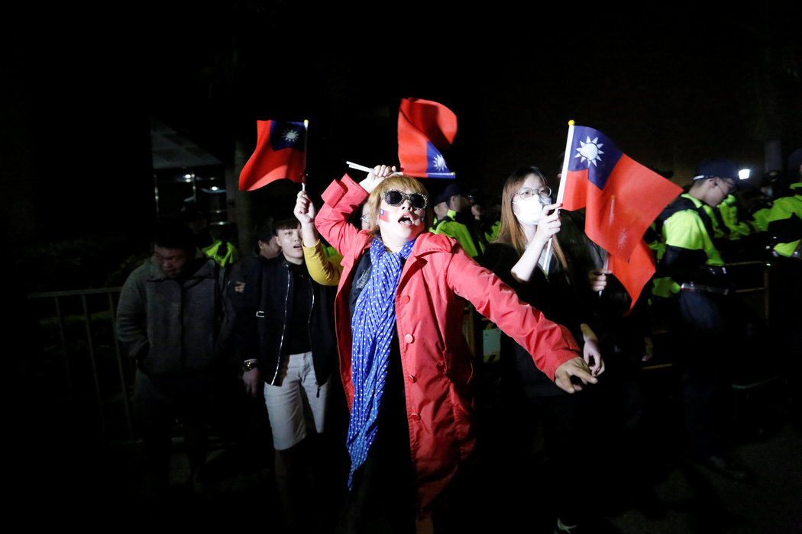

# 台湾会成为第一张被中国推倒的多米诺骨牌吗？ - 纽约时报中文网

观点

练乙铮

2018年11月28日

周日，台湾台北，在野的国民党的支持者。执政的民进党在周六的地方选举中受挫。 Ann Wang/Reuters

担心中国政府试图影响其政治的民主国家，应当对它在上周末台湾选举中的成功好好研究一番。

这些角逐——针对约11000个分布在台湾各地的村庄、乡镇和县市的职位——[类似中期选举](https://cn.nytimes.com/asia-pacific/20181126/taiwan-election-results/)，被普遍视为定于2020年初举行的[下一届总统选举的前奏](https://asia.nikkei.com/Politics/Local-elections-in-Taiwan-set-stage-for-2020-presidential-race)。据我统计，与北京交好的候选人将占据有争议的[24个最高职位中的16个](http://focustaiwan.tw/news/aipl/201811250006.aspx)，高于目前的6个。

中国[否认进行了干预](https://www.voacantonese.com/a/reactions-on-china-and-taiwan-election-20181101/4638293.html)。但在过去几年里，它加强了对台湾政府（由支持独立的民进党领导）的破坏。它[限制大陆游客去旅游](https://jingtravel.com/china-expands-tourism-ban-to-taiwan/)，在台湾周围[进行](https://www.reuters.com/article/us-china-defence-taiwan/china-again-flies-bombers-around-taiwan-idUSKBN1IC0O6)[军事演习](https://www.reuters.com/article/us-china-defence-taiwan/china-again-flies-bombers-around-taiwan-idUSKBN1IC0O6)，甚至[威胁要入侵](https://www.reuters.com/article/us-china-parliament-taiwan/china-warns-taiwan-it-wont-tolerate-separatist-activities-idUSKBN1GH00D)。

这股潮流似乎转变得非常之快。2016年，民进党[上台时](https://www.uscc.gov/sites/default/files/Research/Taiwan%27s%20Elections%20Issue%20Brief_0.pdf)曾承诺，在发展与中国的经济关系、改善台湾表现的同时，将采取更有力的保障措施，防止中国政府的侵犯。民进党不仅赢得了总统职位，还在立法院取得了相当可观的多数席位——这些进展似乎有可能从根本上遏制中国在这座岛屿日益增长的野心。

### 订阅“简报”和“每日精选”新闻电邮

同意接收纽约时报中文网的产品和服务推广邮件

[查看往期电邮](https://us12.campaign-archive.com/home/?u=4811ca8b8001c18674edf6fad&id=82942a3bd2) [隐私权声明](https://help.nytimes.com/hc/en-us/articles/115014892108-Privacy-policy)

在民进党取得胜利之前，2014年，发生了令人震惊的[“太阳花运动”](https://www.nytimes.com/2014/04/08/world/asia/concession-offered-taiwan-group-to-end-protest-of-china-trade-pact.html)。在那次运动中，以学生为主的抗议者占据了立法院，以[阻止批准与中国签订的一项贸易协定](http://focustaiwan.tw/news/aipl/201404070039.aspx)。这项协议是由时任总统马英九领导的政府谈判达成的，他属于支持统一的主要政党国民党。这项协议将使大陆资本能够轻易进入台湾服务业，抗议者担心，这将危及台湾仅存的一点点经济独立。他们的静坐成功了，协议叫停。

但中国不会接受一个拒绝的答案。很显然，不接受是正确的：周六晚上，甚至在全部选举结果公布之前，蔡英文总统就辞去了民进党党主席一职。

某种程度上，民进党的失败，是她勇于努力进行急需的改革的结果，但这些改革的政治代价高昂，比如[逐步取消公务员过高的养老金](https://taiwaninsight.org/2017/07/19/pension-reform-made-in-taiwan/)计划。她还反对核能，这一主张不受台湾强大的高科技制造商的欢迎，这些制造商的工厂依赖稳定的电力供应。

但民进党的失败同时揭示了北京对台湾日益增长的影响力，更具体地说，它有能力利用一个开放社会的弱点：即开放本身。

2014年夏天，我参观了位于台湾东北部的基隆港海军基地。离码头不远处是[国立台湾海洋大学](https://www.ntou.edu.tw/bin/home.php)，该校的任务之一是培养海军军官。在它巨大的学生活动中心里，我看到了该校的中国学生联合会出版的大量免费通讯，内容是微妙的政治内容，北京的亲统一路线藏在人情味十足的故事或光鲜亮丽的消遣文章里。我问一个学生，是否担心北京在搞宣传。他看起来很困惑，说：“嗯，你知道，我们是一个自由的国家，这些出版物是合法的。”

根据日本国家广播电视台[NHK的研究](https://www.nhk.or.jp/bunken/english/reports/pdf/report_14020101.pdf)，到目前为止，台湾有影响力的媒体集团已变得亲北京；它们的大股东在中国广阔的市场上获得了更大的商机。台湾的主要报纸和电视台经常播放与中国大陆几乎没有区别的内容，或者经常对中国领导人大加赞扬。  

2013年3月，台湾报纸《中国时报》曾将领导中国共产党庞大影响力机器的副总理刘延东称为“[新任首长的三朵金花](https://tw.news.yahoo.com/amphtml/%E6%96%B0%E4%BB%BB%E9%A6%96%E9%95%B7-%E4%B8%89%E6%9C%B5%E9%87%91%E8%8A%B1-213000577.html)”之一。今年3月，该报发表了[一篇评论文章](https://www.chinatimes.com/newspapers/20180305000524-260109)，阐述了一个令人费解的论点，即为什么无限任期对中国国家主席习近平这样的好领导人来说是一件好事。其他的例子比比皆是。

本月早些时候，美国在台协会主席莫健(James Moriarty)接受了亲北京的台湾地方媒体TBS的[采访](https://www.ait.org.tw/ambassador-james-moriarty-to-visit-taiwan-november-4-10-2018/)，他警告称，外部力量可能会在投票前散布假信息，操纵公众舆论。这段采访播出过一次，但很快就在该电视台的网站上被删除了。

北京政府也知道，对台湾工人来说，[有钱能使鬼推磨](https://www.csmonitor.com/World/Asia-Pacific/2018/0329/Beijing-s-message-for-young-Taiwanese-We-mean-business)，包括[年轻工人](https://www.japantimes.co.jp/news/2018/02/09/business/china-using-economic-incentives-charm-tech-savvy-taiwanese-youth-entrepreneurs/#.W_VSnBqRWhA)。自1980年代中国经济开放以来，制造业——尤其是高科技行业薪资较高的工作岗位——开始向中国转移，他们的实际工资就一直处于停滞状态。“太阳花运动”结束后不久，北京方面开始向愿意到中国工作或创业的台湾年轻人[提供补贴和优惠待遇](https://www.bbc.co.uk/mediacentre/proginfo/2018/29/the-documentary-soft-power-seduction)。

但中国似乎在台湾的政党中取得了最大的成功。短短二十年间里，国民党，一个曾经在蒋介石执掌下坚定反共的政党，已经发展成为一个[非常亲北京的政党](http://www.atimes.com/article/kmt-leader-creates-storm-by-backing-reunification-with-china/)：它甚至主张[台湾与大陆统一](https://www.abc.net.au/news/2015-07-19/taiwan-ruling-party-endorses-pro-china-hung-hsiu-chu/6632092)，基本上是按照中国的条件。就在本月，长期被视为国民党温和派的马英九从一度主张“不统、不独、不武”，转变为现在表示“[不排斥统一](https://www.taiwannews.com.tw/en/news/3571446)”。

许多台湾人说，他们认为自己只是台湾人；[只有极少数人称自己为中国人](http://www.atimes.com/article/taiwanese-chinese-island-states-shifting-identities/)。现在随着国民党的崛起，中国可能觉得不太需要考虑军事入侵了。但这些因素也表明，未来中国对台湾的渗透将更深。

如果台湾沦陷并被中国吞并，香港——一座已经在1997年回归后[迅速丧失北京曾经承诺的自治权](https://cn.nytimes.com/opinion/20170703/china-hong-kong-xi-jinping/)的城市——将会是下一个目标。在其特权地位于2047年到期之前，它很有可能变成只是又一座中国城市而已。届时，中国政府可能会对全球海外华人施加比目前更大的压力。特别是，它可以更容易地操纵1949年中国成为共产主义国家后从台湾或香港迁往西方的移民（或他们的后代），例如对他们仍然居住在台湾或者香港的任何亲属施加压力。  

二战后，资本主义民主国家曾担心亚洲各国会一个接一个地陷入共产主义。但多米诺骨牌理论没有成为现实，部分原因是这些民主国家的警惕。他们今天最好继续警惕，否则可能最终会看到这一理论被中国实现——从台湾开始。

练乙铮是一名香港和亚洲时事评论员，也是一位观点文章作者。

翻译：纽约时报中文网

[点击查看本文英文版。](http://www.nytimes.com/2018/11/27/opinion/taiwan-election-china-interference-domino-theory.html)

---------------------------------------------------

原网址: [访问](https://cn.nytimes.com/opinion/20181128/taiwan-election-china-interference-domino-theory/)

创建于: 2019-01-07 22:41:18
