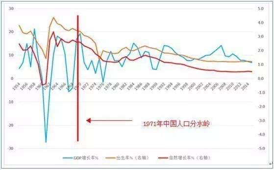
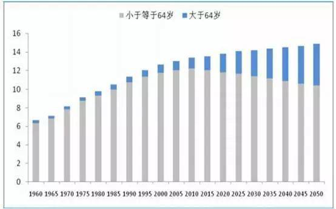
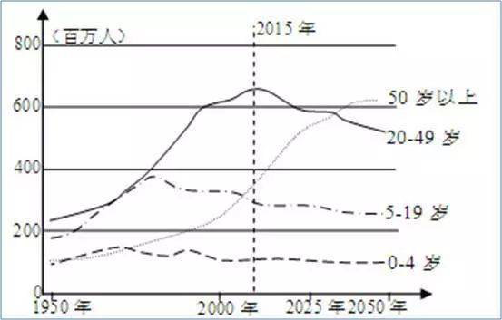
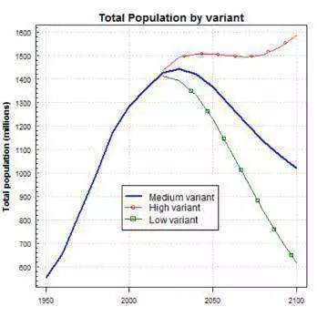
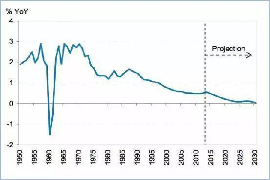
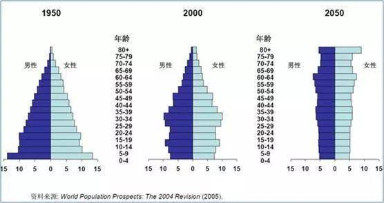
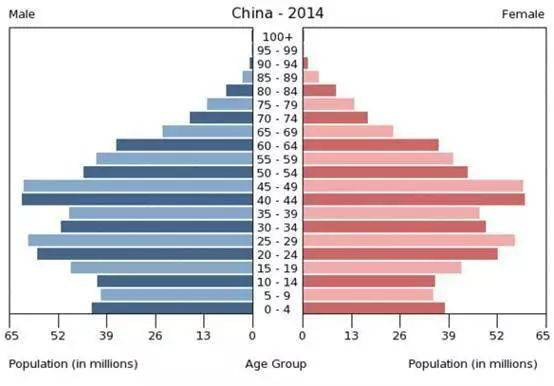
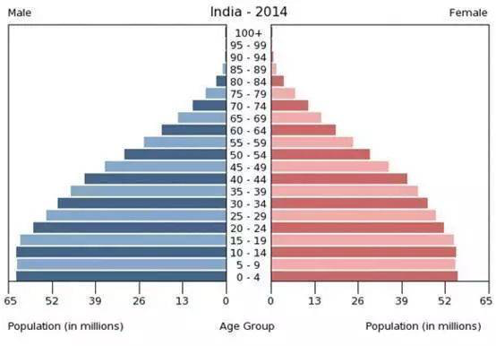
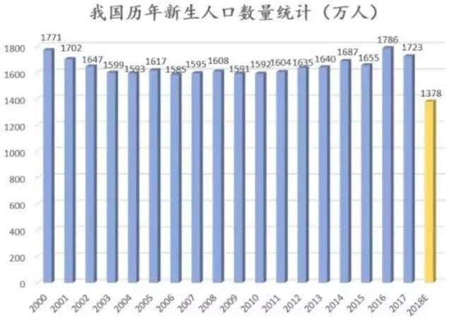

# 2100年中国人口或“雪崩”至6亿，你知道这有多可怕么？-虎嗅网

正和岛

当绝大多数研究学者为2017年中国经济实现超预期增长而感到兴奋时，经济学家马光远却被2017年的人口数据惊呆了：

> 2017出生人口1723万人，比2016年减少了63万人，这一数据比之前各方的最低预测还要更低；2017年人口出生率比2016年下降了0.52‰，只有12.43‰，这一数据比日本的出生率还低，人口自然增长率下降到了5.32‰的惊人低生育水平。

国家卫计委在全面两孩政策实施之初曾预测出生高峰将出现在2018年，对2017年出生人口的最低预测为2023.2万。而最新的数据表明，出生高峰在2017年就过去了，2017年出生人口比卫计委的最低预测还要少整整200万。  

  **峰值没有形成，面临的却是人口塌陷式的下滑。**

无独有偶，人口学者梁建章日前也撰文称，随着生育堆积结束后育龄女性数量的锐减，出生人口将在2018年进入雪崩状态，在之后十年将以每年减少30万到80万的速度萎缩。但现在看来，出生人口雪崩比我们预料的来得更早，也更加迅猛。

作为世界第一人口大国，你能想象得到，出生人口雪崩到底会有多恐怖吗？

## 一、中国的经济奇迹，得益于人口红利

从某种层面上讲，中国过去30多年所创造的经济奇迹，与世界上其他经济体的增长其实并无显著特别之处，一言以蔽之，可以理解为：**在体制上松了绑，辅以巨大的人口红利。**

数据来源：国家统计局  

从上图可以清晰看出，开始大力推行计划生育的1971年是中国人口变化的一个明确分水岭。以1971年为分隔线，中国人口增长分为截然不同的两个阶段。

  

大力实行计划生育之前，1959年～1961年是一个极特殊阶段，连续三年自然灾害，致使人口死亡率突增，出生率锐减。1959年人口死亡率上升到了14.6‰，1960年进一步上升到25.4‰，而人口出生率只有20.9‰。人口自然增长率大幅度下降，其中1960年、1961年连续两年人口出现负增长。

  

**但自1962年开始，中国进入连续8年的人口高增长时期。**这8年中，人口出生率最高达到43.6‰，平均水平在36.8‰；人口死亡率重新下降到10‰以下，并逐年稳步下降，1970年降到7.6‰。出生率的上升和死亡率的下降，使这一阶段的人口年均自然增长率达到27.5‰，年均出生人口达到2688万人，8年时间净增人口1.57亿。

如果给予人口出生与GDP增长17年的周期间隔，中国GDP的高速增长，几乎与中国的人口出生率与人口自然增长率显著正相关：1978年改革开放后经济进入高增长轨道不是偶然的。2017年正好是一代人长成的时间，正是因为从1962年到1970年连续8年的高人口出生率与增长率，才为后面30年提供了足够的劳动适龄人口——这就是经济增长的秘诀。

对于勤扒苦做的中国人，只要他还年轻，能干得动活，同时放松一些捆绑在他身上的体制束缚，他就能创造出令人满意的GDP——最新的案例是西班牙。这个南欧国家因为议会选举没有任何政党达到多数，导致在8个月里是“无政府”的，但其GDP增速达到了3%，是欧洲平均水平的2倍。7月份最新民调，只有2.3%的西班牙居民认为没有政府会是个问题，西班牙著名经济学家Gabriel Calzada 如此评论：2016年上半年，是过去几十年来西班牙最美好的时光……

而改革开放，正是对束缚在这些人口身上的绳索做了松绑。

1971年，中国开始全面计划生育，特别是70年代后期，是中国人口发展出现根本性转变的时期。政府陆续制定和完善了明确的计划生育政策，人口高出生、高增长的势头被迅速控制，人口自然增长率自此一路下滑，从1971年的23.4%，一路不回头下滑到2015年的4.96%。而生育率（妇女一生生育的子女数量）也从1990年开始连续25年低于种群正常更替水平（保证种群不萎缩的生育率），人口“青黄不接”的直接后果，是劳动适龄人口的不断减少，整体人口的极度老化和急剧萎缩。

数据来源：《中国人口老龄化趋势预测研究报告》  

而中国的经济开始走下坡路，GDP增速脱离双位数区间，恰好也就是从中国劳动适龄人口开始绝对减少的2012年开始的——某种意义上讲，这绝非偶然。

数据来源：联合国人口司  

在经济学上，这被称为“刘易斯拐点”。日本在1990年进入这个拐点，从此开始了长达25年的衰退与疲软。

基于以上分析，如果有人告诉你：**人口问题将是中国未来面对的最大噩梦，中国人口可能永远也到不了15亿，而且在迅速老去，你信吗？**

## 二、2100年中国人口跌至6亿？

**我们中的大部分或许应该庆幸，自己不太可能活到2100年。不然，你或许会看到一个让人瞠目结舌的中国：人口消失一半！**

联合国人口署最新发布的《世界人口展望》2017年修订版，预计本世纪末中国人口将出现倒“V”型反转，在低生育率状态下加速下滑跌破，从10亿萎缩至6.13亿。在不到百年时间里，从人口大爆炸反转为人口大坍塌。  

中国人口增长趋势预测，分为低生育率、中等生育率、高生育率三种方案，来源：联合国人口署  

人口和统计学者黄文政认为，即使全面放开并大力鼓励生育，本世纪末中国人口也难以超过8亿。联合国对中国人口的低预测值（6.13亿）比较合理，而中预测值（10亿）严重高估，更不要说高预测值了。

对于这一雪崩式的人口大萎缩，很多人的第一反应是：这绝不可能！看看城市多拥挤就知道中国人口太多了！现实告诉我们，人口问题一点也不乐观。

**首先是人口绝对数量自然增长的逆转。**即使按照1.8的总和生育率来推算，中国人口也将在2030年开始负增长。

数据来源：国家统计局 2015年后数据为推算  

如果这种人口负增长叠加人口快速老化，这种“双杀”的人口结构，对于经济增长就是噩梦。

从六次人口普查的数据来看，中国人口结构最年轻的时候是1964年，当时老年人口占总人口的比例不足4%。而此前的1963年正是中国人口生育率最高的年份，一个妇女平均要生好几个孩子。而1964年开始，中国就进入了持续“变老”的进程中，老龄化曲线一路向上。

2005年，IMF按照1.8的总和生育率（妇女一生所生子女数量）假设，推演出中国100年人口结构触目惊心的变化：

中国人口年龄结构变化资料来源：IMF  

IMF没有想到的是，他们对中国生育率的假设实在太乐观了：不谈2015年抽查出来的那个很骇人的数字，就按照2016年人口普查的结果，我国育龄妇女总和生育率也只有1.7，远远不到人口世代更替水平的2.1。

**这还是在全面开放二胎政策以后的结果。**要知道一直以生育率低为代表的瑞典生育率就是1.7，因为生育率低人口已经连续45年负增长的德国，总和生育率也有1.5，而要维持一个国家的长久正常的发展，总和生育率必须超过2.1，也就是俗称的人口世代更替水平。

这种低生育率将导致两个直接后果：整体人口的急剧萎缩和整体人口的极度老化。世界银行对2014年中国人口年龄结构的统计真实反映了这种令人绝望的变化：

2014年中国人口年龄分布结构 来源：世行  

我们再对照一下GDP增速已经超越中国，未来这种超越将是常态的印度的人口结构：

2014年印度人口年龄分布结构 来源：世行  

典型的金字塔型，堪称完美。

按传统惯例，一个国家65岁以上老人占比超过7%，即表明进入了老年社会。国家统计局《2015年国民经济和社会发展统计公报》公布的数据是：2015年中国13.74亿人口中，60岁及以上的老人2.2亿，占总人口比例为16.1%；65岁及以上人口数1.43亿人，占比10.5%。

把时间轴拉长：中国65岁以上人口占总人口比重在1982年仅为4.9%，1990年为5.6%，2000年为7.1%，2010年为8.9%，2014年为10.5%，老龄化呈加速上升状态。

不难发现，**中国老龄化包揽两个世界第一：老龄人口数量世界第一；老龄化速度世界第一。**相比日本44.6岁的平均年龄，平均年龄36.7岁的中国也许还不算老气横秋，但相比平均年龄26岁的印度，我们真的还能那么自信：我们只是在蛰伏，21世纪还是我们的？

## 三、出生人口萎缩，到底有多可怕？

必须承认，低生育率对中国未来的负面影响可能远远超过大部分人的想象。新生人口减少，中国面临的是问题是人口结构得不到优化，老龄化挑战日益严峻。  

**人口学者姚美雄判断，中国未来人口将呈现严重少子化叠加快速老龄化、适婚人口性别比失衡的结构扭曲状态。可想而知，中国未来将面临的养老压力、劳动力短缺压力以及经济发展动力不足问题。经济活力不足，反过来也进一步抑制生育水平。**

在梁建章看来，低生育率将会严重威胁国家安全。

中国城市长期实行“一胎化”，农村通常生女孩的家庭才会选择生二胎，因此执行政策的家庭一般最多一个儿子。中国曾有“独子不当兵”的传统，很多国家也对独子从军有特别规定。但长期的生育政策导致独子成中国兵员主体，这将影响中国的战争潜力和外界对中国战争意志的判断。

长期低生育率还会恶化财政收支而挤压国防经费。中国近年国防工业突飞猛进，与发达国家的装备差距逐步缩小。这得益于完整的工业体系和强大的研发能力，但人口萎缩将削弱这些基础。维持同等军力，人口减一半，人均分摊增加至少一倍。

**目前的生育状况也在改变中国边疆的地缘政治形势。**清末民初内地民众的“闯关东”确保了中国人在东北的绝对多数，让东北几经波折却未丢失。但目前东北出生人数持续萎缩，生育率远低于周边的朝鲜及俄罗斯，就算稳定在现有水平，最终也只能保持当前一半的人口。低生育率下的东北经济发展低迷。

而人口兴衰论学者则认为，人口剧减将会导致中华文明衰微。在历史上，中国并非仅仅是一个国家，而是一个文明，是东方文明的代表。作为一个文明，中国现在并无人口优势。相对较低的生育率已经让中华文明占世界人口的比例在过去200年中不断萎缩，从四个文明中人口最多降为与印度文明相似的末位，并将很快被印度文明大幅超过。

西方社会学之父孔德曾断言，“人口即命运”。一个文明或种族，不论其科学、文化或社会发展的成就有多高，如果在繁衍后代上长期处于劣势，最终必将没落。

即使在2015年全面放开生育，但如果无法显著提升生育率，中国占世界人口的比例将急剧萎缩，到本世纪末将变得微不足道。简单来说，伴随着这种出生人口萎缩的大概率，是中国的经济规模将不断萎缩，规模效应持续弱化，最终丧失综合性的产业优势，人均收入下降，国力全面衰退。

## 四、还能做些啥？

上文提及的可怕后果是不治之症吗？是，也不完全是。**能改善或者延缓这种状况的唯一救星是——生育率。**  

正常来说，当下的中国，即使没有大规模战争、瘟疫、自然灾害，每个妇女平均生育2.2个孩子才能保证种群的世代更替——而中国生育率已经25年低于这个更替水平。

为此，马光远呼吁，尽快彻底废除计划生育政策。在他看来，计划生育政策已经没有任何存在的价值和意义。应该看到，即使废除了计划生育政策，面对生孩子的种种顾虑，也未必能够逆转人口下滑的态势。

**原因不复杂，长期生育限制、生育成本高、生育观改变导致的民众整体生育意愿走低，这种低生育意愿和低生育率的现实短时间里很难得到逆转。**  

现代化过程中，增加养育孩子的实际成本与养育孩子的机会成本大大提升，养育孩子是一种以自己的艰辛付出来给社会提供公共产品的利他行为，生育率下降是普遍现象。而这种下降抵消养育的规模效应也将不断自我强化，恶性循环。

基于此，梁建章建议，要为孩子减税和补贴。梁建章称，在养老社会化的背景下，这种做法在经济学上是合理的，在社会道义上也是公平的。对养育孩子的家庭来说，孩子接受免费的公立义务教育，相当于家庭享受了政府的教育补贴，但孩子长大后缴纳的用于支持社会养老的社保等税金，则相当于这个家庭未来对社会养老体系的补偿。  

综合世界中高收入国家的情况来看，政府的教育投入一般占GDP的5%，而养老支出占15%。因此，相对于个人收入，养育一个孩子意味着从政府获得了5%的教育补贴，但未来则贡献了15%来支持社会养老体系。因此，公平来看，政府对每个小孩应该补贴人均收入的10%才足以补偿养育家庭对社会的付出。

比如，受到长期低生育率的拖累，日本经济一直萎靡不振，如何提升生育率成为日本社会的难题。而根据今年1月9日英国《经济学人》杂志的报道，日本小镇Nagicho在推出生育补贴等鼓励生育措施后，生育率从1.4提高到2.8。这个消息给深受低生育率困扰的日本社会透出了一线生机。  

那么，政府是否有财力承受这种养育扶助呢？

根据财政部的数据，个人所得税只占公共财政收入的6%左右，所以按孩子抵税的方式来减少个人所得税对国家财政影响非常有限。实际上，中国民众的整体税赋放在全世界范围来看都算是比较高的，尤其是相对于民众享受到的公共福利来说更是如此。  

**因此，降低税赋并补贴家庭应该是财富再分配的基本方向**。长期来看，对孩子的补贴本质上是对于本国人力资源，也就是未来的投资。相对于当下普遍“过剩”的中国经济来说，投资于人力资源恰恰是回报最高的选择。

在经济全球化的背景之下，美国税改法案也自然引起了中国社会的特别关注；该法案会对中美经济互动产生何种影响以及中国是否也需要减税成为财经界的热点话题。  

不久前，美国国会参众两院通过了自1986年以来美国最大规模的税改法案。根据该法案，美国联邦企业所得税率将从35%降至21%；而个人所得税的大部分税率也有所下降，其最高税率从39.6%降至37%。

梁建章认为，应对美国减税方案的最好方式，就是减免养育家庭的个人所得税。这样短期可以提振中国的内需，长期有利于提升过低的生育率，进而维持中国的人力资源优势。

目前中国老龄化还只是刚刚开始，补贴生育在财政上还可以承担。但**如果错过当前时机，随着人口老龄化的进一步加剧，届时维持社会正常运转的财力都可能捉襟见肘，更遑论去补贴没有短期收益的养育事业了。**

此外，未来10年，处于育龄高峰期的女性将减少40%左右，再加上全面二胎实施导致的生育堆积释放结束，如果不大力鼓励生育，中国的年出生人口将以每年减少30万到80万的速度雪崩，最终威胁中国社会的可持续发展。

因此，在财力上大力扶助生育正当其时。

*文章为作者独立观点，不代表虎嗅网立场

---------------------------------------------------

原网址: [访问](https://m.huxiu.com/article/230905.html)

创建于: 2019-01-08 23:03:42

编案：2018年新生人口数量统计