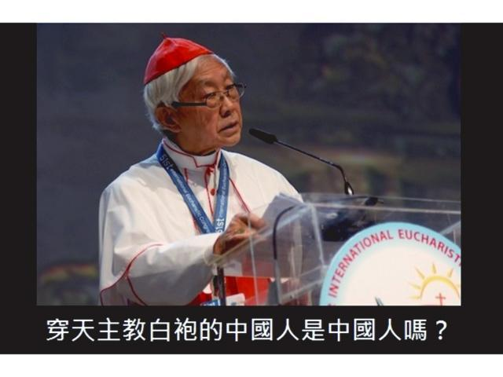

# 中國人的遺傳盲點 - 陶傑

蘋果日報  果籽  名采  20190108

二十一世紀快過去五份一了，又聞所謂「中國人不打中國人」之老口號，這次用來招安台灣，引起一片訕笑。  

許多人不明白，如此粗糙，今日如何還說得出口。他們仍問：大陸上的維權律師、地下教會的基督徒、街頭被城管人員毆打的小販，是不是中國人？  

參與這種一般浪費時間的討論，會降低你的智商。  

但在哲學的層面，為何「中國人不打中國人」這句拙劣的詭辯，至今還有中國人的領袖敢講出來，而且還有大量弄堂胡同的大媽大叔人口相信，這就是有趣的問題了。  

詭辯（Sophistry）學派本是古希臘哲學裏的一支，在春秋戰國時代的遠東，本來也有詭辯學派的萌芽。但那時只有少數一二，亦即後人著知的公孫龍之「白馬非馬論」。  

所謂「白馬非馬」，是將「白」這個顏色，列為感官的一種感覺；而「馬」，是可以形狀肌理可以觸摸而知的物體。色彩只是光影折射在視網膜的一種感覺，一匹馬卻是實在的動物。因此，如果「一匹馬」最先在人的認知世界裏出現，是黃色的，「黃馬」就壟斷了「馬」的全部定義。若另出現一匹白色的馬，白馬就不再是馬了。  

公孫龍詭辯的優點，是本來有機會與希臘哲學的「形而上學」殊途同歸而匯合，但因為中國的象形文字與希臘文的字母不同，是一種憑圖畫感官思考的文字系統，此系統限制抽象思維的延伸。因此中國式的詭辯，只此一家，沒有再發展下去。然而公孫龍開了極壞的先例，將「感覺」和「本質」割裂，令中國人只憑一個「異」，也就是包括顏色不同的表象，判斷為「非」。白馬、黃馬、黑馬，僅顏色之異，馬此一動物的生理骨骼結構形態，本質是一樣的。但中國人從此不管，只憑肉眼之見，而迅速達至唯心的判斷，建立結論。從此這個民族，包括文人世代的文字獄，就走上告別西方理性文明的魔道。  

譬如，剛「解放」即被中國囚禁終身的上海天主教神父龔品梅，是不是「中國人」呢？  

龔品梅生前與教廷色彩一樣的白袍，戴白冠，手持十架聖經。以「白馬非馬」的色彩視覺判斷，龔品梅不是中國人，只是一名西方帝國主義的二毛子，他的白袍，他用洋文讀聖經，那個十字架的符號，符合「白馬非馬」之「非馬」定論。因此，囚禁並虐待龔品梅及其追隨者，並無違反「中國人不打中國人」的「原則」。  

中國人這個民族，為何永遠不可能與西方接軌？源頭就在這裏。反之，極少數能學得西方理性邏輯思維的中國人，即從此不再是中國人了。這一點，其實倒不必反對。於這一點，其實笑而不答即可。

陶傑

---------------------------------------------------

原网址: [访问](https://hk.lifestyle.appledaily.com/lifestyle/columnist/%E9%99%B6%E5%82%91/daily/article/20190108/20585835)

创建于: 2019-01-08 23:41:55

