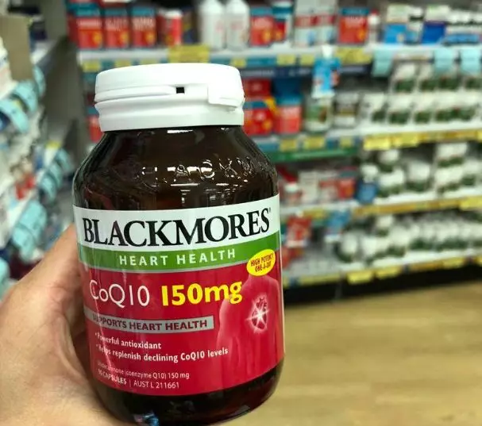
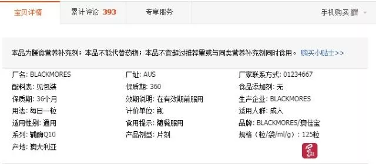
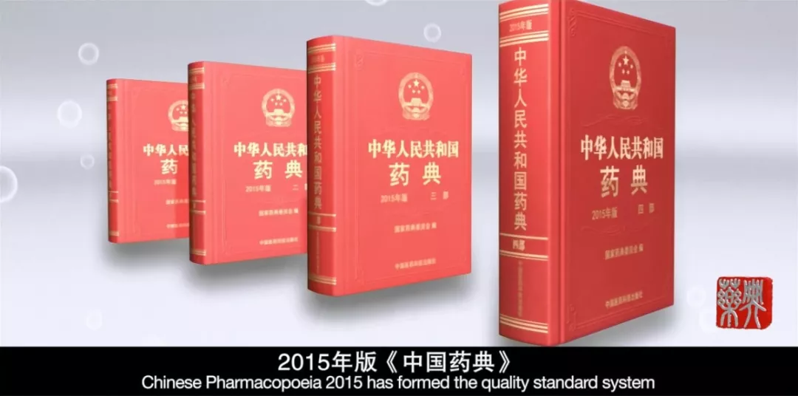

# 澳洲华人代购被重罚¥54000！血本无归！卖了真货也被坑，大家千万小心！

澳洲红领巾！

近年来随着科技的飞速发展，电子商务也逐渐成为人们必不可少的生活方式，海外代购也应运而生，但随着代购群体的迅猛增长，许多行走在法律边缘的人似乎也看到了“商机”。

作为澳洲留学生及移民群体的一个主流选择，代购已经日趋成熟，而在这个行业内慢慢地也在滋生新的灰暗面......

**就在今天，**

**代购圈朋友都在分享一件事！**

**一位澳洲华人代购出事了！**

**而这件事的发生，**

**让所有做代购的亲都需要注意！**

原来近日，来很多澳洲代购朋友表示他们在不知情的情况下竟然遭遇了一系列的官司，且都以败诉收场，还要偿还一笔巨额的赔款。而类似例子，甚至闹上了国内的主流媒体。

  《成都商报》便报道了这样一则新闻，主要讲述一名主要以销售保健品为主的**澳洲代购小周**去年2月在出售产品时的遭遇——

  小周本是一名网店店主，主要经营保健品方面，一般国内的消费者在网上下单后，他会从澳洲药店购买相应的药品并寄给消费者。

生意本是做的顺风顺水的小周在去年2月份，在网上遇到一名声称是谢先生的买家，这位谢先生以5400元的价格拿到了24瓶名为“Blackmores辅酶Q10软胶囊”的营养品，就小周原本还在为接到一个大单而欣喜时，意外却发生了！

就在谢先生在收到货后却以“**该产品没有中文标签，存在严重食品安全隐患**”要求小周退全款，退款后又以比为由将小周**告上法庭！**

而谢先生在诉讼中提到要小周赔偿他高达54000人民币的赔款，将近一万多澳元，是其购买商品价格的十倍。

而就在小周多次解释自己早在的网店标明并提醒顾客自己仅提供代购相关服务，不为购买的药品质量负责无效后。

法院最终认为，代购应当为自己代购的产品尽到检查的责任，并应检查其药品是不是在中国销售标准的范围内。

而据《每日经济新闻》的报道称：

  “涉案食品的配料中含有辅酶Q10，而辅酶Q10是《中华人民共和国药典》中收录的品种，属于药品范畴。根据《食品安全法》规定，食品中不得添加药品。”

但在这种名为“Blackmores辅酶Q10软胶囊”中并未标注药品的批文，在中国这类未标注药品批文的产品被认定为普通食品，这件商品中的辅酶Q10又属于辅酶类药，**故而这件商品违反了中国食品不得添加药品这一标准。**

最终法院判定小周在代购过程中存在违法行为，并判决小周偿还谢先生

**54000元人民币！**

其实小周的遭遇并不唯一一例代购遭遇“碰瓷”事件。

在日本做代购的王女士也曾经有过相同的经历，据《中国经济网》报道，2017年一位李先生就在购买王女士的保健品后，将王女士告上法庭！

而李先生的诉讼理由则是货物接收后发现自己买到的药品没有中文标签和相应的进口保健品批文号，而里面的而商品中所含的红参和灵芝等成分属于药品范围，**且在国家食药监局网站也查不到与其有关的信息。**

而该产品的产自日本的核辐射区即在日本东京部。李先生还提到要李女士全额退款后，赔偿他2.6万元也就是商品价格的十倍之高。

而王女士认为这商品并未对李先生造成实质性伤害，商品的质量也不存在问题，不同意李先生提出的退货和赔偿。

但法院的判决同样认定王女士违反了中国食品安全法并在最终的协商下要求王女士在李先生退还商品后赔偿李先生

**17000人民币！**

 祸不单行，同样北京青年报也报道了另一对澳洲代购的同样经历——他们是刘先生夫妇。

刘先生和他的太太本是澳洲华人，已经在澳洲代购界拼搏了十几年，而他们所经营的保健品在业界的口碑也是相当不错，**在国内有很多忠实用户。**

然而，从2016年起他就接到好多次来自法院的传票，同样是以商品没有中文标签为由，同样并要求他赔偿所购产品十倍的赔偿金，不幸的是这类事件不止一次发生在了刘先生身上，**而最终也都以败诉收场。**

据刘先生表示2016年他在广州败诉，赔偿了对方所购商品的10倍赔偿金，2017年在江苏经庭前和解赔偿了对方所购产品3倍的赔偿金，2017年在北京经调解赔偿了7倍，而2018年也就是今年在大兴还有一个案子但情况同样不容乐观。

  刘先生抱怨到:

  **_“所有这些商品都是我从合法渠道买的，并且都能提供小票，质量没有问题，凭什么因为没有中文标签被起诉？”_**

**_“而且，我和妻子在澳洲工作，并不是专门做进出口贸易的，怎么可能提供中文标签呢？”_**

  据刘先生调查显示，他们遇到的很可能是**职业碰瓷人员**，就在刘先生处理之前北京的官司时发现那位起诉他的熊女士在全国各地多个法院以同样的理由起诉过多名代购，在北京的密云法院就多起案件。

而在他和熊女士沟通中发现熊女士似乎就是以这种方式赚取赔偿金为生，而刘先生也表示自己并不常在国内怕诉讼费用太高也怕如果不接受和解会赔偿金会更高，虽然已经赔了好几万但也只能接收和解。

但在事后对于刘先生提到的熊女士进行采访时，熊女士表示她在买到违规商品后，她有权利行使消费者维权的权利。

换一个角度，这些人其实并不是真正的消费者，他们多是想要利用法律的空子而从中谋取暴利。

而现今新西兰政府已经已经对这种现象对商家发出忠告，新西兰在上海的贸易专员Damon Paling也表示这种现象已经存在很长时间，这些人有时甚至直接越过法律途径向公司索要巨额赔款，但多数公司都会选择私下和解赔偿。

中国方面也表示会对那些职业打假人进行相应的措施以防止他们从中牟取暴利。但在食品和药品这一方面，中国的法律任然无法禁止职业打假人的存在，但于素娟法官表示在面对这些在食品和药品方面的“碰瓷”人法院也会做出相应的措施——

**_代购们可以在交易前_**

**_就提醒买家这种产品没有中文标签，_**

**_就可以避免相应的法律责任。_**

由此可见，代购这一行业看似风生水起，其中心酸估计也只有代购人能理解，希望大家广而告之身边的代购朋友，并提醒她们谨慎交易，小心职业打假人这样的“碰瓷”者。

  素材来源：成都商报、中国经济网、中国青年报

文章已于2019-01-07修改

---------------------------------------------------

原网址: [访问](https://mp.weixin.qq.com/s/P2kqu-KsIZtJBk14U3gyqA)

创建于: 2019-01-09 20:30:16