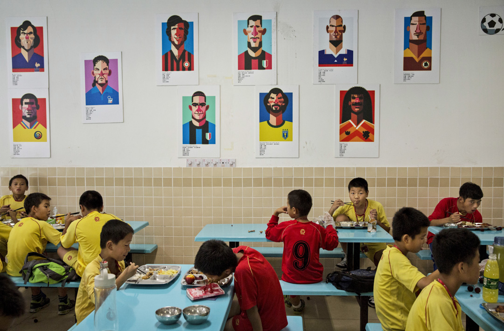

# 鐵腕下的中國足球，與職業化背道狂馳 - 端傳媒

[廣場](https://theinitium.com/channel/notes-and-letters/)讀者來函

> 中國政府有意將足球作為載體，強調對共同體的認同和熱愛。在此背景下，足球成績似乎都居次位，把足球作為宣泄「政治愛國主義」的平台才是首要目的。
>

閆俊2019-01-10

* * *

恆大足球學校食堂的牆壁上貼滿了著名足球明星的卡通肖像，受訓的少年足球員在肖像下用膳。攝：Kevin Frayer/Getty Images

1月5日，2019年亞洲盃足球賽將在阿聯酋拉開帷幕。平均年齡最大的中國隊，將再度回到聚光燈下。而不僅僅是年初的亞洲盃，今年重燃戰火的世界盃預選賽，以及幾年後世界杯的擴軍，都將使中國足球的表現成為媒體熱議的話題。然而在筆者看來，受政治上的牽扯，中國足球幾十年發展，始終未能談得上真正的「職業化」，更是完全藐視了足球發展應有的規律。

## 足球規律背後：被無視的「房間裏的大象」

倘若把官媒和民間關於「足球規律」的討論彙總，大概能編纂出好幾冊書。而在筆者看來，所謂「足球規律」，無非是兩條：內行人辦內行事，以及，基層有足夠的民間組織參與到足球運動中去。大概不少的中國球迷都能得出相同的結論，但若進一步深究這兩條規律在中國為何不能成行，則不可避免地要觸及「房間裏的大象」，導致球迷要麼噤若寒蟬，要麼轉移話題。

如同絕大多數社會主義國家，共和國的體育以效法蘇聯「舉國體制」為伊始，足球自然不能置身事外。《開放》雜誌編輯[蔡詠梅先生評價](https://blog.boxun.com/hero/200808/caiyongmeiwenji/1_1.shtml)說：「如果做一個對比，可以說，中國體育是國家行為，西方體育生社會行為；中國是官辦體育，西方是民辦體育；中國是菁英競技體育，西方是大眾健身體育。」儘管在1993年，國家體委下發《關於深化體育改革的意見》意圖改革體育機制，然而體育部門為追求政績，又成立運動項目管理中心。就足球運動而言，權力並未能徹底下放至足球協會，相反卻被項目管理中心所篡取，集監管與辦事於一體，這即是廣為詬病的「管辦不分」問題。

絕對的權力導致絕對的腐敗。在如此官宦傾軋的環境下，足球「內行人」不說獲得施展拳腳的機會，能在腐敗滋生下保住清白身就已實屬不易。今年距離上一次足壇反腐正好十週年，回顧那些鋃鐺入獄的「內行人士」，在宏大的國家意識形態下，他們又何嘗不是一種犧牲品。他們當然有罪，但若說是「中國足球的罪人」，則未免欺軟怕硬，避諱作為立國之本的國家主義及其實施者。

## 民間足球之殤

足球運動在基層始終難以紮根，這和中國幾十年以來的時代背景息息相關。資源面向城市、城市中面向特大城市優先配置的國策，致使中國經濟發展兩極分化嚴重；年輕人蜂擁向大城市，小城市和農村凋敝。如此的發展現狀，致使基層足球的普及「先天不足」。而更重要的一點在於，如同《沐猿而冠》作者輝格所言，「年輕人進入大都市後，喪失了從小建立的大部分社會關係，不得不重新建立新的社會網絡，這時他們將面臨一個中國社會特有的困境：中國缺少家庭和職業關係外的民間組織和亞文化圈子，中國社會長期以來是高度扁平化的，缺乏中間結構；近代以來中央集權的強化和地方自治的瓦解更強化了這一特徵。」

就政府而言，對於社會全方位無死角的監控，是貫徹了幾十年的執政思路。無論以什麼名義成立的民間組織，是氣功，是足球，亦或馬克思研究小組，一俟產生影響力，則必然要接受政府收編；如若不從，下場只可謂悲慘十足，2015年底對勞工NGO的抓捕就是最好的印證。在如此的高壓下，足球與民間基本脱鈎。或許有人會提及中國的各大足球俱樂部，然而這些俱樂部，與西方國家源自民間的足球俱樂部，並非同一概念。它們源自1994足球職業化改革，而所謂「職業化」，無非是商業化的另一套說辭，是把舉國體制培養的體校隊，交給黨監管下的國企私企，左手換右手，還是和民間脱鈎。偶然有民間資本支撐的足球俱樂部，如果得不到地方政府的青睞，其生存可謂舉步維艱。

## 愛國主義的宣泄平台

中國已故作家、同時也是球迷的[劉曉波先生](http://www.liuxiaobo.net/archives/601)在一篇文章中，這樣提到：「足球與愛國之間的密切聯繫是不爭的事實……但是，競技體育所激發的愛國熱情，在不同的文化及其制度中卻具有全然不同的性質：一種是純粹的文化愛國主義，另一種則是混沌的政治愛國主義……獨裁者都把體育作為政治工具，讓體育承擔過重的意識形態功能。」用筆者的話來複述，前一種愛國是源自民眾的和自發的，後一種則是政府主導的和被操控的。

具體到大陸近年的政治語境，政府有意將足球作為載體，強調對大陸政府領導下的共同體的認同和熱愛。在此背景下，足球成績似乎都居次位，把足球作為宣泄「政治愛國主義」的平台才是首要目的。2015年6月，中國隊在世界盃預選賽客場面對香港，部分香港球迷對國歌發出噓聲；2017年亞冠聯賽，香港東方主場不敵廣州恆大，廣州球迷掛出「殲英犬，滅港毒」橫幅；一正一反兩個案例，表面是中港矛盾，背後則是衝突雙方都已脱離競技體育，雙雙被帶入了大陸政府編織的「國家共同體」的話語場。

## 2019：向舉國體制狂馳？

近幾年來，中國足協的政策可謂朝令夕改，處處透露着「鋸箭桿」式的邏輯，令人啼笑皆非。強制規定U23球員上場，卻不考慮他們的實力是否配得上首發；限制外援人數，可是更多的國內球員並不意味着更好的質量；強制規定俱樂部配備女足，又無視了女足商業價值的孱弱和足球人口之稀少……

在這一系列的舉措中，有兩點最為醒目：一是組織國字號球員參與軍訓，二是被足協闢謠但仍可能以某種形式實施的「大國家隊戰略」，即抽調聯賽中優秀的國內球員組隊集訓。中國足球的管理者，看到自身始終遊走在職業化門檻外，索性背道而狂馳，思路上重新啟用計劃時代的訓練方式提高足球成績，而那一套早已被證明行之不通。

或許，這其中的悲哀並不在於重複歷史，而是在於，面臨困境時，管理者習慣性地重返極權形式的鐵腕治理。小小的足球尚且如此，倘若整個國家的未來也是如此，那將是更大的悲哀。

[讀者來函](https://theinitium.com/tags/_5256/)[中國足球](https://theinitium.com/tags/_237/)

---------------------------------------------------

原网址: [访问](https://theinitium.com/article/20190110-notes-football-in-china/)

创建于: 2019-01-10 19:06:18

