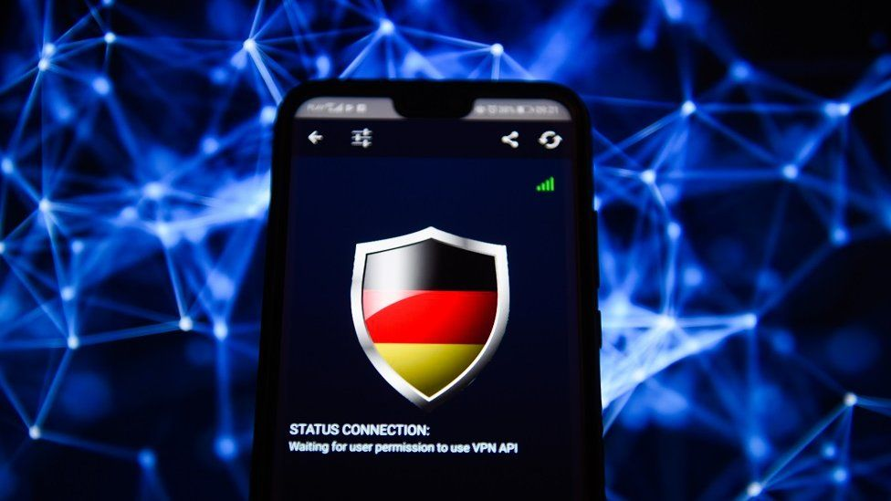
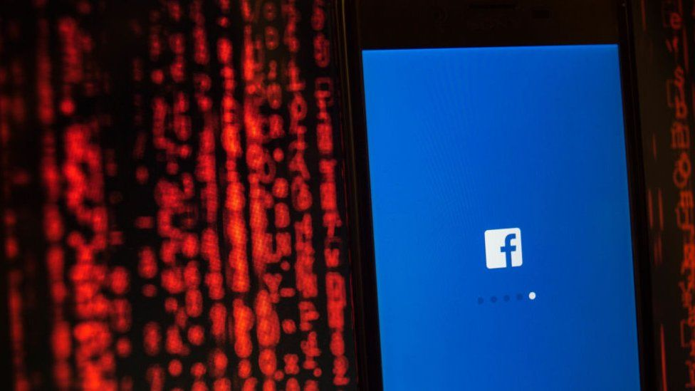

# 中国VPN用户被罚 “翻墙”怎么会违法 - BBC News 中文

_斯影_ _BBC中文记者_

2019年 1月 11日

------

Image copyright Getty Images 

**在中国大陆有数千万网民使用VPN** **（虚拟私人网络）浏览** **境外网站。这种** **突破网络审查的行为俗称** **“** **翻墙”。** **近日，广东韶关市网民朱某因使用VPN受到行政处罚。此前中国当局只针对销售** **“** **翻墙** **”** **工具的商业行为采取行政处罚，少有针对用户进行处罚。**

学者分析，这是“杀鸡儆猴”，意味着当局正加强网络管控力度。

到底什么样的“翻墙”行为触犯法律？“翻墙”是如何被侦测到的？墙外的世界会被慢慢隔离吗？

Image copyright Getty Images  

Image caption 中国使用防火长城屏蔽国外网站。因为有了防火墙，就有了大量使用翻墙软件联通世界的用户。

## 警示网民？

根据广东韶关市公安局于1月4日发布的信息，当地市民朱某被指控“擅自建立、使用非法定信道进行国际联网”，被处以警告，并罚款1000元。

一份印有南雄市公安局公章的《行政处罚决定书》在网络上传播。该文件显示，朱某于2018年8月至12月期间，用自己的手机安装翻墙软件蓝灯（Lantern Pro），连接到家中的宽带网络“翻墙”上网，于被查处前一周内登录487次。

同时，另一份来自印有重庆市荣昌区公安局公章的《被传唤人家属通知书》也在网络上曝光。通知书上显示，重庆网民黄某也受到同样指控。

这是少有的网民因个人“翻墙”行为受到行政指控的事件，因而引起广泛讨论。

专门研究中国互联网法律的香港中文大学法律学院副教授李治安称，类似处罚案例并非第一次出现。从2017年开始，就有类似消息传出。

他对BBC中文网说，这次直接由官方发布消息，是想以一儆百。

- [中国工信部打击无证自建代理服务器](https://www.bbc.com/zhongwen/simp/chinese-news-38714639)
- [苹果CEO辩解为何向中国网络审查低头](https://www.bbc.com/zhongwen/simp/chinese-news-40799126)
- [用马斯克的卫星WiFi翻墙？你可能想多了](https://www.bbc.com/zhongwen/simp/world-43201428)
- [筑墙与翻墙的官民较量](http://www.bbc.com/zhongwen/simp/china/2010/03/100226_china_firewall)

## “翻墙”的意义

VPN最早是用来帮助跨国企业连接世界各地的办公室，让不同地方的员工都可以进入公司内网，执行高权限的任务。以前，企业获取VPN服务需要邀请码注册，并登陆境外邮箱。随着技术成熟，普通人通过手机下载应用程序就能“翻墙”。

李治安说，据保守估计，目前中国网民使用VPN的人数有两、三千万。有些高校的学生、学者使用VPN连接国外图书馆下载资料，或到Google scholar查阅最新发表的研究。对于有互联网专业背景的人，很容易在网络上自学技术原理，自己搭建VPN平台。

苏州一位网络工程师刘元2010年从香港一所大学毕业后，回到家乡供职于当地一间负责软件开发的公司。他对BBC中文网说，读书时早已习惯香港自由的网络环境，回到大陆后觉得束手束脚，于是自己搭建VPN，或在手机上下载各种VPN软件。

刘元说，在平时工作中，开发软件时会时不时遇到疑难问题，需要“翻墙”到境外网络，通过谷歌查询国外专业同行的解决方法，或从国外软件分享论坛下载文件包。“这样不仅提高工作效率，而且可以学习最新技术，”他说。

他的同学郑涛现在武汉一家网络安全公司任职程序员。回家乡前他在一间香港公司任职，离开后会仍会使用原公司提供的VPN账号浏览业内信息。在公司注销其账号后，也曾通过代理服务器的方式“翻墙”，但常因信号不稳，传输速度慢而放弃。

而对于刘元来说，如果无法实现“翻墙”，他就要自己去分析软件代码，寻找编程逻辑，再解决问题，“本来五分钟就能完成的事可能需要一个小时”。现在他仍然会购买境外VPN软件来满足工作需要。

## 什么样的“翻墙”违法？

Image copyright Getty Images  

Image caption 谷歌等软件在中国遭到屏蔽，一些用户通过VPN翻墙使用。中国当局管制网络以前是从技术上封锁IP，现在已经开始从法律上执行。

根据《中华人民共和国计算机信息网络国际联网管理暂行规定》（下称《暂行规定》）第六条，“计算机信息网络直接进行国际联网，必须使用邮电部国家公用电信网提供的国际出入口信道。任何单位和个人不得自行建立或者使用其他信道进行国际联网”。公安机关可对违反此规定的人给予警告，并处以最高15000元罚款。

中国国务院在1996年发布该《暂行规定》，在1997年修改。李治安说，这个规定在过去20多年中“备而无用”，具有法律效应，但没有履行执法行为。

执法主要从2017年开始，当年中国收紧VPN市场。

2017年1月22日，中国工业和信息化部公布了《关于清理规范互联网网络接入服务市场的通知》（下称《通知》），决定从当日起至2018年3月31日，在全国范围内清查网络基础设施和IP地址、宽带等网络接入资源。

李治安说，从那时起，当局就在释放一种信号，警示企业和个人重视“翻墙”的法律后果。

2017年7月1日，拥有大量用户的老牌VPN服务商GreenVPN停止服务。之后，更多VPN服务商在监管部门的要求下终止运营，包括天行VPN、云墙VPN等。在2017年一年，苹果公司以触犯中国法律为由，在中国区应用商店中下架了674款VPN应用程序。

李治安解释，目前只有通过三大电信运营商（中国移动、中国联通和中国电信）来申请的海外服务器对接服务才是合法行为，其他形式的“翻墙”行为都属于《暂行规定》中的“非法定信道”。

“你可能只是下载了一个VPN软件帮你连到国外，其实都是违法”。

## “翻墙”是如何被侦测到的？

李治安说，原则上来讲，中国的国内网络通过有限的几个关键节点与国外网络相连，这些节点相当于远程通讯的枢纽。

当用户通过VPN“翻墙”时，一定要通过这几个关键节点来实现，此时防火墙可以在某个节点根据VPN传输的信息流来识别IP地址。

而VPN的形式多种多样，根据其协议、应用、设备类型等区分，也不断挑战防火墙技术。李治安说，在过去数年间，中国的防火墙技术和VPN突破防火墙的技术此消彼长。有些VPN有加密功能，可以绕过防火墙，不被侦查到。甚至有些高端VPN具有反侦查技术。

李治文说，侦查与被侦查之间，仿佛正邪间的对决，无休无止。

## “选择性执法”

Image copyright Getty Images  

Image caption 全球最大的社交网络Facebook 在中国也无法使用。

李治安认为，中国当局管制网络的执法时紧时松，以前是从技术上封锁IP，现在已经开始从法律上执行。

针对中国网民数千万使用VPN的网民，当局采取的措施是“选择性执法“，依据是“翻墙的行为对国家影响有多大，政府觉得敏感到什么程度”，李治安说。

“如果你看了一个高度政治敏感的网站，或翻墙后散布了一个政府觉得不恰当的言论，很有可能成为一个明显的执法目标，面临的罚则也会很高。”

台湾合盛法律事务所律師张绍斌对BBC中文网说，“（VPN）连线只是一种手段，连线的内容是否涉及国家利益或国家安全则是另外一回事。”

至于当局打击“翻墙”行为是基于网络安全，还是言论自由，张绍斌认为，需要有更多的案例才能判断，并且每个类似案例都要弄清楚两者区别。

苏州的刘元对打压VPN的情况表示无奈，但称自己仍会使用VPN，“感觉周围很多人在用，没那么严重吧！”

武汉的郑涛说，今后只会在公共场所少量使用VPN，查找的资料只做用科研用途。

“Read-only！”郑涛用计算机术语打趣说，表示他只读信息不向外散布。

《暂行规定》尚未成为真正的法律条文。但李治安说，如果广东省进一步发布地方层级的法规命令，一旦在国内不同的管理阶层达成共识，就有可能成为国家法律。

**（应采访对象要求，此文中刘元、郑涛均为化名）**

Copyright © 2019 BBC. BBC不为非BBC网站内容负责。

------

原网址: [访问](https://www.bbc.com/zhongwen/simp/amp/chinese-news-46823319)

创建于: 2019-01-11 21:33:52
