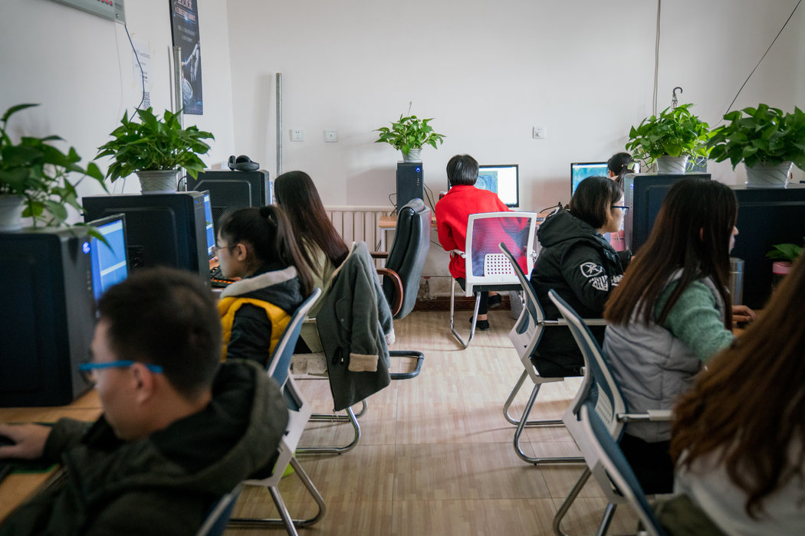

# 网络审查再升级：中国推特用户遭政府盘查或拘留 - 纽约时报中文网

孟宝勒

2019年1月11日

中国南宫的一个网络数据处理中心。推特在中国被封锁, 但一个小而活跃的社区可以使用特殊的软件访问。 Yan Cong for The New York Times

上海——一名男子在拘留所待了15天。另一人的家人遭到警方的恐吓。第三人被用铁链锁在椅子上接受了8小时的盘问。

他们的罪行：发推。

在陡然升级的网络审查行动中，中国警方在盘问和拘捕越来越多的推特用户，即便这个社交媒体平台在中国被屏蔽，该国绝大多数人都看不到。

此次打击行动，是习近平主席将政府的互联网打压行动[拓展至国界之外](https://cn.nytimes.com/china/20180305/china-technology-censorship-borders-expansion/)的又一事例。实际上，当局正在将控制延伸到中国公民的网络生活中，无论他们在哪里发帖。

“如果放弃推特，那么意味着我们会丧失最后的言论平台，”人权活动人士王爱忠说，他表示警方已命令他删除批评中国政府的消息。

有时候当北京无法让活动人士删除推文时，另一些人会帮他们做到。上月的一个晚上，王爱忠在看书时，手机忽然响起，是推特发来的消息，其中包含他账户的备用密码。

一小时后，他说，他的3000条推文已被删除。他将其归咎于政府支持的黑客，尽管哪些人对此负责、他们用了什么方法，都无法单方面被证实。

一名推特发言人拒绝就政府行动置评。

中国长期在监督其公民能看什么、说什么，包括在网上，但最近的行动表明，北京的网络控制视野已包括全世界的社交媒体。被屏蔽的WhatsApp上的消息已经开始在中国的审判中作为证据出现。

中国政府日益[要求谷歌和Facebook](https://cn.nytimes.com/china/20180305/china-technology-censorship-borders-expansion/)撤下官员们反对的内容，即便两家公司网站在中国都无法登录。在[流亡海外的中国亿万富翁郭文贵](https://cn.nytimes.com/china/20180110/the-world-according-to-guo/)使用这些平台发表针对中国最高领导人的贪腐指控后，[Facebook](https://cn.nytimes.com/business/20171009/facebook-china-guo-wengui/)和[推特](https://cn.nytimes.com/china/20170427/guo-wengui-chinese-billionaire-twitter/)以用户投诉和披露个人信息为由，暂停了他的账户。郭文贵如今已回到这些平台上。

推特也许在中国被禁，但这个平台在该国议题的探讨中发挥着重要作用。一个虽小却活跃的群体用软件绕过政府的封锁，抵达政治辩论最后的避难所。去年，德国赫尔梯行政学院(Hertie School of Governance)教授施达妮(Daniela Stockmann)对1627名中国网络用户展开了一项调查。根据基于该调查的估计，仅0.4%的中国网络用户、约合320万人使用推特。

此外，官方媒体机构，如中共控制的《人民日报》和新华社，用推特影响世界其它地区对中国的认知。

“一方面，国有媒体充分利用这些平台的功能触及千千万万人，”位于美国的亲民主研究组织自由之家(Freedom House)的东亚地区高级研究分析师莎拉·库克(Sarah Cook)说。“另一方面，普通中国人冒着被盘问和囚禁的风险，用这些平台互相交流和与外界沟通。”

与中国的审查制度存在抵触的平台并非只有推特一个。

商务网络服务商领英早已[向该国的审查者屈服](https://cn.nytimes.com/business/20141009/c09chinasocial/)。上月，它一度撤下了曾被中国监禁的英国私家侦探[韩飞龙](https://www.nytimes.com/2016/11/02/business/international/china-rules-glaxo-bribes-sex-tape-whistleblower-cautionary-tale.html)(Peter Humphrey)的中国账号，本月又撤下了人权活动人士周锋锁的账号。该公司给两人发了邮件，措辞类似于其删除违反审查规定的贴子时发给用户的信息。

“我们在近几周看到的，是当局不顾一切地升级对社交媒体的审查，”韩飞龙说。“领英一直在以这种偷偷摸摸的方式压制人们的言论，阻止他们的评论在中国被看到，我认为是相当令人震惊的。”

曾在中国被监禁的私家侦探韩飞龙。上月，商务网络网站领英一度撤下了他的中国账号。 Frank Augstein/Associated Press

这两个账户已被恢复。在一份声明中，领英为撤销账户道了歉，称其这么做是出于意外。“我们的信任与安全团队正在升级我们的内部程序，以帮助防止类似错误再度发生，”该声明说。

 在Twitter上，中国官员将目标对准了一个活跃的中国活动人士平台。

记者对九名接受警方讯问的Twitter用户进行了采访，并且检查了一段长达四小时的审讯录音，结果发现了类似的模式：警方会打印出推文，并建议用户删除特定的信息或他们的整个账户。官员们经常会抱怨那些批评中国政府的推文，或者特别提到习近平的推文。

据接受采访的Twitter用户说，警方使用了威胁手段，有时还进行人身限制。在Twitter上拥有8000多名粉丝的活动人士黄成城说，他在重庆遭到八小时的审讯，手脚被铐在椅子上。调查结束后，他签署了一份远离Twitter的承诺。

被叫去问话的不一定要在Twitter上有很大影响力。厦门一家建筑公司47岁的员工潘细佃有大约4000名粉丝，他[贴出了异见漫画家“变态辣椒”的漫画](https://twitter.com/remonwangxt/status/1031736279375986690)，并对人权镇压提出批评。去年11月，警方传唤他，对他进行了20个小时的讯问。被迫删除几条推文后，他被允许离开，认为自己的苦难已经结束了。

但没过多久，警察就出现在他的工作地点，把他扔进一辆车里。他们让他签署一份文件，上面说他扰乱了社会秩序。他照做了。然后他们给他看了第二份文件，说他将被拘留。接下来的两周，他和另外10个人一起待在牢房里，观看政治宣传视频。

“我们这个年纪恐惧是有的，但是没办法控制自己，”潘细佃获释后在接受电话采访时哭着说。“我们活得太憋屈了。”

“我们就像羊羔，”他补充道。“不停地被叼走一只又一只。我们却毫无还手之力。”

这次打击行动的范围之广和惩罚力度之大不同寻常。过去审查国内社交媒体时，官员们的目标是[知名用户](https://cn.nytimes.com/china/20140418/c18xue/)。他们被审讯或拘捕的情况远没那么频繁，并且比较随机。

目前的打击对象包括没有名气、粉丝很少的Twitter潜水者。加州大学伯克利分校信息学院(School of Information)教授萧强说，地方和国家执法部门之间的协调似乎更好了。

“采取真正的全国行动，把这么多人实际抓起来，这是我们以前从未见过的，”他说。

新办法包括中国强大的公安部采取的大范围行动，该部门负责监督执法和政治安全。几名Twitter用户表示，当地政府特别提到了公安部中负责监控网络活动的部门——网络警察。公安部称这类地方执法是“接地气”的办法，去年夏天，以打击厦门电信欺诈闻名的[一名强硬派](https://m.thepaper.cn/newsDetail_forward_2211105)接管了这个部门。

公安部和负责互联网监管的国家互联网信息办公室没有回复记者的传真置评请求。

警方在提醒活动人士，他们是可以看到中国审查防火墙之外的帖子的。对一位在Twitter上发帖抱怨环境问题的用户进行了四小时的盘问后，一名警察给了他一些建议。由于担心遭到进一步报复，这名用户要求匿名。他录下了审讯过程，并提供了一份录音副本。

“把所有推特删掉，把账号注销，”这个警察说。“网上什么都可以监测到，哪怕你在微信群发一些不当的言论，都可以监控得到，”他提到的微信是一款流行的中文即时通讯应用。

“这是给你真心的建议，”警官还说。“如果是第二次，肯定就不是那样处理了。对你父母有影响的，你还这么年轻，万一你以后结婚生孩子，对你孩子有影响的。”

[记录了11月镇压行动](https://www.hrw.org/news/2018/11/21/chinas-social-media-crackdown-targets-twitter)的人权观察(Human Rights Watch)中国研究员王亚秋说，这些行动抑制了中文Twitter上的讨论。不过，并不是所有的用户都悄悄地离开了。

“许多活动人士希望言论自由，”王亚秋在接受采访时说。“即使受到骚扰和恐吓，他们也非常勇敢，继续发推。这是对审查制度和压迫的蔑视。”

孟宝勒(Paul Mozur)是《纽约时报》驻上海记者。  

袁莉自香港对本文有报道贡献。Qiqing Lin对本文有研究贡献。

翻译：纽约时报中文网

[点击查看本文英文版。](https://www.nytimes.com/2019/01/10/business/china-twitter-censorship-online.html)

------

原网址: [访问](https://cn.nytimes.com/business/20190111/china-twitter-censorship-online/)

创建于: 2019-01-11 23:25:30
