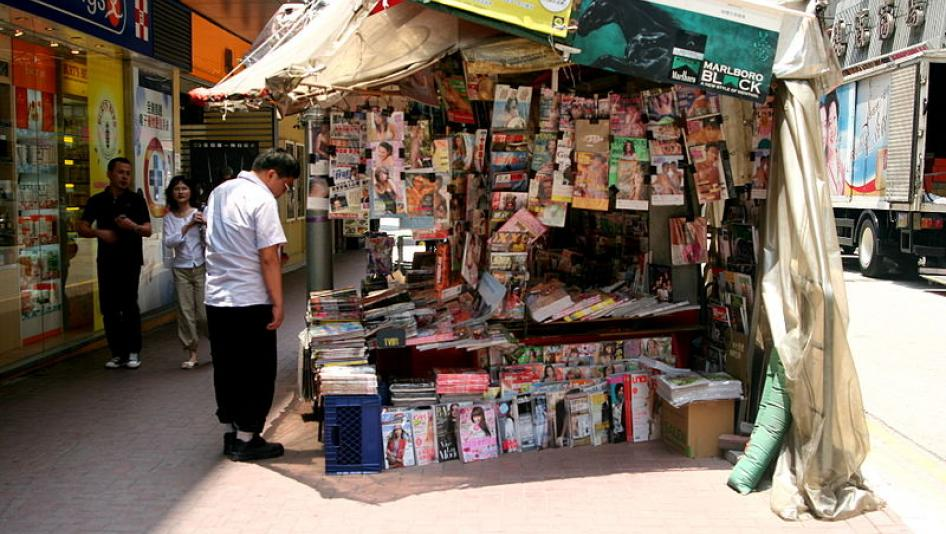

# 中国刺探香港国际媒体 | Human Rights Watch

港府会否立案侦办？

2019年 01月 09日 12:00上午 EST 快讯

#### [Maya Wang](https://www.hrw.org/zh-hans/node/222591)

China Senior Researcher

香港街头书报摊。

© Sonja Pieper／维基共享资源

《华尔街日报》经调查揭发中国大陆公安对该报驻香港记者进行“[全面监控](https://www.wsj.com/articles/how-china-flexes-its-political-muscle-to-expand-power-overseas-11546890449)”后，港府保安局局长李家超[回应指出](https://www.hongkongfp.com/2019/01/09/govt-explain-chinese-agents-spying-foreign-journalists-hong-kong-says-lawmaker/)：“我可以肯定地说，在香港只有特區政府執法部門享有執法權。”

但是，鉴于近来北京屡屡干预而港府消极不作为的纪录，李家超的说法实在难令居民安心。

根据香港实质宪法《基本法》规定，港府享有“高度自治”，有权管理外交与国防除外的一切本地事务，香港居民也享有各项权利，包括新闻自由。在《基本法》中，没有任何条款允许大陆公安在香港执法，对《华尔街日报》记者的监控因而存在合法性疑问。

类似情况早已屡见不鲜。但面对大陆安全部门在香港日益粗暴甚至违法执行任务，港府却几乎视若无睹。

铜锣湾书店英籍出版商李波于2016年[被从香港绑架到大陆以后](https://www.scmp.com/news/hong-kong/politics/article/1898005/missing-booksellers-mystery-cy-leung-vows-hong-kong-will)，当时的香港特首曾表示“高度关注”并承诺进行调查。[加拿大华裔富豪肖建华](https://www.scmp.com/news/hong-kong/politics/article/1898005/missing-booksellers-mystery-cy-leung-vows-hong-kong-will)2017年在香港中环高级酒店被绑架送往大陆之后，他又做出同样承诺。

但这些案件无一获得查处，导致港人维护香港自由的信心动摇。人权观察为前述两案[致函](https://www.hrw.org/news/2017/06/28/letter-hrw-hk-chief-executive-carrie-lam)港府，林郑月娥均置若罔闻。

在此同时，香港民主党派和人权工作者也不断传出[遭大陆安全人员跟踪盯哨](https://m.mingpao.com/ins/%E6%B8%AF%E8%81%9E/article/20170701/s00001/1498873852518/%E3%80%90%E7%9F%AD%E7%89%87%E3%80%91%E7%A4%BA%E5%A8%81%E7%94%A8%E3%80%8C%E6%A3%BA%E6%9D%90%E3%80%8D%E8%A2%AB30%E4%BA%BA%E5%8C%85%E5%9C%8D%E7%A0%B4%E5%A3%9E-%E5%8F%A4%E6%80%9D%E5%A0%AF%E8%85%B3%E5%82%B7%E5%A0%B1%E8%AD%A6)，尤其在2017年7月[习近平访港期间](http://hk.apple.nextmedia.com/realtime/news/20170630/56894999)。

如此重要案件均悬而未决，既是对所有在香港从事“敏感”议题工作的人士──不管是调查中国政府不可告人的金融交易、促进人权或坚持追究当局恣意消音的任何议题──发出警讯，也将让北京更加肆无忌惮。

李家超若真想安定民心，应当宣布对本案追查到底，并定期向大众说明侦办进度。否则，只会令港人更加怀疑是谁在对他们执法。

---------------------------------------------------

原网址: [访问](https://www.hrw.org/zh-hans/news/2019/01/09/326199)

创建于: 2019-01-12 23:49:32
