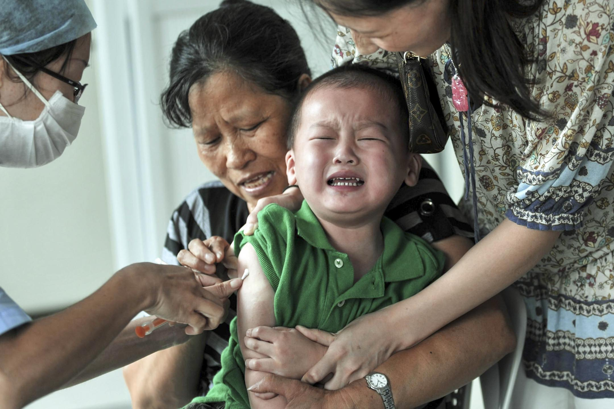

# 江蘇疫苗過期連環爆，百餘名兒童接種後不適 - 端傳媒 Initium Media

2019-01-12

* * *

近日江蘇省金湖縣的多位家長先後發現他們的孩子仍在使用過期疫苗。圖為一名接種疫苗的兒童。攝：VCG via Getty Images

1月7日，江蘇淮安金湖縣家長反映，從去年12月11日起，迄今陸續有百餘名嬰幼兒被接種的脊灰(小兒麻痺)疫苗為過期疫苗，部分兒童在服用疫苗後出現了嗜睡、嘔吐不止等症狀。

脊灰疫苗所預防的病症為脊髓灰質炎，俗稱「小兒麻痺症」。根據中國國家衞生健康委員會要求，自2016年5月1日起，每位兒童均需要接種四次脊灰疫苗。因此此次事件引起了家長普遍的擔憂。

1月9日，金湖縣政府發布通告，稱共有145名嬰幼兒服用了過期疫苗。當局稱過期的原因主要是「管理混亂、工作失職、監管失靈」。當日，金湖縣衞計委下發通知，對金湖縣疾控中心主要負責人及相關科室成員作出免職決定。此外，對涉事衞生院部分工作人員給予立案調查。

然而，當地家長並不認同當地政府的說法，部分家長查閲了疫苗批號後發現，早在2013年，孩子就曾被注射過過期疫苗。有媒體更報導，[金湖的過期疫苗最早可以追述到2010年](https://mp.weixin.qq.com/s/S0Y4l8FcZwMNIK9o_HaRqQ)。

於此同時，大陸還有家長反映，過期疫苗問題不只涉及脊灰疫苗，包括卡介苗、百白破、水痘疫苗、乙肝疫苗在內的多種疫苗均出現了過期情況。這意味著，在金湖過期疫苗事件中受到影響的兒童數量，遠超145名。

而事情的嚴重性似乎也遠超政府的說法。據BBC中文網採訪發現，有孩子注射的水痘疫苗已經過期近2年。而與金湖縣毗鄰的淮安市洪澤區，也同樣被指出現大量過期疫苗。在洪澤區，目前可知最嚴重的過期疫苗是乙腦疫苗，已經過期兩年之久。

在家長們核實疫苗的過程中，當地政府被控隱瞞甚至修改數據。在現場，不少家長發現疫苗信息欄中「疫苗批號」、「生產廠家」信息均是空白；還有部分家長在只有兩個批次的疫苗中發現了第三種批號。家長就此問題進行詢問，均被告知是查詢方式的問題。

1月11日下午，大量金湖家長走上街頭，他們一方面抗議縣政府瞞報受害兒童的數量，另一方面抗議當地長期存在的過期疫苗使用問題。在上傳至社交媒體的視頻中可以看到，當晚大量警力身穿黃色雨衣，組成人牆試圖驅散示威人群。

1月12日上午，仍有[眾多家長前往前往金湖縣政府和縣人民醫院討要說法](https://www.bbc.com/zhongwen/simp/chinese-news-46848703)。據網絡媒體報導，當地縣委書記張志勇在與民眾對話時，因為再三強調「只有145名」孩子接種過過期疫苗而遭陳情人毆打。

日前對於服用過期疫苗可能導致的不良反應以及後遺症，尚未有統一的說法。但有部分家反映，孩子在服用過期疫苗後出現了高燒、昏迷、肺炎、敗血癥等情況。當地政府已經為孩子後續檢查、治療等問題作出安排，但有部分家長表示已經對當地醫院失去信任，拒絕治療。

### 評論 15

*   咸鱼姬3 小時前
    
    已經定調“不法分子”帶家長“尋釁滋事”了，再次無事發生，2019年繼續歌舞升平。首發信息的搜狐怕是面臨被秋後算賬，“自古以來”墻內沒有新聞，只有藍底白字的通稿。
    
*   包子哥3 小時前
    
    起来 不愿做奴隶的人们
    
*   六楼4 小時前
    
    天堂到地狱只有一步之遥，这一针之前是护党群众，一针之后是祸国刁民。
    
*   恒久一心4 小時前
    
    就这样一次次的，多少的岁月静好变成一地鸡毛，党国膝跳反射似的用暴力维稳换来表面上的安宁，但无法挽回人们对党国盲目的信任，直到突破阈值的那一刻。
    
*   nicknames5 小時前
    
    坦克快出动了
    
*   sowhatsthepoint12 小時前
    
    这应该是我老家最“声名远扬”的一次吧…
    
*   我不是在笑12 小時前
    
    土共和韭菜都无药可救了
    
*   The\_Initium\_Reader13 小時前
    
    被再问大陆同胞为什么想统一了，对岸生活质量这么高谁不想过去？
    
*   sun201714 小時前
    
    歲月靜好的人，只差那麼一針而已。
    
*   万戈15 小時前
    
    维稳第一，这就是中国
    
*   AKB4916 小時前
    
    所以別再問為什麼台灣不想統一了⋯⋯如果中國真那麼棒，我也想統一啊！
    
*   tanwoung16 小時前
    
    打的好啊。
    
*   sicKozy17 小時前
    
    為什麼同為人類卻總有敷衍了事的政府人渣
    
*   雨辰17 小時前
    
    这是一条打扰我学习的推送。点开之后再三确认了下发生地，连这么富硕的地方都这样，别的地方呢？更可气的是，一直看到底才知道事情究竟有多严重！
    
*   ChienChing17 小時前
    
    天杀的啊 不得好死
    

---------------------------------------------------

原网址: [访问](https://theinitium.com/article/20190112-vaccine-outofdate/)

创建于: 2019-01-12 23:55:36
