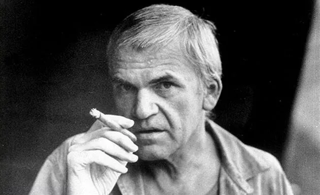

# 周六荐书｜哈维尔：“生活在真实中”

**撰文：景凯旋**

**《东方历史评论》微信公号：****ohistory**  

  

在世界文学史上，20 世纪下半叶东欧文学具有特殊的地位。 东欧作家继承了 19 世纪批判现实主义传统，同时又接受和发展了 20 世纪现代主义与后现代主义思潮，对现代世界的冲突及人的存在进行了深刻思考。**《在经验与超验之间》（东方出版社，2018年12月出版）**是对东欧观念的一次全面审视，从文学、哲学、社会学及政治学的多维角度，围绕东欧作家的问题意识，疏理和分析了他们的价值观念。这些思想型、知识型的作家面对传统价值消亡的现代危机，在强调生活世界的同时，重新追寻失去的意义，探求什么是文学、什么是存在、什么是现代性等时代重大问题，表现出对人类命运的强烈不安，其本体论、认识论和方法论都与西方现代主义迥然相异。东欧观念深刻表明，人类的精神活动总是处于经验与超验之间，向 着地平线前行的征途上，既布满陷阱，又充满希望。

以下文字受权摘自该书。

**哈维尔：“生活在真实中”**

捷克斯洛伐克第四届作协大会后，哈维尔被作协除名，随后他便与另外几个作家筹组了独立作家笔会。在“布拉格之春”发生时，他最初并没有直接参加运动，他一直不喜欢具体的政治活动。首先，他并不想当一个政治家，而只想做一个见证时代的作家；其次，他对体制内有改革思想的作家一直抱有负面看法，认为他们最多不过是反教条主义者，看不到社会的本质。在他看来，“布拉格之春”仍然是来自上面的体制改革，所以并不彻底。但在苏军占领捷克后，哈维尔反而积极地投入到运动之中，参加大学和工厂的集会，拟写各种宣言，在电台上评论事件的进展。不过，他与事件仍然保持着距离，甚至在讨论起草一份绝不放弃真理的宣言的会议中，他还抽空溜出去参加了一个画展。这种保持距离的行为并不意味着不负责任，而是他的“荒诞的理想主义”的表现。按照他自己的解释，正是由于面对痛苦的历史事件，捷克民族具有一种能表现出荒诞感的特性，他才从来没有背弃过这份宣言的精神。 

在1968年8月苏军入侵捷克前，哈维克就一直在思考形而上的意义问题，他曾给杜布切克写过一封私人信，希望他能坚持尊严。信中特别提到，任何一个纯道德的行为，虽然不会立即产生看得见的政治效果，但随着时间的推移终将逐渐产生一定的意义。  尽管这个观点在当时不可能有任何作用，甚至杜布切克也许都不会看到这封信，但在哈维尔自身的践履中，这个观点却得到了进一步的发展。

 胡萨克上台执政后，立即像当年整肃他的哥特瓦尔德一样，进行大规模清洗，人们曾经认为已经不可能的事又出现了。许多作家和学者失去工作，作品也遭到禁止，仅在“七七宪章”开列的名单中，被禁止发表作品的捷克作家就有231名。为了生计，他们被迫去做看门人、清洁工和邮递员。哈维尔也被撤销一切职务，开始在国内过流亡生活。他搬到郊区一幢农舍，并在一家啤酒厂工作了一年。在那儿，他照样遭到窃听和监视。当时有许多异议作家和他一样，一举一动都遭到当局公开的监控、跟踪和骚扰。这一切让昆德拉的愿望彻底落空，最后他放弃了改革梦，于1975年移居法国。哈维尔则与许多作家在国内进行反抗，以萨米亚特的形式写作，组织作家、学者签署各种请愿书，抗议当局的压制，哈维尔本人也为此几度入狱，长期的监狱生活最终毁掉了他的健康。

昆德拉

  整个社会又重新归于压抑和沉寂。20世纪70年代初，唯一引起公众注意的事件是一份要求赦免被捕人士的请愿书，签名者包括原来体制内与体制外的一些作家，其中有瓦楚里克、克里玛、科胡特等人。昆德拉是反对写请愿书的，他认为这样做毫无效果。这件事后来还被他写进《不能承受的生命之轻》中，当托马斯的儿子要求他在请愿书上签名时，他拒绝了，因为他不喜欢人们用社会责任的高调来强迫自己。而哈维尔则是积极参与征集签名的人，他认为这种堂吉诃德式的努力不是没有意义的，即使请愿书没有任何效果，但对于坐牢的人却是一个巨大的精神支持，当局或许不得不考虑国际影响，不再那么肆无忌惮。更重要的是，它会促使人们恢复公德心。  道德的重要性在他的思想中越来越有分量。因此，哈维尔不赞同昆德拉的怀疑态度，在他的自传性采访中，他说：

> 我反对他，是他看不见，或故意拒绝去看事物的另一面——那些不明显但也更充满希望的一面。我指的是这些事物可能具有的间接的和长远的意义。昆德拉也许会成为他自己的怀疑主义的俘虏，因为这种怀疑主义不允许他承认冒着受人讥笑之风险而做出勇敢的行为可能更有意义。 
>

 这段话对于了解哈维尔的思想是很重要的，尽管后来的事实似乎证明昆德拉是对的，许多签名者遭到了逮捕和起诉，但哈维尔仍然坚持认为，昆德拉的怀疑主义是出于从前那种幻想破灭的结果，因此他看不到事物“更充满希望的那一面”。在哈维尔眼里，昆德拉的态度代表了一种普遍的社会消极情绪。在经历了20世纪50年代长期的冷漠症之后，“布拉格之春”曾让全社会充满欣快症，促使人们冲上街头进行和平抵抗，但不出一年，同样的社会却又被冷漠症所压倒。这使哈维尔十分惊讶，却没有让他感到绝望，而是意识到捷克人的性格中既有哈谢克和卡夫卡，又有15世纪的宗教改革家胡斯。  后者为了坚持真理被烧死在火刑柱上，但其思想从此却传播开来。显然，这就是哈维尔所看到的希望的一面。

 然而，“布拉格之春”后毕竟是一个令人沮丧的时期。捷克最重要的作家和学者都被禁止发表著作，思想遭到压制，记忆遭到禁锢。胡萨克所谓的“正常化”就是要造成一种表面的平静，将生活缩减为活着，让人们将兴趣转移到物质享受层面。为了安抚人心，当局放弃了社会主义国家传统的积累至上的模式，而是为居民提供更多消费品（这意味着耗光存款和外汇储备，大搞贸易赤字），当政者与公众达成某种默契，当局不干预公众的私事，公众也不关心公共事务，而是沉溺于消费。这种表面的稳定自然会导致社会的精神危机，那些过去认为不道德的事，现在全都被视为正常了。胡萨克的“正常化”成功地制造了一个面包时代，却导致整个国家陷入深度的道德崩溃。如果说1968年前还有着某种虚妄的历史理想主义，赋予人们生活的意义，那么1968年后这种理想主义也完全消失了，人们彻底失去生活有一种意义的信念。一方面，大多数人都只追求个人的好处，成天考虑的是自己的房子、汽车以及食物、穿着和家庭的舒适。另一方面，整个社会充满恐惧、冷漠、懦弱和顺从，人们担心失去工作和学业，对公共事务和他人的痛苦漠不关心。

  1975年，哈维尔在艰难的处境中给胡萨克写了一封公开信，他在信中分析了当时的社会精神状态，指出“正常化”建立的秩序，其代价是整个民族精神上的麻痹和荒芜，是价值的虚无和道德的沦丧，“为了平稳地操纵社会，社会的注意力被故意转向自身，即脱离对社会的关怀。通过将每一个人的注意力集中在仅仅是消费品的兴趣上，是希望使他没有能力意识到他在精神上、政治上、道德上日益增长的被侵犯的程度。将他缩减为一个初级消费品社会的各种观念的简单容器，是打算将他变成复杂操纵的顺从材料” 。结果是使每个人不再去思考生活的意义，把自己降低到油盐柴米的生物学水平。对此，哈维尔称之为“人类个性的危机” 。显然，当权者已经不再坚持早期那种热情而僵化的价值立场，他们已经“不在乎外表看起来忠诚的公民们的实际态度，不在乎他们言辞的诚意” 。与此同时，当局仍然只认可他们所需要的真理才是真理，压制精神的自由发展。在哈维尔看来，“所有这些制造‘正常’行为的概念是一个本质上深深悲观厌世的概念” 。

  

哈维尔当然明白，写这封信既有风险，也不会有任何效果。从根本上讲，他把这封信看作一种自我疗伤，使自己能重新从沮丧中恢复过来。这封信在社会上立即引起了广泛的反响，许多捷克人在私下传抄它。这表明了一个重要的事实，如果说政权过去曾以社会平等的号召一度占据了时代的道德高地，如今道德高地却转移到被统治的民众身上。在后来的一次采访中，记者问哈维尔为什么要写此信时，他说：“我相信，说出真实总是有意义的。在所有的环境中。”  换句话说，作为一个受到存在主义影响的作家，他像加缪一样，选择了既不当受害者，也不做刽子手。

 那么，什么是哈维尔所理解的“真实”？它的意义又在哪里？

 在写于1978年的《无权者的权力》中，哈维尔对此问题做了详细阐释。这篇文章是为了纪念逝世的“七七宪章”发言人扬·帕托切克，阐述宪章的精神。1976年，当局逮捕了“宇宙塑料人”摇滚乐队的成员，这些前卫的年轻人只是在音乐中表达自己的真实感受，在一首歌《百分百》中唱道：“他们害怕老人的记忆/他们害怕年轻人的思想和理想/他们害怕葬礼和墓上的鲜花/他们害怕工人，害怕教堂，害怕党员，害怕所有的快乐时光/他们害怕艺术/他们害怕语言这沟通的桥梁/他们害怕明天/他们害怕未来/害怕悲伤，害怕欢乐，害怕语言，害怕笑/……他们害怕摇滚乐/那么我们究竟为什么要怕他们？”哈维尔本人也是乐队的忠实歌迷，在他看来，这些年轻人想要突破生活的一致性，追求自己的生活目标，就是在追求自由。为了支持这群独立的年轻人，他和许多知识分子一起发起了抗议活动，这次抗议促成了1977年由众多知识分子署名，以捍卫普遍人权为宗旨的公开宣言。宪章的产生标志着捷克知识分子非暴力抗争运动的肇始，哈维尔成为宪章的三名发言人之一。

“宇宙塑料人”摇滚乐队

 在这篇影响深远的纪念文章中，哈维尔采用了“制度目标”与“生活目标”这一对重要的分析范畴，并对此加以论述：

> 制度目标和生活目标之间存在着一个断裂的深渊：生活，在本质上是朝向多元化、多样化、独立和自我组织的，简言之，向着它自身的自由实现运动；而后极权制度则要求一致、标准化和纪律。生活是竭力创造新的和未必是意料之中的结构，而后极权制度则竭力将生活驱入它的几近必然的状态。制度的目标泄露了它的最基本的性格——封闭内向，一种甚至是彻底的和无保留地向着自身的运动，其辐射的范围也是不断扩展的。这个制度仅仅在这样的限度上为人民服务，即必须保证人民将为它服务。任何在这个范围之外的事情，即任何使得人们逾越他们被指定的角色的事情，都被制度认为是对它的一种攻击。从这个角度看这是对的：每一个这种逾越的要求都是对制度的一种真正的否定。因此可以说，后极权制度的内在目标并不仅仅是一小撮掌权者权力的自我保存，像乍看上去的情况那样。比这更重要的是，自我保存的社会现象从属于某种更高的东西，某种驾驭制度的盲目的自发性质。不管在权力的等级制度中个人置于怎样的位置，他们都不被制度认为其自身是有任何价值的，而仅仅被要求作为燃料服务于这种自发性质。因此，个人的要求若是可以接受的，仅仅是在其方向与制度的自发性方向一致的范围之内。  
>

社会生活的需求是多元、独立和无法预料的，这也是人性的本质规定。极权制度恰恰是要否定生活的这些基本属性，因此，“意识形态，作为在制度和个人之间创造的一座辩解桥梁，弥补了制度的目标和生活的目标之间的裂隙。它伪称制度的要求来源于生活的要求。这是一个试图被当作现实的表象的世界” 。由于其违背人性的性质，生活目标与制度目标之间必然会产生不可调和的冲突。

如前所述，昆德拉曾提到生活目标与历史目标的冲突，他笔下的历史目标是指20世纪50年代的乌托邦理想，而生活目标是指日常生活本身以及它所包含的多元性。哈维尔没有提历史目标，是因为他并不一般地反对历史这个概念。正如他后来在采访中谈到昆德拉时所说，昆德拉曾认为自己掌握了历史的方向盘，然后又发现这个方向盘不掌握在任何人手中，于是将历史看作高于人类之上的没有人性的神灵，喜欢捉弄人类。哈维尔则认为，历史并不是虚无的东西，它就发生在身边，“我们每天所做的事，无论好坏，都是历史的一个组成部分。生活并不是在历史之外，历史也不是在生活之外” 。此外，还有一个原因，在70年代，“现实的社会主义”已成为东欧各国制度的自我描述，  表明政权已经放弃了宣扬历史目标，而采用一种实用主义的态度。匈牙利政治学家基斯在1979年曾写道：“意识形态的要求这时完全是消极的，不要向官方最高的意识形态挑战，或者说在某些不常见的时刻在形式上庆祝庆祝，说愿意服从这种意识形态。”  为了维持权力的稳定，政权反而极力鼓励人性中物欲的一面。作为对抗，哈维尔所称的生活目标除了指日常生活的物欲之外，更是指人对精神生活的需求，包括人对自由、尊严和公正的向往。

哈维尔由此提出一个重要原则，如果一个人不愿生活在谎言中，那么打破这一状况的唯一方式就是“生活在真实中”，亦即返回到人性的本质。问题是，这个人性的本质是什么？它存在于客观的现实之中，还是主观的自我之中？按照其字面意思，“生活在真实中”是指不说谎，表里一致。哈维尔先是从社会层面阐释这句话的含义，由于生活在谎言中使得人们的自我分裂，丧失了个人主体性，从而扭曲了个人的生活目标。借用柏拉图的理论来说，生活目标当然也包括人的欲望与情感，哈维尔并不反对这些日常生活要素，甚至正是为了这些而与制度发生冲突，但他同时也认为，欲望与情感只是生活世界的“观点”，并不是人生的最高目的，在欲望与情感之外，还应当有“真理”的追求，否则人就会为了这些“观点”而屈从，最终导致非人化。

那么，普通人如何才能“生活在真实中”呢？哈维尔继续论述道，假如这位水果蔬菜店经理开始在公共场所讲出内心的真话，他马上就会遭到制度的打压，会失去各种现实利益和平静生活，但他却重新获得了个人尊严和责任感，并通过这种非暴力的反抗告诉人们：“每个人生活在真实之中是可能的。”  在任何一个现实主义者看来，这种行为肯定都是不明智的，它越过了纯粹的私人生活的范围，对个人利益没有任何好处，“它显然是一个道德的行动，不仅因为个人必须付出高昂代价，而且主要因为它不是利己的” 。哈维尔当然明白，不是每个人都有这种无视个人利益的道德勇气，他也不是在要求每个人都应当做出道德选择，毋宁说他是在解释“宇宙塑料人”摇滚乐队的行为，解释“七七宪章”签署者的行为。这些行为在短期内可能没有任何效果，甚至会使私人生活遭到极大的损害，但却会给谎言世界打开一个罅隙，产生对社会有益的长远的影响。

哈维尔  

有意味的是，昆德拉在《不能承受的生命之轻》中同样提到了“生活在真实中”，而且根据他的说法，这句话出自卡夫卡。当代捷克作家大都喜欢从卡夫卡那里吸取思想资源，“生活在真实中”便是一例。不过，从昆德拉的阐释看，在反抗极权的非人化方面，他与哈维尔的观点是相同的，但在对于何为“真实”的理解上，或者说，在对待哈维尔所说的“怎样处理一个人的生活，怎样忍受并摆脱困境，无论这些困境是有关人的、有关生存的、还是有关精神的或政治的” 方面，他们的观点大相径庭。《无权者的权力》发表于1978年，《不能承受的生命之轻》则是出版于1984年，昆德拉在小说中的这番议论或许也是针对哈维尔的文章，因此在这里似乎有必要根据他们的不同观点，对卡夫卡这句名言的含义做进一步的探讨。

对昆德拉来说，真实的生活是指纯粹的私人性，基于其个人主义观念，他认为公共领域与私人领域是有区别的，人只有在私人领域才可能真实，在公共领域则不可能不说谎。萨比娜是一个反感任何“刻奇”的怀疑主义者，将私人性看得高于一切，对公共生活不感兴趣，甚至对此怀有深刻的怀疑。“对于萨比娜而言，要生活在真实中，不欺骗自己也不欺骗别人，除非与世隔绝。一旦有旁人见证我们的行为，不管我们乐意不乐意，都得适应旁观我们的目光，我们所做的一切便一无是真了。有公众在场，考虑公众，就是生活在谎言中。”  与萨比娜相反，浪漫主义者弗兰茨则是一个自以为追求真实的人，偏爱想象甚于现实，他认为：“私人领域与公共领域的分离是一切谎言的根源：一个人在私下是一回事，在公共场合完全又是另一回事。在弗兰茨看来，最真实的生活就是意味着要破除私人与公众之间的界限。他喜欢引用安德烈·布勒东的话，说他渴望生活‘在一间玻璃房里’，任何人都能看到，没有秘密可言。”  换言之，弗兰茨所理解的真实就是，一个人的私人生活与社会生活应当完全一致。但在昆德拉看来，这恰恰是一种抹杀个体存在的集体主义观念。

哈维尔的“生活在真实中”则主要是指价值方面的坚守，强调善与恶有着不可混淆的确定内容，反对一个人在公共生活中表里不一。他始终秉持这样的信念：价值与事实是一致的。大多数人之所以屈从于体制的压力和诱惑，容忍甚至支持谎言社会，就是因为现代人已经失去了对意义的追求。就此而言，昆德拉将“生活在真实中”理解成维护私人生活的独立和自由，拒绝来自公共生活（比如历史目的）的干预，并且像托马斯、萨比娜那样反感道德责任的观念，这意味着在个人自由面前，公共生活的善恶区别并不重要。然而，在后极权时代，体制不一定会经常侵入私人生活，甚至还会鼓励人们只顾物质享受，放弃价值判断，这其实同样意味着个人自由的限制与丧失。换言之，个人自由的前提必须是社会自由。在哈维尔看来，在强迫的一致性社会，“私人生活与公共生活是不可分割的，它们像两个连接起来的容器，如果一个遭到否定时，另一个不可能真正地代表。没有一种历史尺度的私人生活是一种表象和一个谎言” 。可以说，哈维尔的“生活在真实中”体现出某种整全的世界观，具有强烈的社会关怀。如果按照贡斯当的划分，哈维尔的自由观接近古代参与式的自由概念，昆德拉的自由观则接近现代私人化的自由概念。但在没有实现自由秩序的社会，这种私人化的自由是虚妄的。

由此可见，如果说“生活在真实中”就是指忠实于自己的内心，过每个人自己想要过的生活，那就必然会面临一个人生意义的问题，就像“宇宙塑料人”摇滚乐队那些年轻人，正是由于遵循“生活在真实中”的原则，追求精神生活，才导致了生活目标与制度目标的冲突。哈维尔后来谈到这些年轻人的行为，认为这意味着一种自我觉醒和自我解放，证明生活本身是需要有意义的，“文化和精神的空虚贫乏势必会使青年人把注意力转移到更高远的地方，这迫使他们提出生活的意义的问题，去寻找一个更有意义的价值和标准体系，在一个散乱的、支离破碎的疯狂消费的世界里（这里的物质又那么缺乏）去寻找一个固定目标——所有这些都唤醒他们对真正的精神的‘消灭点’的渴求，对更纯洁、更真诚的东西的渴求” 。在每天的日常生活之外，人性决定了一个人仍然会去寻找有意义的东西。

这里需要指出，德语的真实（wahrheiten）与真理是同一个词，即事实与价值是由同一个词来表达的。哈维尔深受存在主义哲学影响，他不仅在社会层面对“生活在真实中”做出分析，而且进一步指出，“生活在真实中”也是存在层面的，它“具有一个存在层面意义的尺度”。  也就是说，在哈维尔那里，“生活在真实中”就意味着“生活在真理中”。这个真理不是来自人的主观思维，而是来自形而上的存在，它规定了生活的各种价值。就此而言，昆德拉是将“真实”理解成社会层面上的“说真话”（在此层面上，如果这世上只有一个人，“说真话”的确就没有任何意义）；而哈维尔的“真实”则不仅指社会层面上的“说真话”，而且指存在层面上的“说真话”（在此层面上，如果这世上只有一个人，“说真话”仍然是有意义的），即事物本质的真实。在本质主义的思维中，人是由灵魂和肉体构成的，因此，人对自然生命并不绝对认同，而是将其与意义世界联系在一起。也就是说，人的内心世界与外在世界是整一的，因而人在任何时候也不能说谎，这与生活在玻璃房里无关，而与存在的意义相关。

随着近代科学理性的兴起，统一的世界在我们面前消失，生与死被截然分开，自然生命成为唯一的实在，死亡不再具有任何价值。首先是理性主义将实体与非实体相分离，接着是浪漫主义将真实（事实）与真理相分离。这就是现代性对人的思维模式产生的根本变化。在生死一体的认识消失之后，人们不得不采取对自然生命绝对认同的思维方式，而如果一个人只秉持纯粹的经验理性，那么“生活在真实中”就自然与真理无关，更与社会无关，而仅仅意味着个人权利不受侵犯。在这个意义上，后极权制度借以维持谎言的最重要的原因不是暴力压制，而是人们“没有能力将自己彻底从表象的世界中解救出来” 。换句话说，后极权制度的非人化就是将人们紧紧地束缚在日常生活中。因此对哈维尔来说，所谓“生活在真实中”就是要重新获得对高于人类生存的永恒事物的信任，重新获得人的尊严和价值。

由于卡夫卡并没有详细解释这句话的含义，导致哈维尔与昆德拉的不同理解。事实上，他们各自的阐释偏重不同的侧面。哈维尔是从个人内在与外在的关系出发，偏重于价值层面；昆德拉则是从个体与群体的关系出发，偏重于事实层面。表面上看，昆德拉的理解似乎更接近卡夫卡的原意，即捍卫个体的独立、自由和尊严。但是，哈维尔也绝对没有将私人生活与社会生活视作完全一致的意思，他只是从形而上的层面去理解卡夫卡，认为卡夫卡的自由概念不仅仅是基于人的自我保全的欲望，而是有着形而上的根源，否则维护个体的独立、自由和尊严也就失去了不言自明的理由。正是由于现代人的价值与事实分离，生活失去了意义层面的东西，所以卡夫卡的人物才会陷入不由自主的境地。

归根到底，现代自由主义关于个人自由的概念是基于“人是目的”，将自我保全视为一切价值的出发点，由此证明自由在价值序列中是第一位的。这一观念促进了现代人的自由。但是，这种对自由的功利主义证明却是有缺陷的，因为倘若自我保全是人的最高目的，人也同样可以为了这个目的而舍弃自由，或者为了面包而屈服于压迫与谎言，或者为了自己与共同体其他成员之间的平等而放弃自由优先的原则。然而，如果按照传统观念，人的最终目的是道德善，人类就不会对自由采取实用立场，或者说，只有将自由建立在道德善的基础上，自由才会有坚实的根基，不会轻易动摇。在这个意义上，“生活在谎言中”在道德上的含义就是个人独立与自由的丧失，而“生活在真实中”则是一个人的自由的证明。因此，拒绝生活在谎言社会，在公共领域讲出真话，便是活在自我的独立、自由和尊严中，同时也必然会将个人对社会的责任视作一种义务。

哈维尔的这篇文章体现了知识分子的社会责任感，在当时的东欧各国，这已经越来越成为一个普遍的认知。例如，匈牙利作家乔治·康拉德曾因写作而遭到禁言，他在20世纪80年代一篇名为《政治与反政治》的文章中写道，知识分子之所以具有优越地位，是因为他的人格是独立的，没有人能命令他，他只表达自己的思想。对于那些指责知识分子介入政治的言论，他持有与哈维尔相同的观点，即在东欧的制度环境下，一个知识分子不可能完全逃离政治：“那些自称不关心政治的人要么错了要么就没说真话。其实他们非常关心政治，他们的整个生命都好像是在避免反对政治的行为。他们不断地被政治影响——往后缩，守在他们的老鼠洞里，躲避政治的花猫。如果需要维持秩序，猫就会吃掉他们, 免得他们来回掠过水面，沉溺在反猫的快乐的吱吱声中。”  在后极权的东欧国家，知识分子最大的困境便是面临这样一个二者必居其一的选择，要么生活在真实中，要么生活在谎言中。

需要指出，哈维尔对现实的分析不是基于政治学知识，而是基于文学和哲学知识，体现出一个文学知识分子的特色，在这方面他可以说是驾轻就熟，得心应手。在写于1987年的《故事与极权主义》中，他完全是以文学家的眼光去分析现实，认为当下的后极权社会是一个没有故事的社会。人们在故事中常常读到的那种纯粹的死亡，在现实中“已经由另一种死亡取代：慢性的、遮遮掩掩的、不流血的，不再是纯粹的，然而是没有行动，没有故事，没有时间的死亡，集体的死亡，或者更确切地说，麻木不仁的、社会和历史虚无化的过程” 。20世纪50年代，理想主义的革命精神气质曾经构成了历史，或者说像是历史。“布拉格之春”后，当局的唯一目标就是自我保存，它甚至不再需要乌托邦的热情，因为这会使人们出于理想主义而对现实不满：

  

> 当前极权主义的支柱是存在着一个所有真理和权力的中心，一种制度化了的“历史理性”，它十分自然地成为所有社会活动的唯一代理人。公众生活不再是不同的、或多或少是自发的代理人摆开阵势的竞技场，而仅仅变成这个唯一的代理人宣告并执行其意志和真理的地方。一个由这种原则统治的地方，不再有神秘的空间；完全的真理掌握意味着每一件事情都事先知道。在每一件事情都事先知道的地方，故事将无从生长。显然，极权主义制度在本质上（及其原则上）是敌视故事的。 
>

在哈维尔的印象中，20世纪70年代早期像是发生了一种“历史休止”，每一年都是相同的，周年纪念、代表大会、庆祝活动、体育比赛等。随着历史事件的消失，意义的感觉也随之消失了，“这个国家由千人一面的官僚们所支配，这些人声称坚持革命的意识形态，却仅仅想着他们自己，他们已经不再相信任何东西，原来的意识形态已经变成形式化的仪式。它给他们提供一种其内部联系的语言。十分奇怪的是，也只是在目前，这种意识形式才开始结出其重要的果实，显示出深刻的结果”。也就是说，极权主义在衰落中才会彻底表现出它的虚无主义本质，“它越是从原先的意识形式的热情中得到好处，便越是奴隶般地信守所有它的基本原则” 。所不同的是，如今的意识形态捍卫者由于玩世不恭，已经完全缺乏思想。意识形态通过历史的必然性最终否定了自身，否定了历史。

接下来，哈维尔用一种文学家的笔调写道，极权主义的特点就是消灭多元化的生活，当他在监狱中时，他才感觉到：“自己像是处于一个极权主义之前的世界，或是一个文学的世界。”因为那儿的人往往都是有个性的，许多人的犯罪只是由于不愿顺从单调划一的秩序。这表明：“对于多元化的攻击是对于故事和个性的双重攻击。”  它导致了没有差别的故事和个性，产生了大量平庸的人物。哈维尔顺便还提到当时捷克的电影，它们由于技巧上的创新在国际上获得了成功。但在哈维尔看来，这些炫耀技巧的电影很难打动他，因为其中的故事可以发生在任何地方。最为悖谬的是，人们只关注个人的私生活，却在个性方面千人一面。在商店、办公室和电车上，所有人的脸上都布满阴郁、粗暴和厌烦的神情。这里，可以看出哈维尔的一个思想，完全关注私人生活并不意味着就有自我，只有那些内心自由的人才称得上拥有自我，才会有真正的个人生活，或者说，才会有故事。

当那位水果蔬菜店经理克服内心的恐惧，在公共场所讲出内心的真话时，他就已经开始“生活在真理中”，有了自由，有了值得一说的故事。这对他个人的生命来说是很重要的，借用阿伦特的话，真理往往出现在历史上一些重要的“间歇”时刻，发生在水果蔬菜店经理生命中的这个“间歇”时刻同样显示了“真理的时刻”。 

---------------------------------------------------

原网址: [访问](https://mp.weixin.qq.com/s/z5E9SCLDyV1mZWSED-vYaQ)

创建于: 2019-01-13 23:58:05
