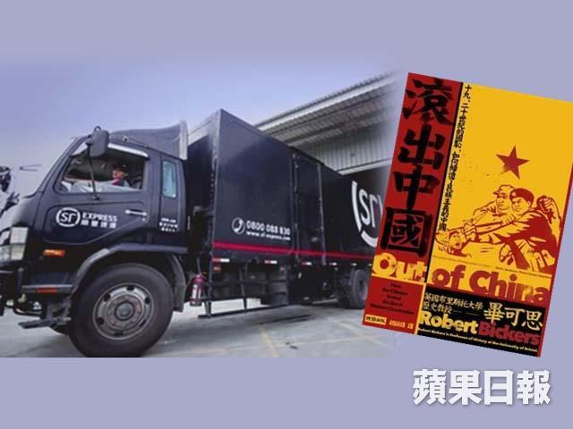
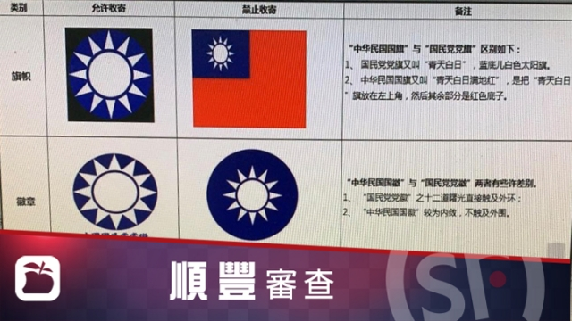

# 順豐快遞的一國兩制

梁文道 20190113
蘋果日報  果籽 名采 

上星期回臺北見見朋友，正是習近平對臺講話出爐，「一國兩制」成為民間熱門話題的時刻，居然恰巧給我碰上一件和一國兩制不知道算不算是有關係的事。  

既然到了臺北，免不了又要買一大堆書回來。近幾年身子不如從前，開始搬不動這麼多書了，就只好讓酒店前檯安排速遞。儘管這筆運送費用可能抵得上好幾本書的價錢，但我輩中人都曉得，買書的時候是很難計較這些的。這一次我照辦煮碗，離店那一天留下了好幾袋書，輕輕鬆鬆上路，等着回家檢閱所獲。結果等了幾天都沒有消息，正想打回酒店問問是怎麼回事，就收到了酒店的郵件：  

「因為中國最近對文章及書冊內容有管制，有三本書快遞無法替您寄送：  

1. 《滾出中國》 
2.  《大辯論》 
3. 《思想史》  

以上三本書已先幫您拿出來存放櫃檯，待您下次入住時再交還給您。此次順豐是以貨到付款方式寄送，之前的信用卡授權會取消。」  

這真是讓人意外。我每年都至少回臺北一趟，每一趟都住在同一家酒店，每一次也都請他們替我安排快遞，把書送回香港，可從來都沒發生過類似的事。大概在大陸住得太久，我第一個反應竟然是先檢討自己，看看是不是自己買了什麼不應該買的東西，又寄了些什麼不應該寄的事物。《滾出中國》是我活該，看名字就知道不是什麼好玩意，它就該滾出中國。但是《大辯論》和《思想史》呢？這兩本書有問題嗎？於是我趕緊查了一下，發現《大辯論》原來早有大陸版，只是譯者不同，翻譯出來的書名也不同，簡體字版叫做《大爭論》。這兩個版本，都來自美國保守派公共知識份子Yuval Levin的英文原著《The Great Debate: Edmund Burke, Thomas Paine, and the Birth of Right and Left》。這本書談的是一個思想史上的重要時刻，那就是法國大革命時期，英國的伯克（Edmund Burke）和潘恩（Thomas Paine）的辯論，一場近代西方思想史上左派與右派之爭的根源性事件。從內容上看，這本書應該一點問題也沒有，更何況它早有大陸「中信出版社」的版本，怎麼會過不了管制？  

轉念一想，我卻又覺得這個管制管得有道理了。首先，自從政府幾年前換班之後，大陸書業就有了「回頭看」的做法。意思是凡在「新時代」之前出過的書，都得回頭重新審查。就算是從前經過審批，拿到書號的合法出版物，也都不意味着它在「新時代」就能自動再版再印。可能是過去幾年太過寬鬆，一大堆包裹在「自由」和「民主」等名號下面的書，原來都是夾帶西方所謂「普世價值」的毒草；還有一些批判德國納粹和反省前蘇斯大林時期的歷史著作，分明就是含沙射影，指桑罵槐；更別提一些關於反右、文革乃至於大饑荒的回憶錄和文學作品，那純粹都是「歷史虛無主義」的載體。所以從這個角度來看，《大辯論》就很有可能是以前可以出，但現在絕對不能再上架的那種書了。左派右派這種事，是你們今天可以隨便妄議的嗎？  

然而，《大辯論》的簡體版2014年8月面市，離習近平上臺也已過了一年多，是「新時代」的產物，可見它並非栽在「回頭看」手下。那會不會純粹是繁簡二版譯者不同，內容完整程度或者也不一樣，所以必然要把臺灣這個本子當成另一本書來看呢？極有可能。去年就出過這麼一件怪聞。一位名滿天下，望重士林的歷史學家從美國教完書回來，一入境就遭到海關扣起行李箱中的幾本書。其中一本正是這位學者中文論著的英譯版。請注意，這部英文學術專著出自全球最受尊崇的學術出版社之一，而它的中文版還是現在在大陸買得到的學術暢銷書之一，那為什麼換了英文就進不了中國呢？縱使學富五車，這位溫文爾雅，說理通透的大學者，也還是說不過認真負責的中國海關。事後我們都猜，那是海關見到這本書上有「China」這個字，神經自動繃緊的緣故。你知道，今天海關見到X光機中有裝着書的行李，其緊張程度堪與見到毒品相比。  

總而言之，法網恢恢，疏而不漏，寧可殺錯一千，不可棄卻一子。於是我也就明白了另外一本書不能從臺灣寄回香港的原因了。那本《思想史》其實是臺灣一本學術期刊，我買的這一期是它的第七期，為了請大家幫我檢討，同時也想聽聽「順豐快遞」的解釋（儘管我知道他們多半不會理我），請大家不要介意我列出這一期《思想史》的完整目錄：  

【論文】  
汪榮祖 道不同終不相為謀：論章太炎與孫中山革命思想的異趣  
羅志田 曲線救文化：梁漱溟代中國「舊化」出頭辨析  

【英華字典與思想史研究專號】  
沈國威 近代英華字典環流：從羅存德，井上哲次郎到商務印書館  
陳建守 雙語辭典與詞源考索：以「啟蒙運動」為例的討論  
阿爾伯特‧霍夫斯塔特著、張哲嘉譯 從出版社的角度談辭典出版  

【書評及書評論文】  
傅揚 評介Yuri Pines, Paul R. Goldin, and Martin Kern eds., Ideology of Power and Power of Ideology in Early China  
盧華 孫中山的第三條道路：張朋園《從民權到威權》  
曾國祥 開明的柏克  

【研究紀要】  
理查‧柏克著、陳禹仲譯 什麼是「舊體制」？  

不知道各位怎麼想，我猜這裏面比較讓人忌諱的字眼可能是「革命」、「威權」和「舊體制」甚至「啟蒙運動」（總不會是孫中山吧？）。以我對今日氣氛的嗅覺，這些字詞讓人起疑是絕對有可能的。  

那麼到底是誰在起疑？誰在害怕？我打電話去追問，酒店的人語焉不詳，就說是「順豐」的意思，和他們無關。如果這是順豐快遞的決策，那這是書籍帶回他們臺北的運送中心之後，有專人在檢查書籍嗎？還是快遞小哥直接在酒店現場一本一本地審閱這些東西合不合格？那是他們手上有一份不准運送的書籍清單？還是反過來，有一份更為浩大的和合格書籍名錄？又或者說，乾脆是他們的工作人員憑自己的判斷力來把握？這些人都是臺灣人對吧？他們是已經經過專門訓練，猶如大陸的審查員那樣，個個慧眼獨具？還是他們在揣摩對岸的意思，想像有些什麼文字和觀念是過不了臺灣海峽的？無論如何我請酒店想想辦法，找回一些我們以前合作過的老夥伴，可是他們卻寧願去郵局專門替我跑一趟，用回最傳統的郵政服務。其實去年之前，這家酒店送快遞回香港給我，不是經過DHL，就是UPS，他們是打從什麼時候開始只用順豐快遞的服務呢？是因為那兩家傳統快遞公司都打不過順豐？還是在臺北住店，而又多有需要托送東西的遊客多半是大陸客，所以為了方便，他們就和順豐快遞獨家捆綁起來？沒辦法，這是市場的力量。大陸的市場那麼大，企業那麼有實力，你能不順着他們走嗎？  

當然，香港人對於這個問題，首先要想到的，應該是從什麼時候開始，香港也被納入了這套書籍和文章內容管制的系統？我也抗議過了，告訴這家酒店的員工，從境外寄任何書籍到香港都不是問題，畢竟以我所知，香港還沒有這套管制書籍進出口的法令（也許我所知有限，其實早就有了這套規矩，只是我沒意識到罷了）。電話那一頭，可憐的酒店服務人員支支吾吾，他好像不大相信香港在這方面跟大陸真的不一樣。這不怪他，經過這次遭遇，連我都懷疑，其實「一國兩制」老早就推行到臺灣去了。 

------

原网址: [访问](https://hk.lifestyle.appledaily.com/lifestyle/columnist/%E6%A2%81%E6%96%87%E9%81%93/daily/article/20190113/20589663)

创建于: 2019-01-13 22:10:03

-------

2019年1月17日 案：[順豐內部方針曝光　簡體字寫明：禁收寄中華民國國旗國徽](https://tw.appledaily.com/new/realtime/20190116/1501471/)

